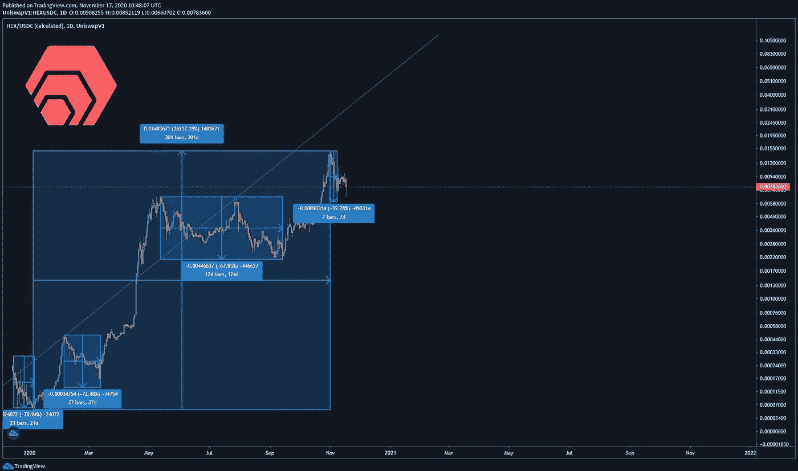
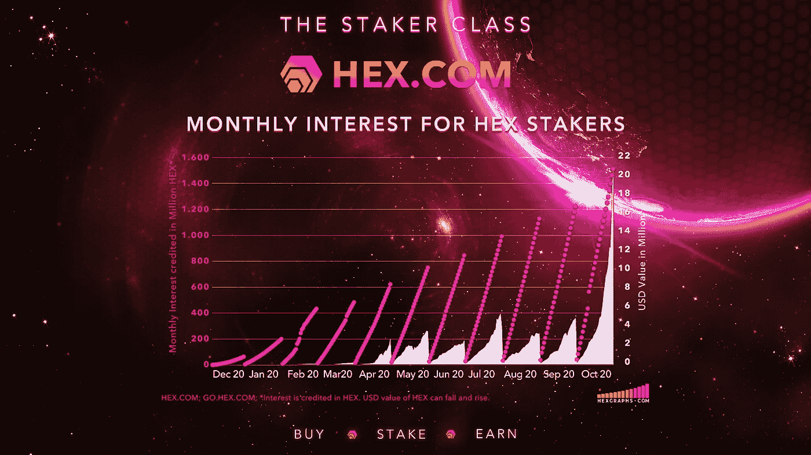
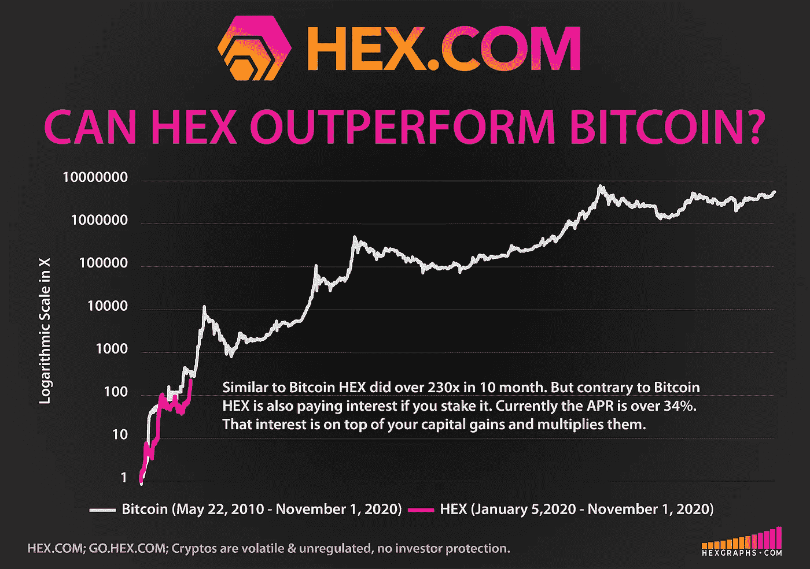
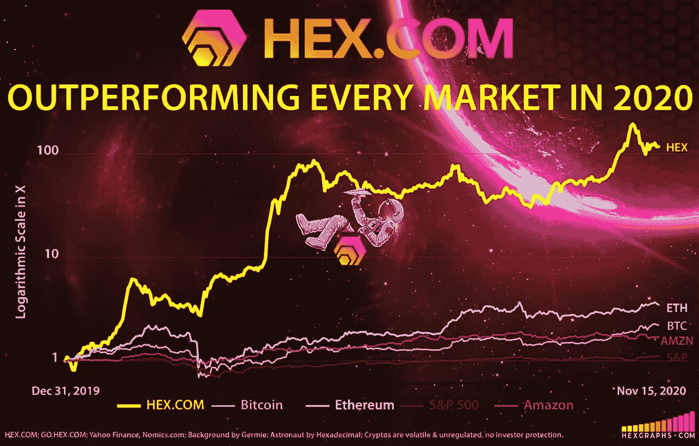

# 勇往直前，HEX 才刚刚开始

> 原文：<https://medium.datadriveninvestor.com/blazing-ahead-hex-is-just-getting-started-be5b13478617?source=collection_archive---------7----------------------->

HEX Performance from Launch Day 1 to Present

## [什么是妖术](https://hex.com/) &为什么在 11 月 19 日[的大发薪日事件](https://medium.com/datadriveninvestor/uniswap-eclipsed-1-5-billion-hex-paid-to-stakers-november-19th-1d202ca938d3?source=friends_link&sk=0a22963bf5056a4e559d35dba5e0c9db)后，它可能会继续跑赢大盘

*原载于 2020 年 11 月 10 日 CoinPedia.org
经作者许可更新并印刷。*

2020 年，HEX.COM 的表现将超越所有市场。Nomics.com 排名前 20(BTI 在市场数据完整性方面排名第一)，超过 16 亿美元的 HEX 正在向赌注者支付可变的 25%的 APY。增加投资者信心的是，平均持股时间为 2 年；最长的赌注是 15 英镑。在 [HEX](https://hex.vision/) 中看到的这种可验证的链上承诺在加密货币中是前所未有的。本文引用的所有数据均为撰写时的数据。

# HEX 中的 Staker 类正在蓬勃发展

## [什么是 HEX？](https://hex.com/)

HEX 是一款经过全面审核的成品，旨在以定期存款从未有过的方式为赌注者提供丰厚回报。利益相关者阶层享受的回报激励净积极的购买和赌注活动，而不是出售。此外，当 HEX 被标桩时，这些硬币就从流通中消失了——这是另一个积极影响供给需求压力的关键设计特征。

# 下注的最后机会:11 月 19 日向下注者支付 12 亿多美元

HEX 的早期采用者将庆祝约 1800 亿 HEX 的意外通货膨胀分配，价值超过 12 亿美元，于 2020 年 11 月 19 日记入 active stakes。这种一次性事件被称为大支付日(BPD)，唯一的资格要求是股份在 BPD 之前活跃，之后结束。**在世界协调时 11 月 18 日的最后一刻，也就是迈阿密时间下午 6:59，洛杉矶时间下午 3:59，成为奖金日的最后赌注。对赌注者职业来说，这个十六进制会像其他记入你赌注的每日利息一样出现，但是要大得多。**

 [## 这么说一家大型风投基金正在投资你的初创公司？4 实际考虑|数据驱动的投资者

### 首先，恭喜你。融资总是需要努力的，一个大的风险投资基金当然是一个大的…

www.datadriveninvestor.com](https://www.datadriveninvestor.com/2020/08/09/so-a-big-vc-fund-is-investing-in-your-startup-4-practical-considerations/) 

## [***如何在 7 分钟内轻松买入并下注 HEX***](https://youtu.be/I-cPCjd0Fto)

# 11 月 19 日，比特币花了 10 年时间做了 HEX 做的事情

比特币的硬币发行通胀模型在 10 年间从 0 个硬币到 1800 万个；HEX 有效地加速了这一过程，在 11 月 19 日完成了整个高通胀发行。紧随其后，HEX 进入低通胀阶段，最大通胀率为 3.69%。比特币花了 10 年时间跨越多次减半才完成同样的任务。

> “HEX 延迟了将近一年才获得安全权限，这就是为什么它有 3 个审核；2 项安全审计，1 项经济审计。十六进制没有管理密钥。没有关闭开关。没有暂停开关。它是完全自主的。
> 
> 如果 HEX.COM 下线了，我死了，系统会继续正常工作。势不可挡:代码在区块链上。你来经营。你自己创造奖励。就是这样。”*—*[*理心，妖术发明家*](https://www.forbesindia.com/article/brand-connect/richard-heart-and-the-influence-of-bitcoin-on-the-hex-blueprint/62095/1#)

# HEX 旨在超越比特币——而且它正在发挥作用

设计意图从来不是一个承诺，但看到 HEX 按设计执行看起来确实非常有希望。HEX 于 2019 年 12 月推出，2020 年的表现超过了所有市场，目前仍处于推出阶段。11 月 19 日的大发薪日结束了发布阶段，许多人认为 HEX 的表现才刚刚开始。

# 为什么 HEX 能在高薪日之后长期保持领先

想象一下，如果比特币支付给持有人更多比特币，让他们承诺持有自己选择的时间段:定期存款。现在想象一下，如果承诺更长的时间会得到更好的回报，当其他人违反他们的时间承诺时，那些遵守承诺的人会得到更多的比特币——这是一个奖励诚实的在线真相引擎。整体净买卖活动会是什么样的？HEX 做了所有这些，还做了更多。

# **开始**

HEX 是由知名连续创业者、比特币早期采用者理查德·哈特(Richard Heart)先生发明的。到 2003 年，他的公司每年为他带来超过 6000 万美元的收入，哈特先生提前退休并环游世界。几年后，当比特币交易价格在 1 美元左右时，他引起了他的注意，他很快就开始独自挖掘完整的比特币区块。由于高度重视准确性和对细节的关注，哈特成为了比特币领域的专家，并找到了改进比特币的方法。

Richard Heart speaking at CryptoFin and Malta Blockchain Summit

如今，Heart 先生是以太坊的精通支持者，也是各种主题中令人振奋的思想领袖。毫无疑问，哈特先生是一个两极分化的人物，他高度重视准确性，被许多同龄人认为是一个有天赋的梦想家。Heart 先生和他的智慧结晶 HEX 已经被支持者和愤世嫉俗者广泛讨论。有一件事是肯定的:HEX 的设计、性能和理性投资者对 Heart 先生的信心，让 HEX 的赌注者阶层受益匪浅，获得了巨大的回报，并为他们的未来带来了灵感。

# 赌注十六进制&看它倍增

[打桩工。App](https://staker.app/invite/PQn8) 允许您安全可靠地在链上积累 100%的财富，并实时观察其增长:

HEX.COM⬣更多信息:

⬣新闻和更新:[关注 Twitter @HEXcrypto](https://twitter.com/hexcrypto)

https://t.me/HEXcrypto 社区:互动、问答、玩乐:

原文:

 [## 飞速前进，Hex 才刚刚开始-在 2020 年跑赢市场

### 十六进制。2020 年，COM 的表现优于所有市场。被 Nomics 评为前 10 名(BTI 在市场数据完整性方面排名第一)，超过…

coinpedia.org](https://coinpedia.org/press-release/hex-is-just-getting-started/) 

**访问专家视图—** [**订阅 DDI 英特尔**](https://datadriveninvestor.com/ddi-intel)