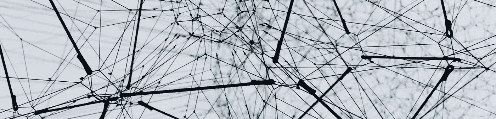
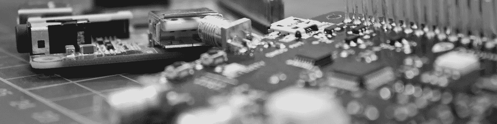

# 盲目资产管理

> 原文：<https://medium.datadriveninvestor.com/blind-asset-management-d0f267d6066?source=collection_archive---------16----------------------->

**它是什么，为什么重要**

> 数字资产管理是这样的操作，通过该操作，数字资产的集合需要使用实现数字资产管理或 DAM 的计算机应用程序，以确保所有者以及可能的他们的代表可以对数据文件和传输执行操作。一家盲目的资产管理公司在被蒙住眼睛的情况下成功地做到了这一点。

**范式转变**

自其诞生以来，数字资产管理识别就一直是一种必要手段，通过这种手段，资产可以被网络明确识别，以便与网络进行交互。到目前为止，这一直是安全的代名词。在我们通过各种类型的网络实现不同功能的日常操作中，我们使用私钥、密码等向系统主动标识自己。一旦对这些凭证有了肯定的认同，我们就被允许进行交互并开始我们的业务。无论我们是在使用互联网和运行安全交易还是高度敏感的军事设备，我们都依赖于在任何信息交易之前与对方的积极识别。

到目前为止，交换的数据，即使是基于肯定的身份，也比知道其发起方的身份更有价值。知道对方的 ID 是肯定的，并且交换正在发生，这足以满足系统的安全性。然而，今天这种情况正在改变。

随着越来越多的团体交换信息，用户的数量正在飞速增长。除此之外，现在收集的大多数数据越来越接近个人，比以往任何时候都更加准确。生物识别现在是一种日常商品，数据的价值现在被称为新的数字黄金。这种数据收集的方式是以牺牲隐私为代价的。因为在许多领域，传输的数据在识别用户和将该信息用作数据方面很有价值。当用户数量很少时，这不是太大的问题，但当用户数以千计甚至数百万计时，注意力就会从收集到的数据显著转移到实际上是谁向您提供了这些数据。因此，你可以使用这种操作方式来描述用户，并将其作为一种商品来使用。这已经成为这个新时代的数据巨头们使用的一种艺术形式。现在，用户的价值几乎超过了他们正在传输的数据。

我们可以用挤牛奶的动作来做类比。在很长一段时间里，牛奶是我们一直在寻找的，也是最有价值的产品。但随着时间的推移，奶牛的互动和行为慢慢将价值转移到了奶牛本身，而不是它产出的牛奶。我知道这是一个有些缺陷的比较，但我相信现在你明白了。

**现在，如果我们把牛拿走。**

想象一下，如果我们把奶牛的身份从等式中去掉。我们将只剩下牛奶，或者我们的数据。如果我们做得好，我们会得到非常丰富的数据。将此与密集收获策略相结合，我们将拥有构成梦想的数据集。这将允许比以往更多的探索。然后我们可以使用今天的技术，无论是人工智能还是机器学习，并得出非常复杂的观察和答案。所有这些有价值的信息都会被收获，而不必知道是谁把它带给你的，同时能够肯定地证明发送它的客户。

 [## 为什么实时数据处理如此具有挑战性？数据驱动的投资者

### 实时数据分析就是要缩小数据收集、分析和行动之间的差距。与……

www.datadriveninvestor.com](https://www.datadriveninvestor.com/2020/07/30/why-is-real-time-data-processing-so-challenging/) 

除了隐私保护，盲资产管理还有其他好处。如果你的数据库没有任何个人信息，那么任何成功的入侵只会产生匿名信息。这样就消除了破坏这样一个基础设施的目的，因为你不能给予你从未拥有过的东西。这种优势对于医疗、军事或制药领域来说是最重要的特性之一。

现在，盲目的资产管理并不能解决匿名化难题，但是从自下而上的发展战略来看，它是网络交易开始匿名化的第一层..

**含义和应用**

盲资产管理意味着我们可以在客户端对服务器通信高度敏感的地方使用这种数据传输方法。医疗领域、军事领域甚至银行业的天气。盲目的资产管理可以打开新的做事方式的大门。它可以与区块链或边缘计算等其他技术结合使用。然而，我们的主要关注点是物联网市场。这是通过我们的数据收集平台供我们自己使用的。也就是说，只需很少的努力，这项技术就可以在很少的时间和精力内应用于任何应用程序。

现在，这项技术将被用来做什么？我们可以在许多场景中使用它。第一个想到的应该是我们最初设计的那个。我们在我们的一个产品 MOOVIN 的基础架构中使用了这一点。能够收集高质量的数据，同时通过设计提供隐私保护，使我们能够获得所需的数据，为城市和基础设施提供所需的数据。能够以符合道德的方式从一大群公民中收集数据，可以实现高质量和密集的数据生成，进而可以被 AI 用来产生积极的结果。这与更传统的策略相结合，形成了一个不包含私人信息的数据库。因此，一旦出现漏洞，任何用户都不会面临个人信息泄露的风险。

另一个可以使用它的地方是电信部门，更具体地说是 5G 切片。显而易见，您可以管理系统上所有电话的动态网络切片，同时允许对一个或多个切片的不同访问，而无需知道电话属于谁。

那么高度安全的通信网络呢？如果有人窃听通信，盲目的资产管理很难搞清楚所有的事情。这就像在不知道谁在说话的情况下窃听电话对话。

正如您现在所看到的，盲资产管理就在这里，它将慢慢成为以用户为中心的隐私设计生态系统的复杂部分。随着世界的进步，隐私保护变得越来越强制性，公民数据收集的起点应该符合他的最佳利益。

这是我将要发表的关于这项技术的许多文章中的第一篇。随着时间的推移，我们正在开发越来越多的应用程序并使其更加高效，我真诚地希望您能与我们一起踏上这一征程。请随意评论并参与讨论，最重要的是，让世界变得更美好。

**进入专家视图—** [**订阅 DDI 英特尔**](https://datadriveninvestor.com/ddi-intel)