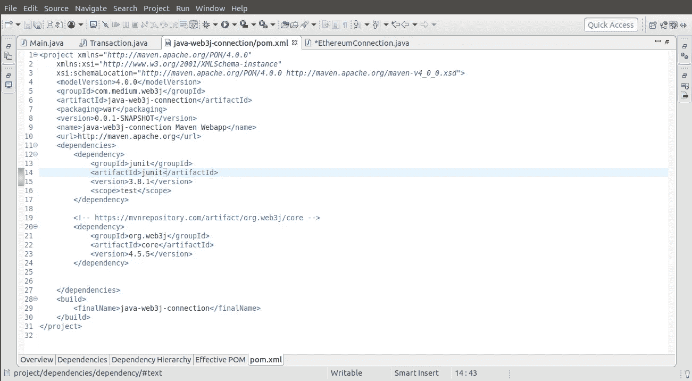

# 使用 Java 的 Web3j 和以太坊的区块链第一部分:连接！

> 原文：<https://medium.datadriveninvestor.com/block-chain-using-java-and-ethereum-part-i-c225f33064d8?source=collection_archive---------1----------------------->

ref:google.com

在我指导你使用 Java 和 Ganache 连接以太坊网络的步骤之前，我想告诉你什么是区块链。
很可能你已经很熟悉它了，这个快速介绍是为那些想从整体上了解区块链基本概念的新手准备的。在实现过程中，我个人犯了很多错误，虽然有很多教程，但都很复杂。
牢记这一点，我试图以简化的方式涵盖所有步骤..

***在出发之前，我们首先需要知道区块链是什么？***

简而言之，区块链是一系列带有时间戳的不可变数据记录，由不属于任何个人/实体的计算机集群管理。这些数据块(即块)中的每一个都是安全的，并使用密码原理(即链)相互绑定。

那么，它有什么特别之处？为什么我们说它具有颠覆行业的能力？

区块链网络没有中央权威——它正是民主化系统的定义。由于这是一个共享的、不可变的分类账，其中的信息对任何人和每个人都是公开的。因此，在区块链上建造的任何东西就其本质而言都是透明的，参与的每个人都要对自己的行为负责。

**区块链的类型:**主要有两种类型的区块链实现。开放/公共和企业。在比特币或以太坊这样开放的公共区块链中，任何人都可以作为节点加入主网络。但是在诸如 Hyperledger 结构的企业区块链中，只有授权的节点才能进入网络。

*参考:谷歌*

区块链技术的实现方式有很多，比如**以太坊**、**科达**、 **Hyperledger** 。

我们将讨论以太坊。

**比特币:**2008 年 10 月 31 日，一个名叫中本聪的不知名人士提交了一份白皮书，内容是关于不需要中间方进行电子交易。这就是比特币的起源。比特币技术的全部目的是在当前的金融交易合同中以点对点的方式在双方之间转移资金，这些交易是在中介(如银行)的帮助下进行的。

 [## 区块链技术法案在伊利诺伊州生效|数据驱动投资者

### 美国伊利诺伊州将智能合同合法化，区块链技术公司一项行业研究宣布 2020 年为…

www.datadriveninvestor.com](https://www.datadriveninvestor.com/2020/02/11/the-blockchain-technology-act-comes-into-force-in-illinois/) 

【https://bitcoin.org/bitcoin.pdf*T21*

**以太坊:【2013 年 12 月，Vitalik Buterin 撰写了一份关于将区块链技术扩展到金融交易和智能合约理念之外的白皮书。这就是以太坊的由来。**

【https://github.com/ethereum/wiki/wiki/White-Paper 号

[http://web . archive . org/web/20131228111141/http://vbuterin . com/ether eum . html](http://web.archive.org/web/20131228111141/http://vbuterin.com/ethereum.html)

以太坊区块链由多个节点组成。每个节点都有自己的块副本。节点使用八卦协议进行对等通信。

你可以使用上面的链接探索更多关于以太坊的信息。

现在，要使用 Java 与以太坊网络通信，您需要下载 **GANACHE** 。

**Ganache** 是一个用于**以太坊**开发的个人区块链，您可以使用它来部署契约、开发应用程序以及运行测试。它既可以作为桌面应用程序使用，也可以作为命令行工具使用(以前称为 TestRPC)。 **Ganache** 适用于 Windows、Mac 和 Linux。

 [## 加纳切|松露套房

### 部署契约，开发您的分散式应用程序(dapps ),并对智能契约进行测试。可作为…

truffleframework.com](https://truffleframework.com/ganache) 

# 我们将使用 java 的 web3j 库与以太网进行交互

**web3j** 是一个轻量级的、高度模块化的、反应式的、类型安全的 Java 和 Android 库，用于处理智能合约并与以太坊网络上的客户端(节点)集成。

 [## web3j/web3j

### web3j 是一个轻量级、高度模块化、反应式、类型安全的 Java 和 Android 库，用于处理智能合约…

github.com](https://github.com/web3j/web3j) 

现在让我们开始发展我们与以太坊网络的联系

步骤 1:在 Eclipse 中创建一个 maven 项目，并将 java 编译器更改为版本 1.8

步骤 2:将来自[https://mvnrepository.com/artifact/org.web3j/core/4.5.5](https://mvnrepository.com/artifact/org.web3j/core/4.5.5)的 Web3j 库/依赖项添加到您的 pom.xml 文件中

这里有一个依赖关系:

> https://mvnrepository.com/artifact/org.web3j/core→
> <依赖>
> <groupId>org . web 3j</groupId>
> <artifactId>核心< /artifactId >
> <版本>4 . 5 . 5</版本>
> </依赖>

my pom.xml file

第三步:

打开 Ganache 进入设置->然后点击服务器->主机名->选择您的 IP 地址，然后选择-enp2so 并更改其端口号->保存并重启 Ganache

这个 IP 地址将在您的本地机器上创建一个测试 RPC 网络，您必须将它提供给 web3j 的连接代码。

重新启动后，ganache 会将其 RPC 服务器更改为您提供的 ip 地址和端口号

复制 RPC 服务器地址并粘贴到 web3j 连接代码中

第四步:

用 main 函数创建一个类，并写下 web3j 连接的代码

> web3j web 3 = web3j . build(new HttpService(" HTTP://Ganache-RPC-Server-Address:port number "))；

第五步:

成功连接到网络后，使用 web3j 类及其功能查看客户端版本和其他信息，如 gasPrice、nonce、帐户余额等。

这里有一个 web3 库的文档

 [## Web3j

###  web3j 是一个高度模块化，反应式，类型安全的 Java 和 Android 库，用于智能合约和…

docs.web3j.io](https://docs.web3j.io/) 

这是对我的主文件的引用

> *打包 com . ether eum . connection；*
> 
> *导入 Java . io . io exception；
> 导入 Java . math . big integer；*
> 
> *导入 org . web 3j . protocol . web 3j；
> 导入 org . web 3j . protocol . core . default block parameter name；
> 导入 org . web 3j . protocol . core . methods . response . ethgasprice；
> 导入 org . web 3j . protocol . core . methods . response . ethgetbalance；
> 导入 org . web 3j . protocol . core . methods . response . web 3 client version；
> 导入 org . web 3j . protocol . http . httpservice；
> 导入 org . web 3j . utils . convert；
> 导入 org . web 3j . utils . convert . unit；*
> 
> *公共类以太网连接{*
> 
> *公共静态 void main(String[] args)抛出异常{*
> 
> *System.out.println("连接以太坊…")；* Web3j web 3 = Web3j . build(new HttpService(" HTTP://Ganache-RPC-Server-Address:port number "))； *System.out.println("成功连接以太坊")；*
> 
> *试试{
> web 3 client version client version = web 3 . web 3 client version()。send()；
> System.out.println("客户端版本:"+Client version . get web 3 Client version())；*
> 
> *EthGasPrice gasPrice = web 3 . EthGasPrice()。send()；
> System.out.println("默认气价:"+Gas Price . getgasprice())；*
> 
> *EthGetBalance EthGetBalance = web 3
> 。ethGetBalance(" 0x cf 8 b 652 b 0173 FBA be 734 F5 f 388 C2 da 24 a 2359993 "，DefaultBlockParameterName。
> 最新)。sendAsync()。get()；*
> 
> *system . out . println(" Balance:of Account ' 0x cf 8 b 652 b 0173 fbabe 734 f 5f 388 C2 da 24a 2359993 ' "
> +ethgetbalance . getbalance())；
> 
> System.out.println("以太格式的平衡:"
> +convert . from Wei(web 3 . ethgetbalance(" 0x cf 8 b 652 b 0173 fbabe 734 f 5f 388 C2 da 24a 2359993 "，
> DefaultBlockParameterName。最新)。发送()。getBalance()。toString()，单位。乙醚))；*
> 
> *} catch(io exception ex){
> throw new runtime exception("发送 json-rpc 请求时出错"，ex)；
> }
> }
> }*

此代码的输出:

> 正在连接以太坊…
> 
> SLF4J:无法加载类“org . slf4j . impl . staticloggerbinder”。
> 
> SLF4J:默认为无操作(NOP)记录器实施
> 
> SLF4J:详情见 http://www.slf4j.org/codes.html#StaticLoggerBinder。
> 
> 成功连接到以太坊
> 
> 客户端版本:以太坊 js test RPC/v 2 . 8 . 0/以太坊-js
> 
> 默认天然气价格:2000000000
> 
> 余额:账户 0xcf 8b 652 b 0173 FBA be 734 f5f 388 C2 da 24 a 2359993 10000000000000000
> 
> 以太格式的平衡:100

【https://github.com/annytikone/java-web3j-medium】你可以在我的 github 上找到这篇文章的资源库

*到目前为止，我们已经成功地连接到 Ganache 和以太坊测试网络。
感谢阅读，&随时欢迎建议。*

*在下一篇文章中，我们将探讨更多关于以太和 erc20 令牌的事务*

***请随时联系我:***

*电子邮件:Anikettikone9@gmail.com*

*[领英](https://in.linkedin.com/):[https://www.linkedin.com/in/aniket-tikone-27808a138](https://www.linkedin.com/in/aniket-tikone-27808a138)*

# *这是我在这个平台上的第一篇文章&你的掌声会鼓励我写更多的博客。*

## *感谢阅读…*

**使用 web3j 和 java 恢复/创建或开立账户:**

* [## 使用 Java 的 Web3j 和以太坊的区块链第二部分:创建或开立帐户

### 与以太坊钱包交互需要私钥。

medium.com](https://medium.com/datadriveninvestor/block-chain-using-javas-web3j-and-ethereum-part-ii-create-or-open-an-account-896cf3b5ef12)*