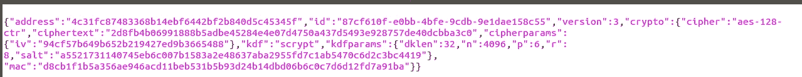
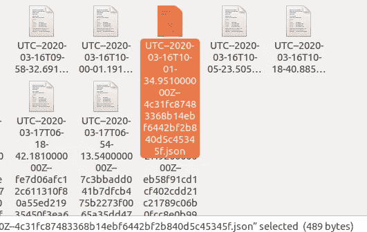
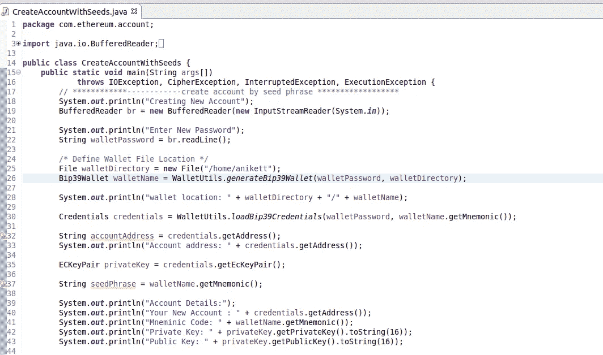
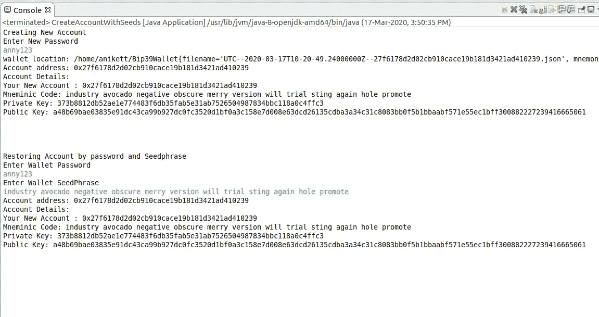

# 使用 Java 的 Web3j 和以太坊的区块链第二部分:恢复/创建或开户

> 原文：<https://medium.datadriveninvestor.com/block-chain-using-javas-web3j-and-ethereum-part-ii-create-or-open-an-account-896cf3b5ef12?source=collection_archive---------2----------------------->


ref:google.com

私钥与以太钱包的交互

私钥是一个非常大的随机数，用于生成公钥。这个公钥就是你在以太坊区块链的地址。私钥允许您签署交易。链上的其他参与者可以使用您的公钥来验证这些交易。

私钥很难记住，所以钱包允许你用密码(使用对称加密)将私钥保存在里面。这意味着，您可以在同一个 wallet 实例上使用一个容易记住的密码来签署您的交易。**了解这个密码不是你的私钥**非常重要，如果你失去了这个钱包的访问权限，你的密码将不允许你从其他钱包取回私钥。

## 助记短语:

助记短语，也称为“种子单词”或“恢复短语”，是 12-24 个单词的有序列表，可将您带到特定的钱包地址。这些通常用于恢复，并不意味着用作任何人钱包的主要访问方法。这些短语提供了一个人钱包的直接入口，所以应该小心对待。

如果你想提供使用 java 创建账户的功能，那么 Web3j 的 WalletUtil 提供了一种创建 JSON 加密密钥库的方法。

## 第一步:

在 Eclipse 中创建一个 maven 项目，并将 java 编译器更改为 1.8 版

## 第二步:

将来自 https://mvnrepository.com/artifact/org.web3j/core/4.5.5[的 Web3j 库/依赖项添加到 pom.xml 文件中](https://mvnrepository.com/artifact/org.web3j/core/4.5.5)

以下是对的依赖性:

```
*<! —* [*https://mvnrepository.com/artifact/org.web3j/core*](https://mvnrepository.com/artifact/org.web3j/core) *→
<dependency>
<groupId>org.web3j</groupId>
<artifactId>core</artifactId>
<version>4.5.5</version>
</dependency>*
```


pom.xml

## 第三步:

WalletUtils 有一些处理钱包文件的实用函数。

定义存储钱包文件的位置

并向下面的方法提供密码和文件位置，该方法将提供助记短语并将生成一个 UTC Json 文件，该文件以加密格式存储用户的凭据

> bip 39 wallet wallet name = walletutils . generate bip 39 wallet(wallet password，wallet directory)；

UTC Json 文件:



## 第四步:

从 Bip39Wallet 加载凭证，该凭证将为帐户提供私有和公共密钥

> credentials credentials = walletutils . load bip 39 credentials(wallet password，wallet name . get mnemonic())；

## 第五步:

获取私钥和公钥:

```
ECKeyPair privateKey = credentials.getEcKeyPair();
```

ECKeyPair 将提供私钥和公钥，这是处理事务和事件的基本要素

使用密码和助记短语创建帐户的完整参考代码

```
// ************ — — — — — — create account by seed phrase ******************System.out.println(“Creating New Account”);BufferedReader br = new BufferedReader(new InputStreamReader(System.in));System.out.println(“Enter New Password”);String walletPassword = br.readLine();/* Define Wallet File Location */File walletDirectory = new File(“/home/anikett”);Bip39Wallet walletName = WalletUtils.generateBip39Wallet(walletPassword, walletDirectory);System.out.println(“wallet location: “ + walletDirectory + “/” + walletName);Credentials credentials = WalletUtils.loadBip39Credentials(walletPassword, walletName.getMnemonic());String accountAddress = credentials.getAddress();System.out.println(“Account address: “ + credentials.getAddress());ECKeyPair privateKey = credentials.getEcKeyPair();String seedPhrase = walletName.getMnemonic();System.out.println(“Account Details:”);System.out.println(“Your New Account : “ + credentials.getAddress());System.out.println(“Mneminic Code: “ + walletName.getMnemonic());System.out.println(“Private Key: “ + privateKey.getPrivateKey().toString(16));System.out.println(“Public Key: “ + privateKey.getPublicKey().toString(16));
```



createAccountWithSeeds.java

此代码的输出:

```
Creating New AccountEnter New PasswordAnny1234wallet location: /home/anikett/Bip39Wallet{filename=’UTC — 2020–03–17T09–44–25.272000000Z — 967a1e84a5a35eeac81b3cad03b9c4d473282471.json’, mnemonic=’veteran piano hotel three echo hire mosquito dutch despair emotion crunch neck’}Account address: 0x967a1e84a5a35eeac81b3cad03b9c4d473282471Account Details:Your New Account : 0x967a1e84a5a35eeac81b3cad03b9c4d473282471Mneminic Code: veteran piano hotel three echo hire mosquito dutch despair emotion crunch neckPrivate Key: 7c75421dbfbce3ab3f0d4d68df68cb9b40a45eca78decbaa304338662d9c1493Public Key: 22d48659060d75b300c7f6ba8229fa33ed676df57f46da6f0dbe33f8487030bc68c6143b42085b99678e5ea96cdd45b04fbee868aa0fbd93047ca851426e1b34
```

到目前为止，我们已经成功地在本地机器上创建了一个帐户！

但是如果我们以后不记得我们的私钥了呢？

但是只记住我们自己的密码和助记短语？

[](https://www.datadriveninvestor.com/2020/02/11/the-blockchain-technology-act-comes-into-force-in-illinois/) [## 区块链技术法案在伊利诺伊州生效|数据驱动投资者

### 美国伊利诺伊州将智能合同合法化，区块链技术公司一项行业研究宣布 2020 年为…

www.datadriveninvestor.com](https://www.datadriveninvestor.com/2020/02/11/the-blockchain-technology-act-comes-into-force-in-illinois/) 

在这种情况下，我们将向下面方法提供*密码和助记符短语，该方法将提供包含私钥、公钥和用户地址*的用户凭证

> credentials restore credentials = walletutils . load bip 39 credentials(密码，
> 
> seed phrase 2)；

提供*密码和助记短语后，它将生成您的钱包凭证*

这里是我的恢复帐户代码的参考

```
/************* — — — — — — Restore Account ************ — — — — — — */System.out.println(“Restoring Account by password and Seedphrase”);System.out.println(“Enter Wallet Password”);String password=br.readLine();System.out.println(“Enter Wallet SeedPhrase”);String seedPhrase2=br.readLine();Credentials restoreCredentials = WalletUtils.loadBip39Credentials(password,seedPhrase2);ECKeyPair restoredPrivateKey = restoreCredentials.getEcKeyPair();String restoredAccountAddress = restoreCredentials.getAddress();System.out.println(“Account address: “ + restoreCredentials.getAddress());System.out.println(“Account Details:”);System.out.println(“Your New Account : “ + restoreCredentials.getAddress());System.out.println(“Mneminic Code: “ + seedPhrase2);System.out.println(“Private Key: “ + restoredPrivateKey.getPrivateKey().toString(16));System.out.println(“Public Key: “ + restoredPrivateKey.getPublicKey().toString(16));
```

## 此代码的输出:

```
Creating New AccountEnter New Passwordanny123wallet location: /home/anikett/Bip39Wallet{filename='UTC--2020-03-17T10-20-49.24000000Z--27f6178d2d02cb910cace19b181d3421ad410239.json', mnemonic='industry avocado negative obscure merry version will trial sting again hole promote'}Account address: 0x27f6178d2d02cb910cace19b181d3421ad410239Account Details:Your New Account : 0x27f6178d2d02cb910cace19b181d3421ad410239Mneminic Code: industry avocado negative obscure merry version will trial sting again hole promotePrivate Key: 373b8812db52ae1e774483f6db35fab5e31ab7526504987834bbc118a0c4ffc3Public Key: a48b69bae03835e91dc43ca99b927dc0fc3520d1bf0a3c158e7d008e63dcd26135cdba3a34c31c8083bb0f5b1bbaabf571e55ec1bff300882227239416665061Restoring Account by password and SeedphraseEnter Wallet Passwordanny123Enter Wallet SeedPhraseindustry avocado negative obscure merry version will trial sting again hole promoteAccount address: 0x27f6178d2d02cb910cace19b181d3421ad410239Account Details:Your New Account : 0x27f6178d2d02cb910cace19b181d3421ad410239Mneminic Code: industry avocado negative obscure merry version will trial sting again hole promotePrivate Key: 373b8812db52ae1e774483f6db35fab5e31ab7526504987834bbc118a0c4ffc3Public Key: a48b69bae03835e91dc43ca99b927dc0fc3520d1bf0a3c158e7d008e63dcd26135cdba3a34c31c8083bb0f5b1bbaabf571e55ec1bff300882227239416665061
```



您可以注意到，在创建和恢复帐户后，我们仍然获得了相同的私钥和地址。

*你可以在我的 github 账户上找到这篇文章的知识库*

[https://github.com/annytikone/java-web3j-medium](https://github.com/annytikone/java-web3j-medium)

到目前为止，我们已经成功地创建和恢复了帐户。
感谢阅读，&随时欢迎建议。

在下一篇文章中，我们将探讨更多关于以太和 erc20 令牌的事务

**请随时联系我:**

电子邮件:Anikettikone9@gmail.com

[领英](https://in.linkedin.com/):[https://www.linkedin.com/in/aniket-tikone-27808a138](https://www.linkedin.com/in/aniket-tikone-27808a138)

# 感谢阅读…

使用 Java 和 Ganache 连接以太坊网络:

[](https://medium.com/datadriveninvestor/block-chain-using-java-and-ethereum-part-i-c225f33064d8) [## 使用 Java 和以太坊的区块链第一部分

### 在开始之前，首先我们需要知道什么是区块链？

medium.com](https://medium.com/datadriveninvestor/block-chain-using-java-and-ethereum-part-i-c225f33064d8)