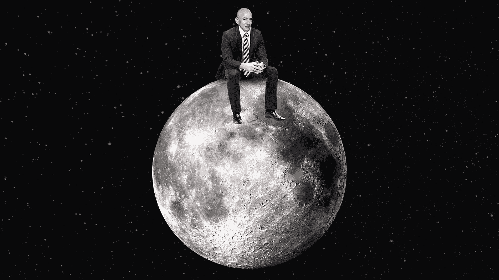
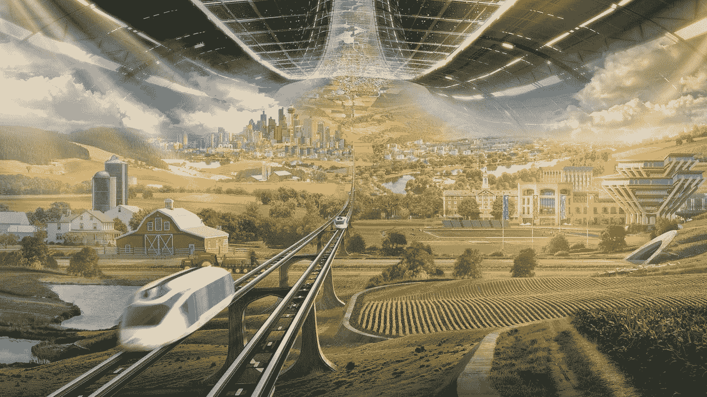

# 贝佐斯、布兰森和马斯克的重磅收购

> 原文：<https://medium.datadriveninvestor.com/blockbuster-moon-buyout-by-bezos-branson-and-musk-f6380c05979d?source=collection_archive---------7----------------------->

He’s Over the Moon: [https://www.axios.com/bezos-dreams-space-future-093b7042-3852-4a1a-8865-203bfd11873a.html](https://www.axios.com/bezos-dreams-space-future-093b7042-3852-4a1a-8865-203bfd11873a.html)

# 突发新闻:2022 年 4 月 1 日

# Moonbeam Ventures 的月球私有化交易

由杰夫·贝索斯的蓝色起源、理查德·布兰森的维珍卡拉狄加和埃隆·马斯克的 SpaceX 领导的私募股权投资集团已经达成协议，从遭受灾难的地球政府手中购买月球。随着杠杆收购的诞生，月球及其尚未开采的资源已经被私有化。

 [## 金融行业如何受益于机器学习发展和人工智能|数据驱动的投资者

### 在快速变化的金融世界中做出正确的决定并抓住机会可以让你的…

www.datadriveninvestor.com](https://www.datadriveninvestor.com/2020/07/28/how-finance-sector-can-benefit-by-machine-learning-development-and-ai/) 

为债务缠身的各国政府进行的谈判由连任的交易撮合者唐纳德·川普总统、俄国的弗拉基米尔·普京、巴西的雅伊尔·博索纳罗、代表欧盟委员会的法国国民阵线领导人马琳·勒庞和中国的习主席·金平牵头。地球上的主要政治领导人都同意出售地球上最大的非核心资产，以支付破坏增长的债务，并为疫情预防保健基础设施和患者治疗提供资金。卖方将保留月球未来采矿、旅游和其他风险投资收入的一小部分。

高盛(Goldman Sachs)为这笔交易中的卖家提供了建议，这无疑将提升其作为全球吸血鬼乌贼的良好声誉。涉案的高盛银行家正是为马来西亚 1MDB 交易提供咨询的那位，导致高盛向其马来西亚客户退还了 31 亿美元的欺诈费用。大多数主流经济学家预测，月球经济潜力的私有化有望启动地球上停滞不前的 QE 永远通货紧缩的经济增长。

美联储董事长杰伊·鲍威尔(Jay Powell)称赞了这笔交易，肯定了其将地球经济从零利率和通缩中解放出来的潜力，而不会导致风险资产因鲍威尔看跌期权(Powell-put)驱动的泡沫估值而再次崩溃，投资者知道每当市场出现问题时，鲍威尔看跌期权将拯救他们(格林斯潘看跌期权的后代，在 2008-09 年全球金融危机中到期)。

鲍威尔说，“唷，我担心美联储的资产负债表可能会在不需要 SpaceX 火箭的情况下发射月球。这让特朗普喜欢在美联储背后射击的目标消失了，并确保了央行的持续独立性。”

针对该交易的批评者称他在外星的投资比在地球上的投资更多，贝佐斯表示，在地球上投资的回报太低了。“理查德、埃隆和我都有责任为我们的股东实现资本回报最大化，这现在意味着投资这个世界。”这笔交易将为亚马逊市场企业提供无限的机会，向登月矿工和服务人员进行利润丰厚的销售。在新闻发布会上，这位亿万富翁首席投资者表示，投资者的资本自然会流向回报最高的投资。他们一致认为，目前他们数万亿美元的最大平流层回报远高于平流层，而不是低于平流层。此外，贝佐斯说，他和他的共同投资者在月球上创造的财富肯定会渗透到地球，特别是在 SpaceX 在地球和月球之间建立了一条 hyperloop 系绳之后。

当被问及 Moonbeam Ventures 是否计划首次公开募股(IPO)时，这位将月球私有化的亿万富翁科技和航天企业家表示，如果该公司需要资金将业务扩展到火星，这可能会发生。

Jeff Bezos’ space colony vision

**进入专家视角—** [**订阅 DDI 英特尔**](https://datadriveninvestor.com/ddi-intel)