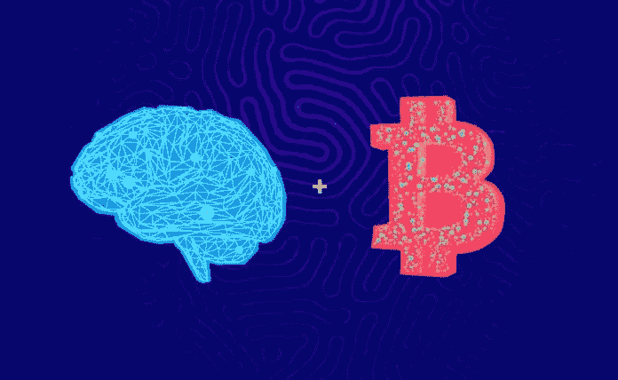

# 区块链和人工智能集成

> 原文：<https://medium.datadriveninvestor.com/blockchain-and-ai-integration-9dd0657ad1d8?source=collection_archive---------21----------------------->

令人生畏的任务之一是创建应用程序。用户友好且安全。开发商做了各种尝试，但不知何故都失败了。然而，经过多次尝试后，他们终于成功了，然后这是一件轻而易举的事。这个概念基于区块链和人工智能的整合，这被证明是催化剂。

> 所有的应用程序开发公司都在很好地利用这些技术。优步和 Ola 是少数几家将区块链和人工智能结合起来的公司。人工智能使司机的导航变得容易，而区块链确保了支付网关的安全。

区块链和作为个体的 AI 都是非常强的技术。正如我在之前的文章中提到的，区块链可以被视为一种非常安全的媒介，用于传输任何信息或任何数据，而不必担心数据被第三方加密。

通过它发送的数字信息非常安全，只有发送者或接收者才能对其进行加密或解密。它可以被认为是对黑客的威胁，因为黑客提供的安全和保障被迫远离。

 [## 5 行业转型区块链应用|数据驱动投资者

### 除非你一直生活在岩石下，否则我相信你现在已经听说过区块链了。而区块链…

www.datadriveninvestor.com](https://www.datadriveninvestor.com/2019/02/13/5-real-world-blockchain-applications/) 

另一方面，AI(人工智能)在之前的文章中也有详细描述。人工智能是科技的另一项成就。在人工智能出现之前，机器接受人类发出的命令只是一个梦想。坐在房间的一个角落里，通过语音识别技术关掉灯是我们梦寐以求的事情。

在手机上输入位置信息，并在没有询问任何人的情况下前往该位置是最大的挑战之一。随着技术的发展，所有这些梦想都很容易实现。这一切都要感谢艾，是他让这一切成为可能。没有任何进一步的延迟，人类制造了遵循他们的命令和做他们命令的机器。

> 像其他技术一样，如果我们在更大的范围内进行比较，即使这些技术也有其自身的缺陷。但是，当我们将它们结合在一起时，它们非常强大。他们可以很容易地相互受益。

关于为什么区块链和人工智能是天生一对的几个原因:

*   **在区块链的帮助下，追踪、理解和解释 AI 做出的决定将变得很容易**——作为人类，我们可能会发现大多数时候很难信任 AI，因为我们有一个习惯，那就是分析 AI 做出的每一个决定。然而，通过使用区块链，我们可以保留所有决定的记录，这将在人工智能中实现一定程度的透明。
*   人工智能可以比人类更有效地管理区块链 -人类有一个大脑，它管理所有的活动，所有的决策。在处理区块链和 AI 时，AI 扮演相同的角色。区块链以其安全功能而闻名，而人工智能则以其识别和独立做事的能力而闻名。

最近，我们听说许多公司已经开发出能像人类一样说话和工作的机器人。开发这种机器的主要目的是减轻人类的工作。这些机器人基于涉及人工智能和区块链的概念。一个确保数据安全，另一个帮助根据人类提供的数据做出正确的决策。

单独来看，这些技术都很强大，但结合起来对任何公司或任何开发者都更有益。尽管如此，还需要更多的实验和研究。日新月异，无论是区块链还是 AI 都在给我们越来越多的惊喜。

最近，我们听说许多公司已经开发出能像人类一样说话和工作的机器人。开发这种机器的主要目的是减轻人类的工作。这些机器人基于涉及人工智能和区块链的概念。一个确保数据安全，另一个帮助根据人类提供的数据做出正确的决策。

单独来看，这些技术都很强大，但结合起来对任何公司或任何开发者都更有益。尽管如此，还需要更多的实验和研究。日新月异，无论是区块链还是 AI 都在给我们越来越多的惊喜。