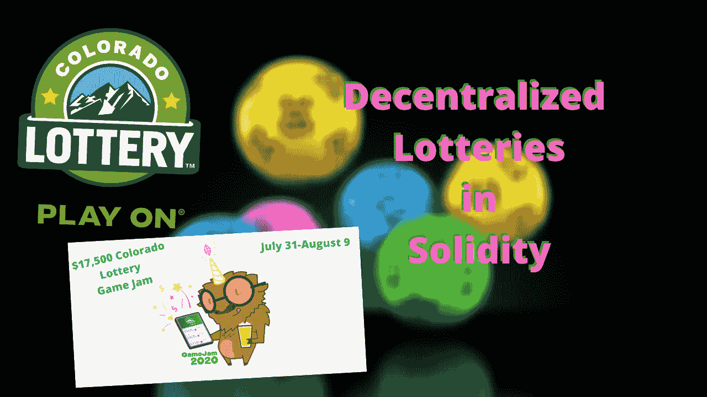

# 构建区块链彩票，去中心化如何修复它们，以及如何构建它们

> 原文：<https://medium.datadriveninvestor.com/blockchain-and-lotteries-how-decentrality-can-fix-them-e8f075ed8f03?source=collection_archive---------1----------------------->

## 如何建立一个分散的彩票，为什么所有的彩票都应该在链上，以及 Chainlink VRFs 和 Chainlink 闹钟如何使它变得容易(用代码示例自己制作一个)

Image from Author

随着科罗拉多州 GameJam 的结束，我们见证了整个区块链的一次飞跃。不仅是科罗拉多州的彩票首次尝试众包他们的彩票，而且他们还在研究是否有可能[与区块链/web3 tech](https://www.coindesk.com/colorado-lottery-gamejam-ethdenver) 合作经营他们的彩票。我们看到一些明星项目制作了基于区块链的彩票游戏。

但是我们为什么要这么做呢？与 web2(“普通”)应用程序相比，基于区块链的应用程序有什么优势？

说到区块链，我认为有两个主要原因可以解释为什么使用它来开发应用程序是有意义的。它们是:

1.  分散性
2.  数据不变性

很多时候，做外链的原因可以归结为这两个原因中的一个。对于彩票，同样适用。

# 分散性

1.  更大的支出和信任
2.  可证明的随机和安全
3.  低维护

## 更大的支出

如果你经营一个分散的彩票，你的开销会大大减少(T4)。您会发现这也是大多数应用程序向前发展的趋势。你不需要运行服务器，*区块链是你的分散式服务器。当用户“注册”时，他们只需支付注册的油费。彩票合同建立后，任何人都可以复制粘贴它来运行自己的彩票。*

哦，如果合同已经签好了你会喜欢的？好吧，不要再看了:

 [## alpha chainio/chain link-抽奖

### 你可以在这里重新混合一个分散的可证明随机彩票的 web3 实现，使用 Chainlink…

github.com](https://github.com/alphachainio/chainlink-lottery) 

一个更高级的:

 [## GMSteuart/乐透-水牛城

### 一个科罗拉多州的 GameJam 游戏#启动服务并运行 docker-compose up -d #进入以太坊目录(truffle)…

github.com](https://github.com/GMSteuart/lotto-buffalo) 

在经营彩票之前，一定要检查你当地的法律，大多数时候独自经营是违法的。然而，这些可以作为政府和州彩票的基线。

## 可证明的随机

随着[链节 VRF](https://docs.chain.link/docs/chainlink-vrf) 的诞生，你现在可以在你的区块链上得到可证明的随机数。如果你读过关于[在 solidity】中创建随机数的文章，你就会知道生成可证明的随机数是一个多么大的问题。这在目前的集中式应用程序中是不可能的，因为我们必须相信制造这些随机数的人没有恶意。我们必须相信，在这个过程中没有代理人会腐败或怀有恶意。我们甚至见过彩票官员操纵彩票使他们中奖的情况。这是一起 1400 万美元被盗的案件。](https://medium.com/better-programming/how-to-generate-truly-random-numbers-in-solidity-and-blockchain-9ced6472dbdf)

$14M Rigged

这只是我们抓到的案例之一，想象一下有多少人因为我们*没有*抓到彩票骗子而被骗。

被证明是随机的现在证明了我们已经选择了一个没人能干扰的人，这是对系统信任的巨大提升。

你听说过人们在赌场赢得头奖而赌场决定不支付的故事吗？是的，这已经发生了。在基于区块链的应用程序上，你不必相信赌场会做正确的事情，因为智能合约会在它准备好的时候自动支付。

 [## 人工智能、区块链和智能合约:为什么我们都需要拥抱创新|数据驱动的投资者

### 区块链是一个抓住了我的想象力的行业，有助于为更大的利益改造社会。我开始…

www.datadriveninvestor.com](https://www.datadriveninvestor.com/2020/08/03/ai-blockchain-and-smart-contracts-why-we-all-need-to-embrace-innovation/) 

## 维修费用低

这里有一个想法。

每次彩票“制造一个新游戏”时，他们都必须做大量新的文书工作，有人必须进行抽奖，人们必须保护系统的完整性…

在区块链，你什么都不用做。您将合同设置为运行，它就会自动运行。这可以大大降低运营成本(反过来，可以提高支出)。这也意味着彩票可以赚更多的钱，对于像科罗拉多州这样的州来说，这意味着更多的自然项目。

[Chainlink 闹钟](https://docs.chain.link/docs/chainlink-alarm-clock)让基于区块链的彩票以分散的方式每隔 x 天自动运行一次变得非常容易。因此，让这些工具及时发挥作用也是小菜一碟。

# 数据不变性

1.  不腐败的

这是一个可以解决很多问题的概念，但是无损数据系统总是一个巨大的进步。如果你的机器选择了彩票中奖者，然后关机，或者重启，或者发生了意想不到的事情，“真正的”彩票中奖者可能会被骗走他们的钱。

# 在以太坊链上建立彩票

要开始在以太坊链上建立一个彩票，你只需要 3 个主要合同(你可以把它们组合成一个，但是把它们分开会更容易一点)。

1.  治理合同
2.  彩票合同
3.  随机契约

治理契约将彩票和随机契约联系在一起。

彩票合同记录了参赛者、游戏状态和游戏时间。

随机性合同以安全可靠的方式获取随机数。

你可以在 [remix 这里](https://remix.ethereum.org/#version=soljson-v0.6.6+commit.6c089d02.js&optimize=false&gist=1bb62664cfad04de04d9dc5d059eb519&evmVersion=null)上旋转基于 ropsten 的合同的基础，并且一定要检查上面的两个回购，它们有许多需要开始的基线代码。同时，看看下面的视频，它更深入，也更幽默。

Video from author

你怎么想呢?你认为彩票应该多快采用区块链技术？你有没有开发出一个很棒的显示器游戏来炫耀？请在评论中告诉我们！

**访问专家视图—** [**订阅 DDI 英特尔**](https://datadriveninvestor.com/ddi-intel)