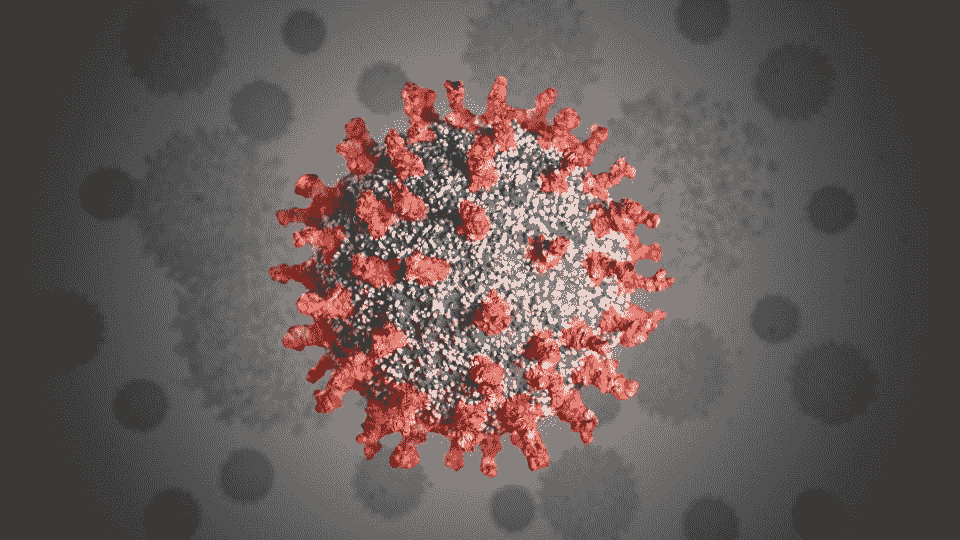

# 区块链和疫情:现在是技术崛起的时候了吗？

> 原文：<https://medium.datadriveninvestor.com/blockchain-and-the-pandemic-is-now-a-time-for-the-technology-to-rise-up-6a8793ae75af?source=collection_archive---------22----------------------->



Source: Shutterstock

T **他的世界正处于转型期。不管我们喜欢与否，一旦疫情得到控制，我们将不得不适应新的常态。我们越快适应，我们的反弹就越大。**

这种反弹的关键是区块链及其配套技术的采用。随着疫情暴露出全球各行业日常运营中的弱点，我们对集中式服务的依赖正在受到审视。

仔细观察这些弱点，可以发现区块链可以用正确的支持技术解决的问题。在这篇文章中，我们强调了为什么疫情是一个企业区块链采用的情况。

# **薄弱环节**

多年来，大多数行业都将利润置于急需的改进之上。短期目标导致了当前全球经济面临的压力。

供应链管理是受影响最大的行业之一，也是区块链开发商投入大量时间的行业之一。供应链上的延迟对全球人口的影响是显而易见的，因为当部分人口处于饥饿状态时，生产商被迫倾销更易腐烂的产品。

全球供应链管理的优化有助于解决这种前所未有的供需矛盾。通过物联网设备，供应商可以根据他们获得的反馈预测产品需求的波动。

此外，在这种流行病期间，供应链可以保持充分运作。随着物联网设备、机器学习和人工智能的应用，我们可以通过区块链集成优化工厂的生产，实现全自动生产选项和半自动选项，只需最少的人力。

上述选项在集中式系统中也是可行的。然而，区块链的分散性质使其成为异常场景的理想选择。区块链有一个强大的安全系统，可以在网络攻击中生存并保持运行，并且只需最少的人工监督。

# **安全会议**

在家工作是大多数员工的新常态。现在大多数会议都是虚拟的，Zoom 占据了在线会议的大部分份额。然而，该平台明显的不安全性和易受攻击性(T9)以及许多其他因素证明了区块链技术在企业中的重要性。

借助分散式视频通话应用，企业在平台上召开会议时的隐私性得到了保证。分散化使得网络攻击者更难找到薄弱环节。它进一步提高了安全性，确保如果黑客设法穿透强大的安全性，只有一小部分块会受到危害。

疫情之后，我们可能会看到几乎所有行业的变化。我们可能会看到的变化之一是物理会议的减少。大多数企业将不得不通过拥有安全的在线会议线路来适应商业环境中不断变化的趋势，例如由分散式应用程序提供的那些线路。

此外，随着虚拟学习目前正在发生，我们也可能会看到疫情后虚拟学习的增加。所有这些变化都需要一个强大的系统，能够无缝处理转型经济体的网络和安全需求。

# **快速反应**

如果说疫情教会了我们什么，那就是准备的优势和迅速行动的必要性。这两个教训都需要一个关键的东西，互操作性。

在一个安全、互联的网络中，来自世界各地的行业可以就即将发生或现有的危机进行合作并共享数据。来自不同领域的科学家也可以分享他们的数据，这将帮助我们更快地实现我们的目标。例如，通过区块链和人工智能，寻找疫苗的时间可以大大减少

银行业也将受益于一个能够快速响应的网络。随着危机期间对金融服务的需求可能上升，拥有一个可信的网络可以帮助管理预期的大量请求。

此外，银行可以受益于区块链技术带来的分散货币。这将有助于减轻经济负担，例如世界目前由于各种市场流动性不足而经历的情况。一种有效的分散货币可以缓解危机期间的现金压力。

各种区块链公司提供上述分散解决方案。但是，需要注意的是，Aelf 等公司为企业提供了最佳的全方位体验。

[Aelf](https://aelf.io/) 提供迎合各行业和各种需求的服务。此外，当谈到在其网络内划分服务时，它可以说是业内最好的。对于未来的互操作性需求，像 Aelf 这样的平台是必由之路。

Aelf 的这篇文章总结了他们令人印象深刻的产品追踪技术的使用。由于目前的疫情是一种容易传播的疾病，通过使用这样的供应链追踪解决方案，Aelf 将能够提供一个一致的平台，允许用户跟踪和监测任何新的和/或潜在的病例。

# **结论**

多亏了新冠肺炎·疫情，我们现在看到了我们日常运营中的明显缺陷。我们正在经历它，随着每一次经历变得更加明智。

现在，好的一面是我们有变革的创新，比如区块链技术已经准备好被采用。我们剩下的就是在日常运营中采用这些创新技术，为可能出现的任何不便做好准备。

关于 Aelf 及其服务的更多信息，请点击此链接。

```
***Disclaimer:*** *Please only take this information as my* ***OWN*** *opinion and should not be regarded as financial advice in any situation. Please remember to* ***DYOR*** *before making any decisions.*
```

♂️你好，我叫萨尔。*如果你觉得这篇文章有用，并想查看我的其他作品，请务必鼓掌并关注我的* [*中型*](https://medium.com/@salmanmiah) *和* [*LinkedIn！*](https://linkedin.com/in/salman-miah-57aa90a0/) *😎*