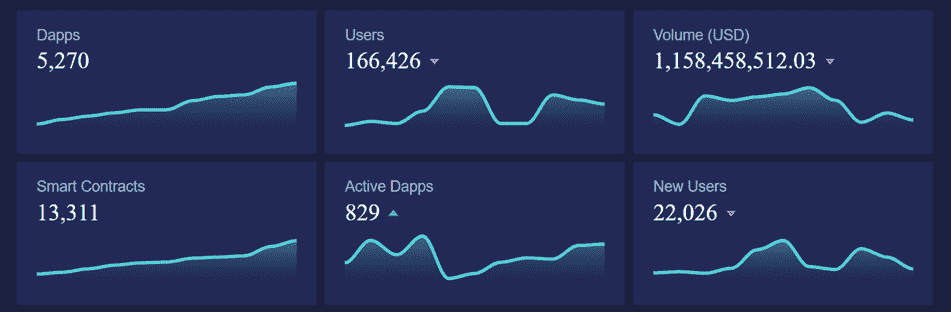

# 区块链应用成为主流——它们缺少什么，谁在解决

> 原文：<https://medium.datadriveninvestor.com/blockchain-applications-mainstream-what-they-lack-and-who-is-solving-5ea149cef37b?source=collection_archive---------7----------------------->

2020 年是 dApp 使用的动力年。对于第一个智能合约平台以太坊，整个以太坊 dapp 生态系统的日活跃唯一钱包上涨 118%，数据来源:dApp 雷达。

具有讽刺意味的是，今天大约有 5000 多万用户使用区块链的钱包，来源: [Statista](https://www.statista.com/statistics/647374/worldwide-blockchain-wallet-users/) 。这些钱包大多是为了储值或者长期不活动。很少有用户(按比例)体验过 dApps。在撰写本文时，有超过 5000 个 dApps，其中只有不到 900 个是活跃的。来源: [dapp.review](https://analytics.dapp.review/) 。

毫无疑问，区块链仍在期待它的大规模采用，这是一个完美的用例，可以为成为广泛用户和开发人员采用的可用技术铺平道路。

在这一点上，许多人会认为，由于可伸缩性问题，分散式应用程序后退了一步，然而，平台的速度并不重要，除非该平台有足够的采用率来要求该吞吐量。

让我们来看看 DeFi dApps 的情况。DeFi 似乎已经选择了主流的采用方式，然而， [ARPA 在 2020 年 7 月](https://medium.com/@arpa/2020-global-defi-user-survey-report-2c08cc59c192)的一项调查发现，500 万名密码交易员中只有 1%使用了分散金融协议。原因之一是使用应用程序的复杂性和糟糕的用户体验。

# 我们真正缺少的是“最终用户可用性”。

**用户不了解你的 app，就不会用。**以下几点解释了用户或开发人员使用区块链应用程序的障碍。

# (1)我为什么要付费:

互联网用户被基于“免费增值”模式的应用程序所包围，用户可以选择免费使用有限的服务，也可以付费使用高级功能。对于一个市场上的新服务来说，提供“免费增值”版本是一种快速获得用户的方式。

相比之下，每次用户与应用程序交互时，区块链应用程序都要支付交易费。“想象一下玩你童年时流行的视频游戏——马里奥，并为每一步支付交易费”听起来如何？这种应用在获取用户方面会面临困难，因此会限制它的广泛采用。

# (2)难以构建应用程序:

对于开发人员来说，在以太坊上构建应用程序，他们必须学习一种全新的语言——“可靠性”。开发人员需要很长时间来学习和编写智能合同。开发人员可能会犯一些简单的错误，这些错误可能会导致巨大的后果，如安全漏洞或高昂的交易成本。

编写糟糕的智能合约代码的一些最著名的例子是:

*   分散自治组织(DAO)黑客攻击—360 万以太网被盗(阅读更多详情> > [DAO 黑客攻击](https://www.coindesk.com/understanding-dao-hack-journalists))
*   奇偶校验使用的智能合约中发现的 Bug，被利用导致 50 万以太(ETH)损失，价值超过 2.8 亿美元。(阅读更多详情> >[奇偶错误](https://cryptovest.com/news/parity-was-warned-in-august-about-bug-that-froze-over-500-wallets/))。

考虑到构建分散式应用程序的困难，开发人员将其应用程序设计限制在最小可行产品的阶段。

# (3)不容易导航和使用:

区块链开发者把很多重点放在了后端，却忘了考虑前端体验。对于一个从未听说过加密货币的潜在用户来说，探索去中心化的应用程序可能是这样的:

*   注册
*   检查注册流程
*   了解解锁应用程序的安全密钥
*   了解钱包、元掩码或信任钱包
*   了解本地令牌，购买一些
*   大概搜索 YouTube 视频
*   最有可能的是关上窗户，并承诺永远不再回来。

**与传统网站/应用的新用户相比:**

*   注册(使用谷歌、脸书等网站和信用卡信息)
*   应用平台

上述问题限制了分散式应用程序发挥其全部潜力。因此，需要一种新的区块链协议模型，它不仅在可扩展性上起作用，而且提供更好的区块链开发工具并简化最终用户的体验。

过去的一年将这些问题带到了聚光灯下，许多公司和开发人员现在试图将这种麻烦的体验最小化。一个这样的初创公司， [NEAR protocol](https://near.org/) ，正致力于在区块链架构和编程模型中引入新思维。以下是 NEAR 如何解决这些挑战。

# 介绍 NEAR 协议:

[近](https://near.org/)ⓝ是一个分片的、开发人员友好的、证据确凿的可扩展公共区块链，从头开始构建，使开发人员能够更容易地构建和搭载用户。目前在主网络中运行，用户在基于 NEAR 的 dApps 中体验到快速交易结算(3 秒结束),与基于 ETH 的 dApps 相比，燃气费用减少了 10，000 倍。

它让用户可以免费试用分散式应用程序，就像他们试用所有其他应用程序一样。开发人员可以为他们预付交易费用，这样他们的用户就不需要为了开始使用应用程序而想办法在外部交易所购买加密令牌。此外，附近的[ⓝ引入了渐进式安全性，允许用户使用电子邮件注册(或注册)应用程序，就像他们从 Web2 注册其他应用程序一样。](https://near.org/)

通过这种方式，用户有时间逐步了解分散式应用程序，让用户轻松加入平台。一旦用户准备好提交，他们就可以链接他们的帐户安全，而不需要任何浏览器扩展，如 Metamask。

在ⓝ附近，开发人员可以使用熟悉的语言编写区块链智能合同——首先是汇编脚本和 rust——编译成 WebAssembly。AssemblyScript 允许您快速编写并利用大量现有 web 开发人员来构建您的团队，而 Rust 为您提供了强大的类型安全性和正式验证的运行时优势，以防止代价高昂的智能合约错误。

这对开发者来说更容易，因为他们不需要学习一门新的领域语言。测试环境、套件和以熟悉的编程语言开发智能合约的灵活性的结合，使开发人员能够以接近协议的方式构建功能丰富的应用程序，并提供愉快的用户(客户)体验。

此外，基于 NEAR 协议的开发人员可以直接设置一个开发人员费用百分比，在任何时候调用他们的智能合约时，除了交易费用之外，还会收取该百分比。例如，一个游戏资产在其他游戏中使用的货币化。这开启了一整套自动化的版税和基于许可的商业模式，而这在以前的区块链上很难实现。

# 结束语:

随着每一种新计算模式的出现，对于如何最有效地利用它以及它对创新的未来意味着什么，存在着大量的不确定性。**区块链也不例外。** [NEAR 协议](https://near.org/)承认可能性和开发者/用户约束的宇宙。NEAR protocol 不仅解决了速度和汽油费的问题，还改善了用户和开发者的参与流程，甚至让区块链新手也能参与进来。

对于感兴趣的开发者来说， [NEAR 协议](https://near.org/)包括一个[开发者程序](https://near.org/developer-program/#faq)，开发者可以利用 [NEAR 漫游教程](https://docs.near.org/docs/tutorials/test-your-smart-contracts)来创建他们的第一个 dapps。一旦准备就绪，他们就可以使用 NEAR protocol 的测试环境来测试他们的区块链应用。此外，开发人员可以连接到 NEAR 的全球[社区](https://portal.near.org/)，他们将尽一切可能支持您构建和增强您的应用程序。