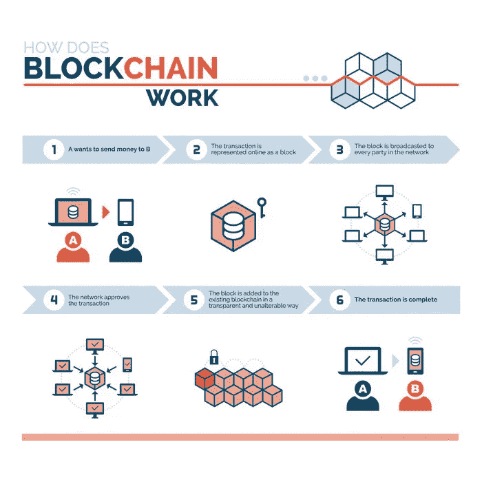
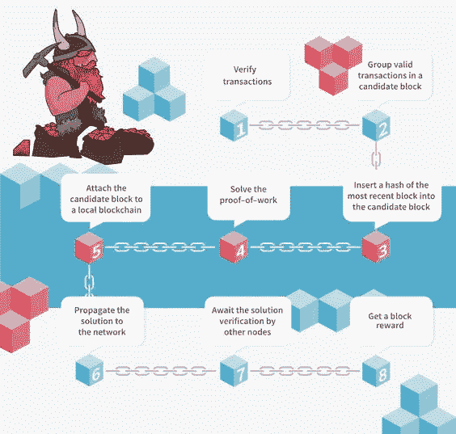
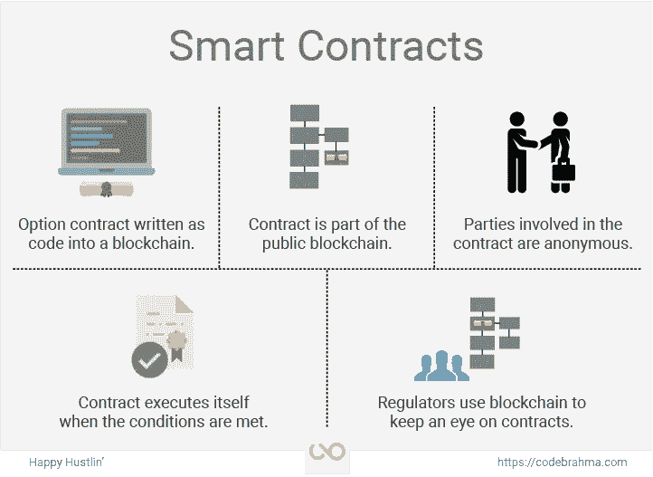

# 区块链基础——更深入的观察

> 原文：<https://medium.datadriveninvestor.com/blockchain-basics-a-deeper-look-f3bd3da0ef1d?source=collection_archive---------17----------------------->

什么是区块链？

区块链是一个不断增长的记录列表——称为块——这些记录使用[加密技术](https://economictimes.indiatimes.com/definition/cryptography)进行链接和保护。

每个数据块都包含某种形式的数据、一个以前的哈希和它自己的哈希——除了区块链中称为*‘起源数据块’*的第一个数据块，它不包含以前的哈希。

Image courtesy of [https://www.coinmama.com/guide/what-is-the-blockchain](https://www.coinmama.com/guide/what-is-the-blockchain)

什么是‘哈希’？

哈希是一个过程，它通过一种称为哈希算法的数学算法将任意长度的输入转换为加密输出。大多数区块链使用 SHA-256 散列算法，它产生 64 个字符长的散列码——SHA 代表安全散列算法，256 是因为它在内存中占用了 256 位。该散列码实质上充当该块的数字指纹。

为了安全起见，加密哈希函数需要满足 5 个要求:

**1。单向:**这意味着对于每个输入，函数都很容易计算，但几乎不可能求解所述函数的逆。也就是说，对于数据 *x* ，很容易计算出 *x* 的散列函数，但是知道最终乘积的值，就很难计算出 *x* 的初始值。

**2。确定性:**如果你给函数一个特定的输入或一组数据，你将总是得到相同的一致结果。

**3。快速计算:**散列函数必须能够快速有效地返回特定输入的散列。

**4。雪崩效应:**如果输入到函数中的数据发生了变化，那么这种变化必然会触发数据输出散列的剧烈变化。这个性质导致了区块链的不变性。

**5。必须经得起碰撞:**这意味着 2 组数据通过函数后不能有相同的哈希值。如果两个输入映射到同一个输出(哈希值),这就是所谓的冲突。SHA-256 哈希算法不排除冲突，但是冲突非常少，很容易处理。

Image courtesy of [https://media.consensys.net/guide-hashing-33dc0467c126](https://media.consensys.net/guide-hashing-33dc0467c126)

为什么区块链如此安全？它们是如何不可改变的？不可改变的到底是什么意思？

关于区块链，你最常听到的一件事就是输入到链中的数据是不可变的。这仅仅意味着输入的数据块是不变的，不能以任何方式改变。

如果块被更改或改变(通常是恶意用户试图以对自己有利的方式改变链中的数据)，块之间的加密链接将不再有效。由于上面讨论的 SHA-256 散列算法，每次数据块中的数据发生变化时，都会给它一个新的散列(因为输入的新数据将不同于块中存储的原始数据，因此会为块创建一个新的散列)。该散列将不再与下一个块的*‘先前散列’*匹配。这打破了区块之间的联系，因此您不仅可以快速找出区块链上的东西是否被更改，还可以准确地找出它们在哪个区块被更改。

然而，这并不意味着区块链是绝对正确的。如果有人来改变区块链上的一个街区，有一种方法可以使链条再次有效。通过修复链中从他们改变的块一直到最近的块的每个断开的加密链接(通过纠正所有的*先前的散列*直到当前块)，他们将验证链。然而，这只有在存在区块链的一个单一副本的情况下才有效，这将引导我们进入下一个主题— *分布式对等网络*。

**当人们谈论区块链时，他们通常会谈到它们是如何分布的，这是什么意思？**

区块链是建立在分布式账本技术(或简称 DLT)之上的。根据维基百科的说法,“DLT”是地理上分布在多个地点、国家或机构的复制、共享和同步的数字数据的共识。没有中央管理员或集中的 [*数据存储*](https://en.wikipedia.org/wiki/Computer_data_storage) *。需要一个* [*对等*](https://en.wikipedia.org/wiki/Peer-to-peer) *网络以及* [*共识*](https://en.wikipedia.org/wiki/Consensus_(computer_science)) *算法来确保跨节点的复制得以进行。那么，这在英语中是什么意思？*

一个对等网络(简称 P2P 网络)是区块链技术运作的一个重要组成部分，也是它如此安全的原因。网络上的每一个*【对等】*都是一台计算机(俗称*【节点】*)。网络中的所有节点都是相互连接的。链中的数据分布在所有节点上，而不是由一个中央服务器保存区块链上的所有信息。网络中的节点越多，区块链的副本就越多，这有助于防止恶意用户破坏数据。

如果有人出现并试图改变区块链，密码链接将被破坏，链将失效。即使他们随后改变该块之后的每个块，并使整个链再次有效(如上所述),这也无关紧要，因为分类帐(节点)的网络会发现其中一个区块链有问题，即其中一个无效。网络上的区块链副本不再匹配。没有 P2P 网络，各种链之间就没有*共识*，因此，如果任何链被成功更改，恶意用户将逃脱惩罚，因为该链将是有效的，不会有可察觉的问题。然而，对于 P2P 网络，他们需要成功地改变网络中超过 50%的节点，以达成*共识*，并在这样做时成功地改变链——所有这些都是在下一个块被添加到链中之前(在几秒到几分钟内)。这给不信任的网络带来了信任。

Image courtesy of [https://lisk.io/academy/blockchain-basics/benefits-of-blockchain/blockchain-security](https://lisk.io/academy/blockchain-basics/benefits-of-blockchain/blockchain-security)

**区块链技术方面的共识是什么？**

谈到区块链技术，有各种类型的*共识协议*。这些协议中的每一个的基本目标是管理分布式网络如何同意向网络或链添加块。协议必须决定增长哪个链，即，如果两个块同时进入区块链，它必须决定首先添加哪个块。它还必须防范攻击者。有许多不同的共识协议，最著名的是工作证明协议。

**工作证明** —说到工作证明共识算法，关键是*“最长的链为王”*。这意味着具有最多块的链将最终获胜，并成为实际有效的链。这里重要的是第二个下一个块在哪里结束，这决定了区块链的新的有效形式。当出现分裂链时，拥有 50%以上[哈希能力](https://coinsutra.com/hash-rate-or-hash-power/)的一方将赢得共识，成为真正的链。

**什么是挖掘？**

当讨论区块链技术或加密货币时，你最常听到的一个术语是*‘挖掘’*，但到底什么是挖掘呢？

挖掘是将事务或块添加到现有分布式事务分类帐或区块链的过程。挖掘包括创建一个不容易伪造的交易块的散列，保护整个区块链的完整性，而不需要一个中央系统(即，它支持区块链的去中心化性质)。

采矿通常在专用计算机上进行，因为它需要快速的 CPU，以及比典型的计算机操作更高的用电量和更多的热量。采矿的主要动机是，选择使用计算机进行采矿的用户会因此获得奖励——在加密货币的情况下，矿工会收到一些加密货币作为奖励。

我在上面提到过，每个块都包含一个前一个散列、一个后一个散列和某种形式的数据。每个块还包含一个称为*‘随机数’—*的数据字段，它是一个任意的数字。这种临时的数据领域就是挖掘的全部内容。nonce 提供了额外的控制，因为您可以通过更改 nonce 的值来操作块散列，这意味着对于这个任意数字的不同值，您可以为块生成不同的散列值，因为 nonce 本身就是块中包含的一段数据。

挖掘者解决的难题是识别 nonce 的值，以便被挖掘的块的散列输出以特定数量的前导零开始。实现这一点的随机数的价值正是矿工们试图解决的问题。要达到的前导零的个数，称为区块链网络在挖掘时的难度。难度是由区块链网络本身决定的。

为了将新的散列包括在区块链中，它必须低于目标值。这没有逻辑上的原因，这仅仅是一种给矿工制造挑战的方式。*‘金色现时’*奖励你方块，然后被区块链接受。没有计算随机数的公式，挖掘者一次又一次地改变随机数，直到散列值低于目标值。

Image courtesy of [https://www.pinterest.ie/pin/727683252263040206/](https://www.pinterest.ie/pin/727683252263040206/)

**区块链技术和加密货币有什么区别？**

当你第一次开始钻研区块链的世界时，最令人困惑的问题之一是区块链技术和加密货币之间的区别。简单地说，区块链是加密货币使用的基础技术。加密货币是指在区块链(分布式交易分类账)上运行的数字货币。区块链充当形成网络的分布式分类帐。这个网络创造了交易的手段，并使价值和信息的转移成为可能。

**什么是智能合同，是什么让它变得*“智能”*？**

智能合同很像日常合同。本质上，这是一份在区块链上运行的普通合同。双方之间的规则和协议被编码到合同中，因为它在区块链上，这些规则是不可改变的，所以不能被更改。当满足预定义的规则时，智能合约中包含的代码会自动执行该协议。这再次消除了对中央机构的需要，因为一旦符合规则，协议就是自动的。

Image courtesy of [https://codebrahma.com/brief-intro-smart-contracts-endless-possibilities/](https://codebrahma.com/brief-intro-smart-contracts-endless-possibilities/)

斯蒂芬·基尔康明斯

[领英](https://www.linkedin.com/in/stephen-kilcommins/)

**参考文献:**

[https://blockgeeks.com/guides/what-is-hashing/](https://blockgeeks.com/guides/what-is-hashing/)