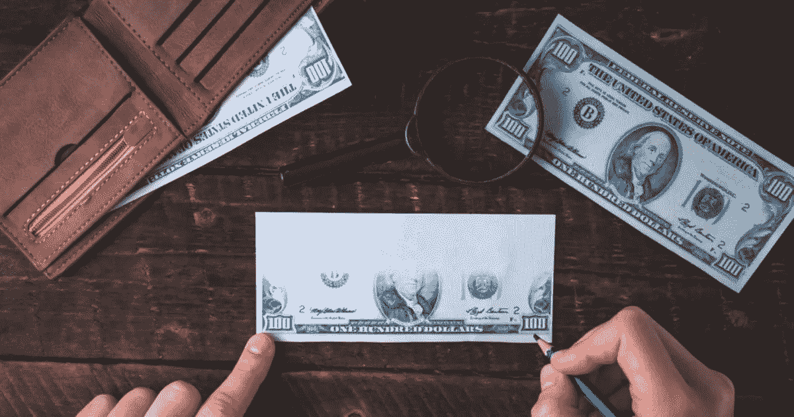

# 区块链、品牌和服装:2020 年还会是增长的一年吗？

> 原文：<https://medium.datadriveninvestor.com/blockchain-brands-and-clothing-will-2020-continue-to-be-a-year-of-growth-ec334c384368?source=collection_archive---------17----------------------->

假冒商品长期以来一直是时尚和品牌商品的一个问题，据[报道计算](https://www.businesswire.com/news/home/20171222005383/en/Global-Brand-Counterfeiting-Report-2018-Counterfeited-Goods)多达 1.2 万亿美元的价值被盗。

根据[全球品牌打假报告 2018](https://www.researchandmarkets.com/research/7j7l2n/global_brand?w=4) ，

> “全球贸易和技术的发展对世界各地的许多市场产生了积极影响，但同时也带来了一些重大的负面影响。商业组织花费大量的金钱、时间和资源来保护他们的品牌和商标。但即使采取了所有措施，假货市场仍在迅速发展。”

## 那么，区块链有什么帮助呢？

2020 年已经开始，区块链继续在许多金融领域使用和实施。现在，为了[鉴定商品](https://www.bcg.com/publications/2019/stamping-out-counterfeit-goods-blockchain-internet-of-things-iot.aspx)并帮助买家在购买昂贵或奢侈品时安心。

> 为了管理真实性，只有真正的、经过验证的标签和产品才能进入自动区块链。在制造过程的早期输入这些信息，可以在制造、运输、配送和销售过程的每个阶段跟踪每一个带标签的产品或批次。

 [## 5 行业转型区块链应用|数据驱动投资者

### 除非你一直生活在岩石下，否则我相信你现在已经听说过区块链了。而区块链…

www.datadriveninvestor.com](https://www.datadriveninvestor.com/2019/02/13/5-real-world-blockchain-applications/) 

在过去的一年中，许多顶级金融部门不断尝试采取更多措施来打击这一领域的犯罪，最近几天这一趋势继续增强。自从区块链引入以来，防伪一直是一个受欢迎的用例，许多大公司都在他们的产品中使用它。微软、路威酩轩和其他公司已经参与其中，还有更多公司紧随其后。

本周进一步报道，佛罗伦萨的意甲运动队[现在也在球员的衬衫上增加了芯片，确保特殊的和不可改变的代码可以跟踪和验证物品，供任何潜在的买家使用。这家体育俱乐部刚刚开始这项测试，向球员出售球衣，然后在 2020 年足球赛季的剩余时间里将收入捐给慈善机构。](https://medium.com/@GeoffreyGardiner/serie-a-football-team-uses-blockchain-to-verify-real-shirts-11ccd0c745df)

添加芯片、跟踪和不可更改的代码是展示区块链技术所有权和真实性的绝佳方式。任何持有或拥有一件物品的人都可以通过简单的在线步骤轻松验证其真实性。在过去，我们使用纸质证书和专家来辨别物品是否是真的，然而，随着技术的进步，我们应该能够轻松、立即地辨别物品是否是真的，而不需要额外的费用。

最后，有了互联网、区块链和追踪，我们可以。

*最初发布于*[*https://block chain . news*](https://blockchain.news/post/blockchain-brands-and-clothing-will-2020-continue-to-be-a-year-of-growth)*。*