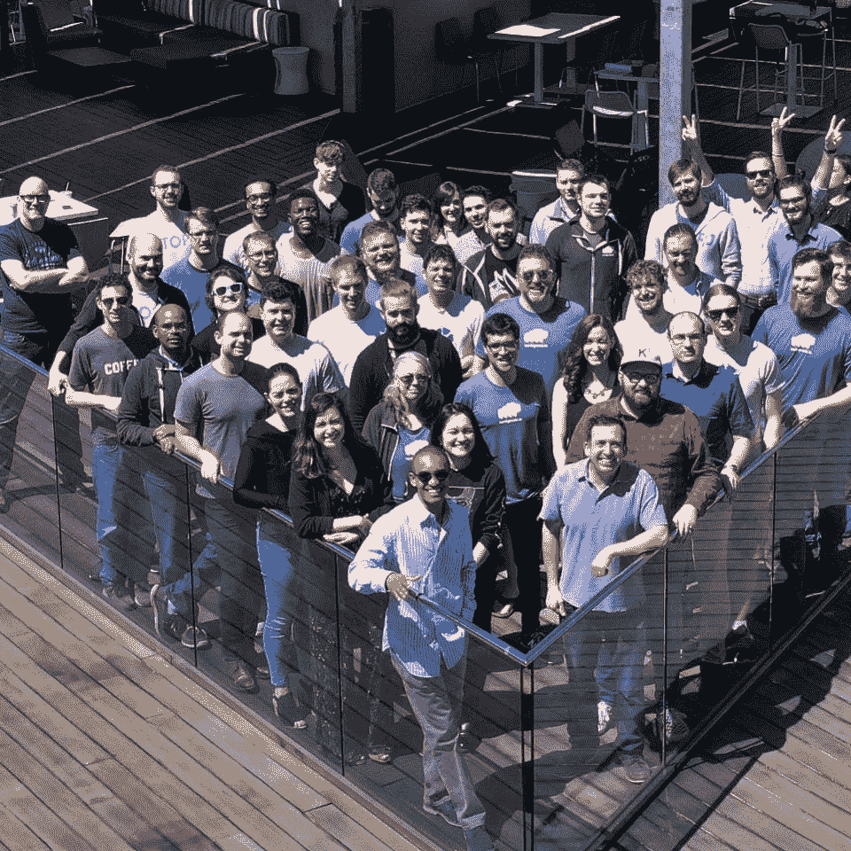

# 区块链创造了新的云。Storj 想挑战巨人队。

> 原文：<https://medium.datadriveninvestor.com/blockchain-creates-a-new-cloud-storj-wants-to-challenge-the-giants-fa4435dd5df4?source=collection_archive---------26----------------------->

A “Secure Cloud Storage” drive is pictured at the CeBIT at the CeBIT, the world’s biggest IT fair, on March 3, 2011 in Hanover, central Germany. More than 4,200 tech firms from 70 countries are expected to attend this year’s CeBIT, with many of the big names that stayed away during the global financial crisis returning to Germany. The fair is running until March 5, 2011\. AFP PHOTO / JOHANNES EISELE (Photo credit should read JOHANNES EISELE/AFP via Getty Images)

Storj 实验室开始营业。Storj 的平台 Tardigrade 是一个分散的云存储服务，想要挑战亚马逊的 S3 云网络。

如果成功的话，像 2017 年 Equifax 个人信息黑客这样的数据泄露几乎不可能成功。更好的是，新公司会为你多余的存储空间付钱。

我们把区块链和比特币联系在一起。加密货币开始使用加密的公共分类账，分成许多部分，或分散的组件，然后用私钥重新组合在一起。但是它的应用继续以更令人兴奋的方式被应用。

 [## 创新提醒:区块链 3.0、Terra 协议、ICO 门户和更多|数据驱动的投资者

### 尽管过去几个月加密货币的价格波动很小，但这项技术并没有停止发展…

www.datadriveninvestor.com](https://www.datadriveninvestor.com/2019/03/16/innovation-alert-blockchain-3-0-terra-protocol-an-ico-portal-more/) 

分散式云存储系统是一种类似于区块链的分散式技术，它在数据上传到服务之前对数据进行加密，并在全球范围内分发每个部分。Storj 将这些数据分成 80 份，其中只有 30 份需要用来创建原始文件。黑客将需要每个文件的密钥，例如个人信息，以及危害 30 个分布式和随机存储节点；然后，他们需要在解密每一部分的时候把它重新组合起来。他们必须对每个后续文件重复该过程。

想想那些试图利用软件漏洞的黑客，比如 2017 年的 Equifax 黑客事件，该事件暴露了 1 . 47 亿人的个人信息，并导致 4 . 25 亿美元的罚款，以帮助受漏洞影响的人。要在分散模式中窃取文件，恶意行为者需要从世界各地随机分布的数千个存储节点中入侵 30 个不同的特定存储节点，然后单独获取该文件的加密密钥。

Storj 的 Tardigrade 平台是一个开源模型。合作伙伴提供他们的存储空间来创建网络。Storj Labs 的执行主席兼临时首席执行官 Ben Golub 表示:“我们的竞争优势是，我们会公平地补偿人们的备用驱动器空间。”

但这会有风险吗？

允许许多不同的合作伙伴会产生安全问题吗——一种不同的软件缺陷？

Golub 先生认为，他们的模型假设他们网络中的一些人可能会做出不诚实的行为。虽然这是一个问题，但相信许多随机分布的合作伙伴将努力支持、稳定和创建一个比主流云竞争对手提供的更安全的系统。

Storj lab 声称，“通过在默认情况下使用客户端加密，并将文件片段分布在 80 个或更多不相关的节点上，Tardigrade 平台比传统云存储解决方案更加安全和隐私，让用户相信他们的数据不会被泄露或挖掘。”

像亚马逊或谷歌这样的集中式云存储模式已经主导了存储行业。进入壁垒很大，因为在集中模式下竞争需要大规模经济。虽然像亚马逊的 S3 这样的系统具有弹性、安全性和广泛可用性，但戈卢布认为分布式云模式更可靠，运营成本更低。

Storj Labs 运营副总裁 John Gleeson 表示:“我们认为解决方案不是一种新的许可证，而是一种新的云。

“虽然大多数云服务提供商对提供跨区域支持收取高额费用，但存储在 Tardigrade 上的文件默认分布在许多区域，不收取额外费用。因为文件的 80 个片段中的任何 30 个片段都可以用来重建文件，并且因为 80 个片段中的每个片段都存储在统计上不相关的节点上(具有独立的电源、操作人员、设备和网络)，所以该系统对中断或违规具有极强的抵抗力，无论是由自然灾害、人为错误还是恶意行为造成的。”

从新闻稿中可以看出，Storj 的测试期吸引了全球成千上万的用户和存储节点运营商。Tardigrade 声称，在此期间，他们从未丢失过一个文件，保持了与 S3 相同或更好的性能，并提供了超过 99.95%的可用性。

Golub 先生还在 Mayfield 担任顾问，这是一家全球风险投资公司，管理着超过 27 亿美元的资金。他之前是 Docker 的联合创始人兼首席执行官，Docker 是容器和微服务运动的领导者。在 Docker 之前，Ben 是 Gluster 的联合创始人兼首席执行官，g luster 是一个开源云存储平台，于 2011 年被红帽收购。

Storj 的团队

Storj 团队照片

…阅读更多内容

*最初发表于*[*【https://www.forbes.com】*](https://www.forbes.com/sites/robertanzalone/2020/03/19/blockchain-creates-a-new-cloud-storj-wants-to-challenge-the-giants/)*。*