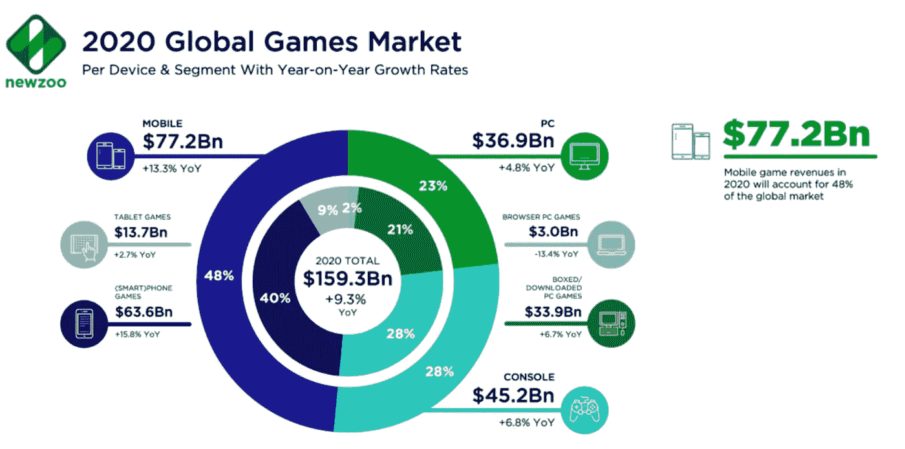

# 在线游戏行业正在使用区块链密码

> 原文：<https://medium.datadriveninvestor.com/blockchain-cryptos-being-used-by-on-line-game-industry-23d3b97c9c9b?source=collection_archive---------21----------------------->

Source: [Newzoo 2020 Global Games report](https://newzoo.com/insights/articles/newzoo-games-market-numbers-revenues-and-audience-2020-2023/)

根据 Newzoo 的数据，在线游戏市场的规模是巨大的——全球游戏玩家超过 26 亿，2019 年的收入预计将达到[**超过 1593 亿美元**](https://newzoo.com/insights/articles/newzoo-games-market-numbers-revenues-and-audience-2020-2023/) ，其中 48%的收入来自亚太(APAC)m 地区。APAC 的增长是由 13 亿游戏玩家的需求推动的，特别是中国，仅营业额就有 360 亿美元，而美国只有 350 亿美元。

由于新冠肺炎和人们被锁在家中无法工作，我们已经看到游戏的显著增长，预计仅手机游戏在 2020 年就将产生 772 亿美元的收入，同比增长 13.3%。

 [## 数字货币、区块链和货币的未来|数据驱动的投资者

### “区块链”、“加密货币”、“令牌化”，以及现在的“央行数字货币”已经成为…

www.datadriveninvestor.com](https://www.datadriveninvestor.com/2020/02/18/digital-currencies-blockchain-and-the-future-of-money/) 

区块链和加密货币正被用于简化支付，为玩家证明虚拟资产的所有权，实现这些虚拟资产交易时的记录和审计跟踪以及跨游戏兼容性。

玩家可以使用区块链技术从在线游戏中赚取、购买和花费代币，该技术为游戏代币和游戏资产创建了一个加密会计系统，可以在单个游戏之外进行交换

有趣的是，由于 4 月下旬以来的高油价，所有在[以太坊区块链](https://www.blockchaingamer.biz/tag/ethereum/)上运行的游戏的日常活动都出现了崩溃。受打击最大的是 [*我的隐密英雄*](https://www.blockchaingamer.biz/tag/my-crypto-heroes/) ，经历了 [33%的下跌](https://www.blockchaingamer.biz/features/13002/most-popular-blockchain-games-2/)。据 [Coinswitch](https://coinswitch.co/news/top-5-best-gaming-cryptocurrencies-in-2020) 报道，2020 年最受欢迎的网络游戏加密货币如下: [FunFair](https://funfair.io/) 、[金恩](https://enjin.io/)、 [RevolutionVR](https://cmc.io/coins/revolutionvr) 、 [GameCredits](https://gamecredits.org/) 、[decoul and](https://decentraland.org/)每一种都有数千名游戏玩家在玩，完成任务，积累虚拟资产。

代币用于奖励完成特定任务的游戏玩家，奖励观看广告，用于完成调查，作为对联盟营销的支付。不再需要现金交易和银行账户，所有这些都包含在数字生态系统中。

在线游戏是一个巨大且不断增长的全球市场，从上面我们可以看到，区块链技术和数字资产正越来越多地被用于这一领域

**#区块链#游戏玩家#视频游戏#虚拟世界#代币#以太坊#透明度#分散地#额济纳#游乐场#密码**

如果你想每周收到数字字节，请发电子邮件给 Jonny.Fry@Teamblockchain.net