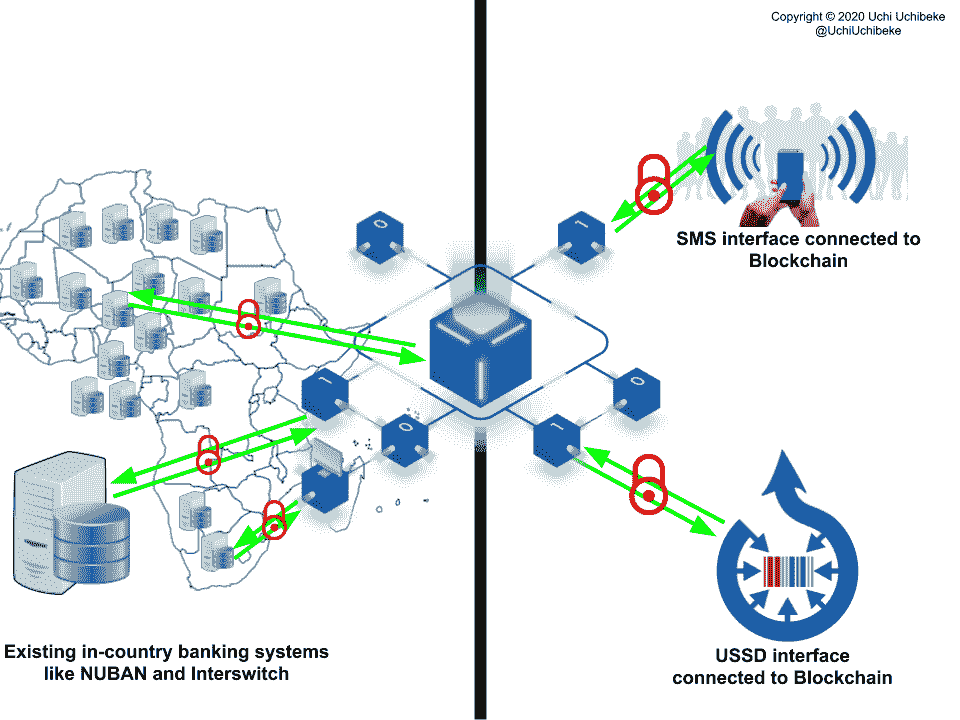

# 区块链:数字货币与身份货币

> 原文：<https://medium.datadriveninvestor.com/blockchain-digital-currency-vs-identity-currency-6d5e9b034648?source=collection_archive---------17----------------------->

这改编自我在 Tekedia 迷你 MBA 项目上的一次演讲，我在那里教授新技术、增长、颠覆性创新。

# 介绍

区块链技术通过以安全、灵活和可审计的方式存储数据，彻底改变了我们存储和共享数据的方式。《哈佛商业评论》甚至说，它有“为我们的经济和社会体系创造新基础的潜力。”

Photo by [Thought Catalog](https://unsplash.com/@thoughtcatalog?utm_source=unsplash&utm_medium=referral&utm_content=creditCopyText) on [Unsplash](https://unsplash.com/s/photos/money?utm_source=unsplash&utm_medium=referral&utm_content=creditCopyText)

区块链是一个计算机网络，所有计算机都同意统一的信息分类账。分布式分类账以安全、灵活、可验证和永久的方式记录交易。区块链中的交易可以是资产的交换、智能合同条款的执行或记录的更新。区块链技术正在彻底改变我们存储和共享数据及其他数字产品的方式。因此，它有可能让企业数字化，并开辟新的创收形式，就像比特币和其他加密货币一样。

> 区块链有可能为我们的经济和社会系统创造新的基础。——**哈佛商业评论**

# 区块链的好处

区块链的好处不仅在于加密货币，还在于区块链技术本身提供的机会。像比特币区块链这样的公共区块链非常适合加密货币。然而，金融机构、政府和企业都希望获得一些控制权和隐私，因此转向了私人的、允许的或不允许的区块链。像 Hyperledger Fabric 这样的私有区块链已经被加拿大的大银行和 IBM 等金融机构广泛采用，因为它们以私有和许可的方式提供区块链的好处。四个关键优势使区块链对于第四次工业革命(工业 4.0)的快速转型至关重要:

1.  **防篡改**:所有数据和变更的完整记录历史在链中可用
2.  **无单点故障**:如果一个节点发生故障，网络的其余部分会进行补偿
3.  **抗勒索软件**:像 WannaCry 这样的病毒必须同时攻击每个节点来劫持数据
4.  **加密安全**:使用行业最佳加密技术，防止数据被篡改

A sample Blockchain Network to illustrate how African countries can trade without US Dollars.

# 荒野中的区块链

# 加拿大银行的客户入职速度提高了 1000 倍

## 为什么？问题是

在一家银行，由于技术或业务原因，同一家银行的不同业务部门之间无法共享数据。感觉就像每次你想买一辆新车或租一辆车时，顾客都要重做他们的驾照考试。

想象一下，银行客户珍妮走进银行注册一项产品或服务，比如在银行私人/个人银行部门开一个储蓄账户，她必须接受严格的背景调查；其中包括诸如重新确认他的身份、风险承受能力等等！所有这些信息都存储在银行的私人/个人银行数据库中。现在，假设珍妮想在银行证券部注册一个投资账户。她必须重做整个签约过程，因为不幸的是，在不同业务部门之间共享数据非常困难，而且 KYC 和反洗钱监管部门抱怨银行需要这样做。这让珍妮陷入了她在全行签约的产品和服务的所有文书工作中。这给她带来了令人沮丧的客户体验。在该银行，当客户在另一个业务领域注册账户时，冗长的过程可能需要长达 2 周的时间才能完成。

## 挑战

1.  整个银行都有重复的员工工作和重复的数据
2.  了解我们的客户很费钱。这个过程平均需要世行 1 亿美元。
3.  最后，当前的进程并不像它应该的那样安全！

## 区块链在公司里是如何被利用的

为了解决这个挑战，成立了一个团队来理解这个问题。因为这是一个流程挑战，而且许多后台流程都是在客户未受保护之前发生的，所以该团队研究了员工，前往银行分行与经理和客户服务人员交谈，并采访了许多高管，然后提出了一个名为 VERI 的 Blockchain 客户身份管理生态系统。VERI 是一个可扩展的生态系统，使用 Blockchain 技术跨不同业务线管理数字客户身份和产品注册过程。

VERI 为区块链提供了许多好处，概述如下:

**许可与私有:** VERI 是使用许可与私有的区块链建造的，所以只有客户才能启动注册过程。这意味着只有需要查看数据的部门才能访问数据。

**灵活:**由于灵活，很容易满足不同业务线的需求，他们可以在 Blockchain 上创建自定义工作流。

**永久的:**区块链允许银行保留永久的数据记录，这是一个变化的历史，这让审计人员很高兴，也让银行在知道数据保持其完整性后感到放心。这就形成了一个可验证的信息来源。

最后，由于它的分布式和分散性，没有单点故障并提供了高可用性

## 解决方案的组成部分

*   后端块链是魔术发生的地方，
*   银行现有客户使用的移动应用程序，直接嵌入到现有银行应用程序中；以及
*   员工和审批机构使用的 Web 应用程序。

当客户想要注册某个产品时，他们会使用经过验证的数字身份自动填写申请表。根据业务部门指定的自定义工作流，银行的员工可以审查和批准提交，以便可以开立帐户。该验证过程符合严格的监管要求。该团队开发的方法正在美国和加拿大申请专利。

## 对公司的好处

该解决方案不仅解决了银行的数据共享问题，还带来了额外的好处。三个最重要的优势包括:

1.  这有助于银行了解客户，让他们对客户有一个全面的了解，从而提供个性化的产品和服务
2.  它每年为银行节省高达 3300 万美元
3.  它将两周的流程缩短到 20 分钟，即速度提高了 1000 倍

这些都改善了客户体验。

## 产品的未来和潜力

该团队使用两条业务线作为新区块链解决方案的用例。然而，他们将 Veri 设计为高度可扩展的，因此该银行可以插入来自信用卡、抵押贷款和银行其他部门的服务，因此客户可以使用他们的数字身份注册这些部门的服务。他们通过提供一个界面来做到这一点，该界面允许银行的员工在没有任何技术技能的情况下添加自定义工作流和表单。

 [## 5 行业转型区块链应用|数据驱动投资者

### 除非你一直生活在岩石下，否则我相信你现在已经听说过区块链了。而区块链…

www.datadriveninvestor.com](https://www.datadriveninvestor.com/2019/02/13/5-real-world-blockchain-applications/) 

该解决方案有可能为资产交换、结算和认知分析服务提供动力。可能性是无限的，在未来，拥有这种解决方案的银行可能会允许较小的银行和公司使用他们的平台进行用户身份验证，并在此过程中赚钱。

# Buycoins Africa: Naira 到加密货币平台

## 为什么？问题是

使用尼日利亚奈拉或银行账户购买加密货币并不容易。人们必须购买美元，然后用美元购买加密货币。

## 挑战

1.  对于需要加密货币的尼日利亚人来说，这是一项重复的工作，因为他们必须花时间将货币转换成美元，然后再转换成加密货币。
2.  在尼日利亚，拥有加密货币的成本很高；事实上，它花费了普通用户花费的 5%。
3.  这很费时间。

## 公司是如何使用技术的

它们提供了一个区块链平台，尽可能方便快捷地满足用户购买、出售、存储或转移比特币、以太坊和莱特币的需求。

为了应对这一挑战，创始人组建了一个由设计师、开发人员和产品人员组成的团队。接下来，他们构建了可能连接到区块链网络的移动应用程序，以存储、安全处理和更新用户和交易信息。

> [Buycoins Africa](https://buycoins.africa/) 将完成 Cryptos 购买的时间减少到 0。

## 有益于公司和非洲

Buycoins 平台提供了一种在整个非洲购买/销售加密货币的无缝方式，从而实现了尼日利亚与其他国家之间的商业往来，而无需公司先兑换成美元，这在三个方面带来了好处:

1.  他们从 P2P 交易收取的交易费和其他费用以及数据播放中获利。从他们的网站上，他们提到他们的点对点交易的利润非常低。虽然这低于非洲大陆上任何其他平台，如 LocalBitcoins (1%)、Remitano (1%)和 Paxful (1%)，但 Buycoins 仍然赚了一些钱。
2.  并且它将完成购买密码的时间减少到 0，因为交易是即时完成和结算的。

## 产品的未来和潜力

交易数据和用户交易模式对于未来的产品路线图和非洲国家之间的国家间转让可能很有价值。