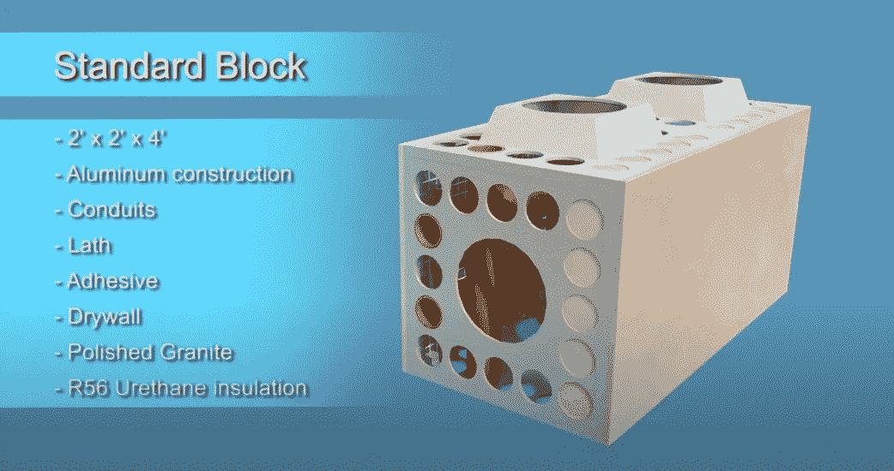
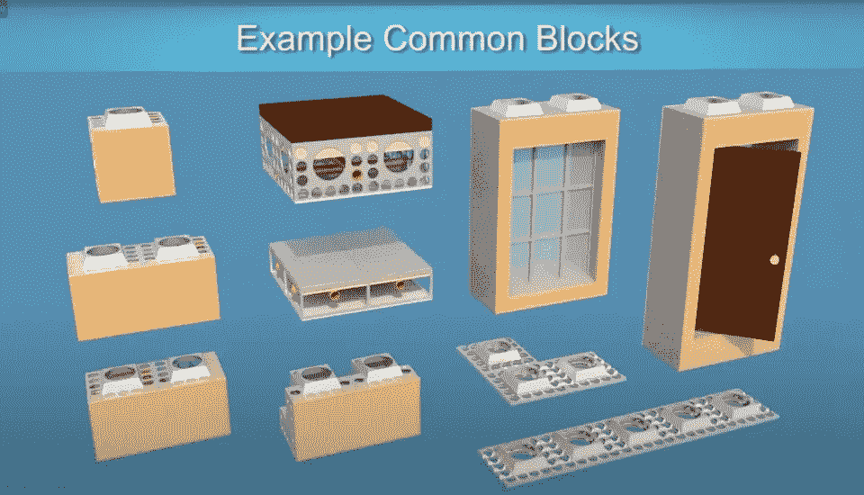

# 区块链在 10 万亿美元的行业中找到了自己的家

> 原文：<https://medium.datadriveninvestor.com/blockchain-finds-its-home-in-a-10-trillion-industry-adcb34b1d2b2?source=collection_archive---------2----------------------->

## 区块链

## 区块链现在可以产生现实世界的影响，解决现实生活中的问题

Created with Canva Design

一群新的和现有的公司正在研究 AECROS。其结果是一个叫做**汽车制造**的*新产业*。

> [Auto Construction](https://autoconstruction.org/2020/10/16/what-is-auto-construction/) 将结合物联网、区块链、AI、Digital Twin、BIM 等各种现有技术，创造一种完全自主、最高效的建造方式，这是以前从未有过的。

这不仅会彻底改变建筑行业——这是目前数字化程度最低的行业——还会让区块链成为主流。最后，区块链将找到其最有用的用例，此前十多年来，它只是投机者的一种金融工具。

> **根据经济研究委员会的数据:全球建筑业**预计到 2023 年将达到约 10.5 万亿美元，预计从 2018 年到 2023 年将以 4.2%的 CAGR 增长。

让我们讨论一下事情将如何发展，以及为什么这是一件大事。

# 建筑方面的事情

[MBU (Left), Other MBU Blocks For Different Needs (Right)](https://www.youtube.com/watch?v=vR8SOXGEBOQ)

由于其巨大的规模、对数字化的需求以及全球化的存在，建筑业是需要颠覆的行业之一。

AECROS 正在开发**模块化建筑单元(MBU)** ，这是可定制的成品建筑块，具有嵌入式物联网传感器和土木要求。

借助 [**建筑信息建模**](https://www.autodesk.com/solutions/bim)[**【BIM】**](http://The people who are crazy enough to think they can change the world are the ones who do)和 [**有限元建模**](https://en.wikipedia.org/wiki/Finite_element_method#:~:text=The%20FEM%20is%20a%20particular,that%20are%20called%20finite%20elements.)[**(FEM)**](http://The people who are crazy enough to think they can change the world are the ones who do)——最先进的建筑技术，简化和完善这些区块的设计和工程。客户可以将他们的设计要求和规格发送给公司，以获得完美的产品。

这些标准化的砌块在工厂大量生产，然后运输到建筑工地。这些块是自动完成的。

这些积木的模块化允许消费者更换特定的积木，购买单个积木，并重复使用或转售它们，而不是拆除建筑。

从本质上讲，这些建筑材料提供了最高效、最具成本效益、最环保的建筑方式。*重复使用街区*系统允许建设中闻所未闻的现象，这使得建筑拆除过程被一种称为解构的新过程所淘汰。

> 街区成员的超级街区可以像解构乐高积木一样被解构，而不是通过拆除产生成吨的废物。

这加强了对绿色建筑的重视，同时创造了重新安置或重新配置建筑布局的可能性。建筑物从建造到拆除的整个生命周期几乎没有浪费，这在业内前所未闻。

使用过的砌块可以在开发成本是一个巨大因素的地区重新使用。这些街区可以在灾难发生时为许多人提供避难所。这些模块的模块化使它们适用于各种环境。

[**(整个施工过程的视频)**](https://www.youtube.com/channel/UCCyvgov8eRjr6kOQuQ8exlA)

# 区块链、人工智能和物联网的作用

区块链和物联网是整个配方中的关键成分。在物联网设备/传感器(如 [LoRa](https://www.semtech.com/lora/what-is-lora) 、红外线、温度传感器)的帮助下，MBU 可以轻松跟踪和检测各种灾难，如火灾、飓风和地震。这将有助于建筑物的安全和监测其健康状况。

在每一个街区都放置信标似乎有点太多了，但这就是区块链和人工智能的用武之地。

 [## 为什么金融科技行业需要利用区块链- 6 个区块链使用案例|数据驱动…

### 区块链被认为是一项革命性的技术，以去中心化的数据库而闻名。自从它是…

www.datadriveninvestor.com](https://www.datadriveninvestor.com/2020/10/29/why-fintech-industry-needs-to-leverage-blockchain-6-uses-cases-of-blockchain/) 

在这些物联网传感器的帮助下，可以跟踪、监控各个街区，帮助家庭自动化，并收集宝贵的信息。这将使建筑商能够创建这些区块的**数字双胞胎，用于进一步的研究、性能预测和预防灾难。**

> **[Digital twin](http://The digital representation provides both the elements and the dynamics of how an Internet of things (IoT) device operates and lives throughout its life cycle) 是真实世界物理对象的数字复制品。这个物理对象可以是任何东西，从人到椅子。数字表示提供了[物联网](https://en.wikipedia.org/wiki/Internet_of_things)(物联网)设备在其整个生命周期中如何运行和生存的元素和动态。**

**建筑是一个人一生中最大的投资之一。传统的施工方法需要依赖多个中间商、顾问、合作伙伴、律师、承包商和劳动力。最重要的是，由于供应链中的问题、利益相关者之间的信任、冗长的合同和及时的付款，整个过程非常耗时。**

**让我们看一个例子。**

**约翰想建一座大厦。他咨询承包商，承包商处理分包商、建筑师、劳工、律师和供应商。从砖块和砂浆到管道和油漆以及数百种其他东西都必须进行运输、协调和记录。中间商处理这些工作，并漫天要价。在每个施工阶段之后，例如基础施工，必须向所有工人付款。像这样的付款经常被延迟，这可能会破坏信任，延迟建设，并增加项目的整体成本和时间。**

**随着项目规模的扩大，这只会变得更加令人厌烦。**

**区块链可以解决这些问题。区块链的不变和去中心化的本质在过程的每个阶段提供了信任、安全和真实性。**

**模块化建筑单元一旦建成，它的数字双胞胎:**货币化建筑单元**就创建了。货币化建筑单位是一个 **ERC-20** 令牌，你可以在世界任何地方购买、出售、出租和转售。**

> **[ERC-20 代币](https://cointelegraph.com/explained/erc-20-tokens-explained)是专为以太坊平台设计和使用的代币。它们遵循一系列标准，因此可以共享、交换其他令牌或转移到加密钱包中。**

**区块链使财产所有权变得更加容易，并允许世界任何地方的各方做出贡献。所有利益相关者都可以访问区块链的可用信息，从而简化供应链，这是建筑行业的最大问题。**

**这使得任何人都可以追溯货物的来源，获得每一步付款的细节，而不依赖中间商。**

**延迟付款在行业中很常见，这可能导致不信任，减慢进度，并增加建筑的总成本。通过使用**智能合同**，可以在任务完成时自动付款。**

> **智能合同是一种自动执行的合同，买卖双方之间的协议条款直接写入代码行。该准则和其中包含的协议存在于一个分布式的，分散的[区块链](https://www.investopedia.com/terms/b/blockchain.asp)网络中。代码控制执行，事务是可跟踪和不可逆的。**

**它不仅仅是建筑。正在开发的技术和机器可以用于许多其他行业和其他种类的工作。**

**还有另一种 ERC-20 代币叫做**会员占位符(MP)** ，用途更广。AECROS 代表建筑工程建筑房地产/金融运营系统。**

**这意味着拥有一名议员就是拥有该行业的会员资格。这将让你获得住房，大宗交易，购房，以及后来的数据网络和能源。**

# **参考资料和资源**

**[**(项目白皮书)**](https://blockmembers.io/wp-content/uploads/2020/01/Whitepaper-FINAL.pdf)**

**[**(技术文件)**](https://blockmembers.io/wp-content/uploads/2020/05/BlockMembers-Technical-Document.pdf)**

** [## 回家的旅程-街区成员

### 集团成员将成为资助“自动建设”的驱动力，允许每个人都购买这一新的股份…

blockmembers.io](https://blockmembers.io/) 

## 访问专家视图— [订阅 DDI 英特尔](https://datadriveninvestor.com/ddi-intel)**