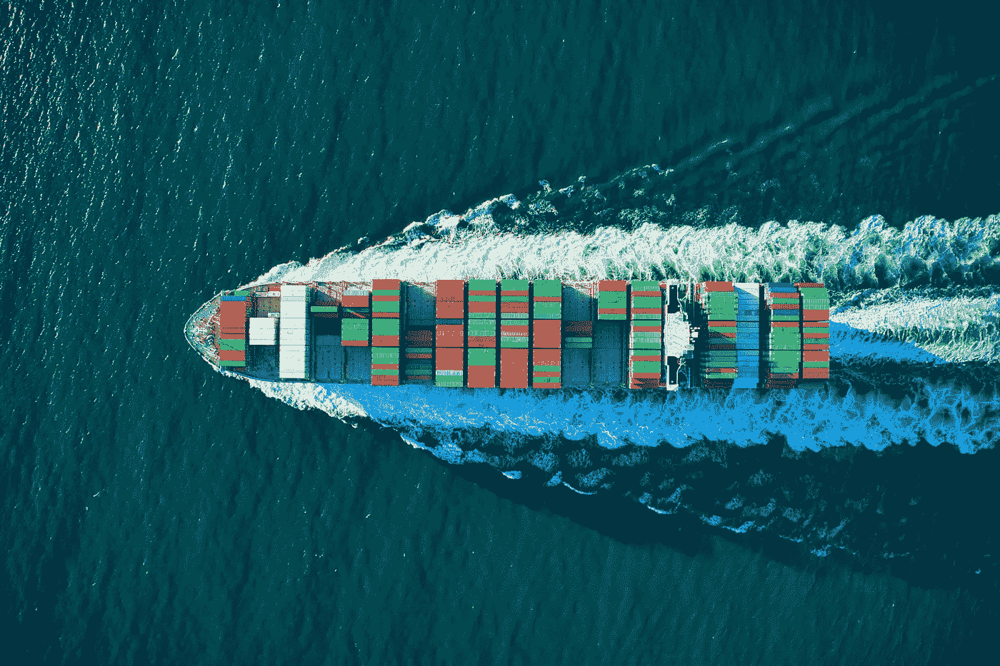

# 供应链弹性的区块链:VeChain

> 原文：<https://medium.datadriveninvestor.com/blockchain-for-supply-chain-resilience-fa2e67904201?source=collection_archive---------11----------------------->

如果说有一个因素是上个世纪我们所看到的巨大经济增长和创新不可或缺的，那就是全球化。全球化使各国能够利用其比较优势，向世界其他经济体扩展其专业知识和产品。

Photo by [Cameron Venti](https://unsplash.com/@ventiviews?utm_source=unsplash&utm_medium=referral&utm_content=creditCopyText) on [Unsplash](https://unsplash.com/s/photos/cargo?utm_source=unsplash&utm_medium=referral&utm_content=creditCopyText)

全球化往往被认为是理所当然的，因为我们大多数人看不到有多少国家通过研究、人力资本和原材料为某一特定产品做出了贡献。这方面的一个很好的例子是 iPhone，它由来自至少 43 个国家的资源支持，当这些资源被进一步分解时，情况变得更加复杂。

纵观历史，在任何时间点都呈指数增长的国家几乎总是在贸易和全球化方面取得重大进展。全球化使人们能够接触到新的文化，降低产品的单位成本，进入新的市场，获得人力资本，从而提高全球的整体生活水平。因此，公司一直在努力提高供应链的效率，以降低生产成本，提高利润。

# **解决的问题**

随着产品变得越来越容易获得，产品质量在供应链的不同环节受到损害，而最终用户却不知道。尽管拥有大量数据，但供应商和消费者都缺乏高质量的数据

这就是 VeChain 要解决的问题。

供应链中透明的信息流是其核心目标之一。这将通过降低与验证、文件和其他与信任相关的成本而使企业受益。

Photo by [Franki Chamaki](https://unsplash.com/@franki?utm_source=unsplash&utm_medium=referral&utm_content=creditCopyText) on [Unsplash](https://unsplash.com/s/photos/data?utm_source=unsplash&utm_medium=referral&utm_content=creditCopyText)

## 用例

*   汽车工业

透明跟踪车辆维护记录、保险、更换零件、故障和事故历史。

*   食品安全

根据[硬币电讯](https://s3.cointelegraph.com/storage/uploads/view/4612f245e3cf8bc227084dff049f4016.pdf)的一项研究，食品安全是一个**十亿美元**的问题，目前还没有解决。不安全食品导致全球 200 多种疾病和 420，000 人每年死亡。在供应链的各个阶段，为降低成本而不加监管的配料、食品标签不当、假冒产品和化学品导致了这些令人望而生畏的数字。

 [## 区块链投票和美国选举|数据驱动的投资者

### 在不到 70 天的时间里，这个世界上最古老的民主国家将以前所未有的方式面临最大的摊牌…

www.datadriveninvestor.com](https://www.datadriveninvestor.com/2020/08/26/blockchain-voting-and-the-american-elections/) 

通过企业平台，VeChain 允许公司通过其区块链全程跟踪其货物。在供应链的每个阶段，数据都可以被扫描并上传，供公司分析。由于区块链上记录的数据不可编辑，最终用户可以扫描产品并了解他们消费的产品的更多信息。这是由 VeChain 的区块链即服务(BaaS)平台实现的，该平台名为“ **ToolChain** ”。

*   数字碳生态系统

道德和可持续生产是一个日益增长的趋势，尤其是在年轻一代中。VeChain 提供了一个平台，鼓励消费者和企业减少**碳排放**。例如，购买低碳和符合道德的产品将获得信用，这些信用以后可以从生态系统中的其他商品和服务中兑换。

*   零售

假冒产品分销是耐克、阿迪达斯和香奈儿等公司持续面临的一个十亿美元的问题。VeChain 通过其区块链和智能标签 **(RFID/QR 码)**提供解决方案，使最终消费者能够在购买前验证产品。确保商品质量的好处会渗透到保险和金融等其他行业。

*   电子文档

随着远程工作被更广泛地采用，电子签名和验证成为一项基本服务。文档管理解决方案旨在管理和消除**伪造**证书、许可证和其他重要文档。

## 目前的伙伴关系包括:

*   LVMH:装有 VeChain 芯片的纪梵希包包验证真伪
*   雷诺:数字汽车保养手册
*   比亚迪汽车:中国最大的电动车制造商。比亚迪环保汽车的碳信用额度可用于其他产品。
*   沃尔玛中国:为了给顾客提供更高水平的信任，沃尔玛设定了一个目标，到 2020 年底，50%的包装肉类、40%的蔬菜都将使用 VeChain 系统进行追踪
*   H&M:收集供应链数据并与客户分享。

# veChain 经济学

VeChain 经济由两枚硬币组成。拥有两枚硬币允许用户有更多的选择。需要输入数据的个人可以直接购买 VTHO，也可以购买 VET 并允许它定期生成 VTHO。其他用户可以购买 VET，并将产生的 VTHO 作为额外收入的来源。

1.  VeChain Token(VET):可以在公开市场上购买的价值和支付手段
2.  Thor Power(VTHO):在区块链上执行智能合同和写入数据的基本要素。持有 VET 可以生成 VTHO。目前的 VTHO 生成率为每个 VET 每天 0.0000432 VTHO。70%的旧 VTHO 被烧掉，剩余的 30%作为奖励支付给权威主节点(AM)。由于职业教育和培训是产生职业技术教育和培训的必要条件，职业教育和培训的价值可直接归因于在区块链发生的活动量。随着更多活动的开展，对职业教育和培训的需求将会上升。

## 共识；一致

区块链技术中最重要的因素是它在没有任何中央权威的情况下保持的信任。这是由共识算法管理的。修改每个笔记中的数据需要一致同意。

比特币使用**工作证明(PoW)** 这是最可靠的，但缺乏可扩展性以及有限的性能，因为它依赖于分布式节点网络来达成共识。随着供应的减少和矿工的增加，电力需要更多的能源。

以太网使用**利益证明(PoS)** 包括在钱包中锁定一定数量的加密货币以贡献给区块链。换句话说，一个人拥有的硬币越多，大宗交易生效并获得更多交易费作为奖励的概率就越高。

VeChain 使用**授权证明(PoA)** ，其中生态系统内的许多参与者有权验证交易并决定是否将新块添加到系统中。本质上，PoA 是一个修改过的 PoS，具有额外的授权主节点层作为验证器。PoA 具有更高的可扩展性和能效，并支持更高的每秒事务处理量(TPS)。尽管 VeChain 具有集中的性质，但验证者有动机通过维持信任和改进系统来保留他们的位置。因此，VeChain 旨在实现集权和分权之间的平衡。

## 节点

VeChain 总最大供应量 867 亿，流通供应量 640 亿。最大供应量的 25%被**锁定**以维持权威主节点、经济节点和 X 节点的投票权。

1.  授权主节点(AM):只有 101 个授权节点可用，负责验证所有区块链交易。申请 AM 至少需要 25，000，000 VET，以获得投票权和更高的 VTHO 生产率。然而，AM 需要专用硬件来进行验证。
2.  经济节点:至少需要 1，000，000 兽医才能进入。经济节点无权验证区块链交易，但可以为生态系统提供稳定性。
3.  经济 X 节点:提供额外奖励给忠诚的 Vechain 支持者。其中一个奖励就是进入 VeChain 的 ICO 白名单。不同级别的要求从 60 万到 1560 万不等。

在涉及复杂供应链的行业中，更多的时间被浪费在检查、追踪文件和分析问题原因上，而不是改善客户的最终体验。借助 BaaS，公司可以获得足够的数据来不断改进产品。此外，当供应链中每个阶段的数据都被记录下来时，就没有怀疑的余地了，因此可以准确地找出问题的根源。更多的资源可以花在解决实际问题上，而不是发现问题。

对**可靠性和质量的要求总是很高。**

# 参考

1.  VeChain (2020)。地点:【https://www.vechain.com/ 
2.  审查:VeChain (2020 年)。可在:【https://kwontik.com/review_vechain (访问时间:2020 年 9 月 26 日)。
3.  你不知道的 9 类共识机制(2018)。可从以下网址获得:[https://medium . com/the-daily-bit/9-types-of-consensus-mechanisms-that-you-not-know-about-49ec 365179 da](https://medium.com/the-daily-bit/9-types-of-consensus-mechanisms-that-you-didnt-know-about-49ec365179da)
4.  VeChain 合作伙伴完整列表| VeChainInsider.com(2018)。请访问:[https://vechainsider . com/partnerships/a-complete-list-of-vechain-partnerships/](https://vechaininsider.com/partnerships/a-complete-list-of-vechain-partnerships/)

## 访问专家视图— [订阅 DDI 英特尔](https://datadriveninvestor.com/ddi-intel)