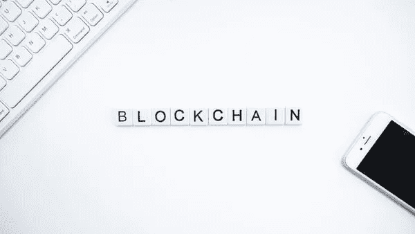

# 区块链适合你

> 原文：<https://medium.datadriveninvestor.com/blockchain-for-you-e1cb678c42fe?source=collection_archive---------21----------------------->

## “区块链技术将取代旧的、腐朽的全球治理体系。拥抱它！”奥拉维尔·丹尼尔

Source: Unsplash

任何有互联网接入的人都一定听说过区块链这个术语，但只有少数人知道它到底是什么，有什么作用。和你一样，我也很好奇这意味着什么，它将如何影响我们的日常生活。我不是一个技术人员，我只是对新技术和它们将如何影响我们做生意的方式感到好奇。

区块链在大多数科技团体和论坛讨论平台中盛行是有原因的。在这篇文章中，我计划与您分享我的一些粗略知识，希望您对区块链有一个基本的了解。

首先，区块链不是以下这些东西:

它不是任何一种加密货币

它不是一种可编程语言。

它不是 Python 库或框架。

它不是人工智能或机器学习技术

那是什么？

对于大多数新手来说，区块链技术是一种简单而巧妙的方式，以完全自动化和安全的方式将信息从 A 传递到 B。单词“块”和“链”意味着信息块被存储和连接在公共数据库中。

 [## 区块链投票和美国选举|数据驱动的投资者

### 在不到 70 天的时间里，这个世界上最古老的民主国家将以前所未有的方式面临最大的摊牌…

www.datadriveninvestor.com](https://www.datadriveninvestor.com/2020/08/26/blockchain-voting-and-the-american-elections/) 

区块链的街区基本上由三部分组成:

1.存储交易信息(如日期、时间和最近网上购物金额)的块。

2.存储谁参与了事务的信息的块。您可以从任何在线网站购买大量商品，并附上您的用户名、网站名称和链接。

3.存储有别于其他块的信息的块。每个区块都存储了一个称为“哈希”的独特代码，使我们能够将其与其他区块区分开来。哈希是由特殊算法创建的密码。

例如，你在亚马逊上购物，这个块将存储所有的细节，比如日期、时间和金额。然后，它会把你的用户名和亚马逊网站，并完成它会给你一个随机的唯一代码，以消除任何混淆的可能性。

***那么，炒作的是什么呢？***

区块链网络没有中央权威——它正是民主化系统的定义。由于它是一个共享的固定日志，其中的信息对任何人都是公开的。每个人都要为自己的决定负责，一切对每个人都是透明的。但是区块链的王牌是它是免费的。区块链不仅可以转移和存储资金，还可以取代所有依赖于收取少量交易费用的流程和商业模式。或者双方之间的任何其他交易。

像 Fiverr、优步和 Airbnb 这样的公司都受到了区块链的威胁，因为它将使收取“中间人”费用的整个概念过时。它走得更远。电子书可以装区块链码。亚马逊不会从中提成，信用卡公司也不会从销售中获利，书籍将以编码形式流通，一笔成功的区块链交易会将钱转给作者并解锁书籍。把所有的钱转给作者，你可以在你自己的网站上这样做，或者建立一个像 Goodreads 这样的书评网站。

那么，哪些行业会通过将区块链整合到他们的流程中而获利呢？

到首先，银行业将获得重大提振。例如，我们都知道银行一周只工作 5 天，每天晚上 5 点关门，所以如果你在周五下午 4 点存入一张支票，你要到周一早上才能把钱存入你的账户，这很烦人。有了区块链，你可以在 10 分钟内拿到钱，基本上是在区块链形成一个新的区块所需要的时间。法国咨询公司凯捷(Capgemini)估计，通过基于区块链的应用程序，消费者每年可以节省高达 160 亿美元的银行和保险费用。

另一个奇妙的用途是在医疗保健行业，涉及病人的机密文件和他们的安全。当病历生成并签名后，它可以自动存储在带有个人用户名和唯一代码的块中。这将确保它们仅被某些个人访问，从而确保隐私。

可能最有用和政治上最正确的应用是在选举过程中，区块链有可能消除选举欺诈和提高选民投票率，正如 2018 年 11 月美国西弗吉尼亚州中期选举中所测试的那样。这种将选票分块存储的整个过程将使篡改选举变得几乎不可能。《区块链议定书》将减少举行选举所需的人员，并向官员提供即时结果。

虽然它有很多好处，但人们可能会问这样一个问题 ***为什么它没有被广泛使用？***

区块链技术发展仍处于早期。企业在部署这项技术时遇到了挫折，包括区块链上使用的软件存在严重缺陷。与区块链相关的企业，尤其是中小型企业，面临的主要挑战是缺乏对该技术的认识，并且普遍缺乏对其工作原理的理解。许多公司不明白区块链是什么，也不知道他们能做什么。如果区块链加快速度，那些濒临灭绝的金融机构的论点是，缺乏监管导致诈骗、欺诈和市场操纵变得司空见惯。备受瞩目的案例之一是 one coin——最近被揭露为一个庞氏骗局，据信该骗局从投资者那里掠夺了数百万美元，这些投资者认为他们很早就获得了将成为“下一个比特币”的东西。虽然区块链面临着许多障碍，但根据研究，全球区块链市场规模预计将从 2020 年的 30 亿美元增长到 2025 年的 397 亿美元。

总之，我认为区块链在未来几年将会发生巨大的变化，并将在我们的日常生活中发挥重要作用。随着比特币和其他加密货币等许多应用的出现，区块链将会腾飞；这只是“何时”的问题，而不是“如果”的问题。

干杯。

**访问专家视图—** [**订阅 DDI 英特尔**](https://datadriveninvestor.com/ddi-intel)