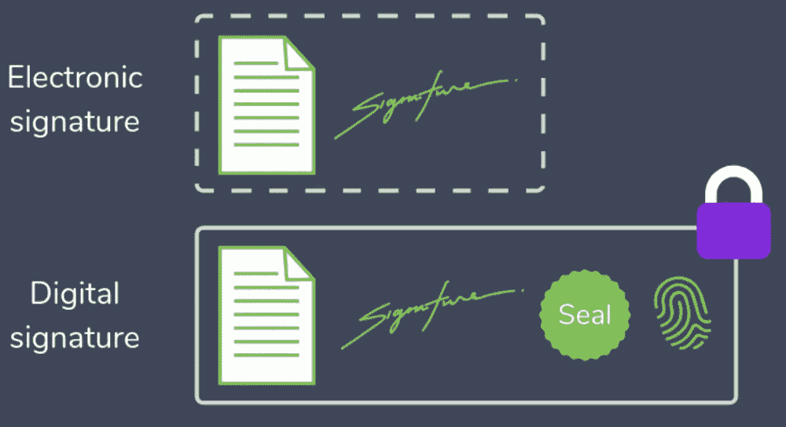
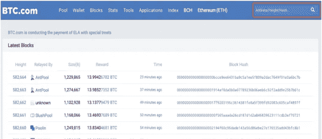
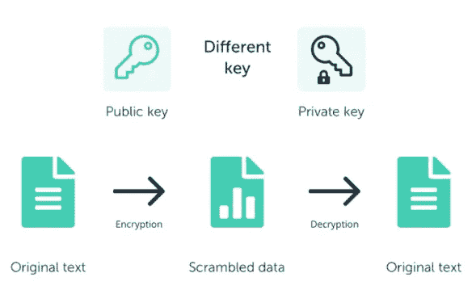
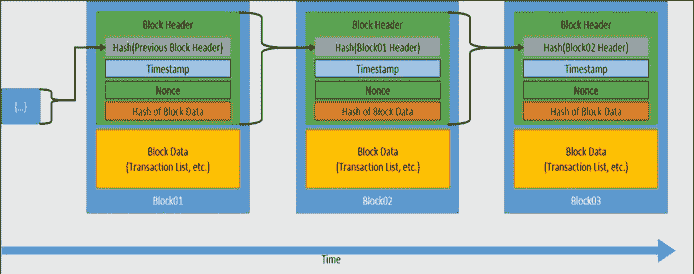

# 区块链从:流行语走向现实

> 原文：<https://medium.datadriveninvestor.com/blockchain-moves-from-buzzword-to-reality-4e3d6b80b1d5?source=collection_archive---------13----------------------->

从区块链介绍到工作，类型，特点和学习与区块链技术相关的新术语

[Introduction to Blockchain](https://www.telecommute.org/catch-up-the-current-technology-of-the-communication/)

# 区块链简介

区块链似乎总是很复杂，但它是一种非常简单的技术。区块链是一个数据库，由一个人(或一群人)在 2008 年使用名字[中本聪](https://en.wikipedia.org/wiki/Satoshi_Nakamoto)发明，作为[加密货币](https://en.wikipedia.org/wiki/Cryptocurrency) [比特币](https://en.wikipedia.org/wiki/Bitcoin)的公开交易[账本](https://en.wikipedia.org/wiki/Ledger)。迄今为止，中本聪的身份仍然不明。我们来详细了解一下区块链。

区块链被称为“区块链”，也被称为 Satoshi 的比特币模型。这是第一种无需可信机构或中央服务器就能解决双重支出问题的数字货币。我说它是一个信任协议，不需要任何第三方服务来完成我们的交易。

> R 使用区块链的理由:

a)速度更快

b)降低成本

c)更高的安全性

d)没有错误

使用的著名数字货币有:比特币、比特币现金、以太坊、以太坊经典、莱特币、恒星流明等。

> 在进入区块链之前，这里有一些你应该知道的术语:

**钱包**
钱包是一串数字和字母，比如 18c 1778914550 e 55545876 c 300 e 136 e 22673 b 73。这是一个地址，随着交易的发生，它将出现在区块链内的各个区块中。没有谁和谁做了什么交易的可见记录，只有一个钱包的号码。

**数字签名**

[Digital Signature](https://oneflow.com/blog/how-to-securely-sign-pdf-documents-with-digital-signature-online/)

它最早是在 20 世纪 70 年代提出的。要进行交易，你需要两样东西:一个包含地址的钱包和一把私人钥匙。私钥是一串随机数。

当某人决定向其他人发送硬币时，他们必须用自己的私钥签署包含交易的消息。双密钥系统是加密和密码术的核心。一旦消息被发送，它就被广播到区块链网络。然后，节点网络对消息进行处理，以确保其中包含的事务是有效的。如果它确认了有效性，则该事务被放入一个块中，此后，关于它的任何信息都不能被更改。

# 区块链是如何工作的？

一个比特币是比特币(BTC)数字货币的单一单位。

[Blockchain Transaction](https://support.coineal.com/hc/en-001/articles/360026200953-How-do-I-check-the-transaction-status-on-the-Bitcoin-blockchain-)

分类账文件不存储在中央实体服务器(如银行)或单个数据中心。它通过存储数据和执行计算的私人计算机网络分布在世界各地。这些计算机中的每一台都代表区块链网络的一个“节点”,并有一份分类账文件的副本。

假设，如果 Dev 想要向 Prachi 发送比特币，他向网络广播一条消息，称他帐户中的比特币数量应该减少 5 BTC，Prachi 帐户中的数量应该增加相同的数量。网络中的每个节点将接收该消息，并将所请求的交易应用于其分类帐副本，从而更新账户余额。

**执行交易**

进行比特币交易的双方都应该有一个比特币账户，在这个账户中有一个钱包，显示我们拥有的比特币的数量和数量。因为，只有你才能花你的比特币，每个钱包都受到一种特殊的加密方法的保护，这种方法使用一对独特但相互关联的密钥:一个私钥和一个公钥。

[Sending messages via encryption](https://www.ledger.com/academy/blockchain/what-are-public-keys-and-private-keys)

假设 Dev 想要发送比特币给 Prachi，那么他需要广播一条用他钱包的私钥加密的消息。由于大卫是唯一知道解锁钱包所需的私钥的人，所以他也是唯一可以花掉他的比特币的人。网络中的每个节点都可以通过用 Dev 钱包的公钥解密消息来交叉检查事务请求是否来自 Dev。

如果消息是用特定的公钥加密的，则只有配对私钥的所有者才能解密和读取该消息。反之亦然:如果你用你的私钥加密一条消息，只有配对的公钥才能解密它。

当您用钱包的私钥加密交易请求时，您正在生成一个数字签名，区块链计算机使用该签名来验证交易的来源和真实性。数字签名是由您的交易请求和您的私钥产生的文本字符串；因此，它不能用于其他交易。如果您更改交易请求消息中的单个字符，数字签名也会更改，因此没有潜在的攻击者可以更改您的交易请求或更改您发送的比特币数量。

# 一个街区看起来像什么？

[Blockchain Internally](https://www.nist.gov/image/blockchainpng)

上图显示的是包含多个元素的积木链。这些区块 01、区块 02、区块 03 基本上是由矿工开采的，作为回报，矿工得到一个区块(除了比特币、以太坊加密货币之外什么都没有)。)在那里他们可以进行交易

现在让我们来理解单个块中的每个元素:

**1。** **hash(前一个块头):**就是与当前 Hash 匹配的前一个 Hash。区块链有一个独特的功能，将前一个块的值作为哈希值存储在当前块中，这使得不可能在不改变所有后续块的情况下改变任何块。

哈希是由 SHA256、SHA512、SHA6、SHA1024 等加密算法生成的。

以 SHA256 为例:它包含 64 个字符(1，2…9，0 &A，B，C，…。e，F)和 256 位(4X64)每个字符。

**2。** **Timestamp:** Timestamp 表示时间，是他们当时在电脑上的时钟时间。

**3。** **Nonce:** 是**工作证明的一部分。**如果获得 50%以上一致同意的区块将被加入区块链。在块验证过程中，矿工将完成覆盖块所有数据的**工作证明**，并检查当前块的哈希值是否小于目标值。Nonce 是一个随机整数，它是一个 32 位(4 字节)的字段，由挖掘器调整，因此它成为一个用于散列 block 值的有效数字。 **Nonce 是只能使用一次的数字**。

**4。** **分块数据(事务):**所有已执行事务的列表。或者你保存的数据。

**那么，一个问题我们如何才能黑掉区块链？**

答案是没有实际可行的方法做到这一点，因为有数以百万计的计算机存储链，所以你必须改变每一台计算机&跟踪并改变散列函数，这甚至是不可能的。

# 区块链的特点

区块链技术的 6 个关键特征解释如下:

**1。** **分散技术**

这意味着数据(存储信息的地方)有一个存储在服务器上的块的副本，它没有任何管理权限或一个人来管理框架。它没有中心倾向，存储加密货币，由私钥管理。

**2。** **【不能被破坏(不可变)】**

这意味着任何人都可以删除、修改、编辑网络上的任何东西。如果在任何块中进行任何改变，它只能在 51%有效的情况下被改变，然后它将被网络接受，并且这个属性将帮助我们打击腐败。

在公共区块链的每个人都可以看到交易，所以它超级透明。另一方面，私人交易的区块链可能最适合希望更加透明和保护其销售的企业。

**3。** **增强的安全性**

由于数据分布在网络上并存储在多个数据块中，也没有中央权威机构，任何人都不能为了自己的利益而简单地改变网络的任何特征。此外，这里为安全系统增加了一个加密层。

**4。** **发放总账**

网络上的分类账由所有其他用户的系统维护。

**5。** **共识**

它帮助我们更快地做出网络决策。基本上，它是网络上活跃的一组节点的决策过程。我们可以说这是一种多数人赢，少数人输的投票制度。

**6。** **快速结算**

与传统银行系统相比，速度更快。这样，用户可以通过网络更快、更安全地向世界各地汇款。从长远来看，这样可以节省很多时间。

# **区块链网络的类型**

**1。** **公有区块链**

在这种类型的区块链中，任何人都可以联网(意味着向公众开放)，成为网络用户，参与核心活动。它被称为无权限，因为没有人授权与这个协议交互。

这并不意味着它不如区块链安全，事实上正相反；不是那个人的身份是可见的，而是只有交易是可见的，例如钱包号码、金额、日期等。

**举例:**这类区块链有:比特币、以太坊、Steller、Dash

**2。** **私有区块链**

这个区块链是有权限的，只有得到网络管理员的许可才能加入。用于企业内部审计

**属性:**受限可见、受限访问、自有存储&权限执行。

**3。** **炮制区块链(公有+私有)**

也被称为“混合区块链”，因为它同时具有公共和私有的属性。

它包含由一定程度的加密货币控制的半公开许可系统&有助于在一个混合区块链上控制的可审计性和安全性，不是在一个中央机构内，而是在几个而是几个批准的用户内。

此外，它还包含与其公共对应物相同的加密功能，但能够从几个节点的集中源进行更大程度的控制。

# **结论**

因此，在这篇文章中，我们了解了区块链&它正在发挥作用。区块链是如何发展的？为什么我们需要区块链是我们的主要议程。随着科技越来越多地进入我们的日常生活，网上诈骗也越来越多。所以，do 安全必须更强大。区块链是迄今为止最强大的网络之一。

祝阅读愉快！

关注更多有趣的更新！