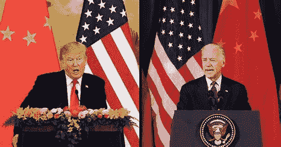
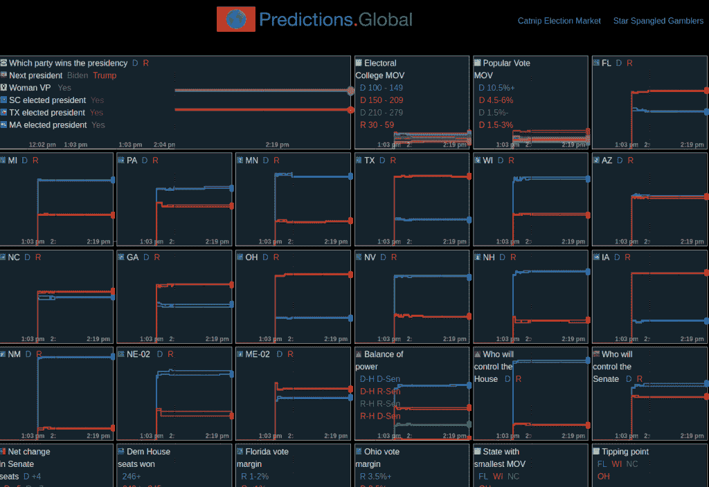
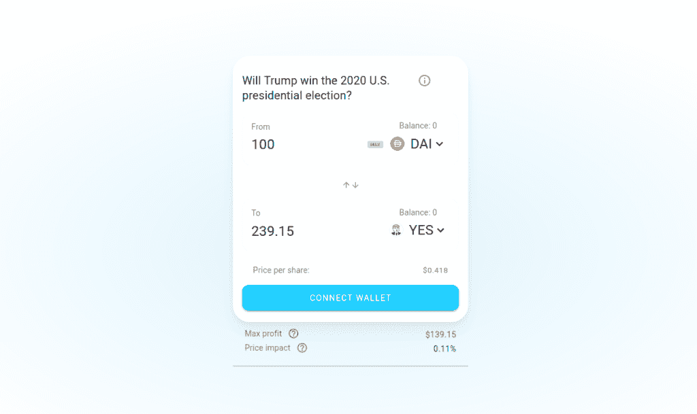
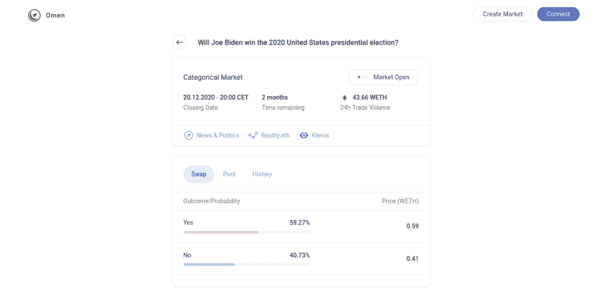
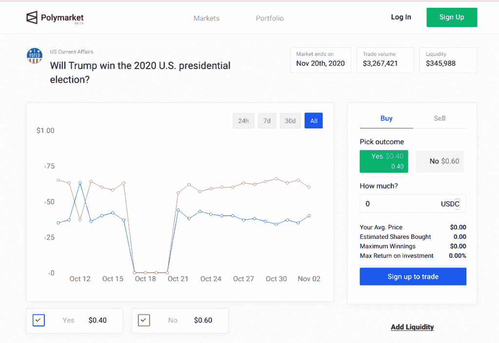

# 区块链预测市场:拜登也在特朗普之前

> 原文：<https://medium.datadriveninvestor.com/blockchain-prediction-markets-biden-also-here-before-trump-54d0af34f618?source=collection_archive---------12----------------------->

美国将选出未来四年世界上最重要的人物。在以太坊和 EOS 的预测市场上，你可以查看加密货币在赌谁赢，也可以自己下注。

在德国，人们喜欢在美国总统当选时加入兴奋的行列，尤其是今年。

有一半以上的美国人迫不及待地想看到这个大老粗被赶出白宫，尽管他的总统任期远没有人们在恐慌中津津乐道地预测的那样灾难性。另一半人，人数少得多，希望看到唐纳德·特朗普再次成为总统。然而，这并不是因为他是一个如此伟大的领导人——几乎没有人这么说——而是因为他的当选将真正显示出“体制媒体”中左翼绿色的主导地位。基本上，一个人不一定想在这里或那里赢，但最重要的是，其他人会输。

然而，幸运的是，我们不能在这里选举美国总统。但是我们能做的是用我们的加密货币赌明天谁会当选美国总统，不管我们怀疑谁。

我们可以看看预测市场来预测谁将赢得明天的选举。因为大家都还记得上次选举的灾难，当时希拉里在民调中遥遥领先，然后唐纳德·特朗普出人意料地追上了她，在最后几米击败了公认不受欢迎的民主党人。如果民意测验专家如此错误——预测市场能纠正吗？毕竟，他们对希拉里在上次选举中获胜的确信程度要低得多——如果他们甚至没有预言特朗普会获胜的话(回想起来，这并不容易确定)。

 [## 永远不要低估占卜符号的影响

### 未来的预测市场

medium.com](https://medium.com/datadriveninvestor/never-underestimate-the-influence-of-augur-token-c735eba4d9c9) 

# 预测市场如何运作

那么，我们从哪里得到信息呢？同时，有几个基于以太坊和 EOS 的预测市场。在这些上面，你可以打赌某些事件的发生；智能合约会根据目前收到的赌注调整赌注的价格，这提供了一种概率晴雨表。

理解这一点的最佳方式是通过一个例子:“市场”代表一个是或否的赌注，例如“唐纳德·特朗普会连任总统吗？然后你可以在这个问题上买“是”或者“不是”。如果两者的价格都是 0.5——例如，0.5 美元，但也是 0.5 ETH 或 0.5 IQ，这是 EOS 上的一个标志——前面的参与者似乎对是和否的概率评级相等。如果一个“是”的代价是 0.8 美元，ETH，IQ -，，那么过去的参与者以 80%的赌注赌唐纳德·特朗普再次成为总统。

原理要从体育博彩知道。那么，今晚美国大选预测市场的赔率如何呢？

# 60%的资金在乔·拜登手中

一个非常详细的来源是显示在基于预测美国选举市场的全球预测网站上的预测选举仪表板。PredictIT 基于 EOS 区块链，拥有 500 多名用户，并不是一个丰富的数据来源。投票在这里用 IQ-Token 完成。

Admittedly, there are other ways to be nice. But the Predictions.global dashboard for the 2020 US election is very informative.

为乔·拜登投一票需要 62 美分，为唐纳德·特朗普投一票只需要 42 美分。类似地，对民主党选举胜利的赌注是 63 美分，而对共和党的赌注是 42 美分。仪表盘还显示了每个州的选举预测，这对于鉴赏家来说是非常有趣的。然而，总体而言，用户似乎认为乔·拜登有 62%的胜算。

当然，我们有更多的数据来源。例如，有猫薄荷，一个基于占卜协议的预测市场。在这里，您只能用 DAI 美元下注，目前只能赌 Trump 或 NoTrump。赌川普输大约 42 美分，赌他输 62 美分，所以猫薄荷反映了预测的比率。

Less is more: Catnip follows the proven simple style we already know from UniSwap.

最后，我们有预兆协议，以太坊上的另一个预测市场。它使用包裹乙醚(WETH)，当被问及乔·拜登是否会成为总统时，你可以用 0.59 WETH 买一个“是”，用 0.41 WETH 买一个“不”(当然，也可以是它的分数)。所以这里的比率也是相似的。

The market for the US election on Omen.

另一个市场是多元市场。它也是基于以太坊的，但我不确定它是一个单独的市场还是通往其他市场的门户。我怀疑是后者，因为网站上写道 Polymarket“展示了以太坊区块链现存的活跃市场”——但这可能是法律要求的免责声明。在 Polymarket 上，你可以用 USDC 买赌注；拜登与特朗普的比例也是 60:40 左右。

And finally still the market on Polymarket — here even with historical Chart of the prices.

因此，在预测市场上，乔·拜登看起来也很明显是有利的——然而不太清楚，这个国家有多少人可能会喜欢。或者你会相信 0.6 到 0.4 的几率有多大？一阵风吹来，整个东西都翻倒了。

# 你怎么能赌自己

你可能认为预测市场只是一个把赚来的钱放在那里的地方。无论是因为拜登的几率太低，只有 0.6%，还是因为你确信特朗普会赢。所以现在你可以在预测市场上下赌注了。

应该提到的是，你在任何情况下都不应该为了赚钱而这样做，而只是出于对技术的好奇，带着你愿意失去的钱。底层智能合约仍然是一个新的技术领域，还没有经过我的测试；据我所知，你与智能合约互动的平台没有得到适当的许可，也不一定值得信任。

 [## 什么是智能合约？

### 智能合约是区块链的功能延伸。

medium.com](https://medium.com/datadriveninvestor/what-are-smart-contracts-af62557d08b9) 

我自己已经试用了两个平台——也只是为了测试目的。我严格主观地选择了它们:首先，我想要一个通过以太坊运行的平台。我已经有代币和钱包了；其次，我想只用钱包登录，而不是用电子邮件地址。

所以我用 WETH 测试了 Omen，用 DAI dollars 测试了 Catnip。Polymarket 听起来也很有趣，但它使用一种神奇的链接方法登录，这不仅令人讨厌，而且对我来说，它实际上根本不起作用。作为钱包，我一如既往的用了 Metamask，效果很棒，尤其是在 Chrome 或者 Chrome 上。

在测试过程中，我发现猫薄荷更好。一方面，因为 Omen 的费用要高得多——我花了 6 美元下了 60 美元的赌注，而在 Catnip 它们“只有”1.5 美元——另一方面，在 Catnip，我可以将我的“NoTrump”令牌直接导入 Metamask。同时，Omen 使用了一种更新的令牌格式，EIP-1155，它在技术上可能更现代。尽管如此，它实际上既不被 Metamask 支持，也不被 Etherscan 支持，所以我不能把它放进钱包。

好吧，有了这些稳操胜券的赌注，选择当然会更加令人兴奋！今天将有希望显示谁赢得了选举！

我在每月的[时事通讯中分享了更多私密的想法，你可以在这里查看](https://mailchi.mp/bf8f8e8ed697/keep-in-touch-with-lukas)。请在评论中告诉我，并在各种社交媒体平台上加入我:

[推特](https://twitter.com/WiesfleckerL) ● [Instagram](https://www.instagram.com/lukaswiesflecker/) ● [脸书](https://www.facebook.com/lukaswiesfleckerr)●[Snapchat](https://www.snapchat.com/add/luggooo)●[LinkedIn](https://www.linkedin.com/in/lukas-wiesflecker-1b11251a5/)

无论你做什么，都要带着爱和激情去做！