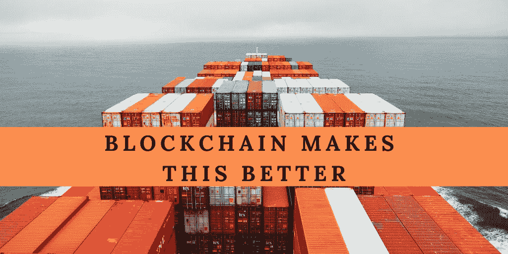

# 区块链降低商品交易的风险和成本|数据驱动的投资者

> 原文：<https://medium.datadriveninvestor.com/blockchain-reduces-risk-and-costs-in-trading-commodities-data-driven-investor-61f93f18db14?source=collection_archive---------21----------------------->

本文是区块链追踪外源性和内源性资产系列的第二篇。对于这些主题的定义，以及关于分布式账本技术(DLT)的一般讨论，我们建议从本系列的第一篇文章开始， [*超越比特币:链外资产*](https://www.heavyzen.co/post/beyond-bitcoin-assets-off-the-chain) *。*

我们将讨论 DLTs 在商品领域的当前实现，包括贸易和供应链管理。我们将讨论一些在商品领域垄断区块链服务的公司。

# 大宗商品的空间是巨大的，颠覆的可能性也是巨大的

外生分布式分类帐跟踪的主要资产是商品，也称为生产者商品或原材料商品。这些商品触及到我们日常生活的方方面面，从我们喝的咖啡或茶到我们放杯子的桌子。因此，全球商品贸易融资约占全球经济活动的 80-90 %:它是我们现代生活方式的基石。

如此庞大的商业活动在过程的每一步都需要许多不同的对手方。这些团体通常拥有专有的方法来确保他们运送或接收的商品的质量、数量和其他因素。这些各自为政的保证模式导致成本膨胀、时间表过长，有时还会给所有相关方带来意想不到的延误，从而抬高了商品交易和贸易融资的成本。外生分布式分类账以多种方式被用来打破这些担保筒仓，并减少商品交易和贸易融资中的出价到交付时间、交易对手风险和总体成本 **…本文最初发表于数据驱动投资者，** [**阅读完整版本**](https://www.datadriveninvestor.com/2020/06/17/blockchain-reduces-risk-and-costs-in-trading-commodities/) **。**

*原载于 2020 年 6 月 17 日 https://www.datadriveninvestor.com**T21*[。](https://www.datadriveninvestor.com/2020/06/17/blockchain-reduces-risk-and-costs-in-trading-commodities/)