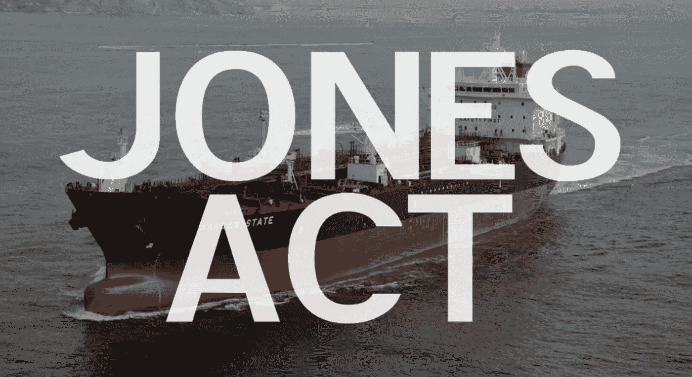

# 区块链揭示了美国 100 年航运法的疯狂成本

> 原文：<https://medium.datadriveninvestor.com/blockchain-reveals-the-crazy-costs-of-an-american-100-year-old-shipping-law-2b02c743a725?source=collection_archive---------18----------------------->

Photo by [Andy Li](https://unsplash.com/@andasta?utm_source=medium&utm_medium=referral) on [Unsplash](https://unsplash.com?utm_source=medium&utm_medium=referral)

Source: [Transport Institute.org](https://transportationinstitute.org/5things/)

关于 1920 年商船法案的 2 分钟视频，也被称为琼斯法案[https://youtu.be/H2JMCtBQOFs](https://youtu.be/H2JMCtBQOFs)

《1920 年商船法案》也称为《琼斯法案》,庆祝其 100 周年纪念日，但这个纪念日不应该庆祝，因为它几乎就像是对美国公民征收的商品税

[琼斯法案意味着](https://www.cato.org/blog/lower-gas-prices-scrap-jones-act)在美国国内港口之间运输货物的船只必须被强制检查；美国制造，美国拥有和至少 75%的美国船员，最终导致运输货物的运输成本更高，因此对美国消费者来说价格更高。它还导致美国国内供应链效率更低，公路、铁路甚至航空货运量增加，所有这些都对环境产生不利影响。

这项法律的出台是为了确保美国不依赖外国船只，作为其继 WW1 之后的国防计划的一部分。[美国船舶建造者协会](https://shipbuilders.org/critical-issues/the-jones-act/)自豪地宣称“*美国商业造船业及其相关供应商基础支撑着美国 4 万多艘商船队”。*

 [## 5 个可以拯救环境的潜在区块链用例|数据驱动的投资者

### 区块链技术已经成为创新和颠覆的代名词。而医疗保健等几个行业…

www.datadriveninvestor.com](https://www.datadriveninvestor.com/2020/03/06/5-potential-blockchain-use-cases-that-can-save-the-environment/) 

然而，它现在产生了意想不到的后果，全球 53，000 艘商船中只有 100 艘符合琼斯法案。全球造船成本的降低意味着美国不再是当年造船的主力军。4 万艘商业船只中的大多数都是拖网渔船和驳船，因此在战争中帮助动员人员和设备的实际用途很小。

一份国会研究服务报告发现，美国制造油轮的购买价格“大约是外国制造油轮价格的四倍，美国船员的成本是外国船只的几倍。”因此，从墨西哥湾沿岸到东北部的原油价格为每桶 5-6 美元，而不是每桶 2 美元。

区块链驱动的平台强调了琼斯法案带来的额外成本和流程，因为它们继续解开复杂的供应链，并寻求提高我们全球互联交易活动的效率。从亚洲进口到加州的汽车必须通过公路和铁路运输到美国各地的展厅。相反，如果没有 1920 年《商船法案》,可以用较小的船只从旧金山或洛杉矶运送到美国其他港口，这破坏了潜在的规模经济。

如果你想每周收到数字字节，请发电子邮件:[Jonny.Fry@Teamblockchain.net](mailto:Jonny.Fry@Teamblockchain.net)

**#区块链#供应链#经济#环境#气候变化#环境#透明度#信任#航运#美国#物流**