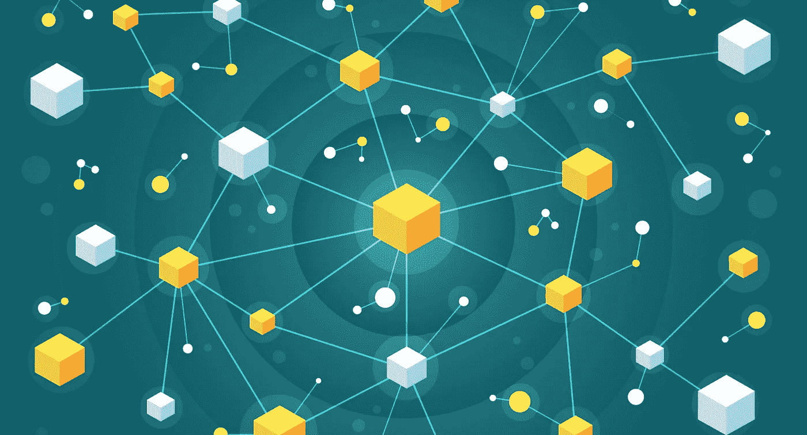

# 区块链导论:新时代的崛起(附音频)

> 原文：<https://medium.datadriveninvestor.com/blockchain-rise-of-technology-f02886d863d6?source=collection_archive---------22----------------------->

***据世界经济论坛预测，到 2025 年，全球 18%的 GDP 将在区块链相关技术上。因此，对区块链的需求正在迅速增加，人们对实现区块链的要求也在增加。***

**区块链历史:**

*   2008 年，一个名叫中本聪的神秘人提出了点对点网络的想法。
*   这并不是说世界上从来没有听说过这种现象，但该文件谈到了资金在网络上流动，没有一个单一的管辖权。
*   在人们能够详细理解这个概念之前，比特币在 2009 年 1 月首次出现。

**比特币介绍:**

*   它相当于数字货币。
*   它甚至可以作为一种商品，双方可以在没有中介的情况下进行交易。
*   但要让它有所帮助，比特币必须足够有利可图。这意味着它必须具有某种价值。
*   在比特币中，权威的力量属于参与者，而不是中央权威。
*   比特币上发生的每一笔交易都被记录在一本账本中。 ***分类账是到目前为止发生的财务交易的集合。***

**区块链的工作方式:**

*   一个特定的事务与网络上发生的其他几个事务一起被记录下来。然后，所有这些事务及其创建时间被分组，这就是所谓的块。
*   每次创建此类事务的新块时，都会将其添加到最近创建的块的前面。这种块的连接只是更新我们的分类账到目前为止。
*   这整个账本，反过来就是区块链。

**区块链的主要理由:**

*   如果一个项可以改变，则称之为可变的。*区块链系统是不可变的，因此一旦记录被捕获，就无法更改。*
*   区块链带来了零中心化，从而消除了对第三方的需求。*第三方可以是银行，也可以是监管相关交易的机构。*
*   由于数据的分散和分布，不涉及任何第三方。
*   顾客也可以设法进行低价交易。但即使在区块链中，支付了一笔处理费用，但几乎可以忽略不计。
*   这里的基础设施不过是连接到互联网的节点。

**区块链的组成部分:**

1.  ***PKI(公钥基础设施):***

*   有一个中央权力机构来创建一个人的身份。这就是所谓的公钥。
*   这是一种极难记忆的形式。
*   它可以运行到接近 300 位或更多，这取决于用来产生它的算法。

2. ***哈希:***

*   这是一个加密函数。
*   它的工作是接受输入，可以是任何东西，从某人的名字到表示你银行账户余额的数字。
*   在密码学中，想法是改变输入，使它看起来是无意义的。

3. ***随机数:***

*   这是一个只能使用一次的数字。
*   它永远不会使用已经使用过的值。

**三星上区块链:**

*   三星区块链平台 SDK 通过提供去中心化 App (DApp)或区块链 App 所需的一整套功能，将开发者和消费者带到了区块链世界。
*   它通过为每种分类账系统提取转账 API，帮助开发人员有效管理区块链账户，并简化交易。
*   三星区块链平台 SDK 通过其 UI 提供了一种加密货币支付解决方案。

**区块链在印度:**

电子和信息技术国务部长 Sanjay Dhotre 表示:“*(在印度)区块链技术是重要的研究领域之一，在治理、银行和金融、网络安全等不同领域都有应用潜力。*”

希望你喜欢。

希望得到积极的回应。

请关注我的@Medium 简介 [Yash Kamal Chaturvedi](https://yashkamalchaturvedi.medium.com/)