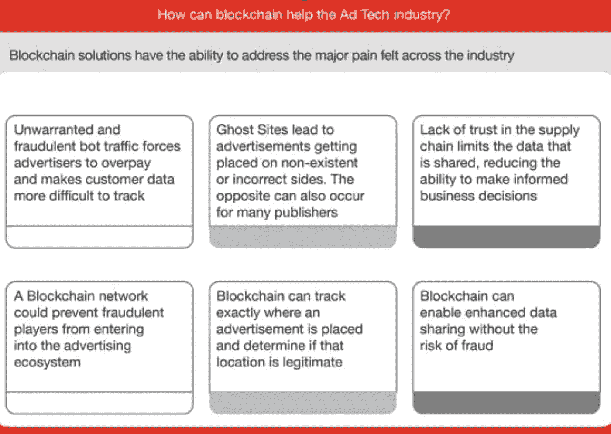
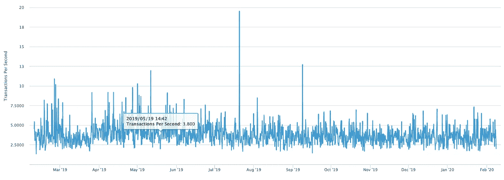

# 区块链技术在广告领域的应用

> 原文：<https://medium.datadriveninvestor.com/blockchain-tech-being-used-in-the-advertising-sector-7fb64abfaa3b?source=collection_archive---------7----------------------->

Photo by [Clifford Photography](https://unsplash.com/@cliffordgatewood?utm_source=medium&utm_medium=referral) on [Unsplash](https://unsplash.com?utm_source=medium&utm_medium=referral)

1994 年 10 月，第一个在线广告被认为已经投放。现在，全球广告的价值预计将超过每年 6640 亿美元。到 2026 年。然而，据估计，与此同时，该行业的欺诈水平在[65 亿美元到 190 亿美元](https://www.emarketer.com/content/five-charts-the-state-of-ad-fraud)之间，这反过来又是削弱那些在美国购买数字广告的人的一个因素。

[Source: PwC](https://www.pwc.com/us/en/industries/tmt/library/blockchain-in-advertising.html)

美国全国广告商协会指出，所有广告支出中只有 58%流向了出版商，其余 42%流向了供应链数据和交易费用。区块链技术提供了一种独立可验证的、去中心化的方式来追踪所花的钱。它让各方对广告费的支出更加清晰和透明，因此应该能让许多现有的第三方和中介被移除。因此，更多的钱花在吸引人类观众上，从而使数字广告更加高效和有效。使用区块链驱动的平台，还可以引入智能合约和令牌。如果有人点击广告并购买，媒体机构可以获得额外收入。产生的所有销售收入的记录将被记录并可能与相关方共享。

 [## 5 行业转型区块链应用|数据驱动投资者

### 除非你一直生活在岩石下，否则我相信你现在已经听说过区块链了。而区块链…

www.datadriveninvestor.com](https://www.datadriveninvestor.com/2019/02/13/5-real-world-blockchain-applications/) 

一家使用区块链技术的公司是总部位于美国的 Adbank，该公司旨在为广告行业带来更大的透明度。其他的还有位于荷兰的 [AdCoin](https://www.blockchainalmanac.com/marketing-and-advertising/adcoin/) 和 [Adex](https://www.adex.network/) 。

来自[普华永道](https://www.pwc.com/us/en/industries/tmt/library/blockchain-in-advertising.html)的一份关于区块链技术对广告行业的影响的报告在其调查结果中总结道:“*区块链进行可信交易、安全管理和记录数据以及提高自动化的能力可以减少欺诈、提高数据可靠性、保护隐私权、实现合作伙伴之间更好的数据流动，并在正确的地方向正确的消费者提供正确的广告*”。

区块链技术为参与数字广告领域的各方带来了好处。**消费者**在看广告和购物时，可以因他们的关注而获得奖励，即因消费者的关注和活动而获得奖励。对于广告商来说，它提供了更大的透明度，因此潜在地减少了广告欺诈和中间商费用，从而使他们的广告支出更加有效和高效。最后，对于出版商来说，它可以提高他们的收入，将广告与实际交易联系起来，从而使出版商能够通过智能合同自动获得广告公司的支付。

**阻碍区块链技术大规模应用的挑战**

可扩展性:

有人担心，在区块链技术真正被接受之前，可扩展性的挑战需要得到解决。然而，一名前微软研究人员声称，他创造了一种新的区块链协议，称为 [Asenys，](https://siliconangle.com/2020/01/30/asensys-unveils-high-performance-blockchain-designed-solve-scalability-problems/)它提供了一种非常快速和可扩展的区块链解决方案。此外，以太坊的创始人谈到了“可扩展性三难困境”，即很容易从一个区块链中获得两个属性，而不是三个属性。这三个是去中心化、安全性和可扩展性，到目前为止，很难在不影响安全性或区块链去中心化的情况下提高可扩展性。Asenys 使用“一致同意区”的概念，提供并行交易处理，从而在任何一个时间分配工作量。Asensys 的 Brendon Wang 认为，asen sys 的区块链每秒可以处理高达 [100，000 笔交易](https://siliconangle.com/2020/01/30/asensys-unveils-high-performance-blockchain-designed-solve-scalability-problems/)并维持超过 10 亿的用户群！

Source: [Blockchain.com](https://www.blockchain.com/en/charts/transactions-per-second?timespan=1year)

第一个大规模和最有价值的区块链是比特币，其交易速度通常低于每秒 10 次交易。以太坊在 2017 年和 2018 年引发了许多最初的硬币发行，通常每秒处理 [14 笔交易](https://coinsutra.com/transaction-speeds/)。与此同时，Cardano 每秒能够提供 [256 笔交易](https://www.bitdegree.org/tutorials/ada-coin/)，最近宣布其区块链也将能够[提供智能合约](https://www.crypto-news-flash.com/cardano-presents-eutxo-model-for-smart-contracts/)，因此给以太坊带来一些真正的竞争。

法规:

监管是另一个经常被引用的阻碍区块链技术更广泛应用的因素。然而，由司法管辖区来监管一项技术是非常不寻常的，即使他们确实倾向于对结果或如何使用技术本身进行监管和提供指导。例如，英国目前不打算监管区块链技术，但大法官在 2019 年 11 月提出，智能合同应该是可执行的，数字资产应该得到承认——见[此处](https://www.judiciary.uk/wp-content/uploads/2019/11/LegalStatementLaunch.GV_.2.pdf)他的报告。同样，我们也看到德国和瑞士的法律被修改，允许以债务和股票证券的形式发行数字资产。与此同时，央行也在寻求使用(而不是监管)区块链技术，并发行自己的[央行数字货币](https://www.forbes.com/sites/biserdimitrov/2020/02/06/why-central-bank-digital-currencies-are-the-killer-app-for-blockchain-in-2020/)。最后，[美国政府](https://www.coindesk.com/fed-reserve-is-researching-dlt-based-digital-dollar-says-governor)正在考虑使用区块链技术创造自己的数字货币！

使用案例:

不涉及区块链或数字资产领域的人引用的一个非常常见的原因是，没有人在使用这项技术，所以我为什么要麻烦呢？你所要做的就是简单地“谷歌”一下你感兴趣的行业，找到一个案例研究，你就会看到大量的例子。企业和政府正在进行大量试验和测试，研究区块链技术带来的潜力和挑战。需要举例说明区块链技术如何在日常商业中使用的用例是产生数字字节的另一个原因。

用户体验:

迄今为止，使用该技术并不是一种简单的用户友好的体验。与私人和公共区块链打交道的全部经历，冷热钱包，为你的私人钥匙记住 27 个单词，更不用说极客们喋喋不休地谈论他们的“分片”、“分叉”、“节点”和“散列”。但是不要让技术上的演讲让你分心，毕竟，我们中的一些人正在努力使用我们的智能手机，但是我们整天都在使用它们！就用户体验而言，当我们看到区块链成为主流时，人们将正确地关注这项技术如何被使用，而不是它如何工作。

标准:

缺乏标准以及不同的区块链无法合作的潜在风险是一个持续的挑战。组织通常不愿意使用一个区块链，然后在未来发现它既不会得到支持，也无法与其他区块链通信。与此同时，像[全球数字金融](https://www.gdf.io/)和[政府区块链协会](https://www.gbaglobal.org/)这样的组织也在试图制定标准。

区块链技术的前景在过去几年发生了很大的变化，因为我们已经从被视为利基技术(在金融领域有一些用途)转变为一种可能影响所有行业和整个社会的技术，因为我们继续从模拟系统过渡到日益增长的数字经济。

*“区块链技术不仅仅是一种更有效的证券结算方式。它将从根本上改变市场结构，甚至可能改变互联网本身的架构。Abigail Johnston，Fidelity 首席执行官。*