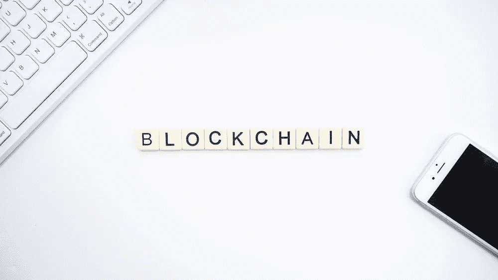

# 区块链技术:协助新冠肺炎战斗

> 原文：<https://medium.datadriveninvestor.com/blockchain-technologies-assisting-with-the-covid-19-fight-d5a5f7975707?source=collection_archive---------13----------------------->

Courtesy: Pixabay at Pexels

2020 年 3 月初，我向几位技术高管和其他人(如律师)发表了一篇关于区块链新兴趋势的演讲。当时美国刚刚开始感受到新冠肺炎的影响。

我讨论了各行业的区块链趋势、基于区块链的国际供应链使用案例以及主要供应链转运点的货运跟踪，包括以下内容:

*   生产设施的原材料采购。
*   成品运输到造船厂并装上集装箱。
*   国际运输货物。
*   入境口岸通关。
*   向客户交付产品。
*   向供应商付款。

讨论了基于区块链的解决方案如何解决传统供应链问题。其中包括:

*   智能合同无需人工干预即可自动支付款项。传统的供应链系统不容易做到这一点。
*   区块链的不变性特征确保了防篡改和可审计的记录。在传统解决方案中，由于合作伙伴之间的记录不匹配，记录可能会丢失或发生冲突。
*   作为一个通用平台，基于区块链的解决方案解决了传统供应链系统难以解决的互操作性问题。

 [## 5 个可以拯救环境的潜在区块链用例|数据驱动的投资者

### 区块链技术已经成为创新和颠覆的代名词。而医疗保健等几个行业…

www.datadriveninvestor.com](https://www.datadriveninvestor.com/2020/03/06/5-potential-blockchain-use-cases-that-can-save-the-environment/) 

突出强调了受益于人工智能、电信和物联网(IoT)的基于区块链的供应链。例如，人工智能(AI)可用于获得跨供应链范围的可操作见解。

演讲结束后，一位与会者走到我面前问道，“*如果区块链技术成为一个主要问题*，它能帮助新冠肺炎吗？”

这让我开始思考。由于当时对新冠肺炎的了解有限，我只能想到讨论供应链用例的可能性。利用这一点，我回答道:

*历史上，供应链在紧急情况下会紧张。在混乱的情况下，运送、跟踪和分发物资变得很困难，就像波多黎各飓风期间那样。具有不变性和可追溯性的区块链供应链可以帮助跟踪医疗用品从制造商到各个医疗机构的分销*。

快进到 2020 年 4 月，“供应链受到压力”这几个字已经是轻描淡写了。供应链被打乱，延伸到极限之外。在一些国家，区块链、人工智能和物联网技术正在恢复高度受影响地区破碎的供应链系统的秩序。

**区块链技术拯救世界**

区块链技术已经在中国使用，向其公民传播新冠肺炎相关信息。一家中国公司支付宝正在使用一个基于区块链的平台，通过手机向市民分享经过验证的真实来源的新冠肺炎信息。这项工作正在帮助市民们识破假冒的新冠肺炎材料。

在湖北，医护人员通过基于区块链的捐赠平台钟山接收口罩和医疗用品，该平台由初创公司 Hyperchain 和其他公司运营。

**现有区块链解决方案和再利用的可能性**

可以开发基于区块链的新冠肺炎特定解决方案，但这需要时间。利用新冠肺炎相关功能重新规划或增强现有的区块链解决方案是一种更好的方法。

包括辉瑞、Eli Lily & Company 在内的大约 24 家公司开发了一种基于区块链的系统，称为 MediLedger。该系统有望追踪整个药品供应链中的处方药。这也意味着跟踪假药。

考虑这样一种可能性，即这样一个系统被克隆或增强了新冠肺炎供应链的能力。这样的供应链可以用来:

*   跟踪医疗设备和用品向医疗机构的交付。
*   使用链外/链上解决方案存储和处理医疗数据。
*   原始数据和处理结果可以保留在离线数据库中，而这些数据的哈希可以存储在区块链上，利用两种技术的优势。
*   人工智能(AI)和分析可以使用链外数据提供可操作的见解。
*   获得的见解可用于向市民提供更好的建议。

州、城市和县可以记录新冠肺炎案件，趋势、每个地区的案件、统计数据和决策等数据可以记录在区块链上。公众可以直接接收来自区块链的经过验证的真实信息。

基于非医疗区块链的平台也可以帮助新冠肺炎疫情的斗争。例如，一些慈善机构使用区块链解决方案来记录捐赠和跟踪资金分配。对新冠肺炎的捐赠也可以这样做。捐助者可以完全了解他们的捐款是如何分配的。

物联网和人工智能等技术与基于区块链的解决方案相结合，可以加速对抗新冠肺炎。2020 年 1 月，谷歌 DeepMind 推出了使用人工智能进行科学发现的 AlphaFold。AlphaFold 在 2020 年 3 月初被用于新冠肺炎研究。研究的数据集和结果已经免费传播给全世界的科学界。

**结论**

由于全球范围内与新冠肺炎相关的波动，医疗用品的供应链管理被中断。供应链合作伙伴之间的交接点中断严重，尤其是需要人工干预的地方。由其他技术支持的基于区块链的解决方案可以帮助全球抗击新冠肺炎。

**作者在 Medium 上写的关于区块链的其他论文**:

[修复区块链供应链解决方案的漏洞，否则将面临中断](https://medium.com/datadriveninvestor/fix-vulnerabilities-in-blockchain-supply-chain-solutions-or-face-disruption-1d7da97377f)

[商业考虑——除了炒作——区块链和数据库——哪一个适合你？第一部分](http://Business%20Considerations%20%E2%80%94%20Beyond%20the%20Hype%20%E2%80%94%20Blockchain%20or%20Databases%20-%20Which%20one%20is%20right%20for%20you/?%20Part%20-I)

[技术考虑因素——除了宣传，区块链或数据库——哪一个适合您？第二部分](https://medium.com/@jpbatra25/technology-considerations-beyond-the-hype-blockchain-or-database-which-one-is-right-for-you-708e6a1b98d)

[区块链——去神秘化！用通俗英语讨论区块链技术](https://medium.com/swlh/blockchain-demystified-33e9737873d7)

[信任——关键领导技能！](https://medium.com/swlh/trust-a-key-leadership-skills-c5eb5e15a588)

[感觉卡住了？你有能力通过六个简单的步骤来处理它](https://medium.com/swlh/trust-a-key-leadership-skills-c5eb5e15a588)