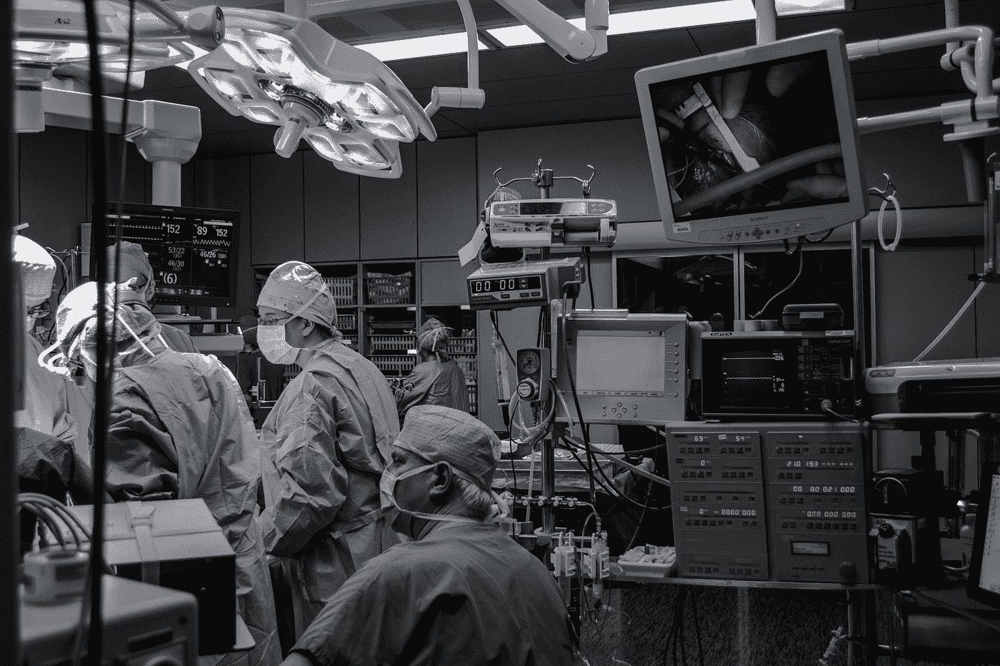

# 区块链技术采用实践:医疗保健、电子投票和能源行业

> 原文：<https://medium.datadriveninvestor.com/blockchain-technology-adoption-practices-healthcare-e-voting-and-energy-sector-6ada5482ec79?source=collection_archive---------13----------------------->

Photo by [Alina Grubnyak](https://unsplash.com/@alinnnaaaa?utm_source=medium&utm_medium=referral) on [Unsplash](https://unsplash.com?utm_source=medium&utm_medium=referral)

计算机处理能力的提高为新的创新理念提供了变革，区块链就是创新技术理念之一。2008 年，它向世界推出了别名为中本聪的点对点电子现金系统。今天，大量的实践正在采用和开发基于区块链的系统。医疗保健、电子投票和能源行业是根据他们的利益调整 it 的主要方式。在努力使区块链的特色受益的同时，他们应该考虑到他们所及范围内的人们的社会技术和经济观点。

**简介**

众所周知，医疗保健系统将新生儿技术整合到其复杂的流程中。在区块链的例子中，它可以在多方面帮助医疗保健。最重要的特征是安全性和可靠性，这是医疗保健系统的迫切要求。

政府的一个重要问题是投票，它需要大量的预算和资产规划。区块链技术可以在公民与政府的互动中提供最精确的透明度和可听度。

由于另一个重要部门是与能源有关的公司，这些公司的重点是向可再生能源和其他资源倾斜。传统能源生产向替代能源的转变带来了转型需求。

 [## 5 个可以拯救环境的潜在区块链用例|数据驱动的投资者

### 区块链技术已经成为创新和颠覆的代名词。而医疗保健等几个行业…

www.datadriveninvestor.com](https://www.datadriveninvestor.com/2020/03/06/5-potential-blockchain-use-cases-that-can-save-the-environment/) 

**讨论**

虽然这些研究文章中的主要优点和缺点基本相似，但每个问题都有相当重要的细节。

Photo by [Luca Bravo](https://unsplash.com/@lucabravo?utm_source=medium&utm_medium=referral) on [Unsplash](https://unsplash.com?utm_source=medium&utm_medium=referral)

能源领域的区块链实施需要社会技术方面的改变。在第三篇文章中，Bernd 提到了关于**德国供电法案**，该法案旨在为通过可再生能源方法产生的能源付费。该法案一直保持完整，直到 2011 年福岛核事故。这件事在法案中播下了革新的种子，人们的意识开始增强。它导致了政治界限，能源市场遭受了巨大打击，并成为能源市场正在转型的原因之一。

这种转变始于对该领域有经验的人员来说众所周知的电网。这里预期的三个发展阶段；

1.  从一个由大型生产商和大规模能源运输组成的全球超级电网开始，
2.  第二，分散和地方性的生产和分配系统，
3.  最后，分散的、本地和区域连接的智能电网，其中能源生产可以向下到个人(称为 prosumer，他们可以生产、共享和使用能源)，并通过创新平台共享。

当电网成为智能电网，并以社会经济和组织政治的方式与人们的认知保持同步时，他们就可以塑造自己的潜在消费者群体。这些在文章中被描述为“分散的自治组织”的社区可以在储存和向有需求的地方输送能源方面做出贡献。

另一方面，医疗保健需要可靠的技术，可以在全球范围内轻松访问，存储数据并且不被更改。这些数据可能是关于跟踪医疗产品的生命周期，最重要的是病人的数据。

Photo by [Piron Guillaume](https://unsplash.com/@gpiron?utm_source=medium&utm_medium=referral) on [Unsplash](https://unsplash.com?utm_source=medium&utm_medium=referral)

医疗专家努力融合各种技术，创造了始于医疗保健 2.0(1991-2005)的系统。尽管这些系统为下一代创造了多样化的基础，如为确保安全而开发的标准(HIPAA、COBIT、DISHA)，但它们跟不上技术发展繁荣的速度。在医疗保健 3.0 中，可穿戴、可植入和可实时跟踪患者的产品被引入世界。用户界面和体验变得更加简单，应用程序中的定制得到了更多人的关注。鉴于这些发展，电子医疗记录(EHR)进入人们的视野，并比以往任何时候都更加强调对建议系统的需求。

在医疗保健 4.0 (2016 年至今)中，随着云计算、大数据、人工智能、机器学习等其他新生技术的出现。行业关注的焦点集中在协作、一致性和融合上。这一重点指向增强虚拟化，实现实时个性化，这可以在区块链结构的帮助下提供。

Photo by [Element5 Digital](https://unsplash.com/@element5digital?utm_source=medium&utm_medium=referral) on [Unsplash](https://unsplash.com?utm_source=medium&utm_medium=referral)

最后，从政府开始，电子投票在世界各地拥有庞大的受众。爱沙尼亚和韩国开发了这样的系统，在选举中，他们的公民可以在网上平台投票。该过程的社会方面极其脆弱，电子投票平台必须在透明度和可验证性方面向公民提供高度信任。Micha 在文章中提出了一个具有复杂软硬件共生结构的系统，该系统由超级节点、可信节点和模拟传统投票过程的投票站组成。这种提出的方法通过减少故障的变化来保持信任的基础。在今天，在未来，完全分散的电子投票平台的过渡阶段可能从这里开始。

Photo by [Timon Studler](https://unsplash.com/@derstudi?utm_source=medium&utm_medium=referral) on [Unsplash](https://unsplash.com?utm_source=medium&utm_medium=referral)

**结论**

除了军事工业之外，医疗保健、电子投票和能源行业也是将区块链技术融入实践的重要领域。这三个部门正试图受益于该技术最增强的特征，即透明性、可靠性和分散性。这些特点是确保公众信任和在私营部门获得更多认可的关键。

电子投票实践是一个微妙的结构，不是在技术上，而是在文化方面。公民的信任可能很难获得，也很容易失去，因为一个简单的谣言。在这里，需要一个完全透明和分散的系统来融入文化，这就是它如何通过使用区块链的完整功能集来取得成功。这就是为什么这种做法比其他应用程序需要更多的时间。

能源行业的公司有他们的困境，他们是否应该投资于这样一个有巨大影响的软件模型并降低他们的发电量，或者他们是否应该抵制这些做法并提高其必要性，并希望他们可以在该行业避免和转型？企业可以通过抵制参与者的变化来推迟不可避免的转型。但是，如果他们看到了创新的价值并投资于此，他们就能在这个领域比预期呆得更久。

最后，医疗保健实践比其他行业不断进步。事实证明，从 20 世纪 70 年代的医疗保健 1.0 到今天的医疗保健 4.0，这个领域从未停止创新。这一领域的需求高于所讨论的其他领域，并与人口保持同步增长。这就是为什么医疗保健系统中的区块链集成很容易获得投资者和开发商的青睐。

**参考文献**

*   第一条:苏迪普·坦瓦尔，卡兰·帕瑞克，理查德·伊文思，“面向医疗保健 4.0 应用的基于区块链的电子医疗保健记录系统”，《信息安全与应用杂志》，第 50 卷，2020 年，第 102-407 页。
*   第二条:Michał Pawlak，Aneta Poniszewska-Marańda，Natalia Kryvinska，“走向区块链电子投票系统的智能代理”，Procedia Computer Science，第 141 卷，2018 年，第 239-246 页。
*   第三条:Bernd Teufel，Anton Sentic，Mathias Barmet，“区块链能源:未来能源系统中的区块链”，《电子科学与技术学报》，2020 年，第 100–011 页。