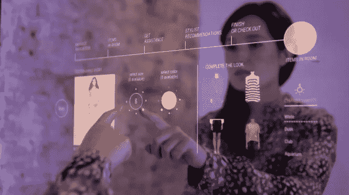

# 零售领域的区块链技术

> 原文：<https://medium.datadriveninvestor.com/blockchain-technology-in-the-retail-sector-8d425ef12850?source=collection_archive---------17----------------------->

Source: dex.openledge.io

越来越多的顾客想知道他们买的衣服来自哪里，鉴于假新闻的增加和越来越多的冷嘲热讽，这些顾客通常想要来源证明。有一些全球品牌使用“血汗工厂”的故事。事实上，[谷歌](https://sites.google.com/site/deeperintochildlabourr/home/which-stores-dont-use-sweatshops)列出了许多非常知名的商业品牌，如阿迪达斯、耐克、阿伯克龙比·惠誉、汤米·席尔菲格和 H & M，仅举几例。然而，通过使用区块链技术，制造商、品牌所有者、零售商和客户似乎可以对他们处理和购买的商品的来源有更多的保证。因此，有望重建对供应链和所购商品的信任。

 [## 5 行业转型区块链应用|数据驱动投资者

### 除非你一直生活在岩石下，否则我相信你现在已经听说过区块链了。而区块链…

www.datadriveninvestor.com](https://www.datadriveninvestor.com/2019/02/13/5-real-world-blockchain-applications/) 

如果我们研究从制造到在商店或网上购买服装的各个步骤，我们可以看到供应链中可能有七个不同的步骤——所有这些步骤都可能容易被不道德的参与者利用，并用正确的材料和物品替代“假货”。

1.**品牌所有者下订单**——相关信息，如要使用的面料类型、颜色范围、所需尺寸的选择、所需材料的数量、要使用的图案、设计、何时需要这些物品以及针对哪些市场，以及实际物品的详细信息，包括拉链、纽扣配件等。所有信息都可以存储在区块链驱动的平台上，并与制造商共享，因此他们知道必须生产什么，在哪个国家和何时生产。

2.**订单发送给制造商** —通过与批准的供应商共享所需的相关材料并使用智能合同，品牌所有者可以自动获知哪个制造商订购了什么，以及供应商何时能够供货。这将启动原材料供应商的每个项目的历史记录，确保这些供应商使用可持续来源，并包括其工人所处的劳动条件。

3.**订单被发送给供应商** —同样，智能合同可以向制造商和潜在的品牌所有者发送材料报价和任何相关工厂检查的副本。这将在定价和其他问题上创造透明度，从而允许品牌所有者“掌握”有关其供应链的实时信息。

4.**物品被制造** —运输公司在确认包装货物的真实性后，通过扫描二维码交付材料。制造商生产贴有二维码的产品(包含使用的原材料、供应商信息、生产产地、生产日期和程序以及质量标准等详细信息)。这使得质量控制能够创建可验证的审计，所有这些都输入到区块链中。创建一个不可改变的记录，该记录是防篡改的并且可以被打上时间戳，这使得品牌所有人以及最终购买者(如果需要的话)能够以高度透明的方式访问制造质量保证细节。

5.**品牌所有人或其物流公司收到货物** —货物已签收，并已检查收到的货物是否与订单相符。智能合同然后通知物流公司什么产品必须发送给哪些零售商。与此同时，智能合同可以授权对收到的货物进行支付(所有这一切都可能不需要人工干预)，从而使整个过程更加高效和快捷。随着物联网(IoT)设备价格的下降，以及使用其他传感器，将有可能在全球运输过程中跟踪原材料和成品，允许零售商和品牌商获得实时数据，从而进一步提高供应链的效率。

6.**零售商销售商品—** 零售商能够将畅销商品告知品牌，从而有可能引发更多商品的生产。当商品售出时，没有理由不通过智能合同使用数字货币触发器向品牌所有者支付他们的销售百分比。所有的账户都可以在线实时获得，允许向 HMRC 支付当地销售税，例如增值税。

7.**顾客拥有透明度** —通过使用顾客可以在手机上扫描的二维码，可以获得关于所购商品的大量数据，从而建立信任，并有可能使品牌所有者和零售商收取更多费用。

因此，区块链驱动的平台有很多优势。区块链显然提供了更大的透明度，加上出处，从而在整个供应链中建立信任。它有可能加快支付速度，并减少那些相同的货物进入多个会计系统需要检查和核实的低效率。这应该也能节约成本。

区块链还提供了减少延迟和纠纷的承诺，防止订单在供应链中被“卡住”，从而实现自动和更快的再订购，以满足对快速销售商品的需求。货物丢失或放错地方的可能性应该最小化，因为它们可以被实时跟踪。好消息是区块链驱动的平台正在被使用，而不是仅仅停留在理论上。事实上，总部位于伦敦的时装设计师 [Martine Jarlgaard](https://www.forbes.com/sites/rachelarthur/2017/05/10/garment-blockchain-fashion-transparency/) 自 2017 年以来一直在使用区块链技术作为其供应链的一部分。当跨国组织在使用像 IBM 这样的公司时，我们看到更小、更灵活的供应商(如 [Vixidoz](https://vizidox.com/) )实际上以较低的初始价格为那些希望开始供应链数字化进程的人提供“现成的”解决方案。

以上所有内容都侧重于将区块链技术主要用于供应链，但它还有许多其他用途。将忠诚度计划数字化，并使不同的计划能够相互作用，这意味着一家商店的奖励可以用来购买另一个品牌的一系列商品。 [LVMH](https://www.vogue.co.uk/article/lvmh-blockchain) 推出了一个基于区块链的平台，既有助于减少奢侈品欺诈，也有助于减少二手市场上买到的假货。与此同时，一家名为 [Loomia](https://www.wearable-technologies.com/2018/11/loomia-uses-blockchain-to-make-smart-clothes-that-make-you-earn-money-by-selling-personal-data/) 的公司推出了一系列可以链接到区块链的“智能衣服”。可以收集数据来查看一件衣服被穿的频率，因此可能用代币奖励穿该物品的人。

毫无疑问，零售和时尚行业将会有更多使用区块链技术的应用，因为这些行业只是不再谈论这项技术，而是将其作为现代社会数字化趋势的一部分。