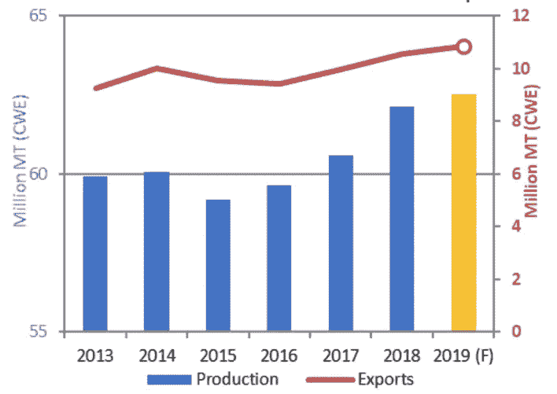
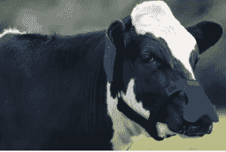

# 将奶牛甲烷转化为二氧化碳和水

> 原文：<https://medium.datadriveninvestor.com/blockchain-technology-is-not-just-being-used-to-prove-provenance-in-the-cattle-industry-25c5f19868d8?source=collection_archive---------9----------------------->

尽管人们越来越意识到养牛对世界气候的影响，但对牛肉的需求仍在持续增长，预计 2019 年全球出口将比 2018 年增加 10.8 吨。据估计，农业代表了 [10%的人为温室气体](https://www.contxto.com/en/argentina/zelp-from-argentina-transforms-methane-from-cow-burps-into-co2-exhibits-at-agri-tech-week-2019/)排放。

**全球牛肉生产和出口**

资料来源:USDA-FAS-PSD

阿根廷牛肉行业最近宣布推出 Bitcow，作为一种可以跟踪和追踪牛肉产量的方式，从而使投资者能够投资于牛。只要 150 美元，投资者就可以购买一头奶牛的 10%。阿根廷 OpenAgro 的总裁吉列尔莫·比拉格拉将 Bitcow 描述为“*使用‘实物资产’的数字令牌，意为奶牛”*。

然而，也有其他举措正在实施，试图减少牛对环境的影响，其中之一是 Zelp(总部设在英国)。据统计，全球有 15 亿头牛，每头牛每年产生 250 磅甲烷气体，其中 90%的甲烷是由[打嗝产生的！](https://www.forbes.com/sites/oracle/2019/10/10/to-reduce-greenhouse-gas-and-produce-better-tasting-beef-a-cattle-federation-tests-blockchain/#65c914593d10)为了防止甲烷打嗝，Zelp 开发了一种可以测量奶牛“打嗝”即甲烷气体的鼻口。

**戴着甲烷鼻罩的奶牛**

资料来源:Zelp.com

枪口除了记录排放的气体，还将潜在的有害甲烷转化为二氧化碳和水，将这种气体的影响降低了 85 倍！枪口还能帮助农民定位他们的牛，识别潜在的疾病，甚至确定挤奶的最佳时间。正如 [Zelp](https://www.zelp.co/technology/) 所说，“这些额外的数据*保存在区块链驱动的区块链上，可以提高农民的利润*”。

 [## 5 行业转型区块链应用|数据驱动投资者

### 除非你一直生活在岩石下，否则我相信你现在已经听说过区块链了。而区块链…

www.datadriveninvestor.com](https://www.datadriveninvestor.com/2019/02/13/5-real-world-blockchain-applications/) 

除此之外，还有许多其他使用区块链技术的项目，由[爱尔兰养牛联盟](https://www.icbf.com/wp/) (ICBF)运营。[甲骨文区块链平台](https://www.oracle.com/blockchain/?source=:ex:nc:::RC_WWMK180119P00044:BlockchainforBeef&SC=:ex:nc:::RC_WWMK180119P00044:BlockchainforBeef&pcode=WWMK180119P00044)跟踪并追踪每块肉，追溯到切割的奶牛，与消费者分享数据(通过二维码、移动应用和智能手机)，以交换他们对味道的反馈。利用动物的 DNA、基因型、屠宰时的年龄等，这让消费者能够准确了解他们购买的东西。

此外，ICBF 正在创建机器学习算法，以潜在地改变牛的遗传基因，这最终将帮助农民确定他们牛群的整体盈利能力。

ICBFs 基因评估小组负责人 Ross Evans 说:“*我们的研究表明，体型较小的肉牛释放的甲烷少得多，如果它们的基因组合生产出优质牛肉*，它们仍然可以获得溢价。”。ICBF 的技术总监 Andrew Cromie 表示:“*我们正在寻找最经济的方法来保护环境，养活 90 亿人口，同时让农民也能从中获利。奶牛的大小，它排放的甲烷量，以及它生产的肉只是总价值等式的一部分*"补充道，"*我们也在研究这些奶牛多快被生产出来并被推向市场"*。克罗米声称，通过分离决定快速生长性状的基因型，农民有可能比平均 700 天快 100 天将他们的牛推向市场。

如需更多此类文章，请联系我，每周收到一份《数字字节》,其中分析了区块链和数字资产领域的一些发展