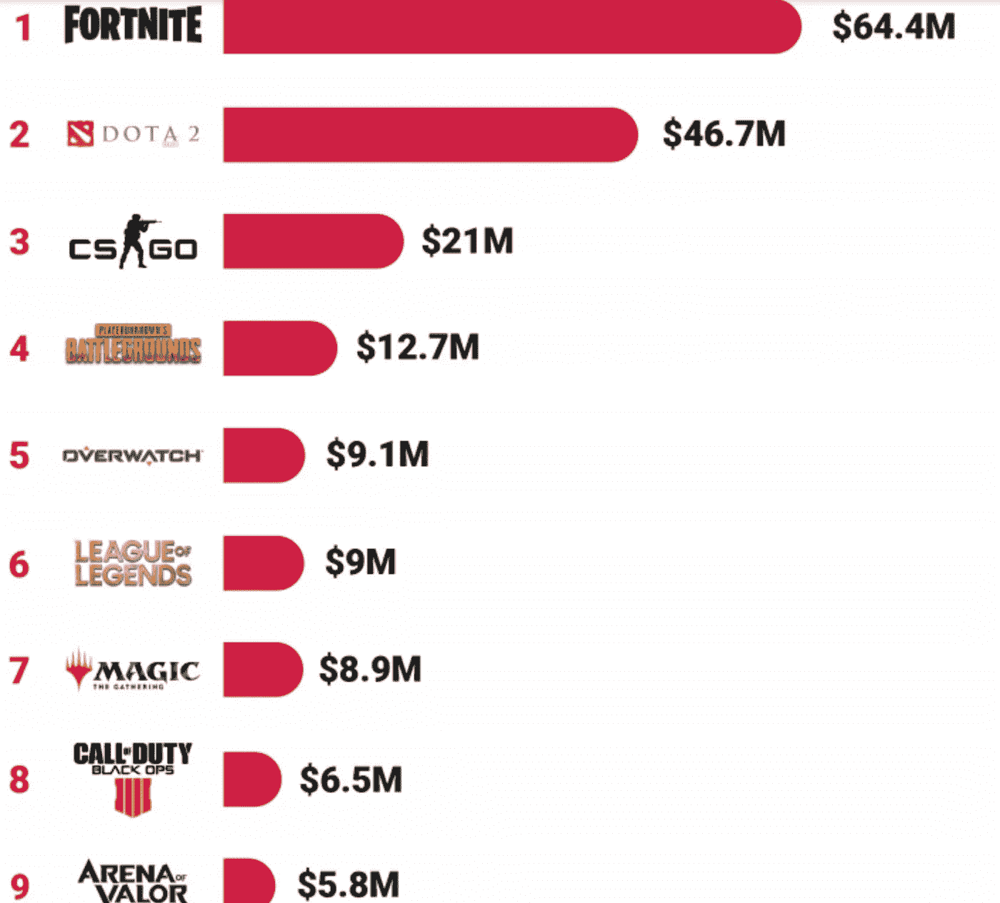

# 区块链技术为电子竞技和在线游戏提供支付和出处解决方案

> 原文：<https://medium.datadriveninvestor.com/blockchain-technology-offers-payments-and-provenance-solutions-to-e-sports-and-on-line-games-d49f379679db?source=collection_archive---------14----------------------->

电子竞技和在线游戏市场吸引了大量观众和奖品，现在正转向区块链驱动的解决方案，为全球范围内交易的虚拟资产提供来源和支付选项。一些最受欢迎的网络游戏吸引了大量的玩家，例如堡垒之夜，它拥有庞大的[2.5 亿](https://www.gamesradar.com/uk/how-many-people-play-fortnite/)注册用户，皇家战役(830 万)，英雄联盟(700 万)和玩家未知战场(曾有多达 320 万人同时玩)。在线游戏吸引的奖金同样可观。《古代防御》为 2019 年世界锦标赛准备了[3400 万美元](https://esportsobserver.com/biggest-esports-2019-prize-pool/)的奖金！

电子游戏最热门的地区是亚洲，据估计该地区的市场价值为每年[415 亿美元](https://e27.co/blockchain-gaming-trends-in-asia-heres-what-you-need-to-know-20191127/?utm_content=bufferaff09&utm_medium=social&utm_source=facebook.com&utm_campaign=buffer&fbclid=IwAR0bhxggGH3i9WEed1l4LEFx5fxDp0SJ03-YQu6xCcb-qRtLiT0EJEcM7AI)。日本市场的价值为 190 多亿美元，根据《好运 3》的首席执行官 Kazuhisa Inoue 的说法，“*游戏和游戏经济为代币的流通提供了完美的契合点。井上是 [CryptOink](https://www.crypt-oink.io/) 的游戏制作者，这是一款基于区块链的游戏，使用 cryptopiggies，最近吸引了 [20，000 名游戏玩家](https://blog.liquid.com/these-blockchain-animals-could-be-the-next-pig-thing-in-crypto)。它类似于 Cryptokitties，但有更多的比赛选项，即游戏者比赛，打赌，繁殖猪和参加挑战。更强大的安全性，以及在线游戏社区的新机会和激励措施，只是区块链技术可以为虚拟世界中的数百万游戏玩家带来的一些好处。*

**2019 年前九名电竞赛事奖金**

来源:[https://esportsobserver . com/biggest-esports-2019-prize-pool/](https://esportsobserver.com/biggest-esports-2019-prize-pool/)

历史上，对于视频游戏来说，游戏中的物品(即盾牌、剑、汽车、房子、过山车和玩家角色)都是由游戏开发者拥有的。它们和游戏通常运行在开发者的服务器上。然而，将你(在玩游戏时)积累的资产放在区块链上，会创建一个去中心化的、不可改变的所有权记录，可以与游戏公司及其服务器分开。这意味着游戏中的虚拟资产可以交易，使这些虚拟资产更有价值，并提高其流动性，因为玩家在本质上拥有虚拟物品。

 [## 数字货币、区块链和货币的未来|数据驱动的投资者

### “区块链”、“加密货币”、“令牌化”，以及现在的“央行数字货币”已经成为…

www.datadriveninvestor.com](https://www.datadriveninvestor.com/2020/02/18/digital-currencies-blockchain-and-the-future-of-money/) 

在区块链平台上交易游戏中的虚拟资产也允许玩家直接与世界各地的其他玩家进行买卖。使用智能合同，任何支付(交易这些虚拟资产时进行的)的 1%可以支付给游戏开发商，因此创造了一个有价值的持续收入流。随着我们看到越来越多的全球在线游戏允许虚拟资产在“对等”的基础上进行交易，收入非常低的国家的玩家没有理由不能将他们积累的虚拟资产出售给伦敦、巴黎或纽约的富裕玩家。虚拟资产交易正在成为一个越来越大的市场，目前据信价值已经高达每年 500 亿美元！

区块链技术还可以用来以更安全的方式保存在线游戏玩家的身份，以及使用军用级加密程序来存储虚拟资产，从而减少这些资产被黑客攻击和窃取的机会。如果这些资产被令牌化，那么如果一个在线账户被黑客攻击，那么虚拟资产被盗的游戏玩家可以要求游戏开发商取消被盗资产，并将受害者的虚拟资产恢复给他们。通过智能合约，一旦玩家玩了一定时间，他们可能会被“锁定”到第二天，因为在中国[人们越来越担心未成年人](https://www.bbc.co.uk/news/world-asia-50315960)每天花太多时间玩游戏。因此，使用区块链可能是解决这一问题的一种方式。

鉴于活跃在在线游戏市场的人数，随着虚拟资产交易变得越来越普遍，看看是否有销售虚拟资产的人激增将会很有趣，因此为一些人创造全职工作/收入。央行发行的数字货币的推出有助于激发人们对虚拟资产交易的兴趣，从而有助于以高度数字化的方式将现实和虚拟生态系统结合起来。

关于每周话题的更多分析，请发邮件给 Jonny。油炸并要求数字字节