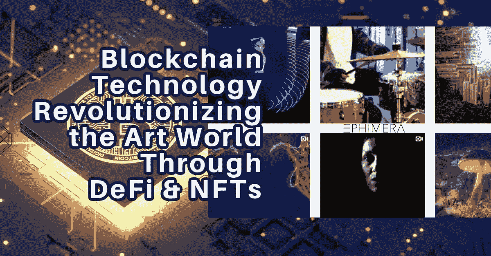
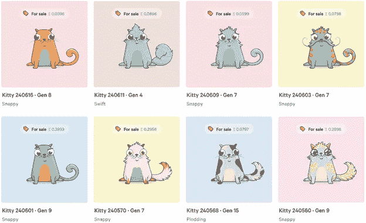
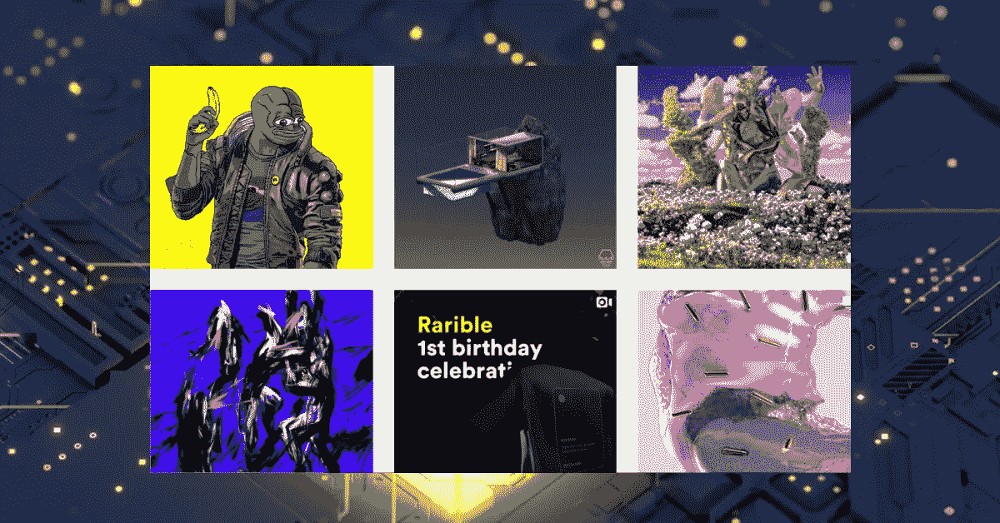
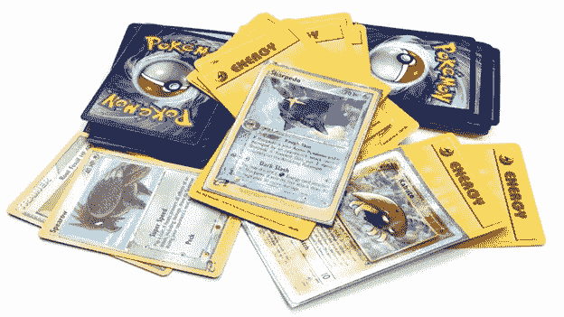
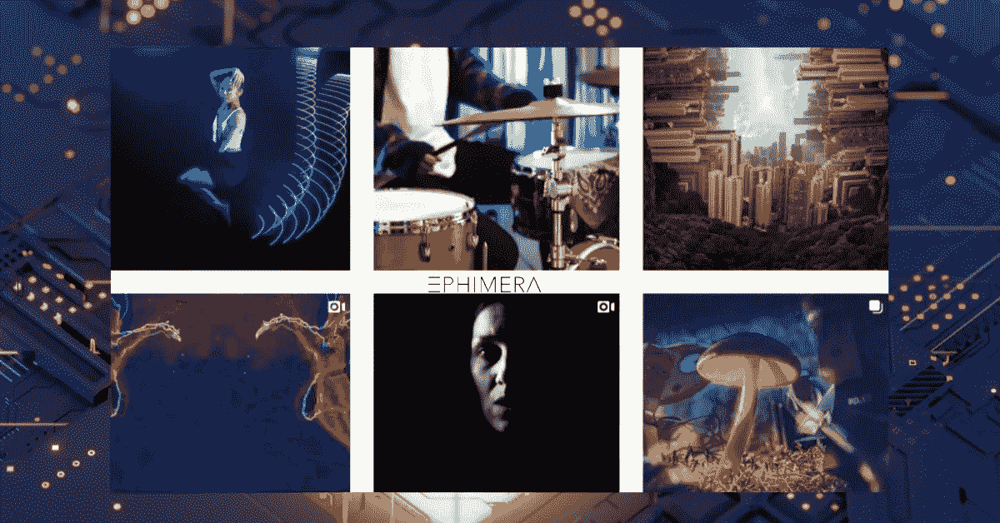

# 区块链技术通过去中心化的金融网络& NFTs 彻底改变了艺术世界

> 原文：<https://medium.datadriveninvestor.com/blockchain-technology-revolutionizing-the-art-world-through-decentralized-finance-networks-nfts-63cd0ace9b82?source=collection_archive---------6----------------------->

Decentralized Finance and NFTs bringing new opportunities to artists through platforms like [Ephimera.](https://www.ephimera.com/)

## 不可替代的代币代表了一个资本转化和财富创造的新时代，它在一个关键时刻赋予了人类行为范式的转变。

提到加密货币，人们首先想到的往往是支付和投资。虽然这可能是数字资产的最终目的，但加密有更多的使用案例，尤其是在今天。一个这样的用例包括不可替换的令牌(NFT)和它们与 art 的美丽协同作用。

但是什么是非传统艺术，为什么艺术家对他们的艺术作品如此感兴趣？区块链技术对艺术有什么影响，我们是否会看到一场永远改变数字艺术家经济的革命？

## 不可替换令牌(NFT)

去中心化金融的兴起给 crypto 带来了许多伟大的概念和特性。作为一项旨在分散现代金融工具的激励措施，146.5 亿美元的 DeFi 市场催生了各种产品和服务，如产量农业、预测市场、打包资产、借贷协议、分散交易所等。

流动性很快成为市场的一个重要标志，而“农业代币”是交易者可以花时间购买的最重要的东西。但是，一旦 2020 年 9 月受欢迎的产量农业热潮平静下来，投资者就将注意力转向其他风险投资，很快，我们就看到 NFTs 成为加密领域的下一个热点。几乎一夜之间，Crypto Twitter 上的讨论就从产量农业话题转移到了 NFTs。

NFT 是一种加密令牌，代表一种独特的资产，其主要特征是不可互换的数字稀缺性，不像可替代资产，包括黄金、法定货币甚至加密货币。每一个 NFT 在价值和属性上都完全不同于其他的。
如果我们以美元这样的法定货币为例，我们会发现每张 1 美元的钞票都是一样的。它们都有相同的设计和价值。此外，它们可以随意印刷，并有无限的供应。

另一方面，NFT 则完全相反，因为每个令牌都是独一无二的，与各自类别中的其他资产相比是不同的。即使它们的数量有所增加，它们的供应量仍然非常少。

简单地说，NFT 是数字或现实世界资产的符号化版本。在 DeFi 领域，这些独特的代币创造了数字收藏品和项目，可以在分散的市场上收集和交易，无需任何中介。

# 标记化

无论我们谈论的是数字媒体还是非数字媒体，我们都必须将这两种形式符号化，以便将它们纳入区块链网络。在这个上下文中，[令牌化](https://searchsecurity.techtarget.com/definition/tokenization)是将事物转换为数字资产或令牌的过程。

大多数人错误地认为，标记化是一个只能在金融资产上执行的过程。但事实是，你绝对可以令牌化任何东西。养宠物？您可以标记您的狗，并创建一个所有权的数字证书。

有人想买一块石头吗？您也可以将其标记化。只要一个物质或非物质的物体具有货币价值，并且你可以把它归你所有，它就可以被标记化。

标记化的一个很好的真实用例是房地产市场。你想卖掉你的房子吗？你可以将你的家标记化，并将其转换成数字形式，一个标记。通过这样做，你可以在数字公开市场上出售房子，而无需处理任何传统的麻烦和文书工作。

像大多数协议、项目和加密领域一样，令牌化资产主要出现在以太网上，要么是 T2 的 ERC-721 T3，要么是最近的 T4 的 ERC-1155 T5 令牌标准。两者都使开发人员和用户能够创建包含不可替换资产的智能契约，这些资产由一个唯一的 ID 表示，从而结束了资产的在线可复制性。

CryptoKitties [CryptoKitties | Collect and breed digital cats!](https://www.cryptokitties.co/)

# NFTs 的兴起

接近 2017 年底时，我们看到基于区块链技术的区块链游戏和数字收藏品有所增加。提供这些物品的一个协议是 [CryptoKitties](https://www.cryptokitties.co/) ，一个用户可以购买、出售和繁殖数码猫的游戏。这款游戏大受欢迎，其中一只 CryptoKitty 卖到了 14 万美元(2018 年 5 月 12 日)。

每个 CryptoKitty 都被表示为一个不可替换的令牌，使用以太坊上的 ERC-721 令牌标准。[猫是可繁殖的，携带一个独特的数字和 256 位独特的基因组，具有 DNA 和不同的属性(属性)，可以传递给后代。](https://en.wikipedia.org/wiki/CryptoKitties)

## DeFi & NFTs

DeFi(去中心化金融)越来越受欢迎，[一种不依赖于经纪公司、交易所或银行等中央金融中介，而是利用区块链智能合约的金融替代方案，](https://en.wikipedia.org/wiki/Decentralized_finance)使 NFTs 重新成为人们关注的焦点。

> 无信任的区块链交易现在是两个全球陌生人需要包含他们的易货参数的唯一要求。真正的转变可以通过考虑 NFT 所包含的独特全球资产的性质和数量来理解。它代表了一个资本转化和财富创造的新时代，正在推动危机时刻人类行为的范式转变。— [流动账户首席执行官兰迪·麦奎尔](https://www.linkedin.com/in/randy-mcguire-a61428/)

## 艺术世界和区块链技术的碰撞

通过 NFTs 的区块链技术为艺术家和收藏家创造了一种新的创新方式，可以接触到更广泛的受众，找到感兴趣的投资者，而无需冒着失去收藏品或特定艺术品所有权的风险，也无需通过中介。

 [## 面向开发者的区块链；API 提供商的重要性|数据驱动的投资者

### 在过去的几年里，区块链突然成为这个领域最热门的新技术。每一个…

www.datadriveninvestor.com](https://www.datadriveninvestor.com/2020/11/25/blockchain-for-developers-the-importance-of-api-providers/) 

[Rarible，](https://app.rarible.com/)被称为世界上第一个“社区拥有的 NFT 市场”，被认为是引发了最近兴趣的激增。该平台使用户能够创建自己的 NFTs，并在 Rarible 的分散市场上展示。

[Rarible —](https://rarible.com/) **the first community-owned NFT marketplace**

无论是数字艺术品还是游戏中的收藏品；根据过去的经验，我们可以得出这样的结论:非功能性测试肯定有一个细分市场需要填补。在 90 年代，孩子们收集了大量的卡片和贴纸，希望收集他们最喜欢的足球运动员、卡通和电子游戏角色。

像《口袋妖怪》和《游戏王》这样广受欢迎的卡通节目提供了人们可以收集和玩的卡片。有些人至今仍拥有这些卡片，有些已经变得比以前更有价值了。

[Pokemon](https://www.pokemon.com/us/) Trading Cards

这表明，只要某样东西能引起人们的兴趣，而且供应量有限，它就能保持货币价值。例如，那些几十年前涉足口袋妖怪卡的人现在以数千美元的价格出售。像亚马逊和易贝这样的互联网市场充斥着卖家，他们以高得离谱的价格提供来自这个利基市场的卡片。某些稀有而独特的卡片甚至可以[卖到 10 万美元！](https://www.tmz.com/2020/06/22/pokemon-trainer-card-auction-block-100k/#:~:text=TMZ%20Sports%20has%20learned%20a,only%20seven%20known%20in%20existence.)

因此，我们认为有收藏价值的物品永远不会消失，我们可以在 NFTs 的帮助下进一步创新它们。

# ephimera——独一无二的 NFT 平台

Ephimera 是 [NFT 市场](https://www.ephimera.com/)的新成员，目前只专注于摄影和视频艺术。艺术家们可以在以太坊网络上发布他们的作品，并通过拍卖以不可替代的代币形式出售。

Ephimera 的独特之处在于，该平台将每件艺术品的供应限制为仅一个令牌。因此，每个 NFT 在同一时间只能有一个主人。

Ephimera 上的 NFT 是基于 ERC-721 令牌标准的，它们都是用 ETH(以太网)买卖的。要购买艺术品，收藏者可以使用 Metamask 等 Web3 浏览器钱包连接到 Ephimera，并使用 ETH 对拍卖进行投标。也有可能以挂牌价出价立即购买 NFT。

至于艺术家，他们可以在 Ephimera 上注册，并在平台上注册。通过发布他们的作品并将其列入拍卖清单，艺术家可以利用区块链技术将其创作流货币化。

一旦艺术品被售出，艺术家还可以通过二次销售版税获得额外的被动收入。艺术品每被转卖一次，艺术家就能获得中标金额的 10%。

[Ephimera](https://www.ephimera.com/) — aims to provide a space for photographers to tokenize, exhibit, and sell their work to collectors around the globe

**为什么 Ephimera 如此受欢迎？** Ephimera 是一个全球性的无障碍之家，用于欣赏、创作和收藏符号化的精美摄影和媒体艺术，为收藏家，更重要的是为艺术家创作的 NFT 提供单一符号供应。这些加密货币资产为那些努力获得曝光率并出售其作品的人提供了一个全新的世界和经济。

在符号化的帮助下，艺术家现在可以访问一个简单易用的基础设施，通过它他们可以访问一个缺乏第三方和中介的分散市场。

> NFT 氏症可以显著改变人们个人和集体的互动方式。
> 
> 不可替代资产的“令牌化”建立了一种内在价值，这种内在价值可以基于其独特资产价值的真实总需求(包括智能合同中捕获的知识产权流程)进行全局表达，而不考虑传统营销、分销、托管、经纪和对账等外部服务。任何在智能手机上拥有数字钱包的人都可以获得传统上由离散领地处理的完整服务，这些领地将单独处理利润丰厚的资产服务，如经纪、托管、托管和债务。
> 
> NFT 的是区块链以其固有的不可信和民主化本质总体上代表的巨大转变之上的真正提升。由于这些 NFT 资产交易工具触及最脆弱人群的先决条件只是智能手机数字钱包，因此几乎无处不在的数字接入和服务现在已成为可能。基于对 ***财产*** 概念的修改，不可替代令牌管理和加密货币互操作性特性代表了一种新的管理和循环收入机会；市场动态的基本特征是，符号化是一种以可以拥有、交易和归属的方式对任何可以预见、表现和期望的东西进行估价(和贬值)的方法。
> 
> 约翰·洛克现在有工具来实现他的十七世纪资本主义的平等主义观点。— [兰迪·麦奎尔，流动账户首席执行官](https://www.linkedin.com/in/randy-mcguire-a61428/)

这一细分市场的发展将在未来 5 年内引人入胜。

[螺旋营销&公关](http://www.spinspirational.com/)

[奥黛丽·奈斯比特在领英上](https://www.linkedin.com/in/audrey-nesbitt-mba-pmp-0388a52a/)

[@ audreynesbit 11 在推特上](https://twitter.com/AudreyNesbitt11)

## 访问专家视图— [订阅 DDI 英特尔](https://datadriveninvestor.com/ddi-intel)