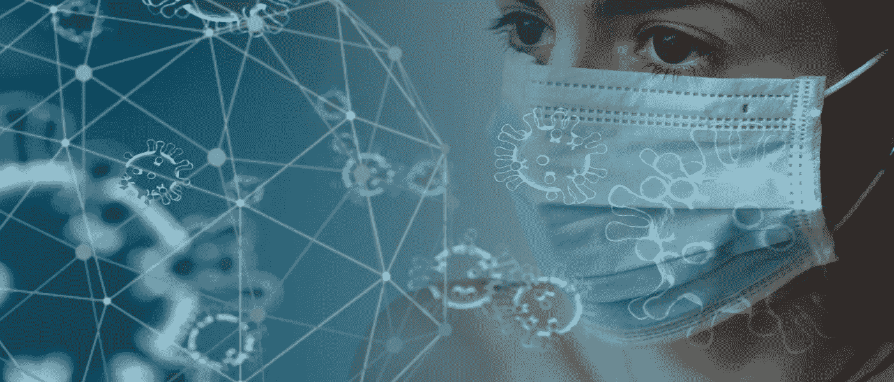
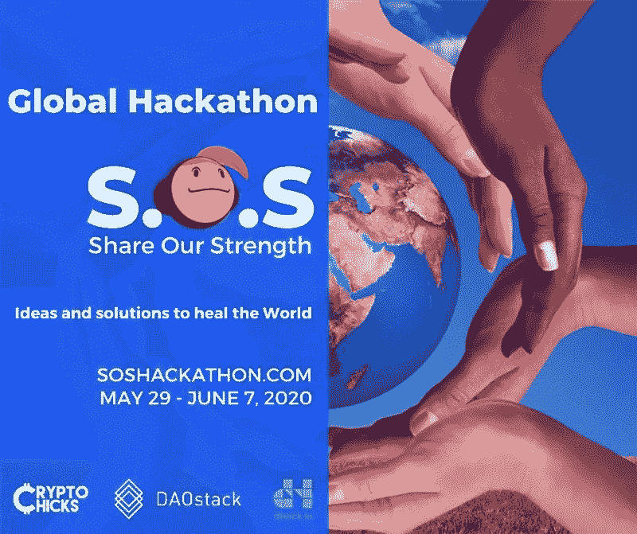
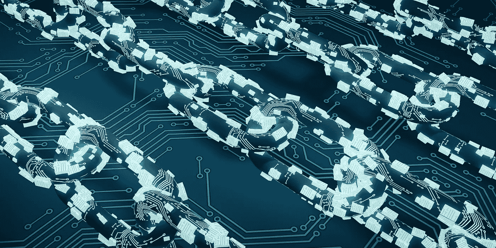

# 区块链技术在新冠肺炎危机中占据中心位置

> 原文：<https://medium.datadriveninvestor.com/blockchain-technology-takes-center-stage-during-covid-19-crisis-b14a89e0abd3?source=collection_archive---------5----------------------->

## 区块链被证明对于因冠状病毒疫情而开始累积的一级和二级危机非常宝贵。

Blockchain Technology Takes Center Stage During COVID-19 Crisis Image by [Tumisu](https://pixabay.com/users/Tumisu-148124/?utm_source=link-attribution&utm_medium=referral&utm_campaign=image&utm_content=4914026) from [Pixabay](https://pixabay.com/?utm_source=link-attribution&utm_medium=referral&utm_campaign=image&utm_content=4914026)

新冠肺炎病毒的传播给医疗系统、全球供应链和社会的其他重要支柱带来了冲击波。世界各国都在部署技术来帮助解决一些与 COVID 相关的最大挑战。新的是这些技术正在采取的形式。鉴于全球危机的巨大规模，新兴技术的大胆的新方法正占据中心舞台。

一个[区块链是一个分布式账本](https://medium.com/datadriveninvestor/blockchain-technology-disrupting-global-finance-and-changing-the-face-of-the-payments-industry-9792e15507cb)，可以在公共、私有和混合数据库中存储数字信息。区块链可以创建不可复制、不可感染或不可入侵的离散和不可变的数字信息单元。数字信息格式的单位类型之一是加密货币，如比特币。比特币等区块链生成的加密货币被视为法定货币的可能替代品，原因从数字便利到处理纸币的风险……最近还包括[冠状病毒](https://qz.com/1803255/china-is-disinfecting-banknotes-to-stop-spread-of-coronavirus/)的威胁。

以下是区块链在面对新冠肺炎时的一些最重要的用途:

## 供应链中的区块链技术

我们从新冠肺炎学到的最严酷的教训之一是，全球供应链可能极其脆弱，而且对日常生存至关重要。当病毒肆虐中国经济时，许多国家越来越依赖中国作为廉价商品的来源，导致了严重的短缺。与此同时，美国国土安全部最近发布了[新冠肺炎指导方针](https://www.cisa.gov/sites/default/files/publications/CISA-Guidance-on-Essential-Critical-Infrastructure-Workers-1-20-508c.pdf)，将区块链食品配送经理列为“关键基础设施工人”

 [## 数字货币、区块链和货币的未来|数据驱动的投资者

### “区块链”、“加密货币”、“令牌化”，以及现在的“央行数字货币”已经成为…

www.datadriveninvestor.com](https://www.datadriveninvestor.com/2020/02/18/digital-currencies-blockchain-and-the-future-of-money/) 

区块链使利益相关者能够准确跟踪和追踪货物在供应链中的移动。我们看到越来越多的食品生产商尝试将区块链作为管理库存、监控货物运输过程中的储存条件以及确保产品真实性的新方法。

G [罗克瑞商店](https://www.ledgerinsights.com/blockchain-food-traceability-albertsons-ibm-food-trust/)和[特色食品组织](https://www.ledgerinsights.com/raw-seafoods-ibm-food-trust/)也在使用区块链来确保食品和其他必需品准时完整地到达。一些提供这些区块链供应链解决方案的科技公司包括知名巨头如 IBM 和 SAP，以及新贵如总部位于加州的[itradenenetwork](https://www.itradenetwork.com/)和总部位于多伦多的 [Emerge](https://emergetechlab.com/) 。

## 追踪冠状病毒

面对像新冠肺炎这样快速发展的疫情，全世界都必须迅速采取行动，实施积极的跟踪和遏制措施。不幸的是，许多国家对此准备不足，政府和卫生执法机构之间的信息流动过于缓慢。结果是越来越大的感染浪潮。问题在于依赖过时的遗留系统。虽然许多国家确实拥有旨在跟踪新疾病和控制现有疾病的监测系统，但这些系统已被证明过时、运行缓慢、难以使用，而且往往不准确。

在这里，区块链再次帮助填补了这一空白。

世界卫生组织与甲骨文、IBM、微软和 Hacera 合作，启动了位于区块链的新冠肺炎数据中心和数据共享平台。世卫组织的目标是尽可能快速、高效、准确地帮助诊断新冠肺炎病毒感染者。

在其他地方，区块链的应用开发者 Acoer 提供了一个数据可视化工具来追踪病毒。该工具与 Hedera Hashgraph 的[分布式账本技术](https://cointelegraph.com/tags/ledger)相结合，使科学家和记者能够更好地理解新冠肺炎的传播。

## 用于医疗数据管理的区块链技术

政府机构、医院和医疗保健提供商一直在努力高效地共享数据。最近的一份 KLAS 报告显示，86%的美国医疗保健提供商仍然没有达到数据系统有效工作的互操作性水平。这个问题已经变得更具破坏性，因为在新冠肺炎，快速诊断和治疗可能意味着生死之别。

Blockchain can help. A blockchain-based solution would allow both healthcare institutions and patients to maintain control over their data. It would render the [35%-40% of healthcare data that’s currently unencrypted](https://www.himss.org/2018-himss-cybersecurity-survey) to become fully encrypted and secure, helping to prevent the [massive patient data leaks](https://www.healthcareitnews.com/news/health-system-fined-2-million-making-patient-data-public-online-twice) that have plagued the industry. Finally, the smart contracts generated by blockchains would drastically reduce the gigantic amounts of unnecessary overhead that currently exist within healthcare systems.

## Blockchain Technology & Insurance Payouts

Another part of the healthcare industry thrust into the spotlight during the COVID-19 pandemic is the insurance sector. One major insurer, Blue Cross (Asia-Pacific) Insurance, has used its blockchain platform to reduce the amount of paperwork for claims made in Hong Kong. Blue Cross Insurance claims that its platform can manage more than 1,000 transactions per second.

That’s good for growth, with the company’s medical claims app seeing double-digit monthly policyholder user base growth since the app’s launch in 2019\. Patients using the app can see the result of their claims within a day after the hospital visit. Best of all, fast claim-processing times mean faster insurance payouts, an absolute must at a time when billions of people around the world are feeling the economic crunch caused by the virus.

## Digital Currencies & Electronic Payments

The World Health Organization is thus encouraging consumers to use contactless, cashless payments instead of physical cash, which could potentially spread COVID-19\. Related to the idea of cashless payments are digital currencies, be they digital money, electronic money, or electronic currency, in the form of either cryptocurrency or central bank digital currencies.

Chinese President Xi Jinping has called for China to [focus on blockchain development](https://www.ft.com/content/2789d21a-f955-11e9-98fd-4d6c20050229) as part of the country’s effort to launch its own digital currency. A digital payment system would enable the government to scale back on paper fiat transactions, while also adding a tool that could help fight societal scourges such as terrorist financing and money laundering. Japan is considering [deploying its own digital currency](https://www.reuters.com/article/us-japan-economy-digital/japan-ruling-party-lawmakers-to-float-idea-of-issuing-digital-currency-idUSKBN1ZN0OU) as well.

数百万中国消费者已经通过微信和支付宝等智能手机应用程序使用数字支付系统。这些类型的现代金融服务提供商在其他国家还没有建立起来，尽管它们的受欢迎程度正在逐渐上升。一旦世界各地的消费者习惯了在全球疫情期间用手机支付，一旦新冠肺炎开始消退，这可能会成为常态。

Blockchain Technology Takes Center Stage During COVID-19 Crisis

## **区块链在冠状病毒引发的二次危机中的应用——作者** [**兰迪·麦奎尔，首席执行官 Liquid Ledgers**](https://www.linkedin.com/in/randy-mcguire-a61428/)

> 我相信我们正在进入我们历史上的一个新时代，它的形状还不知道，因为我们仍然处于这个疫情的破坏缓解的早期阶段。目前，我们被越来越多的恐怖所震惊，但是公众舆论会随着我们对它的麻木而改变。我担心的是，在许多情况下，冠状病毒引发的危机的一些后果是对民主的毁灭性打击，或许是灾难性的。
> 
> 这是病毒和人类之间的战斗，而不是主权旗帜或投票偏好之间的战斗，但由此产生的在执法和保护之间建立平衡的舞蹈将被一些现在有权部署复杂监控技术的威权主义者所利用。俄罗斯刚刚在莫斯科安装了 100，000 个带面罩的摄像头，能够进行面部识别，完全集成到实时移动限制执法中。特朗普已经使用紧急权力关闭了美国南部边境的*正当程序*。许多人将会步其后尘，我们现在面临的挑战是，民主程序如何能够提供同样水平的公共安全，同时仍然保护个人权利。被掏空的政府金库将产生一种歧视倾向，将福利和权利集中到优先群体，而剥夺其他人的权利。
> 
> 基于区块链的生态系统可以帮助分散公共和私营机构的不同利益相关者，这些利益相关者现在受到物理邻近性限制的阻碍。由于广泛分布的分类账技术为所有数字资产提供了不可改变且可审计的生命周期记录，因此解决方案可以由公共利益的共识来设计和管理；实体、工作流、交易、智能合同、生物特征标记、测试结果和跟踪。这是一个特别好的消息，因为随着身份管理将成为日常生活的核心，如此多的强制执行将被自动化，并可以由通过共识建立的机器学习工作流来管理。
> 
> 游轮恐怖事件将使该行业瘫痪，直到公众对遏制、控制和跟踪的新流程以及新的 SWAT 式灾难和应急计划满意为止。基于区块链的身份管理是这一新制度的重要基础平台。机器人后备人员可以提供部分解决方案。
> 
> 公共和私人机器人的依赖将迅速增加，以保护工人，特别是“一线”工人。所有这些计划都应通过基于区块链的流程进行管理和记录。在这个新世界中，其他数字生态系统将受益于区块链技术的“无信任”安全性:
> 
> *监狱和移民营地测试、跟踪、数据仓库
> *长期护理——测试、跟踪、数据仓库
> *就业抗体筛查
> *远程投票流程
> *食品生产&配送安全
> *器官捐赠安全
> *保险凭证
> *数字小额信贷(许多货币将会崩溃)
> *受灾国家所有权细分的绿色能源
> *公共交通健康控制&身份管理
> *医疗供应链完整性

## 区块链和人工智能等新兴技术的一线希望——CryptoChicks**全球 SOS 黑客马拉松**

加拿大非营利区块链和人工智能教育中心 [CryptoChicks](https://cryptochicks.ca/) 正与主要社区合作伙伴合作，举办有史以来第一次[全球 SOS(分享我们的力量)黑客马拉松](https://soshackathon.com/)。这是一个全球性的活动，任何人都可以测试想法并制定解决方案，以治愈我们处于危机中的世界。这个在线活动对所有国家、所有性别、所有技术、哲学、所有思想家、开发者、技术专家、科学家和企业家开放。由 CryptoChicks 和 [DAOstack、](https://daostack.io/)与 [COVIDathon](https://www.crowdcast.io/e/covidathon/register) (分散式人工智能联盟，由 [SingularityNET](https://singularitynet.io/) 和[海洋协议](https://oceanprotocol.com/))、 [ETHDENVER](https://www.ethdenver.com/) 和 [TKS(知识社会)](https://theksociety.com/)共同组织，这是一场真正的全员参与的活动。

有无数的区块链应用程序可以为我们快速变化的环境提供解决方案，我们没有时间等待。世卫组织顶级病毒学家表示，冠状病毒可能需要 36 个月的战斗！

Blockchain Technology Takes Center Stage During Coronavirus Crisis — Image by [xresch](https://pixabay.com/users/xresch-7410129/?utm_source=link-attribution&utm_medium=referral&utm_campaign=image&utm_content=3750157) from [Pixabay](https://pixabay.com/?utm_source=link-attribution&utm_medium=referral&utm_campaign=image&utm_content=3750157)

奥黛丽·奈斯比特

[奥黛丽·奈斯比特在 Linkedin 上](https://www.linkedin.com/in/audrey-nesbitt-mba-pmp-0388a52a/)

[@ audreynesbit 11 在推特上](https://twitter.com/AudreyNesbitt11)

[螺旋营销&公关](http://www.spinspirational.com/)