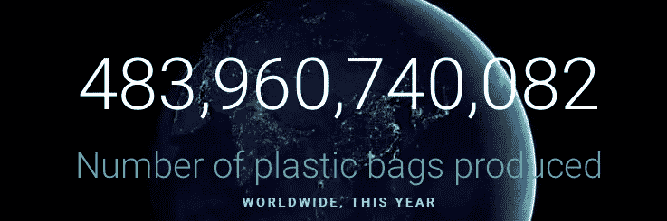
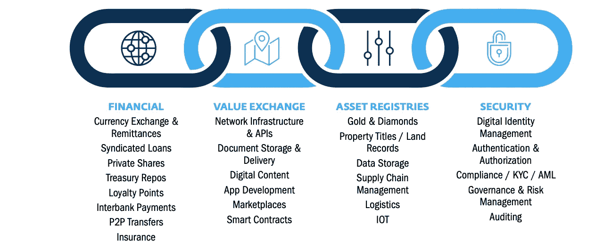
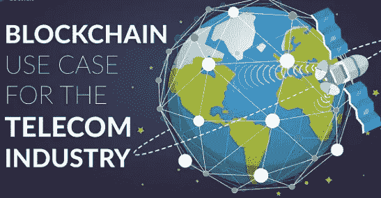
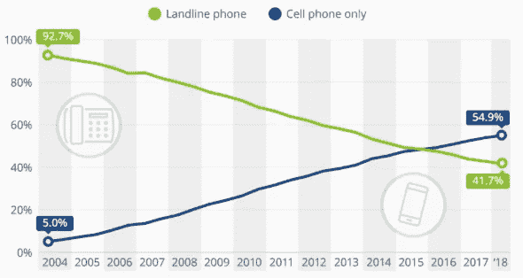
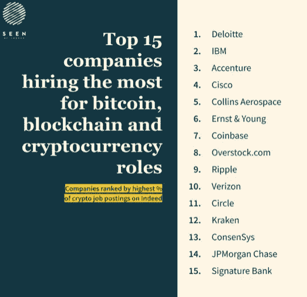

# 区块链使用案例 2020 年 2 月 5 日

> 原文：<https://medium.datadriveninvestor.com/blockchain-use-cases-5th-feb-2020-8687cfeda942?source=collection_archive---------10----------------------->

【2020 年 2 月 5 日数字字节

**视频字节**

鉴于对视频和音频内容的需求不断增加，我们每周都会制作一系列视频。下面的视频是过去七天中观看次数最多的。

【https://photos.app.goo.gl/UXqnCaz6AYxaVSLZA 

Source: [World counts.com](https://www.theworldcounts.com/challenges/planet-earth/waste/plastic-bags-used-per-year)

塑料回收对公司来说变得更加重要。高露洁刚刚推出了可回收牙膏管，强生公司开始用可回收塑料制造容器。不幸的是，全球每年使用 5 万亿个塑料袋！看看这个令人吃惊的网站,它显示了全世界生产的包的数量。令人震惊的是，每年有 800 吨的垃圾最终流入我们的海洋！

 [## 2019 年十大区块链课程|数据驱动的投资者

### 渴望在区块链发展吗？你想知道区块链是如何工作的，但不知道在哪里？或者就是太多了…

www.datadriveninvestor.com](https://www.datadriveninvestor.com/2019/03/08/top-10-blockchain-courses/) 

令人放心的是，我们正在开发其他有助于保护环境的计划，例如垂直农业、塑料银行数字代币(用于鼓励收集废物)、RIF 标签和奖励包装回收的物联网(卡夫食品)。 [90.5%的塑料未被回收](http://www3.weforum.org/docs/WEF_Harnessing_4IR_Circular_Economy_report_2018.pdf)区块链正被用于追踪和追溯废物，以阻止非法倾倒。[https://block head technologies . com/区块链-改变-回收/](https://blockheadtechnologies.com/blockchain-changing-recycling/)

**运动**

**如何赚取超过当前利率三倍的利息——由体育明星支持**

美国国家篮球队(NBA)球员斯宾塞·丁翁迪将发行 3 年期债券，利率为 4.95%，这可能成为一个里程碑式的事件。相比之下，美国目前的 2 年期美国国债利率为 1.56% 。丁威迪已经“锁定”在与 NBA 的斗争中(NBA 威胁要禁止他进入 NBA 联盟)，因为它不希望他推出 1350 万美元的债券，这将由他的三年 3400 万美元的合同提供支持。这位 26 岁的加州人目前仅被估计为价值 50 万至 200 万美元的正在寻求部分出售他与篮网队(他目前的篮球队，未来三年内)的合同，并将 1350 万美元“收入囊中”。他必须每年向债券持有人偿还 4.95%的利息，并在三年后归还他们的资本。然而，他有 3400 万美元的合同收入来偿还他对债券持有人的债务。[丁威迪说](https://www.forbes.com/sites/shlomosprung/2020/01/10/spencer-dinwiddie-launching-digital-token-next-week-discusses-nbas-threat-to-terminate-his-contract/#f02ac3b22bac)、*我正试图定义一个新的资产类别，并开始它*。

来源:今日美国

因此，虽然这项投资并不适合丁威迪的所有粉丝，但它开创了一个有趣的先例，不仅是对 NBA 球员，而是对全球所有的体育专业人士。不仅仅是运动个人希望使用区块链，团队也在释放区块链的潜力。NBA 萨克拉门托国王队将推出一个体育纪念品拍卖平台，为拍卖物品建立一个安全的数据库。第一件物品是其中一名球员的衬衫(收益将捐给飓风道林的受害者)，成功的竞标者将获得服装、权威认证[以及包含历史和未来记录的数字令牌。](https://www.theblockcrypto.com/post/53129/nbas-sacramento-kings-partner-with-consensys-to-launch-sports-gear-auctions-on-ethereum?utm_source=newsletter&utm_medium=email&utm_campaign=2020-01-15)萨克拉门托国王队首席技术官 Ryan Montoya 在一份声明中表示，“*我们已经将区块链技术整合到我们跨多个平台的业务中，包括我们的奖励计划，现在我们的球迷将有机会使用一种创新的基于区块链的解决方案安全地实时购买真实的游戏磨损商品*。” [Hogan Lovells 的合伙人](https://www.law.com/legaltechnews/2020/01/23/lawyers-dont-think-nba-players-blockchain-contract-is-a-regulatory-risk/?kw=Lawyers%20Don%27t%20Think%20NBA%20Player%27s%20Blockchain%20Contract%20Is%20a%20Regulatory%20Risk&utm_source=email&utm_medium=enl&utm_campaign=afternoonupdate&utm_content=20200123&utm_term=ltn&slreturn=20200024110511)和美国区块链技术实践负责人 Ted Mlynar 对 Dinwiddie 正在做的事情发表了评论，他补充道:“*名气稍纵即逝，这使得职业运动员能够更快地利用这一点，……如果你只有五分钟的名气，最好提前拿钱*”

这种创新债券背后的公司是[证券化](https://www.googleadservices.com/pagead/aclk?sa=L&ai=DChcSEwj7we3Or4DnAhUZ4O0KHTJ0CHoYABAAGgJkZw&ohost=www.google.com&cid=CAESQeD2ch5zpVTYp36fIbFMOvK1NvmKX7GnK1xzDcL6DXO78nk88TOuMiOUIa4qMfthkdNR4R41Vt2pVnHRkTwmpuEV&sig=AOD64_3W-VaZ43i5biF2KNhPDW2HplAs_Q&q=&ved=2ahUKEwj13ubOr4DnAhXUSBUIHTOqBFYQ0Qx6BAgTEAE&adurl=&bg=!LC-lLzdYci_SoI5kEy8CAAAAM1IAAAACCgBL0pjYP0sVdQLBw9msDpiz1Ft5UMMw-NgPkAca38E0YY9AEY3LvbQ-2HUSJSxCaXfUgojQCh5Fz9j5yvgl5lYE9ju0HsscNCPpKaFjmQDesUpkwh9O5YEFoPaMse7N5W3B38qK_AetMVfTKI8wKm6dn1vmQ1wmXk0f8g9xvQ7G7wWXDieIqHAomRJvW6i8RlsYG-QUOWrGaMlHP-qPhkb51b5x33JMjKznOSQ4YtSMuru5vSYj-zkqxZh76J4BQQ5Ufweb-8TqWA005dxqLVpXsuLulZI_jnF_wDVrMH9xMVl_lrfAe0GCrzFlbsS1UtJOyPWXAm2MHQFB6D7MZCD14UDrK_31w6yxCAphJkQw25CIJDjW7FmQhBErY_hXweaV1L0XDoHZiKt3H-AZ)，它也在寻求发行新的数字[证券，为世界象棋](https://www.cnbc.com/2019/11/22/world-chess-sells-digital-tokens-as-it-launches-hybrid-ipo.html)筹集资金，世界象棋是一家媒体和在线游戏公司，此前拥有世界象棋锦标赛的转播权。一旦世界国际象棋公司在伦敦另类投资市场(AIM)上市，数字证券将允许投资者转换成股票，有望在 2020 年下半年上市。这两种数字证券都是数字资产能够为投资者创造的新型投资机会的诱人证据，因为我们越来越多地看到社会从模拟纸质系统和产品转向数字在线产品。

虽然 Dinwiddie 证券资产被包装成债务工具，但一个体育运动员(甚至整个球队)没有理由不提供股票证券。这将向球迷提供球员/球队的财务状况，即他们赢得的比赛越多，他们获得的媒体权利和奖金就越大。收入流中的一部分可以作为红利支付给投资者。这种类型的安全令牌已经讨论了一段时间，ConsenSys 发表了一系列文章，研究区块链将如何改善体育产业。事实上，拳击冠军[曼尼·帕奎奥在 2019 年 11 月推出了他的 PAC](https://cryptopotato.com/manny-pacquiao-to-launch-his-celebrity-pac-token-on-gcox-ieo-platform/) 令牌，该令牌现在正在新加坡交易所 [GCOX](https://gcox.com/exchange/PAC_BTC) 交易。无论是债券还是股票，这类证券的一个关键优势是，它们应该与更传统的债券或股票市场不相关。因此，如果市场出现回调，它们可能是分散投资组合的好方法。

另一个有趣的方面是，体育迷(其中许多人不是股市的自然投资者)可以在他们关注的球员和球队中持有少量股份。这些粉丝通常充满热情，在某些情况下，他们对偶像的了解程度不亚于传统的股票分析师对他们所关注的股票的了解程度(并且对是否买入、卖出或持有有自己的看法)。关于证券化资产如何成为资本市场民主化的一个好方法，已经有过很多争论，那么这难道只是另一个例子吗？问题是，这种证券会有多受欢迎？你所需要做的只是发现下一批精英运动员，根据[Forbs.com 的说法，他们的收入为 2500 万美元](https://www.forbes.com/athletes/#6604d32355ae) +例如体育英雄，如莱昂内尔·梅西、克里斯蒂安·罗纳尔多、罗杰·费德勒、勒布朗·詹姆斯和劳埃德·梅威瑟，不一而足！

在 2 分钟的 YouTube 视频中，Dinwiddie 解释了他发行数字债务工具的原因，请点击[此处](https://www.youtube.com/watch?__s=3dkxj4t6ksmmjbmnatvv&v=wgC2IbmHcFg&feature=youtu.be&t=315&app=desktop):

**区块链**

**联合国 51 个创新网络中有 15 个涉及区块链技术**

联合国秘书长、前葡萄牙总理安东尼奥·古特雷斯认为，联合国需要拥抱区块链。事实上，该组织似乎一直在听取古特雷斯的意见，因为[联合国创新网络目前列出了联合国在世界各地区参与的 51 个](https://www.uninnovation.network/projects)项目——其中 15 个项目将区块链列为正在利用的创新技术。联合国参与的使用区块链技术的一系列倡议提供了一种对该技术可以实施的非常多样的方式的见解。其中包括:

援助转移效率——全球

教育——南非

印度土地注册处

养老金跟踪-全球

养猪户——新几内亚爸爸

汇款——尼泊尔

交通——吉布提、埃及

提供支付粮食援助的新方法——约旦

现金换工作——约旦

可可供应链——厄瓜多尔

汇款——塔吉克斯坦西伯利亚

棉花产地——德国、瑞士、意大利、埃及

创建和记录多达 700 万公民的信用记录—塞拉利昂

太阳能——摩尔多瓦

沙盒有助于演示如何在全球范围内使用区块链

**区块链价值链**

来源:区块链实验室-世界银行

不仅仅是联合国在探索区块链驱动平台的各种用途。世界银行的区块链创新实验室成立于 2017 年，是一个创新中心，研究区块链技术如何帮助解决全球减贫问题。“实验室”一直在研究如何在土地管理、供应链管理、卫生、教育、跨境支付和碳市场交易等其他领域使用区块链。

事实上，在由世界银行编写的一份关于区块链技术如何有潜力恢复 T2 信任并影响全球人民生活的报告中，该报告称..*所有新兴市场地区的创新“跨越”*。它还引用了印度储备银行副行长自己的话说:“*区块链技术在分布式网络中提供了篡改明显的记录链接交易，并有可能扰乱金融业务应用。BCT 的本质是解决多党制中的风险和低效率问题，这也是其最广泛受益的地方。除此之外，区块链技术在发展中国家使用的一个很好的案例是[世界粮食计划署(WFP)，称为“积木”](http://innovation.wfp.org/project/building-blocks)，其中数字货币(价值 100 万美元)被分发给约旦 Azraq 难民营的 10，000 名叙利亚难民。然后在 100，000 笔交易中使用虹膜扫描技术购买商品[。](https://www.wfp.org/news/news-release/wfp-introduces-innovative-iris-scan-technology-provide-food-assistance-syrian-refu?_ga=2.145827063.270531311.1510784378-85224679.1507168959)*

因此，尽管有大量关于区块链技术部署的商业方式的新闻评论和媒体报道，但我们也可以看到援助机构使用该技术来帮助解决发展中国家的挑战，这些国家往往缺乏历史和传统的方法。

**电信**

电信市场正在经历巨大的变革。在全球 77 亿人口中，有 35 亿人与网络相连。然而，埃隆·马斯克的 SpaceX 公司计划通过发射 60 颗新卫星来提供全球高速互联网服务。SpaceX 公司希望将数千颗 Starlink 卫星送入太空。SpaceX 并不是唯一一家寻求在全球范围内提供网络服务的机构。OneWeb world 也在寻求发射一个舰队(或者是一群卫星！)绕地球运行。

来源:区块链理事会

区块链委员会制作了一个简单易懂的短片[视频](https://www.youtube.com/watch?v=-zUbqKtJGhA)，概述了区块链技术在电信行业的多种应用方式。

电信公司面临的挑战是，他们必须创新，因为他们的市场竞争激烈，同时找到降低成本基础的方法，以便将他们的服务保持在可承受的价格范围内。

区块链技术的优势在于，它为电信行业提供了以非常安全的方式保存用户历史记录的能力，智能合同的使用提供了计费系统更大自动化的承诺，有助于节省资金和大量时间。引入更大程度的数字化而不依赖模拟系统，有望减少欺诈，因为会计和审计过程将实现自动化，从而提高电信公司后台部门的效率。

[德勤](https://www2.deloitte.com/content/dam/Deloitte/za/Documents/technology-media-telecommunications/za_TMT_Blockchain_TelCo.pdf)已经确定了它认为区块链技术将影响电信行业的一些方式，其关键应用包括:

欺诈保护

身份即服务和数据管理

5G 支持

物联网连接

有趣的是，上面的后三项说明了区块链技术可能如何与其他技术结合使用。区块链技术可以看做是一个骨架，其他技术都会挂在上面。

电信公司正在唤醒区块链技术提供的机会的另一个例子是西班牙 Telefonica 最近的举措。Telefonica 刚刚宣布，它正在与科技园区协会(APTE)合作测试区块链技术。与 [APTE 的合作将为大约 8000 家西班牙公司](https://www.totaltele.com/504574/Telefonica-piloting-blockchain-across-8000-companies)提供访问其区块链网络的机会。与此同时，去年底，德国电信通过其子公司 T-Systems 推出了欧洲首个区块链服务。

美国家庭座机数量持续下降

来源: [Statista](https://www.statista.com/chart/2072/landline-phones-in-the-united-states/)

然而，电信公司面临的一大挑战是，新的服务提供商总是移动和无线的，没有基础设施、实物资产和员工需要担心。只要看看有多少人家里不再有固定电话，但他们花在手机上的时间却越来越多。因此，电信公司需要适应和拥抱不同的技术，如区块链，以保持对客户的吸引力。

**乔布斯**

**区块链和数字资产领域的就业机会**

[区块链协会](https://www.crowdfundinsider.com/2020/01/156718-85-of-blockchain-professionals-employed-by-crypto-exchanges-app-developers-mining-facility-operators-report/)最近进行了一些研究，报告称数字资产领域 85%的雇员为“矿业公司”或交易所工作。它还发现，尽管美国是全球最大的经济体，但监管的不确定性导致 91%的受访者倾向于选择其他司法管辖区。这导致了 67%的最大雇主将自己的住所设在美国以外。然而，这份报告可能忽略了许多分析没有涵盖的组织，如自营咨询企业和专业顾问，如会计师、公司经纪人和律师。事实上，你们中许多正在阅读数字字节的人可能不是区块链和数字资产领域的全职工作者，但尽管如此，你们仍然参与其中。

据信，数字资产行业雇佣了 [20，000 名专业人员，如果我们假设他们的年收入为](https://www.theblockcrypto.com/post/53685/research-report-employment-trends-in-the-digital-asset-industry-commissioned-by-the-blockchain-association)[59，079 美元](https://www.salary.com/research/salary/recruiting/digital-asset-manager-salary)，所得税为 25%,那么潜在的税收可能高达 2 . 9 亿多美元！鉴于全球经济增长(根据国际货币基金组织的数据)在 2020 年可能只有 3.3%，人们可以理解为什么一些政府正在改变立法，以提供更大的监管清晰度和指导，从而具有竞争力和适应性来吸引这些公司。

资料来源:Indeed.com

Indeed.com 表示，区块链领域对新员工的需求依然强劲，正如上图所示，不仅是小型初创企业在发布招聘广告，老牌跨国公司也在发布招聘广告。更多关于 Indeed 方法论的细节，见[这里。](https://www.beseen.com/blog/talent/bitcoin-job-market-2019-beyond/)

最近在达沃斯，我们看到了一个政府更加一致的“自上而下”参与的迹象，在那里[世界经济论坛(WEF)](https://www.coindesk.com/wef-launches-global-consortium-for-crypto-governance?utm_source=&utm_medium=&utm_campaign=clid=) 成立了一个全球财团，旨在创建一个数字资产治理框架。这一声明是紧随一群主要央行[之后发布的](https://www.cnbc.com/2020/01/21/global-central-banks-are-partnering-up-to-explore-digital-currencies.html),也表明他们也成立了一个工作组来研究这些资产的挑战和潜在影响。

因此，人们对区块链技能的需求将继续增长，这可能有助于解释为什么我们看到越来越多的组织提供培训和教育。毫不奇怪，有一些相对较新的玩家提供在线和物理研讨会，如[联合情报学院](https://www.cointelligence.com/content/learn-crypto-currency-blockchain/)，以及传统大学，如伦敦大学学院(UCL)。建筑区块链联盟最近宣布在 UCL [Bartlett 建筑和项目管理学院](https://designcomputation.us14.list-manage.com/track/click?u=31fc161afba69a2903c58e8cf&id=ee993a4a41&e=9c7a7e366f)推出新的数字工程管理(DEM)理学硕士学位。*从 2020 年秋季开始，这个新的理学硕士将开始培训建筑环境中的下一代决策者，通过工程管理的视角让他们了解数字创新。*

**区块链灵机一动**

Guest Byte Pierre Bourque 是 block chain Radio(https://www . block chain . Radio)的首席执行官，这是一个全天候的互联网广播平台，专门关注全球金融科技、区块链和加密生态系统。Pierre 常驻渥太华；加拿大，他的邮箱是:pierre@blockchain.radio

在我看来，知识是王道。及时消化知识是行动和投资的关键。这就是我如此喜欢“数字字节”的原因。易于理解的知识要点。

在这个疯狂而迷人的区块链现象的早期，如果你想知道一些事情，你会问知道的人。或者你问了某个知道内情的人。似乎每个人都认识每个人。或者至少认识认识所有人的人。

抛开文字游戏不谈，从那以后，简单而重要知识收集任务变得越来越复杂和不透明。

如今，要跟上一个遍布全球且没有停机时间的快节奏生态系统几乎是不可能的。挑战？各种平台上的多种不同来源的材料，从可疑的和幼稚的，到笨重的和令人分心的，最后到简洁的和开明的。更糟糕的是，寻求听众的声音数量继续呈指数级增长。

但是谁有时间筛选所有的噪音来找到有价值的脑波呢？然而，谁能承受依靠一个不可靠的过程而将谨慎、时间和金钱付诸东流呢？

或者，如果你是一个寻求分享你所知的人，如何最好地获得你的信息？出于我们的目的，让我们关注消息本身。你所珍视的知识。你宝贵的灵机一动。

当我推出区块链电台时，作为一个新闻迷，我承认我是在满足自己掌控一切的欲望。这是一项艰巨的任务。我发现我不是一个人。我从听众、电台主持人同事和受访者那里听说了这件事。

在一个特别令人回味的事件中，我记得我采访了一位来自欧洲一家与区块链相关的初创企业的首席执行官。他自豪地报告说，他的公司刚刚筹集了数百万美元，用于在区块链生态系统的特定领域开展业务。

一个月后，巧合的是，我发现自己与另一位 CEO 进行了交谈，他来自北美另一家与区块链相关的初创公司，刚刚为他的公司在生态系统特定领域的运营筹集了数百万美元。

两位首席执行官都不知道对方。也不知道对方的行动。他们的投资者和员工似乎也没有。今天，这些实体中只有一个仍然存在，尽管是在区块链空间的不同区域。另一家公司倒闭了，几百万的投资也损失了。

今天，与区块链/加密生态系统的推动者、震动者和意见塑造者的访问和知识共享是至关重要的。这是或者应该是一条双行道。接受全球互动新现实的接触。

对于新一代的生态系统参与者来说更是如此，他们对自己的实时在线角色和对每一个可以想象的即时应用程序的无处不在的依赖感到非常舒服。

根据去年的哈里斯民意调查，这些新玩家年轻、进步、游牧、世故、思想超前，是世界上增长最快、最受欢迎的人群之一。(见下面哈里斯民意调查的链接)

我上面提到的挑战，现在也是机遇。弥合拥有知识的人和寻求知识的人之间的差距。将这些不同的来源映射到新的人口统计。适应、吸引和加速。

一旦你引起了他们的注意？注意力持续时间很短。越来越短。谷歌一下我上面用的“简洁”这个词。使用它。特别是如果你正在被面试，记住它。说到点子上。

最后一点，如果你的想法是为了我们所有人的利益而开发的脑波，无论是通过媒体采访还是会议陈述。考虑你希望分享的三或四个最重要的观点，并坚持下去。想想你的观众。我们想知道，但我们一次就能摄入这么多。

帮助我们帮助你帮助我们。

*哈里斯民意调查:[https://medium . com/区块链-capital-blog/bit coin-is-a-demographic-mega-trend-data-analysis-160 D2 f 7731 E5](https://medium.com/blockchain-capital-blog/bitcoin-is-a-demographic-mega-trend-data-analysis-160d2f7731e5)

Digital Bytes 经过精心撰写，旨在引起人们对区块链和数字资产领域发展的关注，但建议读者在根据上述任何链接和信息采取任何行动之前，先听取专业建议。TeamBlockchain Ltd 对任何可能采取或可能不采取的行动、收到此版本数字字节的损失或收益不承担任何责任。如果由于某种原因以上任何一个链接不起作用，请联系 info@TeamBlockchain.net