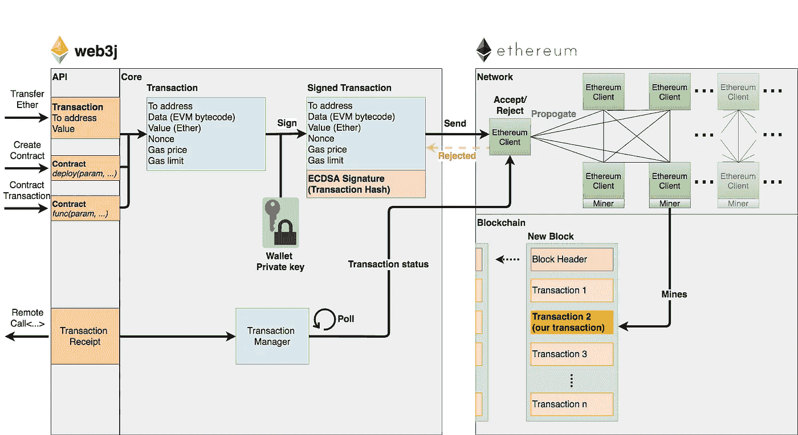
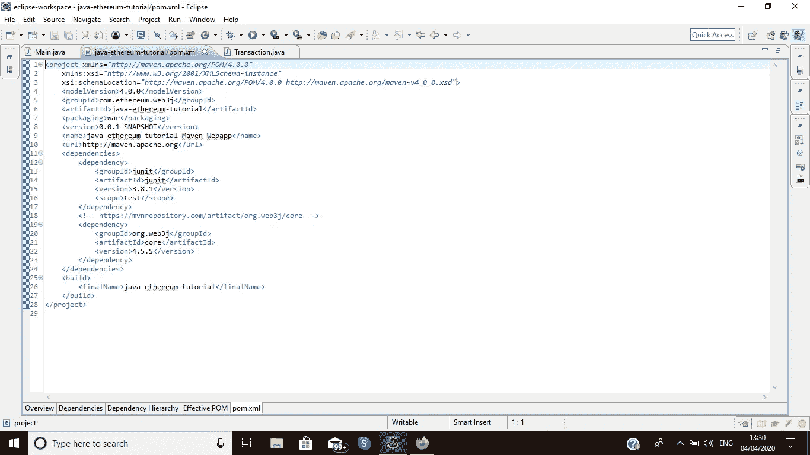
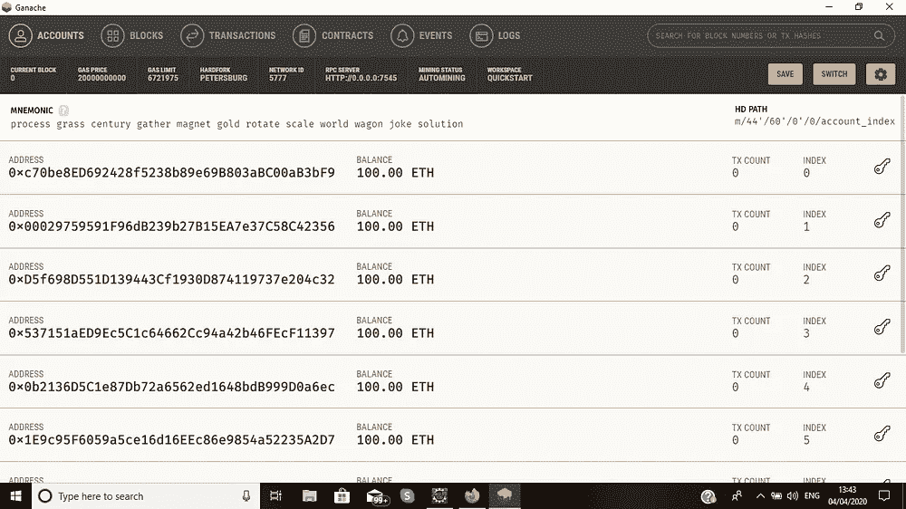
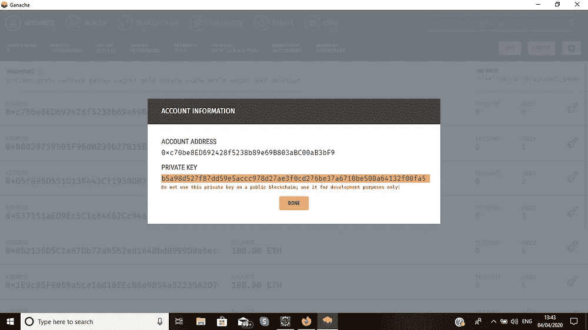
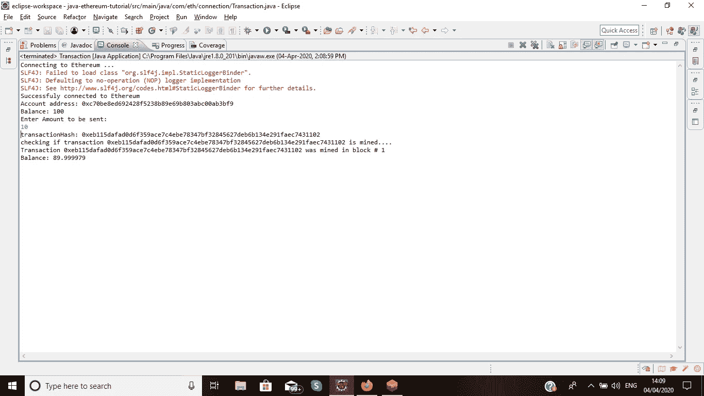
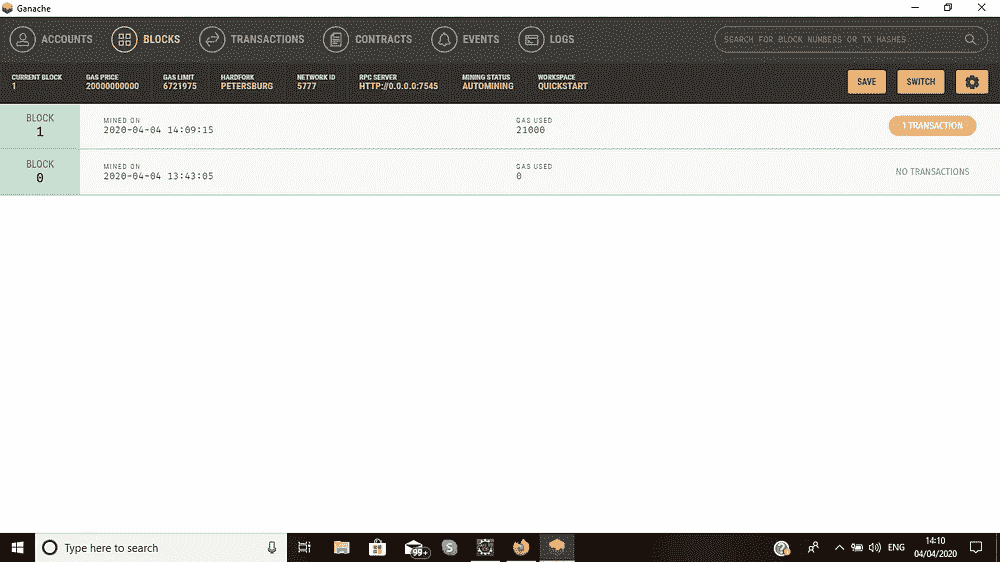
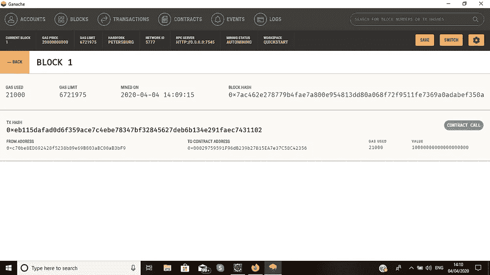

# 使用 Java 的区块链第三部分:使用 Web3j 从一个帐户到另一个帐户的以太交易

> 原文：<https://medium.datadriveninvestor.com/blockchain-using-java-part-iii-transaction-of-ethers-from-one-account-to-another-using-web3j-861c39e7a5e1?source=collection_archive---------3----------------------->


google.com

到目前为止，我们已经了解了如何创建帐户以及如何使用 web3j 库连接到以太坊的测试网络。如果你是第一次阅读这篇文章，我建议你阅读下面两篇文章来理解以太坊的基本交互。

1.使用 Ganache 和 Web3j 创建本地以太坊测试网络:

[](https://medium.com/@anikettikone9/block-chain-using-java-and-ethereum-part-i-c225f33064d8) [## 使用 Java 和以太坊的区块链第一部分

### 在开始之前，首先我们需要知道什么是区块链？

medium.com](https://medium.com/@anikettikone9/block-chain-using-java-and-ethereum-part-i-c225f33064d8) 

2.使用种子阶段恢复/创建以太坊帐户:

[](https://medium.com/@anikettikone9/block-chain-using-javas-web3j-and-ethereum-part-ii-create-or-open-an-account-896cf3b5ef12) [## 使用 Java 的 Web3j 和以太坊的区块链第二部分:创建或开立帐户

### 与以太坊钱包交互需要私钥。

medium.com](https://medium.com/@anikettikone9/block-chain-using-javas-web3j-and-ethereum-part-ii-create-or-open-an-account-896cf3b5ef12) 

在这篇文章中，我们将探讨使用 web3j 库的以太网事务

以太坊区块链上的交易由以下信息组成:

*   **nonce:** 发送方完成的交易总数。
*   **gasPrice (in wei):** 发送方愿意为执行交易所需的每单位天然气支付的金额。
*   **gasLimit:** 发送方愿意为执行此交易支付的最大汽油量。
*   **收件人:**收件人账户的地址。
*   **value (in wei):** 从发送方转移到接收方的金额 wei。在创建合同的交易中，该值用作新创建的合同帐户中的起始余额。*注:* ***魏*** *指最小面额的***【ETH】**
*   ***签名:**标识交易发送方的加密签名。*
*   ***数据:**用于与智能合约通信的可选字段(包括函数名和参数的编码字符串)。*

*[](https://www.datadriveninvestor.com/2020/02/11/the-blockchain-technology-act-comes-into-force-in-illinois/) [## 区块链技术法案在伊利诺伊州生效|数据驱动投资者

### 美国伊利诺伊州将智能合同合法化，区块链技术公司一项行业研究宣布 2020 年为…

www.datadriveninvestor.com](https://www.datadriveninvestor.com/2020/02/11/the-blockchain-technology-act-comes-into-force-in-illinois/) 

向区块链发送交易有两种方式:

1.  [通过以太坊客户端](https://web3j.readthedocs.io/en/latest/transactions.html#transaction-signing-via-an-ethereum-client)进行交易签名:这包括向账户*解锁*的以太坊客户端发送未签名的交易，包括向网络提供密码和私钥。我个人不推荐这种方法，因为对你的帐户来说，大多数网络可能都不安全。
2.  **离线交易:**离线交易签名允许您在 web3j 内使用您的以太坊钱包对交易进行签名，允许您完全控制您的私人凭证。离线创建的原始事务对象可以发送到网络上的任何以太坊客户端，其中包括网络上的一组**挖掘器/验证器**，它们拾取所有未完成的事务，将它们分组到下一个块中，并就有效性达成一致。一旦它们被验证，则事务被挖掘到新的块中。此时，客户可以通过交易散列来要求交易收据，以确认他/她的交易的良好执行。



[https://web3j.readthedocs.io](https://web3j.readthedocs.io)

现在让我们将一些以太从一个帐户发送到另一个帐户:

*注:私钥是与以太坊网络任何活动进行交互的必备信息。*

步骤 1:在 eclipse 中创建一个 maven 项目，并将 web3j 库包含到项目中

```
<dependency>
 <groupId>org.web3j</groupId>
 <artifactId>core</artifactId>
 <version>4.5.5</version>
 </dependency>
```

将这个依赖项添加到 pom.xml 文件中



第二步:连接到本地专用网络，即 Ganache，并提供其帐户之一的私钥。



Ganache app

用 main 函数创建一个类，并写下 web3j 连接的代码

```
*Web3j web3 = Web3j.build(new HttpService(“HTTP://Ganache-RPC-Server-Address:portNumber"));*
```

然后向凭证对象提供私钥，凭证对象将私钥解密成对网络至关重要的凭证。

```
// Add a private key here
String privetKey= “b5a98d527f87dd59e5accc978d27ae3f0cd276be37a6710be500a64132f00fa5”; 
 // Decrypt private key into Credential object
 Credentials credentials = Credentials.create(privetKey);
 System.out.println(“Account address: “ + credentials.getAddress());
```

第三步:获取你的账户随机数:

```
// Get the latest nonce of current account
 EthGetTransactionCount ethGetTransactionCount = web3
 .ethGetTransactionCount(credentials.getAddress(), DefaultBlockParameterName.LATEST).send();
 BigInteger nonce = ethGetTransactionCount.getTransactionCount();
```

第四步:提供收件人地址，汽油价格，汽油限额和价值的以太网的发送到该帐户

```
// Recipient address
 String recipientAddress = “0x00029759591F96dB239b27B15EA7e37C58C42356”;
 // Value to transfer (in wei)
 System.out.println(“Enter Amount to be sent:”);
 String amountToBeSent=br.readLine();
 BigInteger value = Convert.toWei(amountToBeSent, Unit.ETHER).toBigInteger(); // Gas Parameter
 BigInteger gasLimit = BigInteger.valueOf(21000);
 BigInteger gasPrice = Convert.toWei(“1”, Unit.GWEI).toBigInteger();
```

步骤 5:准备 rawTransaction 并提供 nonce、gasPrice、gasLimit、recipientAddress 和要发送的值。

```
// Prepare the rawTransaction
 RawTransaction rawTransaction = RawTransaction.createEtherTransaction(nonce, gasPrice, gasLimit,
 recipientAddress, value);
```

步骤 6:签名部分需要用于加密签名交易的`rawTransaction` 和`credentials` (keypair)。

```
// Sign the transaction
 byte[] signedMessage = TransactionEncoder.signMessage(rawTransaction, credentials);
 String hexValue = Numeric.toHexString(signedMessage);
```

第七步。通过 JSON-RPC 发送到节点

最后一步是将已签名的事务发送到节点，这样它就可以被验证并广播到网络。如果成功，该方法返回由事务哈希组成的响应。

```
// Send transaction
 EthSendTransaction ethSendTransaction = web3.ethSendRawTransaction(hexValue).send();
//get TransactionHash
String transactionHash = ethSendTransaction.getTransactionHash();
 System.out.println(“transactionHash: “ + transactionHash);
```

第八步。等待事务被挖掘。

如前所述，当签名的事务被传播到网络时，取决于许多因素(油价、网络拥塞)，可能需要一些时间来看到事务被挖掘并添加到最后一个块。

这就是为什么下面的代码包含一个简单的循环，通过调用方法`web3.ethGetTransactionReceipt(<txhash>).send()`每 3 秒验证一次交易是否被挖掘。

```
// Wait for transaction to be mined
 Optional<TransactionReceipt> transactionReceipt = null;
 do {
 System.out.println(“checking if transaction “ + transactionHash + “ is mined….”);
 EthGetTransactionReceipt ethGetTransactionReceiptResp = web3.ethGetTransactionReceipt(transactionHash)
 .send();
 transactionReceipt = ethGetTransactionReceiptResp.getTransactionReceipt();
 Thread.sleep(3000); // Wait for 3 sec
 } while (!transactionReceipt.isPresent());
```

以下是这段代码的完整版本:

此代码的输出:

```
Connecting to Ethereum ...
SLF4J: Failed to load class "org.slf4j.impl.StaticLoggerBinder".
SLF4J: Defaulting to no-operation (NOP) logger implementation
SLF4J: See http://www.slf4j.org/codes.html#StaticLoggerBinder for further details.
Successfuly connected to Ethereum
Account address: 0xc70be8ed692428f5238b89e69b803abc00ab3bf9
Balance: 100
Enter Amount to be sent:
10
transactionHash: 0xeb115dafad0d6f359ace7c4ebe78347bf32845627deb6b134e291faec7431102
checking if transaction 0xeb115dafad0d6f359ace7c4ebe78347bf32845627deb6b134e291faec7431102 is mined....
Transaction 0xeb115dafad0d6f359ace7c4ebe78347bf32845627deb6b134e291faec7431102 was mined in block # 1
Balance: 89.999979
```



如您所见，在我的 ganache 应用程序中生成了新的块，显示了该事务的信息



现在我们已经理解了用 Web3j 发送交易背后的核心原则，我可以告诉你一个秘密。Web3j 提供了一个名为“Transfer”的实用程序类，它负责处理所有事情(nonce、gas、交易收据轮询等)。)在一行代码中。

```
TransactionReceipt receipt = Transfer.sendFunds(web3, credentials, recipientAddress, BigDecimal.valueOf(1), Unit.ETHER).send();
```

*你可以在我的 github 账户上找到这篇文章的知识库*

[](https://github.com/annytikone/java-web3j-medium) [## annytikone/java-web3j-medium

### 在 GitHub 上创建一个帐户，为 annytikone/java-web3j-medium 开发做贡献。

github.com](https://github.com/annytikone/java-web3j-medium) 

感谢阅读，并随时欢迎建议。

在下一篇文章中，我们将探讨更多关于 erc20 代币和构建您自己的虚拟货币的内容。

**请随时联系我:**

电子邮件:Anikettikone9@gmail.com

领英:[https://www.linkedin.com/in/aniket-tikone-27808a138](https://www.linkedin.com/in/aniket-tikone-27808a138)

# 感谢阅读…

***恢复/创建或开户:***

[https://medium . com/@ anikettikone 9/block-chain-using-javas-web3j-and-ether eum-part-ii-create-or-open-an-account-896 cf 3 b5 ef 12](https://medium.com/@anikettikone9/block-chain-using-javas-web3j-and-ethereum-part-ii-create-or-open-an-account-896cf3b5ef12)

***使用 Java 和 Ganache 连接以太网:***

[](https://medium.com/datadriveninvestor/block-chain-using-java-and-ethereum-part-i-c225f33064d8) [## 使用 Java 和以太坊的区块链第一部分

### 在开始之前，首先我们需要知道什么是区块链？

medium.com](https://medium.com/datadriveninvestor/block-chain-using-java-and-ethereum-part-i-c225f33064d8)*