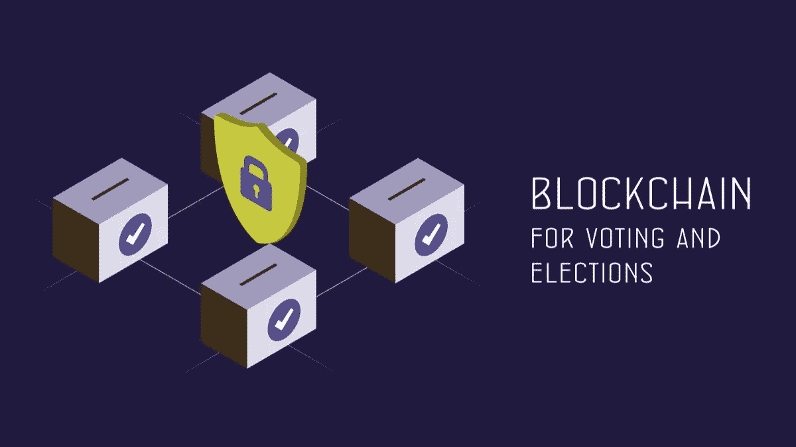

# 区块链投票和美国选举

> 原文：<https://medium.datadriveninvestor.com/blockchain-voting-and-the-american-elections-4d824e61ec66?source=collection_archive---------20----------------------->

Image via Shutterstock

在不到 70 天的时间里，这个世界上最古老的民主国家将以前所未有的方式，在非常时期面临最大的摊牌。在这个充满挑战的时期组织一次像联邦选举这样大规模的活动不仅需要非同寻常的计划，还需要创新的方式。许多选项，如缺席投票和邮寄投票，以前很少使用，现在被广泛鼓励。然而，有人对这些投票机制表示担忧，美国总统经常谴责它们充斥着欺诈。当值得信赖的亲自投票不是一个安全的选择时，还有什么其他可靠的选择呢？[区块链](https://www.datadriveninvestor.com/glossary/blockchain/)投票如何融入范式？

# 传统投票方式——纸质选票和投票机

自从 1788-1789 年举行第一次总统选举以来，美利坚合众国的人民已经选择以多种方式行使他们的投票权。

传统上，亲自投票是美国选民中最受欢迎的选择。有资格投票的人在选举日前往他们指定的投票站，根据选民所在的州，他们必须用有效的身份证证明自己的身份。随后，他们通过纸质选票或电子投票的方式进行投票。美国的电子投票涉及各种机器——从选民标记选择的触摸屏到读取纸质选票的扫描仪。

 [## 人工智能、区块链和智能合约:为什么我们都需要拥抱创新|数据驱动的投资者

### 区块链是一个抓住了我的想象力的行业，有助于为更大的利益改造社会。我开始…

www.datadriveninvestor.com](https://www.datadriveninvestor.com/2020/08/03/ai-blockchain-and-smart-contracts-why-we-all-need-to-embrace-innovation/) 

# 替代投票方式——缺席投票和邮寄投票

然而，最近，缺席投票和邮寄投票等替代投票方式越来越受欢迎。两个选项都允许公民投票，即使他们“不在”当地投票管辖区。缺席投票可以追溯到南北战争时期，那时士兵们会收到选票，这样他们即使不在自己的家乡也能投票。这项规定后来扩展到因各种原因(包括疾病、受伤或残疾)而无法行使权利的[平民。](https://www.usa.gov/absentee-voting)

在[缺席投票和邮寄投票](https://www.usa.gov/how-to-vote)中，合格的公民通过邮件收到选票。然后他们可以记录他们的投票并寄回他们的选票。在邮寄投票中，居住在某一特定管辖区的人们不管是否选择，都会收到选票。而在缺席投票的情况下，公民必须登记并申请缺席投票。由于持续的疫情恐慌，许多州鼓励他们的公民在即将到来的全国选举中远程投票。一些州现在不要求人们在选择缺席投票时提交理由。

# 有哪些弊端？

传统投票的成本高于预期收益。2016 年选举花费惊人[650 万美元](https://www.opensecrets.org/news/2017/04/election-2016-trump-fewer-donors-provided-more-of-the-cash)。为了控制开支，几个州的当局采取了关闭一些投票站等措施。相反，这种措施将导致选民的冷漠，因为他们最终要等待很长时间才能行使自己的权利。此外，邮寄选票的延迟会导致[选民权利被剥夺](https://www.washingtonpost.com/local/md-politics/usps-states-delayed-mail-in-ballots/2020/08/14/64bf3c3c-dcc7-11ea-8051-d5f887d73381_story.html)。

# 缺乏透明度和问责制

传统的投票程序没有充分接受公众监督，从而增加了操纵选举的可能性。在 2018 年的 [Curling vs Kemp](https://www.courthousenews.com/wp-content/uploads/2017/07/voting-atlanta.pdf) 案件中，佐治亚州的选民成功地证明了无纸化投票机缺乏透明度如何影响了他们的投票，危及了他们的宪法投票权。

# 蓄意或意外欺诈

在传统的投票系统中，有机会改变、丢失或错误地计票。2000 年布什对戈尔旷日持久的重新计票就是一个最好的例子，说明所谓的 537 张选票的误算是如何以一种意想不到的方式左右了整个选举。混乱的投票，穿孔和凹陷的选票最终决定了美国总统的地位。

# 隐私问题

缺席投票或邮寄投票系统给了投票人在任何地方投票的自由。但它们往往会减少隐私，增加选票被更改或丢失的可能性。最近，新泽西州的一名法官宣布一次市政选举无效，理由是有人指控邮件投票欺诈。

# 安全和系统故障

在美国，有[3141 个县及其对等的](https://www.usgs.gov/faqs/how-many-counties-are-united-states?qt-news_science_products=0#qt-news_science_products)，遍布 50 个州和哥伦比亚特区。这些州中有几个仍在使用易受黑客攻击的过时的无纸化投票机。过去，[俄罗斯黑客曾干预选民数据库](https://www.nytimes.com/2019/07/25/us/politics/russian-hacking-elections.html)，意图影响 2016 年总统选举。此外，设计不良的投票系统也令人担心选举的完整性。这项技术在今年爱荷华州党团会议上的巨大失败是这种失败的最好例子。

# 区块链投票能解决这些问题吗？

Image via Shutterstock

区块链技术有可能促进安全、准确和透明的选举，同时解决隐私问题。使用区块链的单次投票可能会将投票成本从通常的 7 美元到 25 美元降低到不到 50 美分。该技术不可改变的特性确保了选举的完整性和结果的合法性。

# 透明度和问责制

首先，区块链便于选民在投出选票后进行验证。此外，不变的存储和时间戳投票确保了选举过程的透明度。

第二，透明的制度本身增加了问责制。如果所有的行为都是不可变和透明的，那么操纵系统的机会就会大大减少。

# 欺诈防范

首先，在选举过程的各个参与节点之间分离责任[将确保不可能有共谋](https://skemman.is/bitstream/1946/31161/1/Research-Paper-BBEVS.pdf)。拥有三种不同类型的节点——管理选举的管理员、确认投票的验证者和计票的节点——可以减少可能的共谋。

其次，篡改明显和不容置疑的数据库确保故意篡改选票是不可行的。最后，由于多个分布式节点必须达成共识，才能将选票添加到[区块](https://www.datadriveninvestor.com/glossary/block/)，因此有可能减少故意欺诈的机会。

# 区块链投票隐私

区块链投票有两个明显的隐私问题。首先是选民隐私。如果选票和选民数据在同一个系统中，选票很可能会被追溯到选民。了解选民可能会导致恶意验证者试图操纵选举以支持候选人，从而拒绝他们的投票。因此，维护两个不同的区块链系统至关重要——一个用于投票，一个用于跟踪选民投票率。

第二个问题是投票的隐私。在将选票记录在区块链中之前对其进行加密是非常重要的。零知识证明有助于投票者宣布他们的投票，而不会透露任何关于选择本身的信息。

# 区块链投票的安全性

区块链结合了[密码术](https://www.datadriveninvestor.com/glossary/cryptography/)的强大功能和透明性，这使得它成为在线投票的一个方便而安全的选择。人们现在可以使用电脑或移动设备投票，安全性或隐私不会受到影响。

# 区块链投票有哪些挑战？

区块链技术确实为选举过程增加了价值。然而，使用这种技术进行选举带来了该技术特有的问题。首先要解决的问题是块终结时间。根据所用系统的不同，所需时间从几秒钟到几个小时不等。更长的确认时间增加了双重投票的可能性——投票过程允许选民多次投票，因为他们之前的投票尚未得到确认。因此，明智的做法是选择容错算法而不是资源密集型[工作验证](https://www.datadriveninvestor.com/glossary/proof-of-work/)算法来加快投票确认时间。

其次，使用区块链可能会危及美国宪法规定的基本原则——一人一票。在其他形式的投票中，一旦投票人投了票，他们的选票肯定会被计算，除非被篡改。有了区块链，在交易(投票)上又多了一层验证者共识。如果大多数验证节点串通起来拒绝投票，投票者就有失去选票的风险。因此，让公正的第三方监督投票过程是明智的。

最后，最大的担忧是将面临技术挑战的人排除在系统之外。对于只有区块链的投票系统，不了解技术或无法访问必要基础设施的选民有被排除在选举过程之外的风险。利用区块链和现有系统的混合解决方案将是有益的。选民可以选择使用传统的投票机制或区块链驱动的系统进行注册和投票。然而，不管投票机制如何，投票都必须记录在区块链上。这种混合方法将两全其美。

# 美国在用区块链投票吗？

过去，几个州已经在小范围内采用了区块链投票。在[西弗吉尼亚](https://sos.wv.gov/FormSearch/Elections/Informational/West-Virginia-Mobile-Voting-White-Paper-NASS-Submission.pdf)中，区块链被用来记录 2018 年中期选举海外军工的选票。2016 年犹他州共和党初选和 2019 年丹佛市政选举采用了区块链投票。最近，美国专利商标局披露了一份来自美国邮政的名为- [安全投票系统](https://pdfaiw.uspto.gov/.aiw?docid=20200258338)的申请，该申请考虑利用区块链技术来确保邮件投票的安全。

总之，区块链技术可能不是解决所有投票问题的灵丹妙药。但区块链投票的好处将大大减少选民的冷漠，甚至鼓励更多人投票。

*原载于 2020 年 8 月 26 日 https://www.datadriveninvestor.com***。**

***访问专家视图—** [**订阅 DDI 英特尔**](https://datadriveninvestor.com/ddi-intel)*