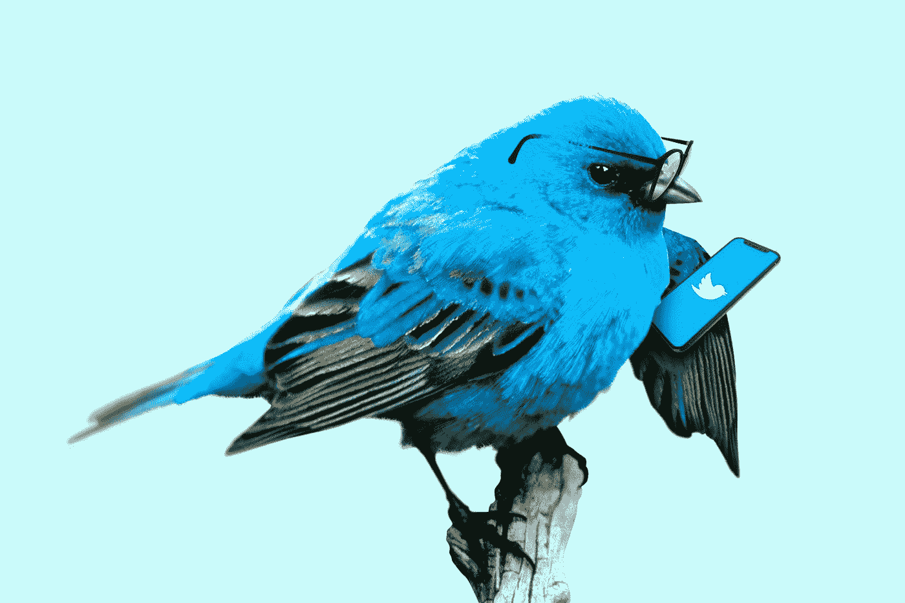

# 引爆你的推特粉丝 101

> 原文：<https://medium.datadriveninvestor.com/blowing-up-your-twitter-followers-101-ba0de2a42f05?source=collection_archive---------12----------------------->

个人品牌是这个时代的交易。

互联网证书确实很重要。如果你有几千个喜欢你想法的人，这肯定会给你一个激励。你只需要有效地利用它。

我们在谈论推特。对于那些不知道的人来说，Medium 和 Twitter 的创始人是一样的。

你的关系网就是你的净资产。

> Twitter 是发现你专业一面的地方。

## 你如何扩大你的人际网络？你是如何被发现坐在家里的？

Photo by [Morning Brew](https://unsplash.com/@morningbrew?utm_source=medium&utm_medium=referral) on [Unsplash](https://unsplash.com?utm_source=medium&utm_medium=referral)

# 提供价值。

没别的了。世界上的一切都是有来有往。如果你能给某人的生活带来价值，他们就会愿意和你保持联系。

如果你希望在企业界发展，发展业务，在网上发展或以任何方式发展，twitter 是你的不二之选。

*那么，如何在 Twitter 上成长呢？*

# 首先，为什么是 twitter？

Twitter 反映了人们的大脑。

当你浏览 Twitter 的时候，你可能会想，“哦！所以这个人是这样看待读书的。相当酷。连我都这么想。”就像外向者拥有全世界一样，内向者拥有推特。

如果你认为 twitter 是一个负面的地方，你首先要取消关注所有政治、新闻和类似的账户。你不需要追随你不感兴趣的利基市场。

如果你想提高自己，推特是最好的地方。有思想很美好的了不起的人，他们频繁地推出令人惊叹的超短形式内容。显然，你可以选择你所选择的任何利基，但更大的增长 twitter 账户主要是基于自助的。

Twitter 也可以娱乐你，但是通过音频或媒体形式的娱乐是有效的。文本内容通常是想学习的人阅读的内容。

如果你是一个读者，twitter 是为你准备的。如果你的读者阅读，twitter 是为你准备的。Twitter 是最聪明的社交媒体平台。以下是你开始成长的方法。

# 抓住你的小众受众

你必须找到并抓住对你的专业领域感兴趣的观众。如果你对技术感兴趣，并且你放了技术内容，对漫画感兴趣的人不太可能去读它。找到与你所写的东西互动的人。

找到空白，并填补它。

 [## 为什么 Twitter 不能通过收取订阅费赚钱|数据驱动投资者

### Twitter 在社交媒体公司中排名第二，在全球拥有相当可观的 3.36 亿用户…

www.datadriveninvestor.com](https://www.datadriveninvestor.com/2019/03/21/why-twitter-cant-make-money-charging-a-subscription-fee/) 

# 你会在 twitter 上找到哪些受众？

如果你想发展一个商业 twitter 账户，寻找可能成为你潜在客户的账户。如果你是一个以人工智能为中心的时事通讯或付费杂志，找到与相关推文互动的账户。

如果你想发展个人账户，找一些在类似领域工作的人。我是一名 UI/UX 设计师，也是一名产品爱好者，我在类似的领域找到了很多人。推特上有公司的大事件。你的目标应该是推出能引起他们注意的高质量内容和想法。

推特上有思考的人。有些知识分子有令人费解的想法。有首席执行官、首席执行官、商人、哲学家、投资者、风投、雇主——思想家。以技能为基础的人，他们关心你脑子里在想什么。

## 用一个主题吸引一群好观众

你可以根据你的喜好挑选一个合适的位置。我会说我选择 UI/UX 设计。你可以选择任何东西，商业、喜剧、娱乐，并且只发关于这些的微博。

请记住，我们现在关注的是增长型 twitter。所以，不要看那些拥有巨大账户的名人，他们可以发布任何其他东西。他们是生活中其他领域的名人，不需要在这里建立新的观众群。

我们的目的是提供足够的价值，这样我们就可以联系到有相似思维过程的人。这甚至可以让我们接触到一些有影响力的人，一些你专业领域的顶尖人物。把你的作品拿出来。

如果你想知道为什么你应该使用 Twitter，看看吧。

# 保持一个主题

在发微博之前问问自己——“这符合我账户的主题吗？”

你正在建立一个专业的 twitter 账户，所以你需要注意不要随意发布任何东西。

不是你所有的想法都会变成你的推文。只有你最好的 1%的想法会在推特上发布。不要推出任何你以后会后悔的东西。你要让人们看到它，你不想表现出任何负面的东西。

例如，如果你喜欢园艺，你可以把你的技巧和有用的信息公之于众。

## 与 Instagram 的比较

Instagram 是事物的外观、美学、食物和美丽。

推特是心灵，是思想的投射，是大脑的反映。

## 字迹工整。

每条推文都有类似的转发选项。喜欢多，评论多，就意味着印象多。更多的印象意味着你会被更多的新人所关注。这就是我们想要的。

但最棒的是转发。

这让你有机会出现在完全不同的观众的提要中。

比方说，我有一千个追随者，约翰也有一千个追随者。如果他转发了我的推文，我的推文就会被他的粉丝看到。这是增加你的受众的一种即时方式。

Photo by [Marten Bjork](https://unsplash.com/@martenbjork?utm_source=medium&utm_medium=referral) on [Unsplash](https://unsplash.com?utm_source=medium&utm_medium=referral)

# 写可转发的推文。

你的第一句台词要强势。应该会让读者着迷。你只有 280 个字符，明智地使用它们。

通过你的开头几句话吸引注意力。

您可以使用项目符号、连字符和数字。使用表情符号作为子弹也是非常吸引人的事情。

不要使用段落。你不是在写长篇大论的内容。段落很无聊。至少对 twitter 来说是这样。使用段落没有这么大的账户。只有像保罗·格拉厄姆这样的人使用段落。他使用名气推特。人们追随他，因为他是保罗·格拉厄姆。不是因为他的微博。从零开始培养一个推特粉丝，你不能这么做。

你可以从 Naval Ravikant 这样的人那里获得灵感。他有一个最好的推特账户。他的微博太棒了。

你的侧写必须看起来流畅。

# 使用趋势页面

探索页面有最新的新闻，政治，技术，甚至是负面的。你可以在探索页面使用标签，让全新的读者阅读。

记住，一条推文中不要超过 2 个标签。你只有 280 个字符，不要浪费在标签上。

我建议至少在趋势板块发一条推文。

不要发表负面意见。拿出积极性。忽略消极因素。

# 瞄准你的客户类型

你是经验丰富的海盗之海中的一名新水手。

用更大的账户回复推文，如果一个人看到已建立的账户的推文，他们看到你的推文，这很好，人们肯定会看的。

# 线

有些读者、作家和人们更喜欢在网上消费信息而不是娱乐。

如果你创建了一个有线程的账户，你将会拥有一个神奇的 twitter。将大量信息压缩在非常小的 twitter 线程中。一篇 2000 字的文章大约需要 18-20 条推文。价值集中。

这需要大量的数据、照片和研究。但是如果写一个线程需要 5-6 个小时，这是值得的。

# 如果你筋疲力尽

找到你账户上转发次数最多的推文。

大多数转发的推文是某人澄清的想法。如果有人说——“我也是这样想的。”

他们会转发。看别人的推特，试着引用别人的话来转发。

# 使用分析和数字。

如果你发现一些推文爆了，写类似的推文。

Photo by [Fabian Blank](https://unsplash.com/@blankerwahnsinn?utm_source=medium&utm_medium=referral) on [Unsplash](https://unsplash.com?utm_source=medium&utm_medium=referral)

# 把 twitter 当成银行。

你总是可以把人们从这里推到那里。

你可以在那里测试你的想法。如果人们喜欢某种类型的内容，你实际上可以用它来写一些大的东西。

**进入专家视角—** [**订阅 DDI 英特尔**](https://datadriveninvestor.com/ddi-intel)