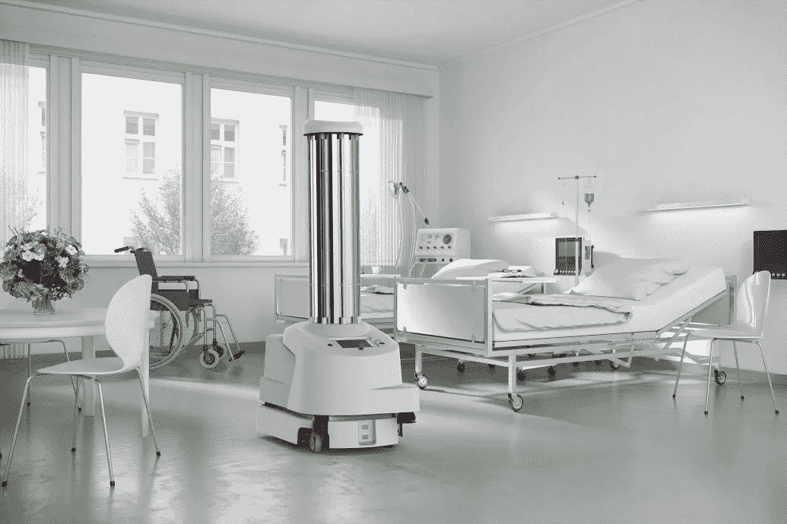
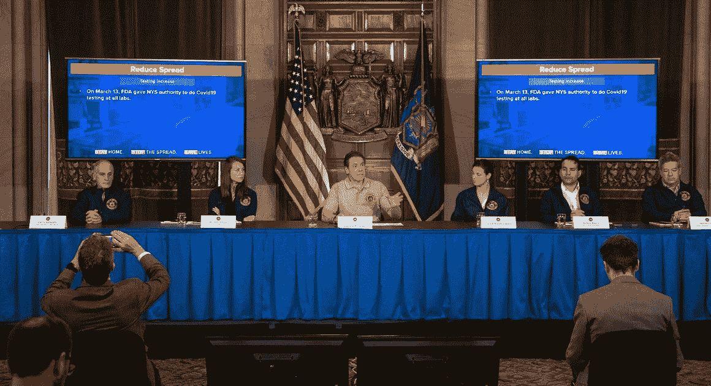
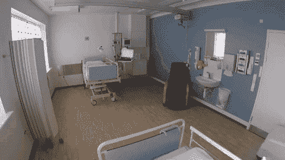
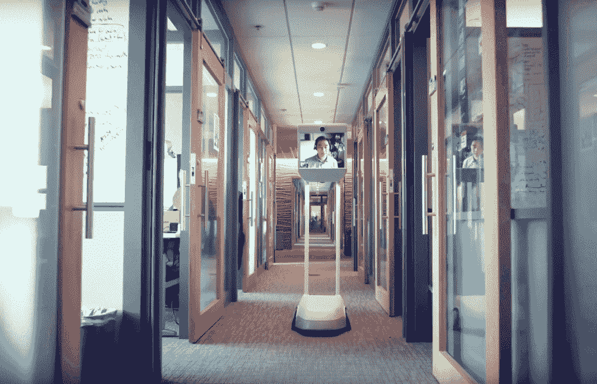
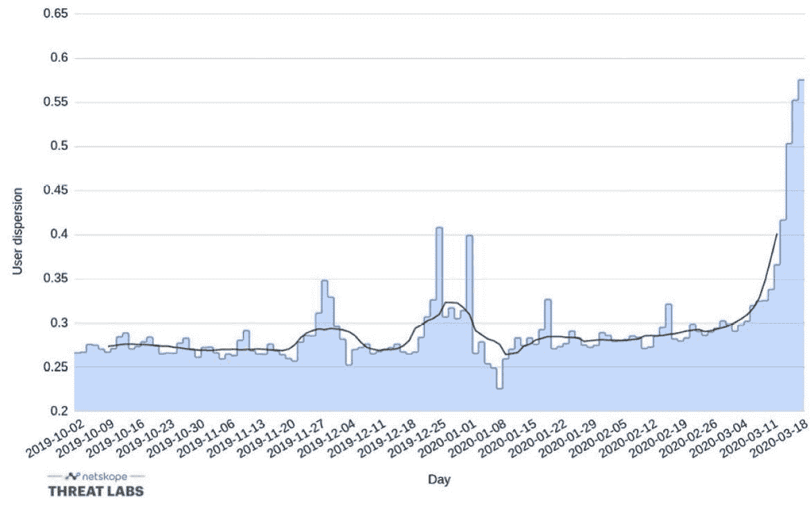
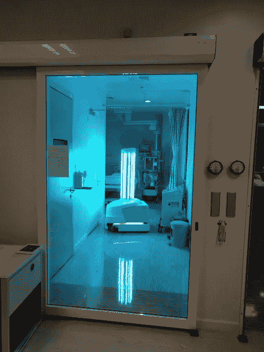
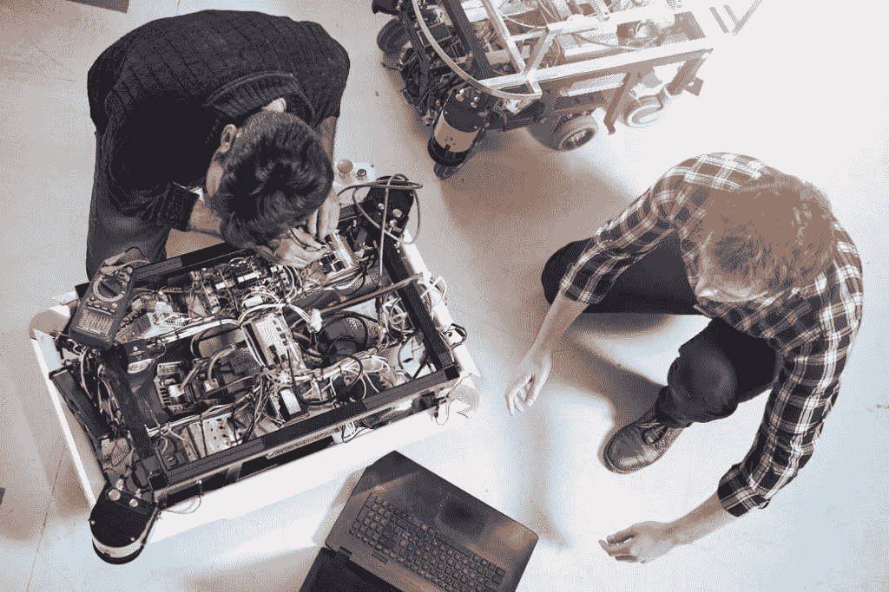

# 蓝海机器人公司在对抗新冠肺炎方面一马当先

> 原文：<https://medium.datadriveninvestor.com/blue-ocean-robotics-leads-the-way-in-combating-covid-19-ec8d96317ea1?source=collection_archive---------19----------------------->

来自美国新型冠状病毒热点的报道没有带来多少安慰。让我与你分享在纽约生活的现实。不夜城很安静，非常安静。我很少看到车在我的窗外行驶(但从好的方面来看，停车更方便了)。行人都很紧张，像躲避瘟疫一样相互躲避，小心翼翼地圈出自己的个人力场。在焦虑的时刻之间，也有亮点——家庭时间、个人反思和州长科莫的每日简报。

作为一个机器人爱好者，我对我们州的温斯顿·丘吉尔有一些建议——部署机器人来抵消关键工人。纽约市目前正在召集 40，000 名以前退休的医疗保健专业人员来充实其目前的医院工作人员。在其他地方，如中国和韩国，管理人员已经利用机器人进行卫生、分娩，甚至病人检查。

 [## AI 将军是否已经超过了人类的智力容量？数据驱动的投资者

### 不仅在游戏中，而且在劳动力市场上，机器都比人类聪明。在今天的许多领域，使用…

www.datadriveninvestor.com](https://www.datadriveninvestor.com/2020/02/12/has-general-ai-exceeded-the-intellectual-capacity-of-humans/) 

正如去年二月机器人报道中所描述的，蓝海机器人公司向中国运送了 2000 台 UVD 机器人 ApS，一种移动紫外线消毒平台，以对抗新冠肺炎。最近，我采访了蓝海公司的创始人兼首席执行官 [Claus Risager](https://www.blue-ocean-robotics.com/about) ，讨论他们的业务如何受到全球疫情的影响。

自 20 世纪 80 年代末以来，这位丹麦机器人专家一直处于机电创新的前沿。Risager 于 2013 年成立该公司，着手“开发为医疗保健、酒店、建筑和农业领域的特定服务应用量身定制的移动机器人。”有趣的是，我第一次见到蓝海团队是在他们与我的投资组合公司 Que Innovations 接洽自闭症治疗设备时。从那以后，我看到这家北欧初创公司在塑造全球机器人领域发挥了主导作用。用创始人的话来说，“公司是一个‘机器人风险工厂’，因为我们有一个机器人组合，每个机器人都以其独特的品牌名称销售。今天，我们的产品组合中有 UVD 机器人、光束机器人和 PTR 机器人。”Risager 还提倡“机器人企业家精神”，通过循环最佳实践和重用组件来商业化新的创新。正如首席执行官所解释的那样，“我们已经能够简化从一个想法开始，经过设计、开发和商业化，一直到扩大规模的过程，并且由于重用了成熟的组件，我们能够以比其他人更好、更快、更具成本效益的方式来完成这一过程。因此，它所花费的资金、风险和时间都大大减少了。如今，我们的机器人在全球约 50 个国家销售，我们在美洲、欧洲和亚太地区也有业务。”

去年 8 月，蓝海[从美国的合适技术公司收购了](https://www.therobotreport.com/beam-telepresence-robot-suitable-technologies-bought-blue-ocean/)网真领导者 Beam 的资产。这项改变游戏规则的交易扩大了 Risager 在远程办公室和远程医疗领域的市场份额，尤其是在当前的健康危机时期。截至[3 月 18 日](https://www.forbes.com/sites/johnkoetsier/2020/03/20/58-of-american-knowledge-workers-are-now-working-remotely/#5545a2ab3303)，58%的美国知识工作者正在利用在线视频工具和远程呈现应用来保持员工的工作效率。相比之下，病毒前，2018 年只有 5.3%的美国人在家工作。分析师预测，目前的上涨将溢出到机器人[远程呈现市场](https://www.marketsandmarkets.com/Market-Reports/telepresence-robot-market-146812674.html)，之前估计(疫情之前)到 2023 年将增长到 3 亿美元以上(基于 Covid 采用后，可能是最初预测的 10 倍)。例如，远程医疗正迅速成为对抗新型冠状病毒的第一线治疗手段，从而加速了对 Beam 产品的需求。虽然销售数字尚未披露，但研究和市场部门此前估计，到 2024 年，医疗用例将攀升至 1000 亿美元。里萨格不顾新型冠状病毒的阻碍，让他的团队专注于长期发展:“远程呈现机器人已经被证明主要解决三个主要的价值主张:1)预防感染，因为人们可以互动，但在物理距离上；2)社会包容，因为机器人以一种非常简单和容易的方式使人们能够以其他方式无法做到的方式在一起；3)气候变化，因为机器人使人们能够远距离一起工作，从而减少旅行和二氧化碳排放。”他简洁地总结道，“简而言之，远程呈现机器人改变了做生意的方式和人们互动的方式。”

由于个人防护设备越来越少，Risager 认为他的消毒机器人舰队可以成为解决方案的一部分。发明者解释道，“在过去的 6 年里，我们一直与丹麦当地医院的细菌学和病毒学专家合作，制造一种移动机器人，它可以帮助清洁人员对病房进行消毒。”他阐述了对新冠肺炎的影响，“我们在 2018 年将 UVD 机器人引入市场，并取得了 400%的年增长率。但是很明显，由于冠状病毒危机，对我们的 UVD 机器人有非常高的需求，我们目前正在尽一切努力生产和交付所有从世界各地订购的机器人。令我们自豪的是，我们的机器人已经在武汉、意大利、韩国、台湾、德国、美国和许多其他地方投入使用。”结果很有希望，因为它减少了清洁用品、材料和员工。“各种测试结果表明，在那些应用了 UVD 机器人的医院房间里，我们能够将感染人数减少 40-50%，”Risager 分享道。

UVD sterilizing the ICU

蓝海看到 UVD 的销售大幅增长，从医疗设施到游轮到交通枢纽到疗养院。2018 年， [Grand View Research](https://www.grandviewresearch.com/industry-analysis/antiseptics-and-disinfectants-market) 已经报告称，“全球防腐剂和消毒剂”的市场超过 160 亿美元，然而，这并没有考虑电晕后效应或机器的使用。Risager 观察到，“在电晕之前，我们在远程呈现和 UVD 机器人方面都经历了稳步增长。这表明，电晕或没有显着的市场潜力，并从市场拉向这类机器人。在电晕危机和应急计划之后，我相信每个人都希望有更好的工具来处理这种危机。我们还看到的另一件事是，人们很快就习惯了以不同的方式工作——更加数字化——我相信这将是一个主要的推动力，尤其是远程呈现机器人。对于 UVD 机器人，市场不再仅仅是医院，还有其他垂直市场，这意味着对这些机器人的需求很可能会继续非常显著。”

坐在美国受灾最严重的大都市，我向里萨格询问他对新常态的看法。“首先，我相信在后日冕时期，地球上的每个国家都将开始致力于建立流行病应急计划。由于 SARS 和 MERS，台湾、新加坡和韩国等国家已经对病毒爆发做出了非常快速的反应和非常详细的应急计划，因此这些国家没有病毒的指数传播。他们有固定数量的人被感染，这完全改变了情况，因此关闭社会和企业是没有必要的，”机器人高管认为。他进一步评论了他的业务是如何应对的，“未来一年似乎非常专注于进一步扩大我们的远程呈现和 UVD 机器人的销售。越来越多的解决方案提供商/分销商加入进来，越来越多的客户开始使用我们的机器人或增加他们已安装的机器人数量。”他现在最大的挑战是扩大规模，但他乐观地认为蓝海已经准备好了，“我们也搬到了一个新的更大的建筑，使我们能够在同一屋檐下每年生产数千个机器人，我们也有优秀的设施用于我们的开发和测试。”蓝海的独创性可能是这场混乱中的一线希望，它加入了越来越多的企业的行列，无私地联手打败一个看不见的敌人。