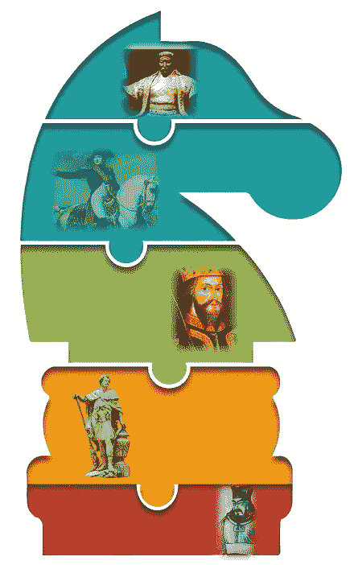
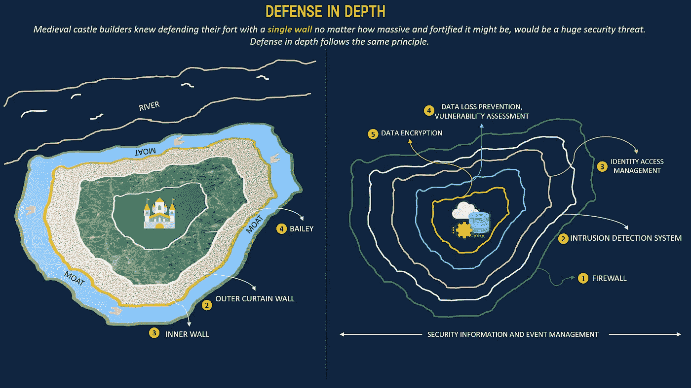
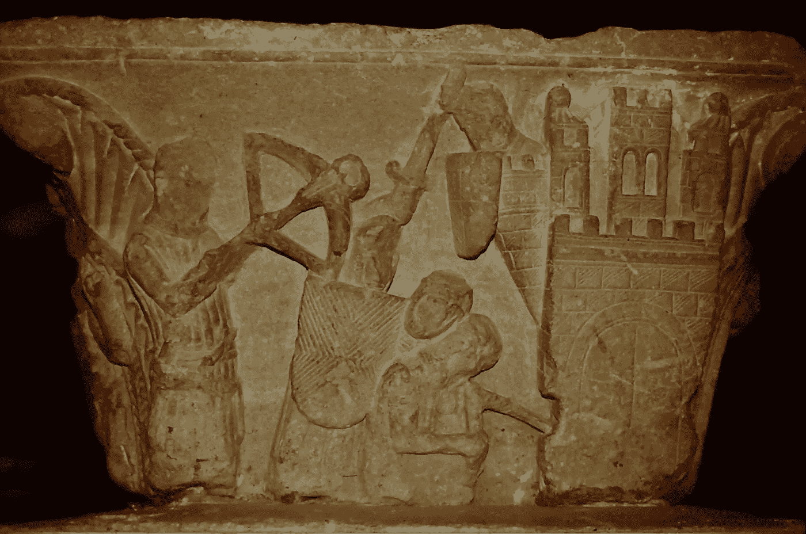
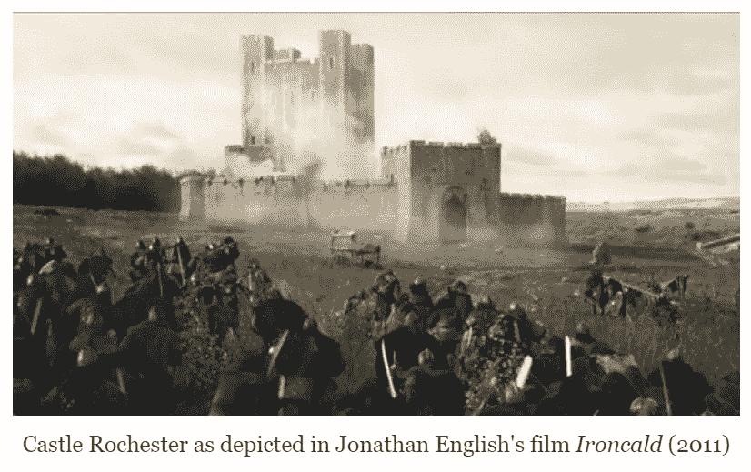
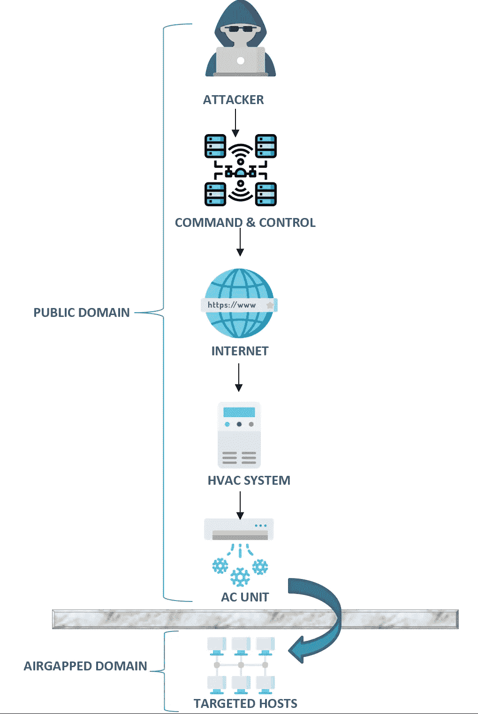
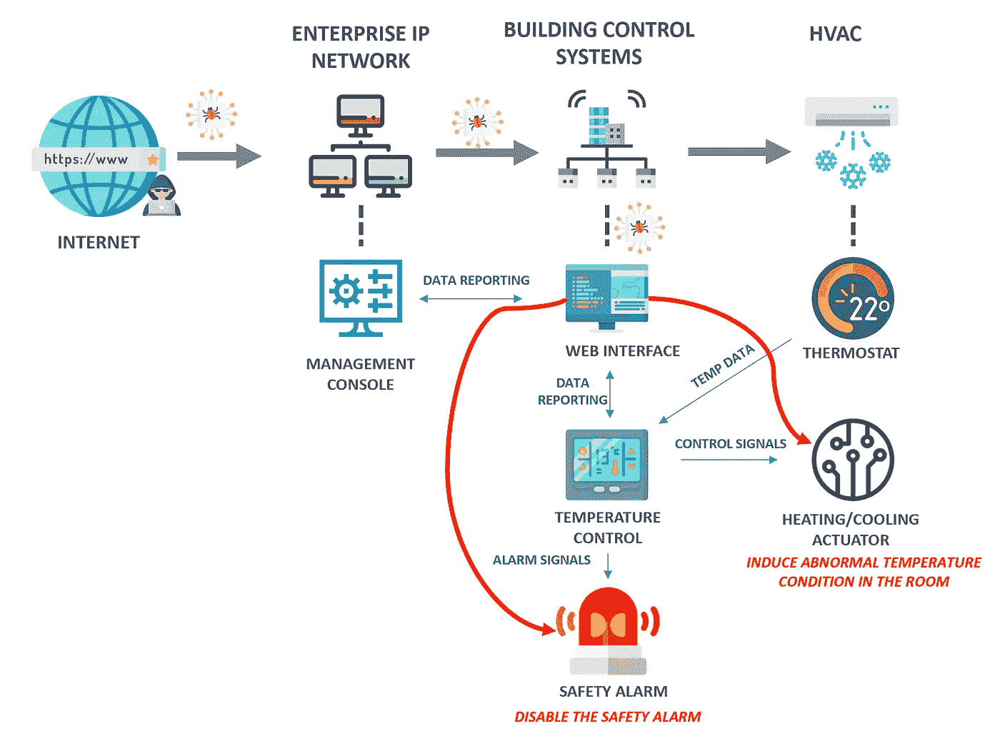
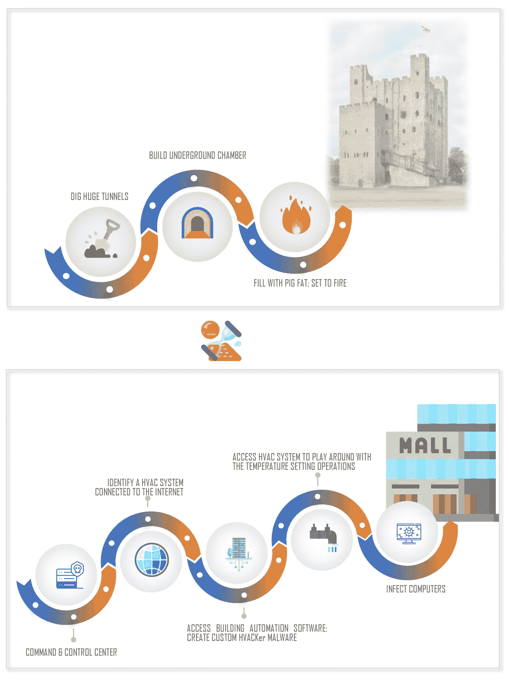
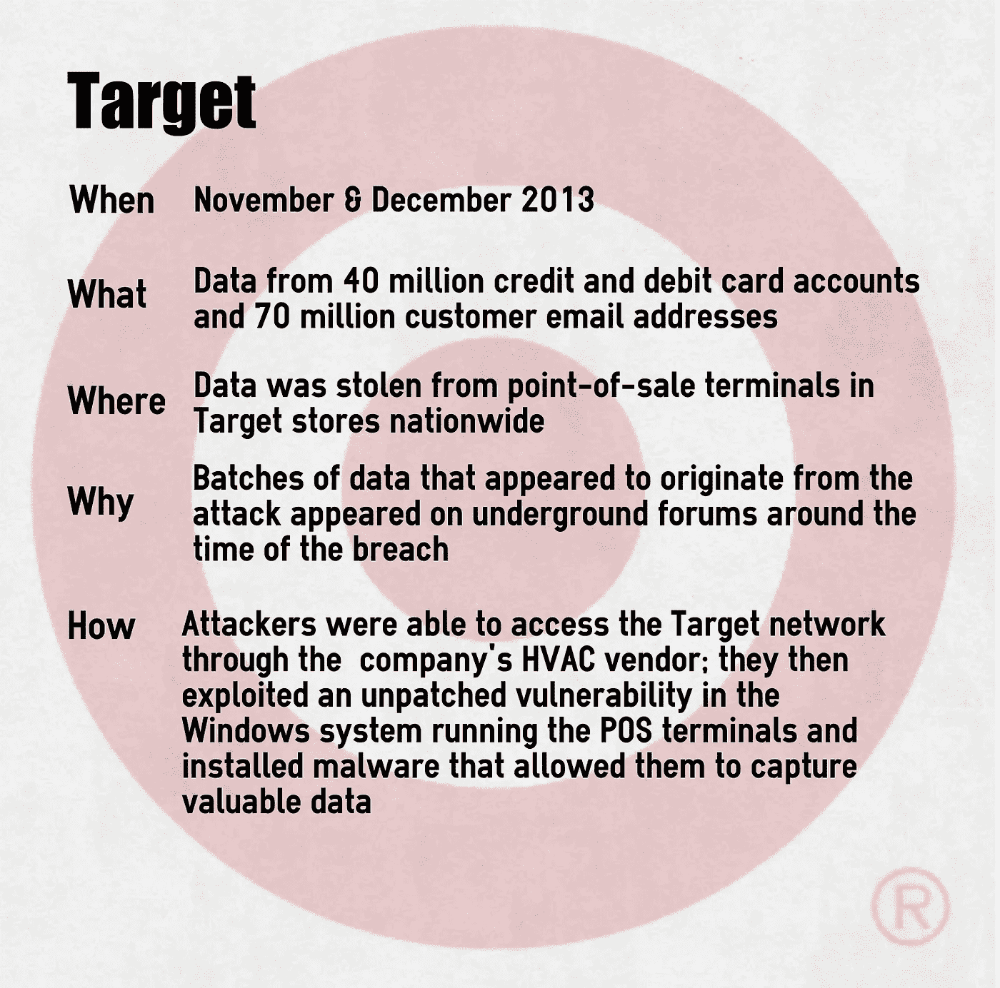

# 来自历史的蓝图

> 原文：<https://medium.datadriveninvestor.com/blueprints-from-history-c889a5be00de?source=collection_archive---------8----------------------->

# ***“如果你想了解今天，你必须研究昨天”——赛珍珠***

T4:童年时，在我翻阅电视遥控器的频道列表中，有一个是历史频道。关于城堡、陌生面孔的战争的系列和视频似乎太遥远了，人们对它们没有任何真正的兴趣。但现在，过去枯燥的同一段历史变得有趣起来，有机会向伟大的人物学习，并在当今的数字世界中模仿他们。我最近对了解网络安全的好奇心激发了我写这个系列的想法。我最没有想到的是，写这个博客系列的过程会把我变成一个历史迷，到目前为止，我已经在 YouTube 上观看了数百个历史频道视频和战争纪录片。

当我开始深入研究网络安全技术(其中第一个是“深度防御”)时，我开始将印度堡垒和中世纪城堡背后的架构与云平台和内部的应用程序和数据库中实现的安全技术层进行比较。

Fig : Defense in Depth in Information Security

这是我开始翻开历史的一页，从一个与我的学生时代相比完全不同的角度了解[拿破仑·波拿巴](https://www.history.com/topics/france/napoleon)[亚历山大](https://www.history.com/topics/ancient-history/alexander-the-great)[甘泉](https://www.biography.com/military-figure/hannibal)[成吉思汗](https://www.history.com/topics/china/genghis-khan)和[孙子](https://www.ancient.eu/Sun-Tzu/)的时候。看到采用这些伟人执行的战略作为当今网络战的指导蓝图的价值是令人着迷的。最终，我意识到我们实际上是在效仿历史所教的相同策略，只是战场不同而已。

这篇文章是我从历史中得出的一系列类比，可以帮助网络安全初学者理解以下四种策略

[系列#1:来自意料之外的攻击](https://raji-krishnamoorthy.medium.com/blueprints-from-history-c889a5be00de) —高级持续性威胁攻击

[系列#2:间接方法策略](https://raji-krishnamoorthy.medium.com/blueprints-from-history-series-2-510f3e0498fb) —利用 DDOS 攻击作为烟幕

[系列之三:迷惑敌人](https://raji-krishnamoorthy.medium.com/blueprints-from-history-series-3-c85c8f93975f) —移动目标防御

[系列之四:假装撤退](https://raji-krishnamoorthy.medium.com/blueprints-from-history-series-4-a8fa0b8cc054) —蜜罐

## **蓝图 1:来自意料之外的攻击**

“以约翰国王的名义，付钱或者烧掉”，戈弗雷在电影《罗宾汉》(2010) 中说道，他在电影中扮演了哑剧对手约翰国王的密友和仆人。历史记得约翰国王是英国王位上最不受欢迎的国王之一，这是由于他的性格和他对法国的失败。国王向他的男爵和骑士征收重税来支付他的战役，他们反对这导致了第一次男爵战争。

Image Credit : [Castle Studies Trust](http://castlestudiestrust.org/blog/2020/05/22/kings-barons-miners-and-inedible-pigs-the-great-siege-of-rochester-in-1215-now-on-video/)

男爵们在战争中迈出了第一步，占领了位于肯特郡的具有战略意义的罗切斯特城堡。国王用来赶走反叛者的武器之一是采矿。他命令矿工在城堡周围的干沟下面挖掘巨大的隧道。城堡的地基被移走，换上了木制的支柱。

> 然后国王发布了一项皇家法令，要求将 40 头肥猪带到他面前。他杀了猪，用堆积如山的猪脂肪代替了木坑支柱。当点燃时，猪油产生了 1000 华氏度的炽热地狱，足以使城堡墙壁开裂，地基烧焦，并最终导致东南塔倒塌。国王在 7 周内完成了这次进攻。

这种策略很费时间，但却很有效，在中世纪没收城堡时被广泛采用，俗称“挖空”。这种策略仅仅意味着在城堡的一部分下面挖洞或挖掘。在挖掘出的隧道里放一把火，可以推倒城堡的地基，并方便进入它的防御工事。这是攻击者从一个位置进行的持续尝试，有助于攻击者了解更多关于防御者的领域的信息，使后者对隐藏的威胁一无所知。

Image Credit : [Reel History in Film](http://reelhistoryinfilm.blogspot.com/2014/10/king-johns-england-and-film-ironclad.html)

来自隐蔽和不可预见的位置的对组织的一个这样的网络安全威胁是 HVACker。这是网络安全语言中的一种高级持续性威胁。APT 是一种有针对性的努力，在达到黑客的最终目标之前，需要经历几个阶段。

Fig: SAMPLE ATP ATTACK MODEL

在第一阶段，攻击者研究防御者的网络，以便了解如何访问它，并通过向互联网上某处的命令和控制服务器发送命令来执行攻击。服务器通过其互联网网络接口将命令转发给受感染的 HVAC 系统。攻击者还会收集组织员工的详细信息，因为最初的网络入侵通常是通过社交网络攻击实现的。攻击者通常发送带有受感染附件的电子邮件，然后由不知情的员工打开。这种技术悄悄地用攻击者的恶意软件感染员工的计算机。在下一阶段，恶意软件进一步研究网络，寻找获取更高权限资产和数据的方法。恶意软件开始在网络上传播，以加强其在网络上的立足点，并获取对关键资产的访问权。

HVAC(加热通风空调)系统用于通过加热、冷却和控制气流来控制房间的温度和湿度。该系统由 HVAC 厂商的应用程序远程监控，该应用程序可被利用来桥接空中网络与外部世界，使得远程攻击者能够向已经放置在 HVAC 厂商系统内的恶意软件发送命令。

> 人们有这样的想法，如果在维护敏感系统的网络和连接到公共网络的所有非必要基础设施之间保持一个物理间隙，那么敏感网络就不会受到远程攻击。HVAC APT 攻击实际上打破了这一信念。

典型 HVAC 温度控制系统的应用模型及其相关的楼宇自动控制网络如下所示。

Fig: HVAC TEMPERATURE CONTROL

企业 IP 网络有一个管理控制台，由设施管理员用来维护和监控建筑物的系统。楼宇控制器报告从 AHU(空气处理器单元)等物理设备收集的数据。AHU 感测建筑物的环境条件，并将数据发送到控制器。控制器具有温度控制器，该温度控制器具有用于控制建筑物的安全警报的温度控制致动器。致动器过程大多是远程的，可以被操纵来禁用火警。攻击者在连接到互联网的管理控制台界面中安装恶意软件。该恶意软件被设计为具有接收和解释来自本地空调的热信号的能力。接下来，远程温度控制致动器被破坏以禁用火警。

> 操纵管理控制台的 web 界面向致动器发送异常高温。这将激活 AHU 中的温度自动调温器，自动调温器开始向建筑控制器系统发送信号，但火警不会被激活。这些信号成为攻击者进入恒温器制造商网络的入口。

**Fig : BLUEPRINT#1 : ATTACK FROM UNFORESEEN QUARTERS**

2013 年 12 月的目标零售店攻击是利用 HVAC 恒温器制造商网络的攻击者造成的最大消费者违规事件之一。当黑客获得恒温器的密码后，他们就进入了销售点机器网络。

> 结果是 HVAC 供应商和 PoS 机都在同一个网络上。除此之外，HVAC 供应商还获得了远程访问目标 PoS 网络的管理员凭据。

因此，当 PoS 网络连接到所有其他商店时，窃取凭证是通向所有 Target 零售店的入口。黑客们显然有一个恶意软件，它将信用卡号码和有效期复制到位于他们指挥控制服务器的一个服务器上。一旦他们能够将这种恶意软件上传到一台 PoS 机上，他们就能够上传到整个网络中的所有机器上。

Image Credit : [Crypteron](https://www.crypteron.com/blog/what-the-biggest-data-breaches-in-retail-have-taught-us-about-cybersecurity/)

在[系列#2](https://raji-krishnamoorthy.medium.com/blueprints-from-history-series-2-510f3e0498fb) 阅读下一张蓝图