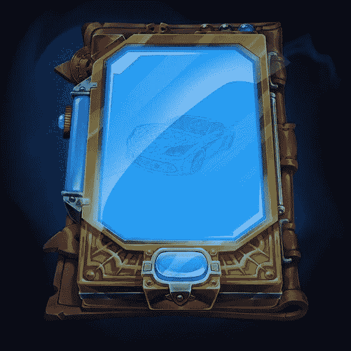
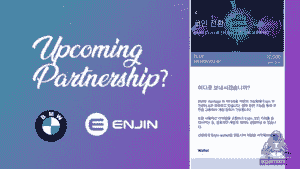

# 区块链上的宝马 Vantage 客户应用

> 原文：<https://medium.datadriveninvestor.com/bmw-vantage-customer-app-on-blockchain-d82594f147c?source=collection_archive---------4----------------------->

基于以太坊的奖励平台将首先在韩国推出。包括加密游戏硬币金恩

宝马 Vantage——汽车制造商区块链奖金平台的试运行将首先在韩国进行。然而，随后，宝马 Vantage 计划将在全球范围内推出。

# 基于区块链的宝马华帝

宝马会员计划奖励用户代币，可用于支付。顾客也可以用代币换取折扣或服务形式的奖励。对于级别特别高的会员，区块链科技的奖励计划还包括邀请他们参加公司活动。

当然，任何想要享受这些代币的人都必须从 Bayerische Motorenwerke 购买新的模型。例如，这包括新款 5 系或运动型 6 系宝马。首次购买新宝马汽车的顾客可获得高达 50 万积分。转用 5 系或 6 系的现有客户甚至可以获得高达 90 万的积分。

根据韩国新闻门户网站《韩国先驱报》的报道，这些会员积分也可以通过游戏获得。为此，金恩令牌被集成到应用程序中。客户忠诚度应用程序为用户提供了在 ENJ 应用程序中兑换积分的机会。

# 金恩硬币与宝马应用程序集成

金恩硬币是一种基于以太坊的加密货币。金恩公司于 2009 年在新加坡成立，提供不同集成产品的生态系统。可以在使用区块链技术的平台上开发应用程序。用户也可以在那里交易和货币化金恩硬币。金恩网络是一个游戏平台，拥有超过 2000 万用户。

在 2017 年成功获得近 1900 万美元的 ICO 后，金恩开始构建一套有效管理、探索、分布和整合资产的区块链产品。这些工具包括金恩平台、市场、钱包和所谓的金恩光束。已用于发送数万条区块链资产，发放超过 18.2 万个奖励。

微软还使用 Azure Heros 平台，允许最终用户分享区块链技术的好处。Azure Heros 是一种新的有趣的方式，通过包容性的行为和技术社区的有意义的支持来赚取数字收藏品。Azure Heros 的目标是 Azure 开发人员社区，他们可以通过几个类别中的独特徽章来识别。

Azure Heros 旨在激励开发人员学习、指导和构建 Azure。金恩生态系统是基于一个强大的链上基础设施，使公司能够增加收入，获得竞争优势，并开发创新。

# 基于区块链的加密游戏技术

金恩非常有趣，因为它预装在数百万部三星手机上，用户可以通过内置在钱包中的令牌进行交易。合作的结果是，金恩的股价在 2019 年 3 月创下新高，其市值也相应增长了 1 亿多美元。今年 8 月，金恩游戏《密码之战》登上了苹果商店最受欢迎策略游戏的榜首。

与宝马的合作非常有前景，因为宝马硬币可以兑换金恩硬币，这意味着加密游戏。根据来自韩国的消息，宝马 Vantage 用户可以通过奖励应用程序支付与他们的汽车相关的所有服务。还值得一提的是，所有宝马经销商和员工都应该收到了下载该应用程序的电子邮件。

虽然宝马 Vantage 的全球发布仍未确定，但用户可以在应用程序中生成推荐邀请，并使用它来邀请朋友。当然，招募成功后，他们还将获得宝马硬币。顺便说一下，这些朋友不一定要开宝马，因为韩国新闻社继续报道说，该应用程序应该对所有客户开放，不管他们开什么车。

我在每月的[时事通讯中分享了更多私密的想法，你可以在这里查看](https://mailchi.mp/bf8f8e8ed697/keep-in-touch-with-lukas)。请在评论中告诉我，并在各种社交媒体平台上加入我:

[推特](https://twitter.com/WiesfleckerL) ● [Instagram](https://www.instagram.com/lukaswiesflecker/) ● [脸书](https://www.facebook.com/lukaswiesfleckerr)●[Snapchat](https://www.snapchat.com/add/luggooo)●[LinkedIn](https://www.linkedin.com/in/lukas-wiesflecker-1b11251a5/)

无论你做什么，都要带着爱和激情去做！