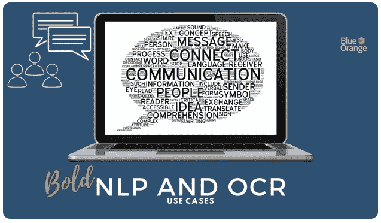

# 粗体 NLP 和 OCR:用例

> 原文：<https://medium.datadriveninvestor.com/bold-nlp-and-ocr-use-cases-cc8843743f60?source=collection_archive---------6----------------------->

上次我们已经介绍了一些[无聊机器学习用例](https://blueorange.digital/boring-machine-learning-everyone-should-get-excited-about/)，展示了算法如何利用数据并以自动化的方式解决任务。今天，我们仔细看看实现高级自动化的两个机器学习学科:自然语言处理和光学字符识别。

# 自然语言处理

**NLP** 是一个总括术语，定义了所有旨在理解和处理人类生成的文本或语音的(机器学习)任务。在所有机器学习学科中，NLP 面临着一个特别具有挑战性的方面:源于人类语言和交流的数据是高度非结构化的。在线评论、内部通信电子邮件、时事通讯和客户服务日志都是这种非结构化数据的例子。当企业需要每天处理它时，他们不仅对解决简单的任务感兴趣(例如关键词提取)，而且对理解内容的实际意义感兴趣。NLP 算法可以破译这种意义，并提供对人类语言的有价值的解释。

 [## NLP 重要的 3 个原因|数据驱动的投资者

### “每年，世界卫生组织(世卫组织)估计抑郁症影响超过 3 亿人，其中近…

www.datadriveninvestor.com](https://www.datadriveninvestor.com/2019/09/25/3-reasons-why-nlp-matters/) 

企业在各种场景中部署基于 NLP 的应用程序。以房地产中介公司为例，该公司希望[评估租户对物业管理的看法](https://medium.com/@_orcaman/gaining-insights-about-real-estate-properties-from-online-reviews-using-nlp-211c7754d1c)。在用自然语言编写的评论上训练的 NLP 模型可以帮助识别资产质量、正在进行的问题和整体投资潜力。一项涵盖人工智能和人工智能在房地产领域应用的研究还发现了另一种受欢迎的 NLP 驱动的解决方案:通过聊天机器人和虚拟助理提供 24/7 客户服务。先进的自然语言生成模型使得与人类进行自然、个性化的对话成为可能。这给代理机构一个机会来改善他们的潜在客户(或租户)的交互体验。最后但同样重要的是，NLP 工具是理想的信息提取工具。它们可以从人类生成的文本和语音内容中处理、分析和提取意义。如今，这样的应用程序就像垃圾邮件过滤器一样无处不在。

NLP 模型非常强大，因为它们能够处理高度非结构化的数据(如自然语言)，并将其转化为结构化的可分析数据。这意味着大量的文本信息可以成为商业洞察力的宝贵来源。

# 光学字符识别

**OCR** 技术随着从物理文档中捕获数据的业务需求而发展。信件、发票、打印的合同甚至图像都是需要作为日常业务运营的一部分进行管理的文档示例。然而，大量的文档将最基本的任务(如搜索)变成了极其耗时和昂贵的工作。OCR 工具创建所述文档的数字副本，并且可以将数据提取为结构化格式(即数据库)。这使得数据易于用于进一步处理，并且能够对存储的信息进行快速分类、搜索和编辑。

OCR 应用在各行各业都会遇到。银行部门的一个例子是支票的处理和加工。OCR 工具执行自动支票清算(即扫描、文本转换和签名匹配)并为所有相关方(银行、付款人和收款人)节省时间。在法律领域，一个例子是可以搜索大量文档。OCR 解决方案可以处理大量文档，并在需要的时候快速访问信息。应付账款是另一个[例子](https://softco.com/blog/power-of-ocr-software-in-ap/)，它与服务大量客户的公司相关，例如能源行业的公司。扫描发票内容并将它们作为键-值对存储到数据库中是一种众所周知的使发票数据为进一步的电子处理做好准备的方法。

当然，所有行业都有这样的例子。最重要的一点是:OCR 技术重新定义了企业操作和处理文档的方式。当数字化的文档信息在数据库中可用时，它就可以进行各种进一步的处理:搜索、编辑，甚至翻译。

# 商业利益

Gartner [认为](https://www.gartner.com/smarterwithgartner/gartner-top-10-data-analytics-trends/)自然语言处理技术具有颠覆性的潜力，因为它们支持文本分析和语音识别应用。在 NLP 的支持下，企业可以开发具有以下特点的解决方案:

*   用自动化解决方案取代耗时的手动处理
*   将非结构化数据转换为结构化、可分析的数据格式
*   将文本和语音数据转化为有价值的资产

同样，OCR 工具已经成为希望简化其文档处理工作流程的企业的首要任务。OCR 技术的使用带来了以下优势:

*   节省存储空间成本
*   使信息易于获取
*   减少与手动处理相关的成本

关键的收获很明显 **:** NLP 和 OCR 使得简化流程和提高运营效率成为可能。他们帮助企业进行数据转型，同时帮助他们降低运营成本。对于任何希望利用其数据资产的公司来说，这都将它们转化为重要的战略能力。

可以为您的业务用例开发 NLP 和 OCR 解决方案吗？如何开始使用 NLP 解决方案？哪些流程可以通过光学字符识别实现自动化？

你有任何相关的问题吗？从 [HR](https://blueorange.digital/casestudy/removing-bias-from-hiring-with-natural-language-processing/) 到[医疗保健](https://blueorange.digital/casestudy/digital-transformation-of-government-documents/)，蓝橙数码团队在基于 OCR 和 NLP 的解决方案方面拥有丰富的经验。
[联系](mailto:contact@blueorange.digital)我们很乐意为您提供答案！

**访问专家视图—** [**订阅 DDI 英特尔**](https://datadriveninvestor.com/ddi-intel)