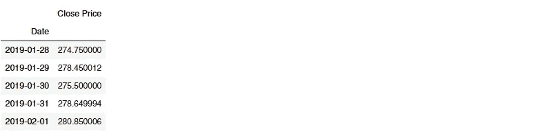
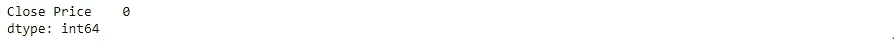
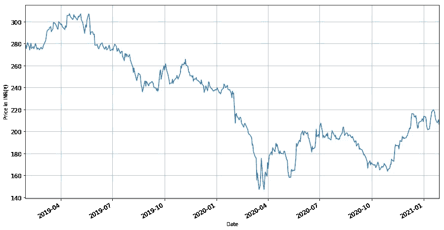
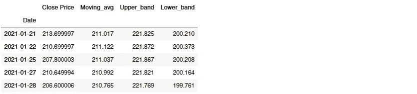
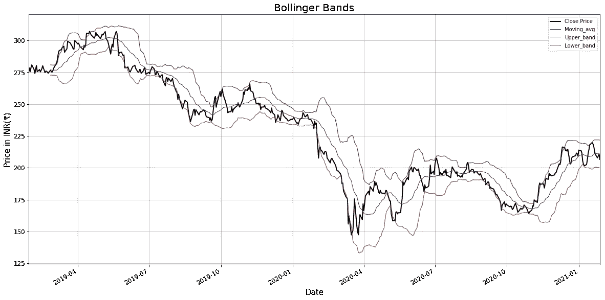

# 用于识别市场中超买和超卖情况的布林线 Python 实现

> 原文：<https://medium.datadriveninvestor.com/bollinger-bands-for-identifying-overbought-and-oversold-conditions-in-market-python-ed26380b91d3?source=collection_archive---------2----------------------->

## 在本文中，我展示了如何使用 Python 绘制和可视化布林线，并从中获得了一些见解。

# 什么是布林线

布林线是由[约翰·布林格](https://en.wikipedia.org/wiki/John_Bollinger)在 20 世纪 80 年代早期创造的一种技术分析工具，用于产生[超卖或超买](https://finance.zacks.com/difference-between-overbought-oversold-2829.html)信号。它们源于对适应性交易区间的需求，以及对波动性是动态的(而非当时普遍认为的静态)的观察。

布林线可应用于所有金融市场，包括股票、商品、外汇和期货。布林线可以在大多数时间框架内使用，从非常短的时期，到每小时，每天，每周或每月。自 30 年前推出以来，它们已成为全球使用最广泛的技术指标之一。

# 了解布林线

布林线由三条线组成:

1.  移动平均线(通常是 20 天的均线)
2.  布林带上轨
3.  下布林线

上限和下限通常是中间简单移动平均线的 2 个标准差+/-的范围。

当价格波动较高或较低时，波段分别变宽和变窄。布林线本身不会产生买入或卖出信号；它们是超买或超卖的指标。当价格接近上限或下限时，它表明反转可能即将发生。中间带成为支撑位或阻力位。

# 如何计算布林线

**第一步:** [**计算被考虑证券的简单移动平均**](https://www.investopedia.com/terms/s/sma.asp)

**例如，20 天移动平均线将计算出作为第一个数据点的前 20 天的收盘价的平均值。下一个数据点将删除最早的价格，添加第 21 天的价格并取平均值，依此类推。**

****第二步:** [**计算标准差**](https://www.investopedia.com/terms/s/standarddeviation.asp)**

**标准差衡量的是数字与平均值的差距。标准差是通过计算方差的平方根来计算的，方差本身是平均值的方差的平均值。**

**请注意，这里我们计算的是上一步中计算的收盘价(移动平均价)的移动平均值的标准差。**

****第三步:计算上频带和下频带****

**接下来，将标准偏差值乘以系数 1.5 或 2(取决于我们希望考虑多少标准偏差的价格传播)。要获得上限，将乘积加到移动平均线上。对于低频带，从移动平均值中减去乘积。**

****使用的典型值—****

*   **短期:10 天移动平均线，1.5 倍标准差的波段
    (1.5 *标准差+/- SMA)**
*   **中期:20 天移动平均线，2 个标准差的波段。**
*   **长期:50 天移动平均线，在 2.5 倍标准差处波动。**

# **用 Python 绘图和可视化**

**现在我们已经熟悉了基础知识，让我们继续学习 python 代码。如果你被这个理论弄得不知所措，相信我，使用 Python 来执行上面提到的所有步骤要容易得多。**

**为了进行演示，我选择了为期两年的 ITC 有限股票，即从 2019 年 1 月 28 日到 2021 年 1 月 28 日。你可以自由选择你自己的公司和时间段。**

**导入必要的库—**

```
# import necessary libraries 
%matplotlib inline
import numpy as np 
import pandas as pd
import matplotlib.pyplot as plt
import datetime
import warnings
warnings.filterwarnings(‘ignore’)
```

**我们将使用 [Pandas-datareader](https://pandas-datareader.readthedocs.io/en/latest/remote_data.html) API 从 [Yahoo Finance](https://in.finance.yahoo.com/) 中提取给定时期的股票价格。**

```
import pandas_datareader.data as webstart = datetime.datetime(2019, 1, 28)
end = datetime.datetime(2021, 1, 28)itc_df = web.DataReader([‘ITC.NS’], ‘yahoo’, start = start, end = end)[‘Close’]
itc_df.columns = {‘Close Price’}
itc_df.head()
```

***输出—***

****

**接下来，我们检查是否有空值—**

```
itc_df.isnull().sum()
```

***输出—***

****

**让我们继续观察给定期间收盘价的一般价格变化。**

```
itc_df[‘Close Price’].plot(figsize = (15, 8), fontsize = 12)
plt.ylabel(‘Price in INR(₹)’)
plt.grid()
plt.show()
```

***输出—***

****

**可以看出，在 4 月份左右，股票价格急剧下跌。这是由于全球金融市场在新冠肺炎疫情巅峰时期的崩溃。**

**现在，让我们构建一个函数来计算每日收盘价的移动平均值，即上限和下限。**

```
def bollinger_band(price, length = 20, num_stdev = 2):
  mean_price = price.rolling(length).mean()
  stdev = price.rolling(length).std()
  upband = mean_price + num_stdev*stdev
  dwnband = mean_price — num_stdev*stdev

  return np.round(mean_price, 3), np.round(upband, 3),  np.round(dwnband, 3)itc_df[‘Moving_avg’], itc_df[‘Upper_band’], itc_df[‘Lower_band’] = bollinger_band(itc_df[‘Close Price’])
```

**让我们看看数据框的最后几行—**

```
itc_df.tail()
```

***输出—***

****

**现在我们已经获得了所需的值，让我们绘制布林线图—**

```
itc_df[‘Close Price’].plot(c = ‘k’, figsize = (20,10), lw = 2)
itc_df[‘Moving_avg’].plot(c = ‘b’, figsize = (20, 10), lw = 1)
itc_df[‘Upper_band’].plot(c = ‘g’, figsize = (20, 10), lw = 1) 
itc_df[‘Lower_band’].plot(c = ‘r’, figsize = (20, 10), lw = 1)plt.title(‘Bollinger Bands’, fontsize = 20)
plt.ylabel(‘Price in INR(₹)’,fontsize = 15 )
plt.xlabel(‘Date’, fontsize = 15 )
plt.grid()
plt.show()
```

****

# **布林线告诉我们什么？**

**上下波段距离移动平均线两个标准差的原因是，这在收盘价周围形成了一个包络线，大部分价格行为都包含在这两个波段内。从统计上看，两个标准差包含了 95%的价格变动。因此，任何时候收盘价低于或高于布林线，都有很大的机会突破或价格反转，因此它可以被用作信号。**

**因为标准差也是衡量波动性的一个指标，当市场变得更加波动时，波动区间往往会变宽。在波动性较小的时期，波段往往会收缩。这通常被称为布林线挤压，交易者认为这是未来波动性增加和可能的交易机会的潜在迹象。**

# **用布林线交易**

**对于满足于低风险但安全的投资回报的相对低风险的个人来说，一个有效的策略是通过关注 SMA 作为进入或退出交易的信号来交易。如果收盘价从下方穿过 SMA，这是做多的迹象。更多基于均线的交易策略，请查看我之前的文章**

**[](https://towardsdatascience.com/making-a-trade-call-using-simple-moving-average-sma-crossover-strategy-python-implementation-29963326da7a) [## 使用移动平均交叉策略生成交易信号——Python 实现

### 一个 Python 程序，使用简单移动平均线(SMA)和指数移动平均线(EMA)生成买入/卖出信号…

towardsdatascience.com](https://towardsdatascience.com/making-a-trade-call-using-simple-moving-average-sma-crossover-strategy-python-implementation-29963326da7a) 

早期策略的一个变化是，当收盘价在波段内并呈趋势时，我们进入交易，当收盘价触及另一个波段时，我们退出交易。例如，如果收盘价在再次上涨之前触及了较低的波段，并且如果我们确信它将维持价格上涨，我们就买入股票，并在它触及较高的波段时退出。

在上面的图表中，你可以看到价格一旦触及上布林线就会改变方向，当触及下布林线时也会再次改变方向。

# 底线

布林线是理解资产价格行为的好方法，有助于我们更好地决定何时交易。当股价穿越布林带下轨时买入，通常有助于交易者利用超卖的条件，并在股价向中心移动平均线回升时获利。

注意布林线不是一个独立的交易系统。它们只是一个指标，旨在为交易者提供有关价格波动的信息。建议与其他两到三个不相关的指标和技术一起使用，如[移动平均线发散/收敛](https://www.investopedia.com/terms/m/macd.asp)(MACD)和[相对强弱指数](https://www.investopedia.com/terms/r/rsi.asp) (RSI)，它们提供更直接的市场信号。您可以使用不同指标的组合来创建自己的策略。** 

# **参考资料:**

*   **[投资媒体](https://www.investopedia.com/)**
*   **[雅虎财经](https://in.finance.yahoo.com/)**
*   **[QuantInsti 博客](https://blog.quantinsti.com/)**
*   **[富达学习中心](https://www.fidelity.com/learning-center/overview)**
*   **[布林线官网](https://www.bollingerbands.com/)**

**你可能也想看看我的另一篇文章——**

**[](https://towardsdatascience.com/data-analysis-visualization-in-finance-technical-analysis-of-stocks-using-python-269d535598e4) [## 金融中的数据分析和可视化—使用 Python 对股票进行技术分析

### 如何使用 Pandas、Matplotlib、Seaborn 这样的 Python 库从股市数据中获取洞察？

towardsdatascience.com](https://towardsdatascience.com/data-analysis-visualization-in-finance-technical-analysis-of-stocks-using-python-269d535598e4) 

*—————* ***免责声明*** *—本文交易策略及相关信息仅供教育之用。股票市场上的所有投资和交易都有风险。任何与购买/出售股票或其他金融工具相关的决定都应在彻底研究后做出，并在需要时寻求专业帮助。* ——*————***