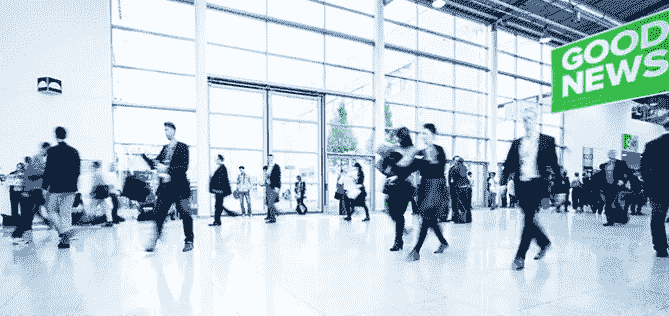
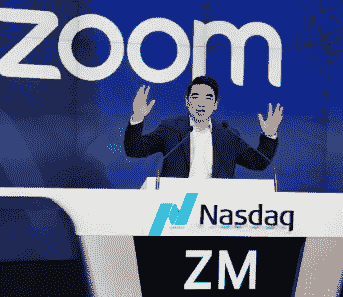

# 新常态下的无用功

> 原文：<https://medium.datadriveninvestor.com/boondoggles-in-the-new-normal-8c05f6921ae0?source=collection_archive---------12----------------------->

*了解远程优先模式转变对企业活动营销的影响*

在冠状病毒成为吞噬一切、推动衰退的全球疫情之前，企业已经[开始远程先行](https://www.techrepublic.com/article/how-remote-work-rose-by-400-in-the-past-decade/)。然而，随着新冠肺炎的经济后果继续在全国蔓延，[偏远的第一 SaaS 产品](https://techcrunch.com/2020/03/07/startups-weekly-remote-first-saas-products-boom-as-workers-stay-home/amp/)现在发现自己处于一种繁荣时期[。从长远来看，这种繁荣时期对邻近行业的影响可能是巨大的。企业正在迅速调整方向，以全新的方式开展业务，从某些内部预算中剥离资金，并将它们重新分配给远程优先的产品和平台。这种短期反应在多大程度上成为一种基本的范式转变是事情变得有趣的地方。取决于哪家企业软件公司被采用，以及它们的表现如何，可能会在各行各业引起永久的反响，事件营销和企业旅游可能会看到最深远的变化。](https://www.bloomberg.com/news/articles/2020-03-20/working-from-home-coronavirus-drives-long-lasting-change)

Exhibitions, like CES, contribute $200 billion annually to GDP

每年，参观者和参展商在展览和贸易展上花费惊人的 1160 亿美元，从 CES 到苹果全球开发者大会，每年为 GDP 贡献近 2000 亿美元。根据 [Technavio](https://www.technavio.com/) 的数据，预计到 2021 年，美国 B2B 贸易展市场将接近 170 亿美元，而全球展览组织市场预计将在未来三年增长近 83.2 亿美元。这是一个巨大的行业，每年都有大量的公司资金投入其中。

 [## 现金为王，比我们想象的更强大|数据驱动的投资者

### 2020 年 3 月 12 日，在川普总统宣布新冠肺炎进入国家紧急状态的前夕，纽约时报报道…

www.datadriveninvestor.com](https://www.datadriveninvestor.com/2020/03/26/cash-is-king-more-potent-than-we-think/) 

现在，人们只需看看被改造成新冠肺炎医院的贾维茨中心，就能发现整个活动行业未来的实时先兆。展览业研究中心预计因活动取消而造成的经济损失约为[18 亿美元](https://www.tsnn.com/index.php/news/ceir-preliminary-projections-economic-impact-covid19-us-exhibition-industry)。人们有理由怀疑该行业是否以及何时会完全复苏。

Will the Javitz Center re-emerge as a convention center and, if and when it does, in what modified capacity?

鉴于大多数公司将几乎四分之一的营销预算分配给面对面活动，营销人员跟踪投资回报与支出是有道理的。随着企业的适应和活动营销投资的减少，公司将被迫重新评估与这些费用相关的投资回报率。然而，做出这样的评估可能会很困难。

对于这些投资，企业历来接受一个相当宽松的 ROI 指标。在接下来的几个月里，企业将很难计算在没有这些事件的情况下损失了多少收入。此外，这些突然释放出来的营销费用将被迅速重新分配，许多美元将用于远程第一 SaaS 产品，帮助企业在新常态下更有效地运作。这些新投资的投资回报率将更加清晰，因为根据定义，对远程第一 SaaS 产品的投资有一个更加清晰的投资回报率计算器。

很可能企业将开始从基于 SaaS 的远程工作解决方案的强制应用中实现许多意想不到的效率(运营和收入驱动)。例如，根据 Global Workplace Analytics 的数据，一家典型的公司每年为每名半日远程办公者节省大约 11，000 美元。鉴于这些节省，商业领袖自然会重新评估诸如旅游、活动、会议、展览等以前的主要业务的价值。所有大家认为理所当然是企业生活方式一部分的要素(在两周前的古代)无疑将被重新审视。那些以前被认为对开展业务至关重要的展览和活动元素会反弹到美国企业以前的投资水平吗？或者，这些投资会在一场深刻的范式转变中，被重新导向一个更永久的全球远程操作环境吗？

These are boom times for Zoom and other remote-first software tools

已经有很多很棒的远程优先软件工具可用，而且它们现在正被大量使用。[毫无疑问，Zoom](https://techcrunch.com/2020/03/03/zoom-earnings-remote-work-and-a-terrible-but-possibly-bright-moment-for-startups/) 在虚拟工作范式方面处于领先地位，但它们只是冰山一角。 [HiveIO](https://www.hiveio.com/) 、 [Friday](https://www.friday.app/) 、 [FreeConferenceCall](https://www.freeconferencecall.com/) 、 [Brandlive](https://www.brand.live/) 、 [Kentik](https://www.kentik.com/) 、 [Bluescape](https://www.bluescape.com/) 、 [LogMeIn](http://logmein.com/) 以及其他面向远程的 SaaS 初创公司的采用率都出现了大幅上升。病毒爆发后，FreeConferenceCall 的最初数字令人瞠目结舌。在美国和英国，他们看到了+6%的增长。在意大利和中国，这种病毒已经造成了更大的社会影响，分别增加了 170%和 524%。在香港和越南，他们看到了+1576%和+3836%的大幅上涨！

还有第二层的远程工作公司也将因重新定位而感受到辅助冲击。支持这些通信和协作平台或利用该技术满足其他独特业务需求的公司将在未来几个月获得大量采用。Symbl.ai 是一种基于人工智能的语音技术，可以分析对话并将其融入上下文，是一种基于 SaaS 的技术解决方案的完美例子，该解决方案具有独特的定位，可以利用全球工作场所的长期范式转变。其他例子包括[阿科尔达](https://www.linkedin.com/company/akorda/)、 [Zendesk](https://www.zendesk.com/) 、 [MarketMuse](https://www.linkedin.com/company/marketmuse/) 、 [Lawyaw](https://www.linkedin.com/company/mystacks-inc./) 和 [Fetcher](https://www.linkedin.com/company/fetcherai/) 他们都为非常不同的业务问题提供了非常不同的解决方案，但他们都有资格成为远程第一 SaaS 产品，他们都准备在 2020 年激增。

作为一个整体，远程第一 SaaS 产业[每年代表约 1000 亿美元](https://www.techrepublic.com/article/how-remote-work-rose-by-400-in-the-past-decade/)，全球公共云收入预计在 2020 年[增长 17%](https://www.gartner.com/en/newsroom/press-releases/2019-11-13-gartner-forecasts-worldwide-public-cloud-revenue-to-grow-17-percent-in-2020)。即使美国企业在 B2B 贸易展上的年度支出只有 170 亿美元的一小部分被重新分配给这些远程通信和协作平台，你也会突然看到这些公司分别在活动和远程工作场所发生改变游戏规则的转变。这也是为什么苹果前首席执行官约翰·斯卡利认为航空公司和酒店将永远重新考虑商务旅行的收入预期。

毫无疑问，远程工作平台将在未来几个月内出现显著增长。问题是这些水平在多大程度上是可持续的。为了应对这一增长，活动营销公司将需要适应重新夺回因公司预算重新分配而导致的到场人数下降所造成的收入损失。他们将需要通过在线活动重新定义他们的内容/网络价值，提供持续的洞察力和连通性，并可能转变为他们的选民的行业 CRM 平台。

在某个时候，这场危机将会加剧，市场和经济将会迅速恢复到与以前相似的状态，但我们现在做生意的方式的改变，有真正的机会成为我们未来做生意的方式。未来的市场营销、销售和客户服务体系将会完全不同，在这个世界中，面对面和面对面的交流和通信会减少或被完全切断。远程工作可能不只是一个短期的权宜之计，而是一个长期的“一切照旧”的趋势，最终将以某种形式永久采用。一些行业，如活动和公司旅游，将永远不会完全恢复，导致企业和当地经济不可逆转的痛苦下滑。