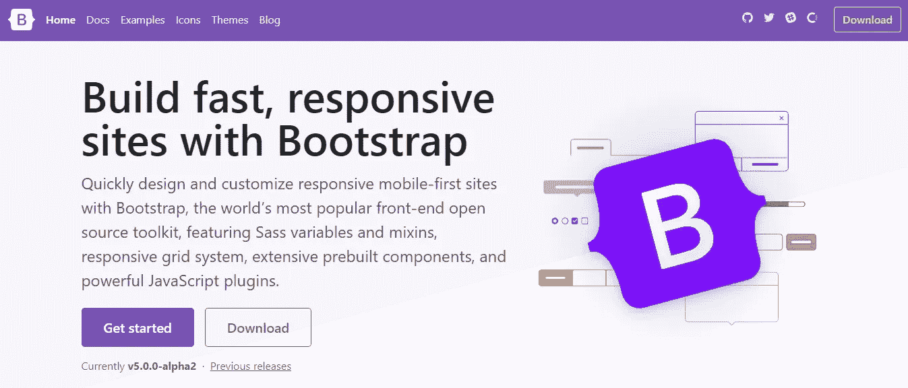
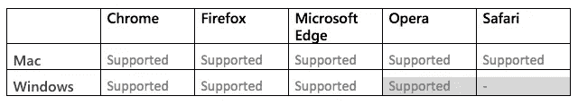
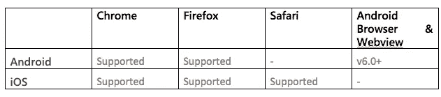
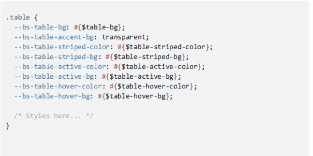
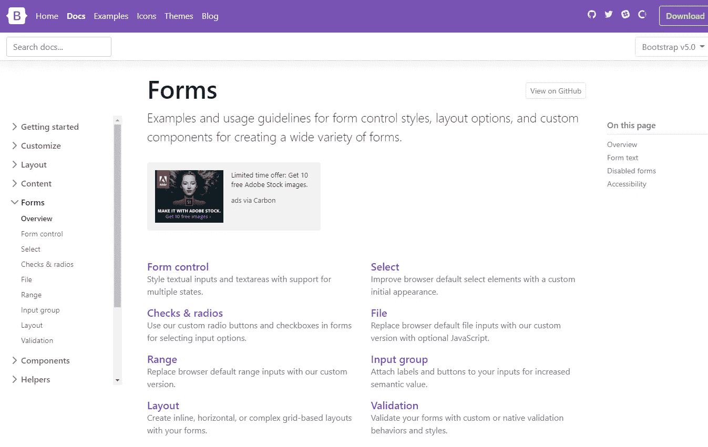
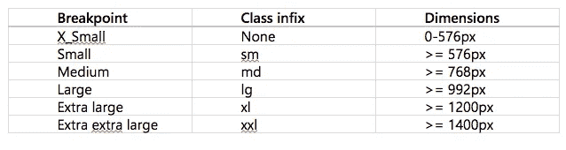
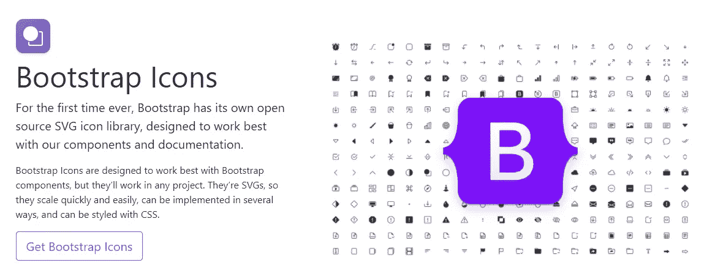
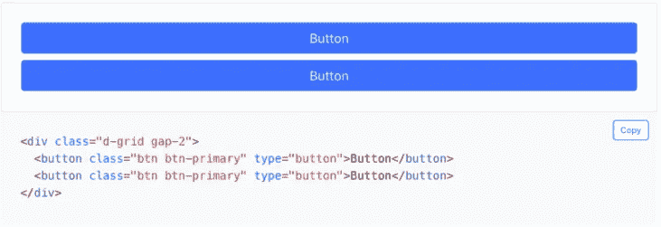

# Bootstrap 5 —您需要知道的一切

> 原文：<https://medium.datadriveninvestor.com/bootstrap-5-everything-you-need-to-know-c4c1fb512fcb?source=collection_archive---------3----------------------->

Bootstrap 发布了新的测试版 Bootstrap 5 . 0 . 0-alpha 1——让我们来看看它提供了什么！

众所周知，Bootstrap 是构建响应式网站最流行的前端框架。Bootstrap 于 2020 年 6 月 17 日发布了新的测试版 Bootstrap 5.0.0-alpha1。它引入了一些非常有用的特性。让我们看看 Bootstrap 5 提供了什么！

Bootstrap 不再依赖 jQuery，并且不再支持 Internet Explorer。他们更加专注于构建更加未来友好的工具，虽然他们还没有完全实现，但 CSS 变量、更快的 JavaScript、更少的依赖性和更好的 API 的承诺肯定是正确的。

# 新的外观和感觉

文档页面不再是全幅的，以提高可读性，使网站感觉更像内容而不是应用程序。此外，他们还升级了侧边栏，使用可扩展部分来加快导航速度。

他们想出了一个全新的标志！只是圆形正方形中的 B。受 CSS 的启发，logo 体现了一种规则集的感觉——由花括号包围的样式

# jQuery 和 JavaScript

bootstrap 经历的一个非常重大的变化是移除了 jQuery。因此，项目大小将比 v4 项目更小。提到他们对 JS for v5 做了重大改动。

另一个较大的变化是放弃了大量的按钮插件，只使用 HTML 和 CSS 来切换状态。现在切换按钮由复选框和单选按钮驱动，更加可靠。

v5 中 JavaScript 的一些其他变化和增强，集中在代码质量和弥合 v4 和 v5 之间的差距上。

# 浏览器和设备

Bootstrap 支持所有主流浏览器和平台的最新稳定版本。这也包括最新版本的遗留 Edge (EdgeHTML 布局引擎)。

Bootstrap 现在已经放弃了对 IE 的支持。所以，如果你必须在 IE 上使用 bootstrap，你将被限制在 Bootstrap 的 v4。记住使用 CSS 自定义属性和其他新特性。

# 桌面浏览器:

# 移动设备:

对于 Firefox，也支持最新的扩展支持发布(ESR)版本。

然而，Bootstrap 在 Chrome 和 Chrome for Linux 以及 Firefox for Linux 中的外观和行为应该足够好，尽管它们没有得到官方支持。

# CSS 自定义属性

有了 Bootstrap 5，人们现在可以使用定制的 CSS 了。在以前的版本中，CSS 自定义属性只包含在有限的颜色和字体根变量集中。但是在版本 5 中，它们在组件和布局选项中也是可用的。

Bootstrap 在其编译的 CSS 中包含了许多 CSS 自定义变量。当您在浏览器检查器、代码沙箱或常规原型中工作时，这些工具可以方便地访问常用值，如主题颜色、断点和主字体堆栈。

所有自定义属性都以 bs-为前缀，以避免与第三方 CSS 冲突。

以我们的为例。table 组件，我们在其中添加了一些局部变量，以使条带化、可悬停和活动的表格样式更容易:

# 形式

在 v5 中，他们已经完全定制了表单控件——检查、单选、开关、文件等等。这些新的表单控件都建立在完全语义化的标准表单控件之上——没有多余的标记，只有表单控件和标签。

窗体控件在重新启动的窗体样式上用类扩展。确保在所有输入中使用适当的类型属性(例如，email 表示电子邮件地址，number 表示数字信息)，以利用较新的输入控件，如电子邮件验证、号码选择等。

 [## 我作为软件工程师学会的 4 个关键习惯|数据驱动的投资者

### 我从事软件工程已经快 3 年了。老实说，我不认为我擅长这个(我不知道我会不会…

www.datadriveninvestor.com](https://www.datadriveninvestor.com/2020/10/12/4-key-habits-i-learned-as-a-software-engineer/) 

# 网格系统

Bootstrap 更新了网格系统。以下是他们网站上列出的变更:

*   我们添加了一个新的网格层！向陈某人问好。
*   。装订线类已被替换为。g*实用程序，很像我们的边距/填充实用程序。
*   新的网格系统取代了表单布局选项。
*   添加了垂直间距类别。
*   默认情况下，列不再是 position: relative。

[获得项目帮助](https://www.thesunflowerlab.com/contact-us/)

# 核标准情报中心

虽然默认情况下 Bootstrap 不包含图标集，但他们有自己的综合图标库，称为 Bootstrap Icons。我们可以在我们的项目中自由使用它们或任何其他图标集。

引导图标是一个不断增长的 SVG 图标库。

替代品:

下面的图标集被测试为引导图标的首选替代图标。

*   字体真棒
*   羽毛
*   八图标

第三个阿尔法是与组件，实用工具，文档，表单，JavaScript 和更多的更新负荷！

组件
这个版本中几乎没有改进的组件。

# 新手风琴

他们已经放弃了。卡为基础的全新手风琴。手风琴组件。新的 accordion 仍然使用折叠 JavaScript 插件，但有了自定义 HTML 和 CSS 的支持，它比以往任何时候都更好更容易使用。

支持齐平手风琴(添加。accordion-flush)来移除外部边框，以便更容易地放置在父元素中。

# 新块按钮

他们已经放弃了。BTN-块类。d 网格和。差距–*公用事业。这允许相同的行为和样式，但是对间距、对齐甚至响应布局选项有更大的控制。

# Java Script 语言

插件有一些更新。

*   简化下拉布局。
*   移除多余的聚合填充，因为它们已删除 IE 和传统边。
*   通过检查第一张幻灯片上的数据间隔，修复了转盘数据间隔错误。
*   移除 Manipulator.toggleClass 以简化一些代码，因为它只在一个地方使用。

# 公用事业

添加了一些新的默认实用程序，让生活变得更加轻松:

*   补充道。用于显示的三维网格:网格
*   补充道。字体大小的 fs 实用程序
*   将字体粗细实用程序重命名为。淡水
*   补充道。四舍五入-1，.四舍五入-2，和。对于新的小型、中型和大型边界半径公用事业，取整为 3
*   补充道。溢出-可见和。溢出滚动实用程序

# 形式

表单现在有了浮动标签，作为成熟的表单布局选项和新的文件输入。

# 浮动标签

浮动标签包括对文本输入、选择和文本区域的支持。

# 新文件输入

他们放弃了习俗。控件上的附加样式的窗体文件类。表单控制类。这意味着我们不再需要额外的 JavaScript 来实现我们的文件输入样式——[新的表单文件](https://v5.getbootstrap.com/docs/5.0/forms/form-control/#file-input)都是 CSS！

# 输入组圆角

使用验证时，有一个新的附加类来修复输入组上的圆角。添加。将反馈类添加到。input-group 在输入组中启用验证消息，而没有任何视觉回归。

# 更少…

*   删除了大部分表单控件的显式高度。
*   修复了禁用的复选框切换按钮。
*   添加了残疾人文档示例。表单控制。表单选择，和。表单范围元素。
*   将首选 CDN 从 BootstrapCDN 移动到 jsDelivr。
*   放弃对传统 Edge 的支持。
*   移除 CSS 中过时的前缀。
*   增加了光标:颜色输入的指针和高度
*   移除背景-夹上。BTN-关闭，使背景图像不再被裁剪。
*   改进了 Ubuntu 中的无衬线字体选择。
*   修复面包屑中不一致的空白。

Bootstrap 5 仍处于其 alpha 版本，并不完全稳定，所以我建议您等到他们发布稳定版本后，再用 v5 更新您现有的项目。但是如果你喜欢尝试新事物，你是最受欢迎的。从 v4 迁移到 v5 显然非常容易。

## 获得专家视图— [订阅 DDI 英特尔](https://datadriveninvestor.com/ddi-intel)