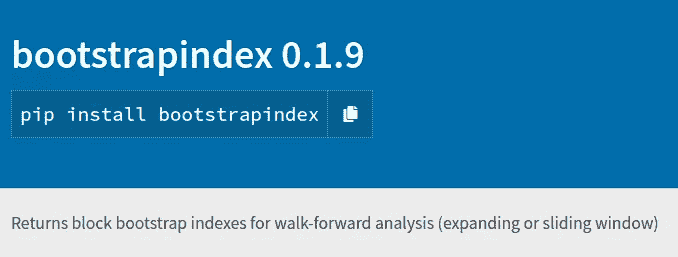
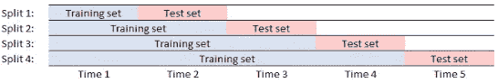

# Bootstrapindex，一个 Python 包，具有向前遍历分析和块引导功能

> 原文：<https://medium.datadriveninvestor.com/bootstrapindex-a-python-package-with-walk-forward-analysis-and-block-bootstrapping-capability-7ae71ee9f107?source=collection_archive---------4----------------------->



*“本质上，所有的模型都是错的，但有些模型是有用的。”—乔治·博克斯*

对于任何时间序列预测、量化金融或系统交易的从业者来说，他/她可能熟悉这两个概念:向前优化和块引导。

**什么是向前走分析？**

*   向前行走分析对训练集进行优化；在设置后的一段时间内进行测试，然后向前滚动/展开并重复该过程。有多个样本外期间，可以分析合并的结果。
*   向前分析减少了过度拟合的问题，并反映了经常基于历史数据优化参数并对看不见的数据进行测试的实时模型。

**什么是块引导？**

*   块引导表示时间序列的连续块，在数据块内用替换进行采样。这通常适用于模型中的数据/误差相关的情况；时间序列数据就是这种情况。
*   您可以在这些块自举数据块中优化您的参数，并对它们进行平均，以便在测试数据集上进行测试。
*   执行此分析允许您模拟结果中的随机性，同时保留数据集的序列相关性。

**问题**

但是问题来了！我找不到一个结合了上述功能的包——向前遍历分析和块引导！

特别是，独立包的引导功能通常会隐藏每个引导示例的信息，并且只提供汇总的统计信息。

因此，我着手构建一个结合了这两种功能的 python 包。

注意:在 [Sklearn](https://scikit-learn.org/stable/modules/generated/sklearn.model_selection.TimeSeriesSplit.html) 中，有一个时间序列分割函数，但我无法根据自己的喜好定制它。

*在我可以在全自动算法交易系统(* [*part1*](https://medium.com/datadriveninvestor/designing-and-building-a-fully-automated-algorithmic-trading-portfolio-management-system-6945c6c87620) *，* [*part2*](https://medium.com/datadriveninvestor/how-to-place-option-spread-e-g-straddle-through-interactive-brokers-api-a-101-tutorial-aca2a0be3737) *和*[*part 3*](https://medium.com/datadriveninvestor/deploying-a-hedging-feature-for-foreign-exposure-in-fully-automated-algorithmic-trading-system-8db31f50d3ad)*)中部署它们之前，在向前行走分析中实现块引导对于健壮性至关重要(参见*[*part 1*](https://medium.com/datadriveninvestor/developing-a-performance-monitoring-component-in-my-fully-automated-algorithmic-trading-system-88f5afae05cd)*，*

**bootstrapindex 包是关于什么的？**

该软件包的目的是生成用于前推优化的数据集索引。

为了便于向前分析，该包在每个定型集数据区块内生成块引导索引的开始和结束。有一个“窗口”参数，允许您通过滑动或扩展窗口来划分数据。参见[此处](https://stackoverflow.com/questions/62210221/walk-forward-with-validation-window-for-time-series-data-cross-validation)对滑动和扩展窗口的进一步解释。



Walk forward analysis (expanding window)

该包还可以为每个训练集数据块生成块引导索引。有了这些索引，您可以使用并行化技术来加速优化计算。

**bootstrapindex 包教程**

*您也可以访问项目页面，*[](https://pypi.org/project/bootstrapindex/)

*我将通过一个独立的例子向您展示如何使用这个包。*

*   *bootstrapindex 的安装*
*   *启动类*
*   *创建样本内和样本外索引*
*   *从数据区块生成块引导索引*
*   *从用于扩展窗口的所有训练集数据块中产生块引导索引*
*   *从滑动窗口的所有训练集数据块产生块引导索引*

*[](https://www.datadriveninvestor.com/2020/07/23/learn-data-science-in-a-flash/) [## 一瞬间学会数据科学！？数据驱动的投资者

### 在我之前的职业生涯中，我是一名训练有素的古典钢琴家。还记得那些声称你可以…

www.datadriveninvestor.com](https://www.datadriveninvestor.com/2020/07/23/learn-data-science-in-a-flash/)* 

***1。从 pypi 安装 boostrapindex】***

```
*pip install bootstrapindex*
```

***2。启动类***

```
***The constructor information is as follow,***class bootstrapindex(object):

def __init__(self, data, window, num_samples_per_period, min_sample_size, prop_block_bootstrap, 
                 days_block, starting_index=None):**“”” Constructor for bootstrap_index class

 Attributes:
 data (pandas data frame or series) Data-frame
 window (string) expanding or sliding
 num_samples_per_period (int) Number of blocks of samples to be extracted 
 min_sample_size (int) To define minimum data points to be extracted for each sample 
 prop_block_bootstrap (float) number of trials
 days_block (int) Used as parameter in expanding or sliding window block.
 starting_index (int) Starting index to create window of training and testing indexes
 expanding_windows_w_bootstrap_info (dict) Dictionary of indexes used for boostrapping

 “””*import pandas as pd
import numpy as np
import random
import io
import requests
from bootstrapindex import bootstrapindexurl=”[https://github.com/jironghuang/trend_following/raw/main/quantopian_data/futures_incl_2016.csv](https://github.com/jironghuang/trend_following/raw/main/quantopian_data/futures_incl_2016.csv)"
s=requests.get(url).content
data=pd.read_csv(io.StringIO(s.decode(‘utf-8’))) 
data[‘Date’] = pd.to_datetime(data[‘Date’], format=’%Y-%m-%d’)
data.set_index(‘Date’, inplace=True)bootstrap = bootstrapindex(data, window=’sliding’, #expanding
 num_samples_per_period=10, 
 min_sample_size=300, 
 prop_block_bootstrap=0.25, 
 days_block=252, 
 starting_index = 5
 )*
```

***3。创建样本内和样本外索引***

```
*bootstrap = bootstrap_index(data)
bootstrap.create_window_index()
Out[93]: 
[[[5, 256], [257, 508]],
 [[257, 508], [509, 760]],
 [[509, 760], [761, 1012]], 
…*
```

***4。从数据块中生成块引导索引***

```
*bootstrap.extract_block_bootstrap_periods(sample_size = 100, start_sample_index = 50, end_sample_index = 500)
Out[143]: 
{‘start_index’: array([247, 118, 78, 171, 170, 368, 343, 215, 166, 287]),
 ‘end_index’: array([372, 243, 203, 296, 295, 493, 468, 340, 291, 412])}*
```

***5。为扩展窗口从所有训练集数据块产生块引导索引***

```
*bootstrap = bootstrapindex(data, window=’expanding’, 
 num_samples_per_period=10, 
 min_sample_size=60, 
 prop_block_bootstrap=0.25, 
 days_block=252, 
 starting_index = 5
 )
bootstrap.create_dictionary_window_n_bootstrap_index()
bootstrap.expanding_windows_w_bootstrap_info 
{1: {‘in_sample_index’: [5, 256],
 ‘out_sample_index’: [257, 508],
 ‘bootstrap_index’: {‘start_index’: array([103, 39, 19, 65, 65, 164, 151, 87, 63, 123]),
 ‘end_index’: array([166, 102, 82, 128, 128, 227, 214, 150, 126, 186])}},
 2: {‘in_sample_index’: [5, 508],
 ‘out_sample_index’: [509, 760],
 ‘bootstrap_index’: {‘start_index’: array([202, 73, 33, 126, 125, 323, 298, 170, 121, 242]),
 ‘end_index’: array([328, 199, 159, 252, 251, 449, 424, 296, 247, 368])}},
 3: {‘in_sample_index’: [5, 760],
 ‘out_sample_index’: [761, 1012],
 ‘bootstrap_index’: {‘start_index’: array([399, 142, 62, 248, 246, 266, 87, 336, 237, 479]),
 ‘end_index’: array([588, 331, 251, 437, 435, 455, 276, 525, 426, 668])}},
 4: {‘in_sample_index’: [5, 1012],
 ‘out_sample_index’: [1013, 1264],
 ‘bootstrap_index’: {‘start_index’: array([399, 142, 62, 248, 246, 642, 592, 336, 237, 479]),
…*
```

***6。从滑动窗口的所有训练集数据块产生块引导索引***

```
*bootstrap = bootstrapindex(data, window=’sliding’, 
 num_samples_per_period=10, 
 min_sample_size=60, 
 prop_block_bootstrap=0.25, 
 days_block=252, 
 starting_index = 5
 )
bootstrap.create_dictionary_window_n_bootstrap_index()
bootstrap.expanding_windows_w_bootstrap_info 
{1: {‘in_sample_index’: [5, 256],
 ‘out_sample_index’: [257, 508],
 ‘bootstrap_index’: {‘start_index’: array([103, 39, 19, 65, 65, 164, 151, 87, 63, 123]),
 ‘end_index’: array([166, 102, 82, 128, 128, 227, 214, 150, 126, 186])}},
 2: {‘in_sample_index’: [257, 508],
 ‘out_sample_index’: [509, 760],
 ‘bootstrap_index’: {‘start_index’: array([355, 291, 271, 317, 317, 416, 403, 339, 315, 375]),
 ‘end_index’: array([418, 354, 334, 380, 380, 479, 466, 402, 378, 438])}},
 3: {‘in_sample_index’: [509, 760],
 ‘out_sample_index’: [761, 1012],
 ‘bootstrap_index’: {‘start_index’: array([607, 543, 523, 569, 569, 668, 655, 591, 567, 627]),
 ‘end_index’: array([670, 606, 586, 632, 632, 731, 718, 654, 630, 690])}},
 4: {‘in_sample_index’: [761, 1012],
 ‘out_sample_index’: [1013, 1264],
 ‘bootstrap_index’: {‘start_index’: array([859, 795, 775, 821, 821, 920, 907, 843, 819, 879]), 
…*
```

***待办事项中有什么？***

*   *包括进一步的参数，以允许训练和数据大小块的变化。*
*   *包括引导功能，允许用户通过替换对非连续索引进行采样。这最适合本质上独立的数据点。*

***Github 项目页面(**[https://github.com/jironghuang/bootstrap-index](https://github.com/jironghuang/bootstrap-index)**)***

*你可以访问[链接](https://github.com/jironghuang/bootstrap-index)，突出任何问题或建议任何你希望包含在一揽子计划中的功能。*

*如果你喜欢这些内容，你可以访问我以前的文章 [第一部分](https://medium.com/datadriveninvestor/designing-and-building-a-fully-automated-algorithmic-trading-portfolio-management-system-6945c6c87620)、[第二部分](https://medium.com/datadriveninvestor/how-to-place-option-spread-e-g-straddle-through-interactive-brokers-api-a-101-tutorial-aca2a0be3737)和[第三部分](https://medium.com/datadriveninvestor/deploying-a-hedging-feature-for-foreign-exposure-in-fully-automated-algorithmic-trading-system-8db31f50d3ad) *，在那里我讨论了我是如何设计、构建和部署我的非期权、期权策略和对冲的全自动算法的。**

*我也写过关于系统性能监控功能的文章，在这些文章中，我讨论了如何捕捉权益曲线、时间加权回报、下滑、汇率影响、滚动波动和提款。参见 [第一部分](https://medium.com/datadriveninvestor/developing-a-performance-monitoring-component-in-my-fully-automated-algorithmic-trading-system-88f5afae05cd)[第二部分](https://medium.com/datadriveninvestor/developing-a-performance-monitoring-component-in-my-fully-automated-algorithmic-trading-system-983368441bba)和[第三部分](https://medium.com/datadriveninvestor/performance-monitoring-component-in-my-fully-automated-algorithmic-trading-system-part-3-3d41f14005)*

***访问专家视图—** [**订阅 DDI 英特尔**](https://datadriveninvestor.com/ddi-intel)*