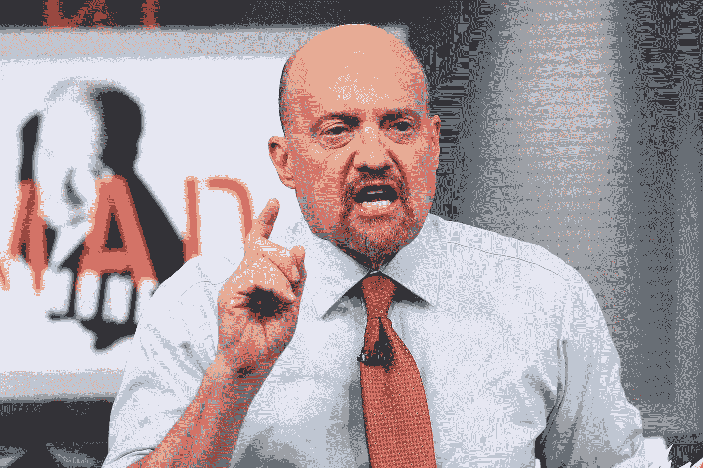

# Booyah！美国消费者新闻与商业频道“疯狂金钱”主持人吉姆·克拉姆是一个两极分化的人物，但他有帮助吗？

> 原文：<https://medium.datadriveninvestor.com/booyah-cnbc-mad-money-host-jim-cramer-is-a-polarizing-figure-but-does-he-help-155fc6f9aa32?source=collection_archive---------6----------------------->

***一个充满激情的投资专业人士，是很多投资专业人士的目标***

****

**吉姆·克拉姆是美国消费者新闻与商业频道电视投资名人，也是“疯狂金钱”节目的主持人，这是一个财经电视节目，通过评论、采访和关于多样化和统计分析的特别节目，专注于投资建议。他的节目中最受欢迎的部分是“闪电回合”，这让观众有机会打电话问 Cramer 关于特定股票的问题，以确定他们是否应该购买，持有或出售。利用一系列的音效、笑话、有趣的评论和引用，克莱姆用几个简短的句子提供了他的建议。**

> **2005 年《疯狂金钱》播出后不久，《纽约时报》的商业专栏作家约瑟夫·诺切拉曾评论说，“那些看《疯狂金钱》并听从克拉姆建议的人是傻瓜。"**

**毫不奇怪，“闪电回合”不仅是他节目中最受欢迎的部分，也是最有争议的部分之一。Cramer 的建议和观点似乎是许多对他和他的节目持批评态度的人关注的焦点。这些批评家通过细致的研究发现了一些例子；他的 Action Alerts Plus 投资组合多年来的表现一直不如标准普尔 500 指数。此外，这些人还质疑克拉姆在他的对冲基金期间成功投资回报的说法，该基金从未接受过公开审计。过去的采访、市场电话和文章都经过了审查，以找出克拉姆选股和观点的错误。**

> **“Cramer 通过 Mad Money 和 Action Alerts Plus 的受众不是大型基金经理或对冲基金，而是寻求信息帮助他们积累财富的个人投资者。”**

**那么他会帮忙吗？**

**最棘手的问题不是关于他精力充沛的个性；它与他的观众——普通投资者——有更多的关系。普通散户投资者是从观看《疯狂的钱》中受益，还是像他的批评者所强调的那样，他在伤害他们？**

** [## 使用谷歌搜索趋势预测首次申请失业救济人数|数据驱动的投资者

### 几年来，我的重点一直是使用多种替代数据来预测宏观经济统计数据…

www.datadriveninvestor.com](https://www.datadriveninvestor.com/2020/03/25/using-google-search-trends-to-predict-initial-jobless-claims/) 

作为一名散户投资者，我知道最终还是要由个人投资者决定是否遵循克莱姆的股票建议。他可能会推荐一只股票，但他不是为你买的，你必须做出决定。我完全同意他经常改变对特定股票的看法，这是那些对他的观点持批评态度的人经常强调的一点。然而，请记住，当新的信息出现时，我也会改变对股票的看法，所以他改变主意并不奇怪。这在投资界是意料之中的事。

其次，学习投资的来龙去脉可能很难，更不用说有时真的很无聊，但 Cramer 以一种有趣的方式做到了这一点。例如，他帮助观众理解用于评估和识别股票机会的技术。克拉默还花时间与上市公司的高管交谈，并通过他的“我多元化了吗”部分展示了多元化的基础。

最后，人们不得不承认，他不像沃伦·巴菲特那样冷静沉着，但很明显，正是他在片场高度紧张和喧闹的性格特征，使他在电视上取得了成功和引人注目。如果他没有现在这样的个性，疯狂金钱就不会存在。但通过高管面试和与行业专家的讨论，克莱姆提供了良好的基本投资信息，以帮助个人做出决策。

**我对克莱默的看法:**

坦率地说，我从未从我交谈过的任何财务顾问那里学到任何东西。事实上，我现在知道，我过去的许多顾问利用他们的投资知识来利用我，以便赚钱和领取他们的奖金。这也延伸到我的大家庭的许多成员。他们也通过艰难的方式学会了投资界的专业人士如何利用客户有限的投资知识。

> "金融服务业已经失去了许多消费者的信任和信赖."

今天，我讨厌那些在社交媒体或电视上对克莱姆持负面看法的专业人士。许多投资专业人士只能怪他们自己，多年来，他们一直在利用那些只希望积累足够退休收入的辛勤劳动者。具有讽刺意味的是，Jim Cramer 被赋予了如此高的标准，但投资界却没有这样的标准。通过高价、混淆文献和利用客户来管理 403(b)计划。

> "克莱默承认了自己的错误，这是我从投资顾问那里得不到的."

我了解到投资需要一些谦逊和努力，我认为克莱姆努力在他的节目中传达这一点。然而，很明显，有些人比其他人更不容易接受他的信息。我并不是说投资界的所有人都不道德、不好，事实上，大多数人很可能非常擅长帮助他们的客户。不幸的是，在我作为客户的经历中，情况并非如此。我发现，我接触过的许多投资专业人士极其傲慢、自私，带着一种优越感。更糟糕的是，他们从不承认我觉得他们在我的投资组合上犯了错误。例如，有一天，通过挖掘，我发现我的投资组合中有一只债券基金，十年来净收益 30 美元。我认为回报率约为 1.1%。我被两位顾问令人困惑的行业术语淹没了，他们解释为什么回报没有那么糟糕。但我意识到，扼杀我回报的不仅仅是费用，还有基金中的债券类型。更糟糕的是，我花了两天时间不停地打电话和争论，最终卖掉了所有东西，这样我就可以自己投资了。

> 克拉默不仅仅是选股，他还提供了其他对观众有用的信息；许多不喜欢他的表演或方法的人往往会忽略这一点。”

由于多年来在大银行和投资公司的挫折，我最终创建了自己的网站，提供资金管理方面的见解和知识。学习如何控制我的财务状况需要时间、努力和一些错误，但是今天我有一个良好的基础。对许多人来说,“疯狂的钱”可能并不完美，但与我打交道多年的基金经理不同，至少我学到了一些东西，对投资有了更好的理解。

**克莱姆有缺陷吗？**

不管你对吉姆·克莱姆的感觉如何，我们都同意他显然为我们提供了一种独特的方式，让我们在投资这个主题上受到启发和教育。然而，如果他有任何缺点，我会说他可能对投资过于热情，但这真的不好吗？我不这么认为。最后，我相信吉姆·克莱默确实有一个缺点，但不是他的投资方法，而是他对费城老鹰队的持续支持，对不起，我是绿湾包装工队的球迷。

**这是艾伦·柯比(Allan Kirby)写的一篇关于 MySmallBank.com****的博客，他为《我的成功》杂志******撰写和制作个人理财和资金管理的文章和视频。******