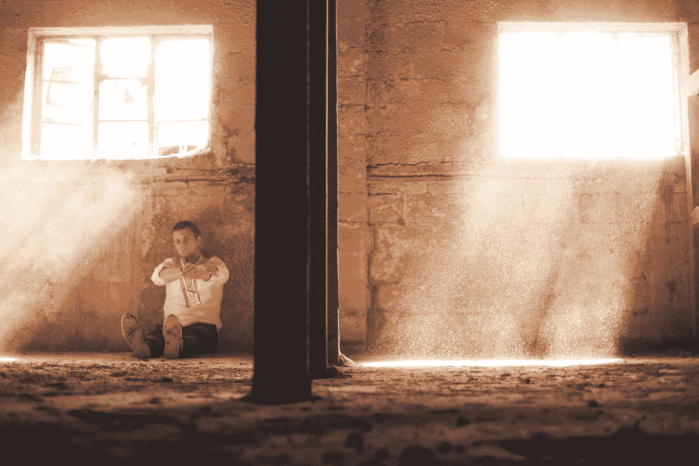
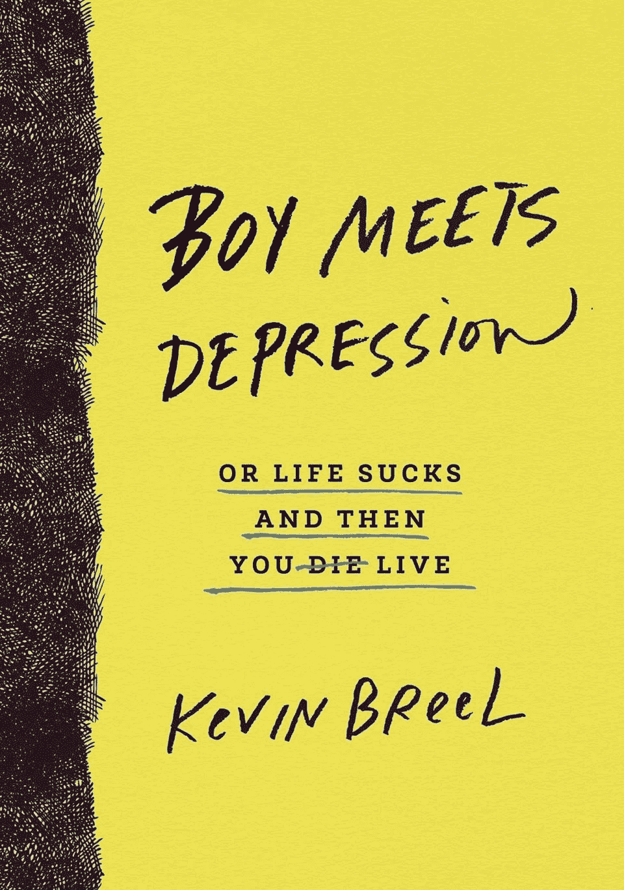

# 男孩对抗耻辱和抑郁

> 原文：<https://medium.datadriveninvestor.com/boy-battles-stigma-and-depression-4e2854eb163b?source=collection_archive---------8----------------------->

Photo by [Austin Ban](https://unsplash.com/@austinban?utm_source=medium&utm_medium=referral) on [Unsplash](https://unsplash.com?utm_source=medium&utm_medium=referral)

Ten Speed Press: Boy Meets Depression by Kevin Breel

几年前我在华尔街工作时，员工福利经理曾告诉我，美国银行 30%的员工都被开了百忧解。这可能是世界上最著名的抗抑郁药物。但它只是众多用于治疗精神疾病的类似药物中的一种。

我没有向那位经理询问细节，但我猜测超过十分之三的员工服用了抗抑郁药。当时，我认为这表明工作场所的压力影响了很大一部分人。的确，这种压力，就像在投资银行的高压工作中发现的那样，会引发这种事情。但事实上，抑郁可能没有明显的原因或起因。它甚至会折磨年轻人，比如 21 岁的喜剧演员凯文·布瑞尔。

他的书《男孩遭遇抑郁:或者生活糟透了，然后你还活着》是不言自明的:布瑞尔写了他在加拿大的童年，以及他如何成功地与自杀念头作斗争。

# 抑郁没有虚弱的迹象

在这本薄薄的书中，他成功地强调了这样一个事实，即这种痛苦不是软弱的标志，也不是可以摆脱的东西。要是可以就好了！相反，他清楚地解释了一个抑郁症患者的内心世界。“这是一个透视人生的镜头，”他写道。“乌云密布；带有消极色彩。你通过这个镜头看到的一切都变得扭曲，与现实脱节。”

你可能会问，为什么这很重要。原因有二。首先，这种被误解的疾病(这就是它，一种疾病)笼罩在羞耻之中。人们不愿与同事讨论此事，因为害怕被打上烙印或被边缘化。很难责怪他们想把这些事情保密。我曾听以前的同事用平庸的频率把抑郁的人描述为“水果圈”和“疯子”。很明显，说这种话的人要么是不明白，要么是想隐瞒什么。当你看我提到的百忧解统计数据时，应该很清楚这种疾病影响的不仅仅是少数边缘个体。如果有什么不同的话，那就是主流。

# 一个常见的误解

第二，这种疾病不一定是由事件引起的。还记得罗宾·威廉姆斯去世的时候，所有关于他的金钱问题是如何让他陷入抑郁的讨论吗？这是一个常见的误解。Breel 做了很多工作来帮助消除抑郁总是对事件的反应这一观点。“[……]当它到来时，它没有做太多的解释，”他写道。"它就这样出现了，并逗留了一会儿."

如果你想更好地了解这种疾病，那么这是一个快速但值得一读。

*这是 2015 年 9 月 16 日首次出现在 Forbes.com 上的一个故事的编辑版本。*