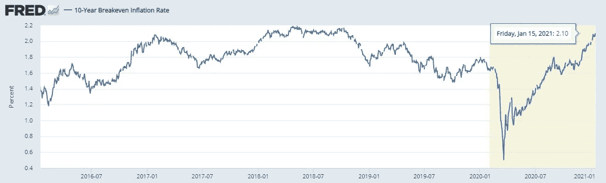
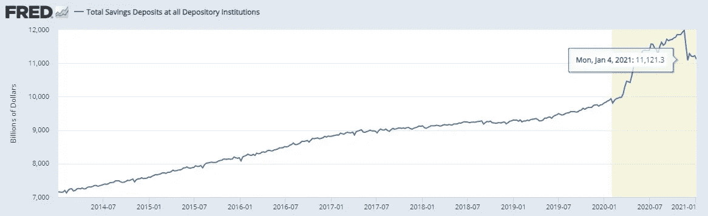
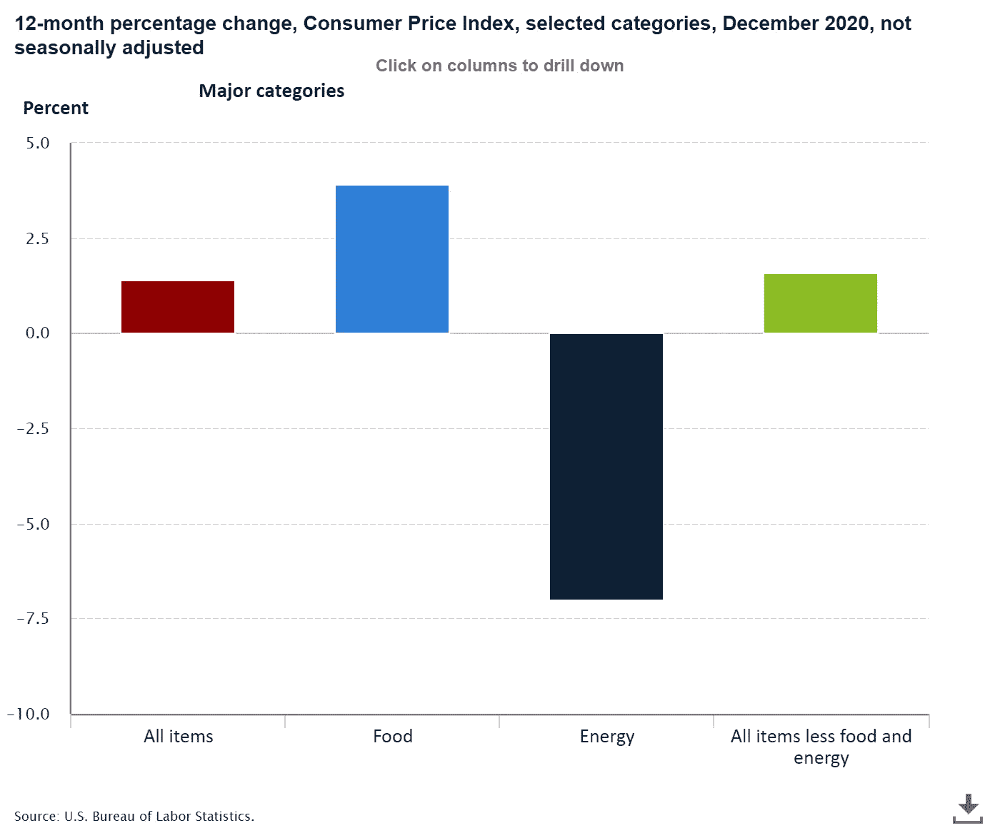

# 振作起来，通货膨胀就要来了

> 原文：<https://medium.datadriveninvestor.com/brace-yourself-inflation-is-coming-2c27d170705c?source=collection_archive---------0----------------------->

## 宏观经济前景

## 美国通胀预期正在上升。财政和货币政策意味着通胀将进一步加快步伐

Photo by [maria pagan](https://unsplash.com/@mariapaganc?utm_source=medium&utm_medium=referral) on [Unsplash](https://unsplash.com?utm_source=medium&utm_medium=referral)

投资者痴迷于通货膨胀。有充分的理由。

它与利率密切相关，对当前和未来利润的相对估值有着广泛的影响。

通胀前景的变化可能会导致行业轮换，以及华尔街在增长与价值、大宗商品与周期性以及国内股票与外国股票之间的权衡发生变化。

通胀预期正在上升。但是他们可以走得更远。

随着世界经济在未来六个月重新开放，投资者可能面临短期通胀飙升。

以下概述了通胀压力迫在眉睫的主要原因。

此外，投资者寻求优化他们的投资组合的影响得到强调。

## 美国当前的经济环境

美国经济在 2020 年快速大幅收缩后正在反弹。受新冠肺炎疫情和大范围封锁的影响，春季经济活动的下降在现代是没有预料到的。

但全球央行(尤其是美国美联储)的扩张性货币政策和持续的财政刺激提供了一些急需的缓冲。

与 2007 年至 2008 年金融危机后的上一次经济衰退相比，政策制定者的反应迅速而有力。

货币政策一直非常宽松。

美联储(Fed)的政策目标是年通胀率达到 2%。为了在政策制定方面有更大的灵活性，他们可以选择暂时超过或低于这一目标，但将在中长期内将平均通胀率定为 2%。

这种灵活性是由于促进最大限度的就业和稳定、适度的利率这两个目标同时存在。

一个经常被关注的指标是 10 年的盈亏平衡通胀率。最近，该指数自 2018 年以来首次升至 2%以上(见图表 A)。

Exhibit A: US 10-year breakeven inflation rate. Source: Federal Reserve Bank of St. Louis

这表明预期的未来通胀正在上升。然而，即使在短期内，通胀仍有充足的上升空间。

来看看为什么理解通货膨胀是关键。

## 近期通胀的主要驱动因素

通货膨胀衡量一篮子商品和服务的加权平均价格增长。

通常，当就业率远低于最高水平时，经济学家不会担心通胀。

当有很多人可供雇佣，需求逐渐增加时，供应方(生产商品和服务的公司)可以通过雇佣更多的工人和扩大生产来进行调整。

更高的供给将抵消更高的需求，这意味着对价格的影响可以忽略不计。

毕竟，价格上涨通常是因为供应商无法——至少暂时无法——在给定的价格水平上满足对其产品和服务的需求。

但现在的情况不同了。

衰退是特定行业的，许多家庭在经济上不受疫情的限制。事实上，家庭储蓄处于较高水平，远高于趋势水平(见图表 B)。

目前，美国家庭储蓄存款超过 11.4 万亿美元。

Exhibit B: US household savings (total savings deposits at all depository institutions). Source: Federal Reserve Bank of St. Louis

大量储蓄是由封锁引起的，在封锁中，人们没有了通常的消费可能性。

*观望行为*(这个术语用来描述选择呆在家里以确保疫情安全的家庭)意味着家庭推迟了很多消费。

由更大赤字资助的大规模刺激计划，如国会已经通过的和拜登政府承诺的，将进一步刺激需求。

 [## 蓝色风暴对市场意味着什么

### 民主党在佐治亚州决胜选举中获胜后，金融市场的五个重要主题

medium.com](https://medium.com/datadriveninvestor/what-a-blue-sweep-means-for-markets-518bd9655af1) 

这些因素表明，当限制取消或放松时，需求会迅速大幅飙升，从而让流动性强的家庭推迟支出。

结果将是需求大幅增加，至少是在疫情期间家庭无法获得的消费类型方面。

那么，企业难道不能雇佣更多的工人，迅速扩大生产，以应对未来一段时间的预期需求高峰吗？

答案是在某种程度上。但出于几个原因，供应的反应将是不完美的。

首先，工人(劳动力的提供者)和企业(劳动力的需求者)之间的匹配过程受到摩擦的影响。

招聘是一个既及时又昂贵的过程。公司需要发布职位空缺并评估申请人。即使有可能，完美地评估工人的能力也是昂贵的。这就有新员工不匹配的风险。

另一方面，员工花大量时间申请工作和参加面试。他们可能需要异地调动或学习新技能——无论是在工作中还是通过课程——才能有效地完成工作。

因此，就业机会的创造是逐渐发生的。匹配过程的效率因作业类型及其包含的任务而异。但总的来说，就业变化缓慢。

尽管通胀在一段时间内超过目标，但美联储已表示完全致力于保持低利率。

宽松的货币政策抑制了储蓄动机，降低了债务负担。由于货币和财政政策都是扩张性的，当限制放松、经济活动增加时，似乎没有什么能够抑制需求。

## 细节决定成败

各部门之间的差异进一步加剧了上述情况。

以旅游行业为例。人们渴望旅行。他们有储蓄这样做。但是一些旅行社和航空公司已经倒闭了。其余的则处于占领市场份额的有利位置。

但是他们需要扩大提供服务的能力。航空公司可以从破产的竞争对手那里购买飞机。

然而，他们可能还需要订购新飞机。这些都需要生产和交付。同时，最初可以访问的目的地可能有限。

需要额外的导频。飞行员是高度专业化的，再培训工人成为飞行员不可能很快完成。那些被关闭的企业解雇的人可以被雇佣，但是如上所述，这个过程需要时间。

酒店和贷款机构近期受到设施的限制。因此，旅游部门的供应商很可能面临对其服务的过度需求。因此，他们可以收取更高的价格来挑选出那些支付意愿最低的人。

餐馆有相当固定数量的座位。此外，他们可能只允许在开始时以减少的容量运行，以降低 COVID 感染复发的风险。

许多餐馆已经停业。如果外出就餐的需求很高，其余的可以收取更高的价格。至少在一段时间内。

随着时间的推移，随着企业家和有抱负的厨师看到更多供应商的市场，新的餐馆将会开业。供应会因此而调整，但不会马上调整。

某些部门的高通胀会推动整体通胀。这里值得注意的是，CPI(消费者价格指数)中的一个主要权重是食品，2020 年的通胀率为 3.9%。

总体 CPI 通胀在很大程度上被 7%的能源通缩(价格下跌)所抑制。能源价格预计将在 2021 年全年上涨，这增加了通胀论点(除了 CPI 通胀，还有其他通胀指标)。

Exhibit C: Decomposed US inflation December 2019 — December 2020\. Source: US Bureau of Labor Statistics

## 投资者当心

在众多因素中，通胀前景的变化最多只会引起耸肩和咕哝。但对投资者来说，价格如何变动很重要。

高通胀将在某个时候迫使美联储通过加息(加息)做出回应。利率对未来利润相对于当前利润的价值(成长股相对于价值股)有很大的影响。

如果美联储将利率维持在当前水平，通胀可能会在相当长一段时间内处于高位。这对资产价格有影响——特别是当通货膨胀是异质的时候。

此外，投资者积累了大量的流动资产。它们可能会被重新分配给风险资产，如下文所述。

 [## 创纪录的兼职现金可以刺激当前的牛市

### 几个因素表明牛市正处于初期阶段

medium.com](https://medium.com/datadriveninvestor/record-amounts-of-cash-on-the-sideline-can-fuel-the-current-bull-market-7a5c76374709) 

股票目前的估值很高，表明投资者认为风险资产很有吸引力(见下文)。调整可能即将到来，但预测不可避免的事情发生的时间是很棘手的。

 [## CAPE 比率表明股票市场是有吸引力的

### 坎贝尔和诺贝尔奖得主席勒发明的这一指标预示着股市的乐观前景

medium.com](https://medium.com/datadriveninvestor/the-cape-ratio-suggests-the-stock-market-is-attractive-7eb3fc22816b) 

和往常一样，对于大多数散户投资者来说，市场时间胜过市场时机。但他们的投资组合应该为 2020 年低基础上的高通胀时期做好准备。

随着美联储反对早期加息，价格可能会以西方经济体几十年来经历的更快速度飙升，标志着金融市场的新时代。

未来几年将会是“咆哮的 20 年代”、“伟大的通货再膨胀”，还是两者兼而有之，还不得而知。

 [## 市盈率捕捉到的信息比许多人想象的要多

### 作为一个估值工具，这个比率是不够的，但它是更大图景中的一个重要部分

medium.com](https://medium.com/datadriveninvestor/the-p-e-ratio-captures-more-information-than-many-think-2d266c221ae9)