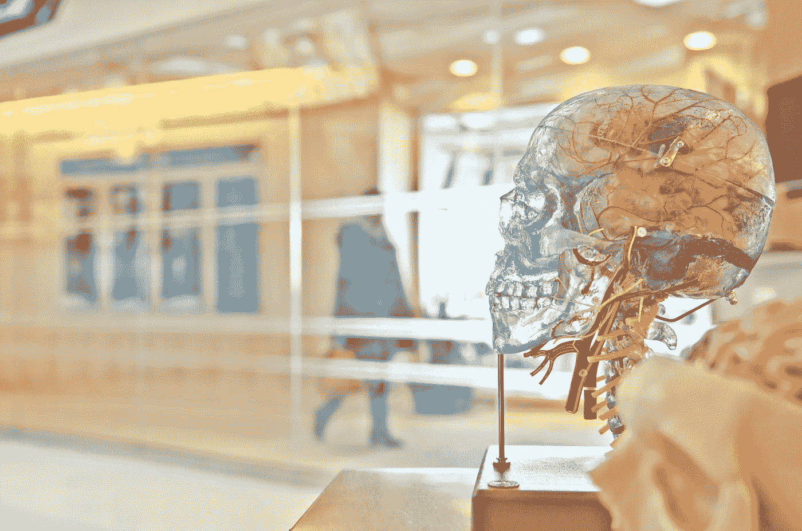

# 脑子和偏见！！

> 原文：<https://medium.datadriveninvestor.com/brain-and-bias-f6952096f001?source=collection_archive---------30----------------------->

与你对现实的感知相关的好恶。

Photo by [Jesse Orrico](https://unsplash.com/@jessedo81?utm_source=unsplash&utm_medium=referral&utm_content=creditCopyText) on [Unsplash](https://unsplash.com/collections/27919680/neurot?utm_source=unsplash&utm_medium=referral&utm_content=creditCopyText)

人脑以有趣的方式工作。如此小的质量如何控制我们所有的活动、信息处理和思维过程是令人惊讶的。我们花了几个世纪来理解和管理这个器官，然而心灵哲学仍然是一个典型的问题。

为了管理信息的泛滥，我们大脑工作的一种方式是创造处理信息的捷径。在任何给定的时刻，可用的信息都比我们的大脑所能接触到的要多。此外，我们只能处理有限的信息量。为了克服信息处理的限制，我们的大脑会创建快速指南，并根据我们的经验做出假设来做出决定。这个过程可能会导致无意识的偏见，进一步限制我们的思维过程，误导我们的决定，并影响我们的行为。偏见被定义为对某一事物、个人或群体的偏见，通常以一种被认为是不必要的方式。工作场所对这种偏见的重视导致了各种意识和培训项目。然而，同样的原则也适用于我们的个人决策，而且有这么多不同类型的无意识偏见，意识到我们的偏见以有效地管理它们是至关重要的。

当我们开始 2021 年，这里有三个潜在的无意识偏见，可能会影响你个人，要注意避免。毕竟是有新机遇的新篇章。

1.  归因偏差:

2020 年对新冠肺炎来说是充满挑战的一年，许多人都在努力应对健康和经济挑战，因此这也成为历史上独一无二的一年。随着一年的结束和新的一年的开始，我们反思发生了什么。我们无意识偏见的一部分倾向于将所有出错的事情归咎于环境，并将一切顺利的事情归因于我们自己。在疫情期间，在管理前所未有的情况时，一些人只关注疫情并寻找缺点，而许多人继续对他人产生巨大影响，促进他们的职业或教育，与他们所爱的人重新联系以体验快乐的时刻，并继续成长。属性偏见会导致我们把自己的成功归功于他人，把自己的失败归咎于他人和环境。作为个人和社会，现实地思考 2020 年，公平地评估我们的经历和每个人对它的真正贡献是至关重要的。2020 年的慢下来的时间让很多人在这个疯狂的快节奏世界中停下来，反思生活中真正重要的事情。这也是一个让我们对自己的贡献负责的机会。接受这一点并相应地为 2021 年做计划是很重要的。

2.对比效果:

与以前相比，我们很容易失去视角，评价一个人或一种情况。对比效应是一种常见的无意识偏见，当我们主观地评价某样东西，而不是根据公平的标准客观地评价它时。不要让你的 2021 基于与 2020 的对比效果而被塑造。在新年问候和社交媒体幽默中，许多人暗示 2021 年必须比 2020 年更好。带着这样的想法，我们可能无法实现 2021 年的所有潜力。承认 2020 年是独特的，2021 年应该是一个新的开始。我们应该客观地为新的一年设定目标，并专注于独立实现这些目标，而不仅仅是与前所未有的 2020 年进行比较。

3.投影偏差:

当我们通过自己的眼睛看世界时，很自然地认为每个人都在以同样的模式思考，并且和我们一样经历着同样的事情。这种无意识的偏见有两个影响。第一个是我们预测未来的自己会和现在的自己一样思考和行动。第二，我们假设其他人的想法和行为和我们一样，这导致每个人都把自己的观点或方法强加给其他人。当我们进入 2021 年时，有必要了解预测偏差的两个方面。2020 年不寻常的情况已经影响了我们的信息处理和行为。因此，我们正在基于我们当前的状态做出具有长期影响的决定，相信我们将永远是一样的。意识到风险，更加努力地评估你的决定，以确保你已经考虑到了自我预测偏差。此外，我们都经历了不同的 2020 年。虽然有些重大事件是每个人都经历过的，但我们处理这些事件的方式和经历它们的影响对我们每个人来说是不同的。基于我们各自的优势、环境、价值观和挑战，我们做出了不同的回应。当我们与不同的人交往时，谨慎地将我们的经历投射到他们身上是至关重要的。自我意识和对他人的真实意识是克服投射偏见的关键。2021 是一个新的开始！

对世界上大多数人来说，2020 年是不可预测的。当我们开始新的十年时，意识到我们的无意识偏见并管理它们以更有效地处理信息和做出决定是有益的。这既是为了你自己，也是为了那些会受到工作和家庭决策影响的人。

**进入专家视图—** [**订阅 DDI 英特尔**](https://datadriveninvestor.com/ddi-intel)