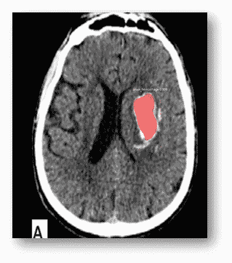
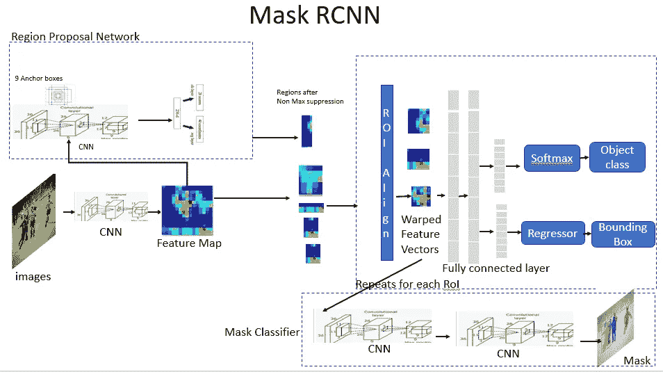

# 基于掩模 RCNN 的脑出血 CT 图像分割

> 原文：<https://medium.datadriveninvestor.com/brain-haemorrhage-segmentation-from-ct-scan-images-using-mask-rcnn-e4f478ee10b2?source=collection_archive---------4----------------------->

Application of Mask RCNN for Brain haemorrhage localization

如果有一个强大的人工智能系统，可以扫描多个射线照相图像，并像专家一样进行分析，那该多好啊！嗯，使用人工智能解决方案对**计算机断层摄影**图像进行自动分析以诊断异常，不仅有助于克服当前成本高昂且耗时的过程，还可以消除人为依赖，减少人工分析导致的错误。[如果你有兴趣了解我的其他作品，请访问我的网站。](https://aditya-bhattacharya.net/)

 [## 大笔资金和尖端技术:人工智能/人工智能投资将如何革新医疗保健…

### 在过去几年人工智能(AI)和机器学习(ML)的显著发展中…

www.datadriveninvestor.com](https://www.datadriveninvestor.com/2018/03/22/big-money-and-cutting-edge-technology-how-investment-in-ai-ml-will-revolutionize-the-healthcare-industry/) 

深度学习是人工智能的一个子集，已被证明可以非常有效地复制人类的认知能力(在许多情况下甚至超过人类水平的性能)，特别是对图像这样的非结构化数据。

Cerebral Haemorrahge region highlighted in CT scan image

DL 算法有助于检测和定位，并有助于量化不断增长的脑病理列表，包括颅内出血及其亚型、梗塞、质量效应、中线移位和颅骨骨折。

因此，通过先进的 DL 算法及其有效使用，可以轻松实现对放射数据的分析，这可以加快由人工智能驱动的某些关键医疗状况的早期检测。

如前所述，用于计算机视觉用例的深度学习算法在分类和定位相关问题上非常成功。随着标注数据集的可用性，使用深度学习进行感兴趣对象或感兴趣区域分割已经变得可行。

像区域卷积神经网络(RCNN)及其演化形式、快速 RCNN 和掩蔽 RCNN 这样的算法正被广泛用于高级放射学领域，以通过放射图像自动检测医学状况。

[Mask RCNN Architecture.](https://towardsdatascience.com/computer-vision-instance-segmentation-with-mask-r-cnn-7983502fcad1)

在这篇文章中，我将特别讨论掩蔽 RCNN 在从大脑的 CT 扫描图像中检测脑出血区域中的应用。

在我们开始之前，请花些时间阅读原文:**面具 R-CNN 作者明凯·何埃尔等人。:**[https://arxiv.org/pdf/1703.06870.pdf](https://arxiv.org/pdf/1703.06870.pdf)。本文作者不仅给出了详细的解释，而且给出了许多关于 Mask RCNN 实际使用案例的直觉。

**链接到数据集:**[https://www . ka ggle . com/felipekitamura/head-CT-出血/下载](https://www.kaggle.com/felipekitamura/head-ct-hemorrhage/download)(低分辨率图像)

[https://www . ka ggle . com/c/rsna-颅内出血-检测/数据](https://www.kaggle.com/c/rsna-intracranial-hemorrhage-detection/data)(提供更高分辨率和更多细节)

**用于从实际图像数据集创建带注释的数据集的工具:**[【VGG 图像注释器(VIA)】](http://www.robots.ox.ac.uk/~vgg/software/via/):快速、轻便、设计非常好的工具，它创建一个 json，并在边界框周围添加注释。

**现在，为什么在这个用例中屏蔽 RCNN，为什么不屏蔽其他？**

为了检测脑溢血区域，真正的医学专家将扫描整个大脑图像并突出显示(或标记)一个或多个区域(如果存在)，几乎精确地标记受影响的区域，具有一定程度的确定性。

> 屏蔽 RCNN 算法也以类似的方式工作。
> 
> 它将扫描整个图像，并创建一个彩色遮罩，以突出显示受影响的确切位置，并具有一定的可信度。
> 
> 因此，它通常进行实例分割，这是计算机视觉中最难解决的问题之一。

Each bounding box denotes, different area being scanned and searched for the region of interest.

## 【Mask RCNN 在这个用例中到底是如何工作的？

*掩模 RCNN 是一个两阶段过程:*

1.  在第一阶段，将扫描整个 CT 图像，并对可能存在医学状况的区域(感兴趣区域)提出某些建议。
2.  第二阶段将对每个建议的区域进行分类，并生成边界框，并在该区域周围创建一个遮罩以突出显示。

**阶段 Mask RCNN 中的区域建议网络**

区域提议网络(RPN)在图像上的许多框(锚点)上运行轻量级二进制分类器，并返回对象/非对象分数。

只有基于分数的正面锚被传递到第二阶段进行分类。

使用**非最大抑制**和**并集上的交集(IoU)** ，这是一种用于测量特定数据集上的对象检测器的准确性的评估度量，用于挑选最佳的可能建议。

**阶段 2:掩码 RCNN 中的建议分类**

这个阶段从 RPN 中提取区域建议，并对它们进行分类，生成类别概率和边界框回归。

**1 detections: [‘brain_haemorrhage’]**

**最后，应用生成的掩模来突出感兴趣的区域:**

听起来真的很耐人寻味吗？您是否有兴趣深入探讨和演示 Mask RCNN 如何帮助从大脑的 CT 扫描图像中分割脑溢血影响区域？

然后，请为这篇文章鼓掌以示支持，如果你想要关于这个话题的详细文章，请发表评论。如果你碰巧在印度 ODSC 期间访问了 Bangalore，请访问链接:[https://conf engine . com/odsc-India-2020/proposal/14402/application-of-masked-rcnn-for-segmentation-of-脑出血-from-computed-tomography-images](https://confengine.com/odsc-india-2020/proposal/14402/application-of-masked-rcnn-for-segmentation-of-brain-haemorrhage-from-computed-tomography-images)，提供你的意见建议，喜欢的谈建议。如果建议被选中，你可以亲自来见我，详细讨论这个话题，并展示一个演示。

不能等到 2020 年印度 ODSC？想看看快速演示吗？然后再看看一步步实现同一个概念的笔记本:[https://github . com/adib 0073/Application _ Of _ Mask _ RCNN _ For _ CT _ Image _ Analysis/blob/master/samples/bhd/inspect _ BHD _ model . ipynb](https://github.com/adib0073/Application_Of_Mask_RCNN_For_CT_Image_Analysis/blob/master/samples/bhd/inspect_BHD_model.ipynb)

希望这篇文章对你有所帮助！[欢迎留言提出建议或任何意见](https://aditya-bhattacharya.net/contact-me/)！你也可以在 LinkedIn 找到我:[https://www.linkedin.com/in/aditya-bhattacharya-b59155b6/](https://www.linkedin.com/in/aditya-bhattacharya-b59155b6/)