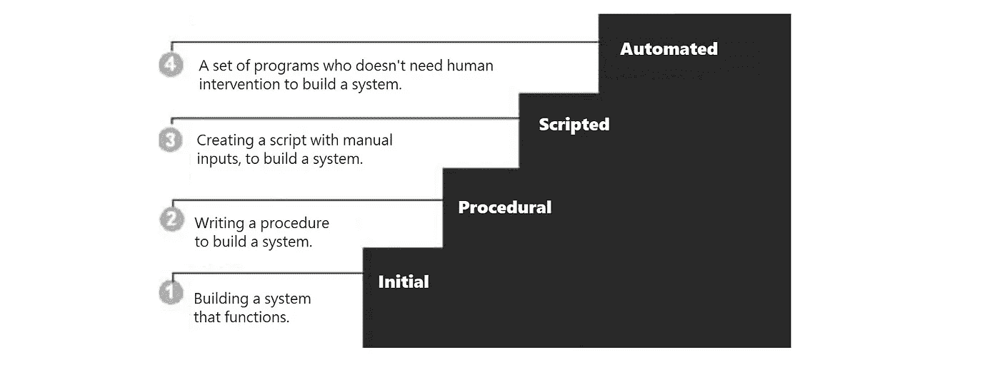
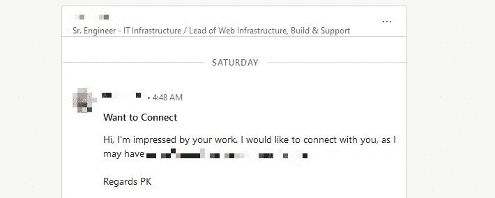
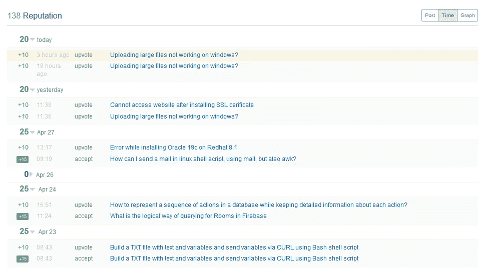
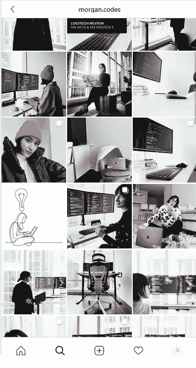

# 将自己标榜为软件工程师

> 原文：<https://medium.datadriveninvestor.com/brand-yourself-as-a-software-engineer-b2ce305c3e26?source=collection_archive---------20----------------------->

品牌是营销中的一个基本词汇，它意味着建立你自己的品牌，你自己的产品。建立一个让你与众不同的形象，让人们在你做的每一件事上都认可你的签名。事实上，这是一个我们在过去几年中不断听到的热门词汇。但是是什么让它如此特别呢？我自己也一直在问这个问题。你可能会说，我不是一个公司，我只是一个个体。我为一家公司工作，做我必须做的工作。那么，我为什么要首先关注自己的品牌呢？

品牌是一个花哨的词，这就是为什么一开始很难接受它；事实上，这意味着你的**声誉**。这个术语更熟悉，更容易理解，指的是你在你所做的事情上的排名。我们都知道坏名声和好名声意味着什么。一个很好的例子是，当你做一项工作，人们喜欢它，你的技能甚至可能让那些听说过你的工作，但没有实际看到它的人感到惊讶。一个好名声，或者品牌，是当你走出一个房间，人们开始谈论你有多好。而一个不好的，恰恰相反，人家会说你不好。

好名声对任何人都很重要。无论你是自己的企业还是雇员，如果人们听到你的好话，他们会想见你并和你一起工作。如果他们听到你很差劲，每个人都会尽量避开你。就这么简单。那么， ***作为一名软件工程师，你如何建立良好的声誉呢？***

在这篇文章中，很明显我是在和狂热型的工程师交谈。你编写前端代码或数据库脚本，你操作应用程序的测试部分，或者你像我一样，在基础设施的幕后工作…这都不重要。我相信你已经知道我们的工作只不过是一遍又一遍的程序，任何人都可以取代你。我们如何展现自己才是最重要的，你可以从以下几点开始。

## 有用的代码

在 **Github** 上分享你的代码。我自己有很多日常工作中使用的个人代码(当然，除了需要时间建立的非常杰出的硬程序，例如 IBM Spectrum Scale AFM DR replication config。我使用私人 Gitbook，每当客户或同事要求我向他们展示如何做到这一点时，我只需将他们指向我的个人 github，他们就会选择我的代码，并在需要其他相关内容时不断访问它。你看到了吗？你总是被提醒是救世主。这是好名声！

另一个要提到的是自动化。我开始自动化我的日常工作是因为有人挑战我，但随着时间的推移，我明白了任何领域的专家都是自动化其工作的人。没有比这更好的人了。如果人们知道你自动化了自己的工作，10 分钟的任务就在脚本中完成了，相信我，**你绝对是最棒的。**

专业知识，是我们想要的。要达到这一点，你需要通过不同的级别，定义如下，如果你曾经通过编写一些代码来帮助人们在尽可能少的人工干预下完成工作，从而达到自动化级别，那么你的声誉是有保证的。

## Youtube 视频

我个人对此非常怀疑。我不相信这会有什么不同，直到一周前我试了试。我发布了一个关于如何部署 IBM Websphere Application Server 的视频(【https://www.youtube.com/watch?v=4OIp-7LCTvo】T4)，到目前为止已经有 73 次观看，4 个赞。

不，我知道你在想什么，这不是一个巨大的视图数量，真的。但我们发布视频不是为了观看，我们是为了声誉，为了品牌。**如果你的技术团队中有 73 个人看了这个视频，其中一些可能是你的同事、你的合作客户、你的主管……任何看到你实际能力的人，那么我们在树立名声和证明我们认为自己拥有的专业技能方面做得很好。对吗？不要低估数字，因为那些都是真实的印象，尤其是在我们这个领域。**

几天前，我在我的 LinkedIn 上收到了一条关于我的 Youtube 视频的消息，那是我为了测试目的制作的，你可以清楚地看到它得到的反应

你还觉得不值得一试？现在想象一下，你有 10、30、50 个关于你所掌握的东西的视频，这对你来说可能是无用的，但对其他人来说却是非常重要和拯救生命的。试试吧伙计！

## 堆栈溢出信誉

真的！谁不知道 StackOver 流程。每个人都用它来寻找解决问题的方法。你可能不知道的是 StackOverFlow 用一种叫做 ***信誉*** 的东西来给它的用户排名。这是一个分数，根据人们对你的回答的反应而增减。如果他们给你竖起大拇指，你会得到奖金，如果你的答案很糟糕，那么竖起大拇指，你的声誉会下降…等等。它还有一种叫做徽章的东西(金、银、铜)。

说实话，10 天前我才认真对待。我记得大约 3 个月前一位英国 IBM 专家访问我们时我的反应，我问他在数据库方面的经验，他说“只要在 Stack OverFlow 上找我，你会发现我的排名很高！”我完全惊呆了。我们一直在谈论他，他是如何帮助人们的“正常，他是一个专家！”我的一个同事说。这个闪回让我想到，如果他能做到，我也能。为什么不试着给自己排名呢？

所以我在过去的 10 天里每天用 30 分钟来回答关于我掌握的东西(数据库、中间件、操作系统)的最简单的问题，结果呢？这👇👇👇

138 声誉。我还没有做任何明显的努力，但我已经看到了结果。我的目标是 10，000 的声誉和一些金质徽章。相信我，这会有所不同。你在 Stack OverFlow 上的名声等于你在现实生活中的名声。这证明了你的知识和你的专长！！

## **科技文章**

我之前说过，我是在和热情的工程师们说话，而不是那些懒惰的。如果你认为你有一些想法、技能、知识可能会让人们惊讶或者对他们有用，我建议你开始写科技文章。在这里，你是自由的，你可以写任何你想写的东西，探索你所有的兴趣。如果你对人工智能感兴趣，即使这不是你的工作，或关于管理，或其他任何东西，也要写。只要对它充满热情，探索不同的方面。

不要低估这一点！这很重要，它让人们知道你的潜力，你知道什么，你有什么能力。你的文章可能是关于程序或教程(你的视频的连续性)，或者写关于新出现的想法…请记住，这些文章可能会落入一个不了解你个人的高层手中。可能是客户看了，也可能是你的同事。这对你的声誉影响很大，投资吧。

几个月前，我写了一篇文章，**IT 咨询的** **艺术**([https://bit.ly/3fglvZe](https://bit.ly/3fglvZe))我谈到了如何成为一名优秀工程师的不同方面。大约一周后，办公室里有人找到我，对我说这帮助他们把工程生活中的事情安排得井井有条。对我来说，这本身就是一个成功，一个意外收获。知道我的话产生了影响。完全忘记掌声、观点、评论…专注于内容，写完文章就忘了，然后再写一篇，再写一篇…

## Instagram 美学

我喜欢关注技术娴熟的 Instagrams，观看他们的帖子，但老实说，我无法将我的个人资料转换成一个。在我的工程生活之外，我是一名艺术家，我的房间里堆满了古董书、木制家具和艺术品……我把我的 Insta 献给了这些。(在我的上一篇文章中找到更多理由，**一个软件工程师的日常生活:**【https://bit.ly/3diDKvr】T2)

如果你认为那种模式会给你带来快感，那就去做吧。要建立一个科技 instagram，你的帖子应该表达你生活在一个铁的科技世界。创建一个极简的设置，有一个漂亮的显示器，一些无线键盘和鼠标，IDE 应该一直运行，就像你一直在编码一样(这是你想要分享的图像)。也许去找一些其他的科技设备。最新的智能手机，有最新的功能，或者 Ipad Pro 有智能铅笔，甚至是智能手表…我不知道。**你明白了，这是关于创造一个工作场所，告诉人们“我过着科技生活”，**如果有人看到你的个人资料，他们得到的第一个想法是“**那是个技术人员** n”。对我影响最大的是摩根，我认为他做得最好。看看她的 Insta([https://www.instagram.com/morgan.codes/](https://www.instagram.com/morgan.codes/))多美！

# 我们做什么呢

我知道按照上面所有的注意事项开始品牌推广会非常困难，尤其是如果你不习惯的话。我建议你遵循下面的规划

## 每天地；天天地

在 **LinkedIn** 上分享 **1** 帖子。回答 5-10 个关于 **StackOverFlow** 的简单问题。在 **Instagram** 上分享 **1** 帖子。

这将花费你每天大约 15-30 分钟。你不会在两天内看到结果，你需要坚持。创造内容，保持耐心。

## 一周的

在 **Github** 上推动 **1** 回购。在**介质**上写 **1** 文章。在 **Youtube** 上发布 **1** 视频。

建立这种写东西的心态，一开始可能会很难。但是请相信我，两个星期后这样做是正常的，如果你非常热衷于此，你可能会做得更多。

名声不是我们与生俱来的。这是我们通过工作创造的东西。问题是我们在科技领域的工作大多不为人知，我们通常单独工作，如果一切顺利，没人记得这个名字。这就是为什么很难让你的作品单独呈现你的名字。不会的。(你大概不知道苹果 CTO 的名字。)因为科技成就是看不见的。除非你做必要的事，自己推销。你让你的工作到处可见，尤其是你的随从和你领域内的人。创造影响力，成为一个非常与众不同的程序员，他不仅有技能，还有声誉。也许这会给你提供更好的机会…也许这将是你职业生涯的转折点..谁知道呢。

~优素福·斯拜·伊德里西，2020

【https://www.instagram.com/sbaiidrissiyoussef/ 号