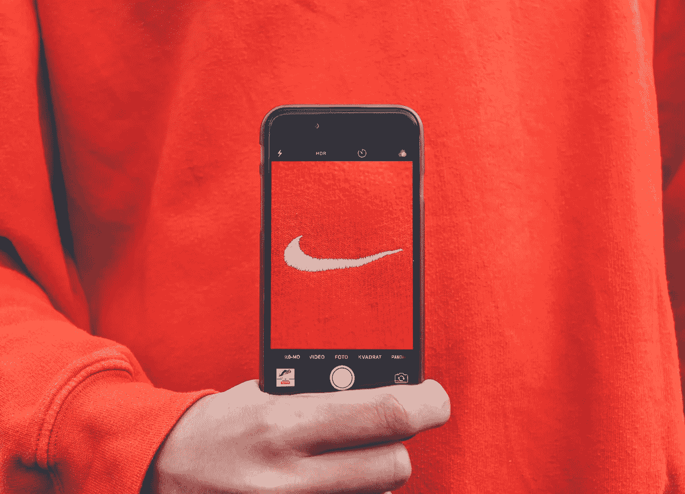

# 品牌与营销-相对关键差异

> 原文：<https://medium.datadriveninvestor.com/branding-vs-marketing-relative-key-differences-75caf0a038ae?source=collection_archive---------12----------------------->

品牌与营销，所有企业都在争论的话题。无论你是一家初创企业还是一家本土企业，你都会经常遇到两个术语，品牌和营销。

“品牌”和“营销”孰先孰后，这是一个混乱的问题。

Nike has become a brand because of its passion, efforts, and branding foundation, they put in their work.

品牌是企业想要推广的文化和意识。品牌是关于你是谁，以及你希望你的潜在客户如何看待你。而**营销**则是利用“工具来推广你的品牌，并向你的客户传达你的目的”。

这些工具包括:

1.  [*SEO*](https://newssir.com/8-powerful-digital-marketing-strategies-to-grow.html)

*2。* [*社交媒体营销*](https://newssir.com/8-powerful-digital-marketing-strategies-to-grow.html)

*3。* [*内容营销*](https://newssir.com/8-powerful-digital-marketing-strategies-to-grow.html)

*4。* [*【点击付费(PPC 营销)*](https://newssir.com/8-powerful-digital-marketing-strategies-to-grow.html)

*5。* [*邮件营销*](https://newssir.com/8-powerful-digital-marketing-strategies-to-grow.html)

**什么是品牌？**

品牌是你企业的声音、信息、外观和感觉。这是你营销策略背后的核心原因。因此，品牌首先是营销策略的基础。没有决定文化和品牌，企业如何营销自己？

在品牌化之前，你应该问自己:

1.  我品牌推广的目的是什么？
2.  我希望客户如何看待我的业务？
3.  我的业务会给客户的生活带来什么价值？
4.  有效品牌背后的目标是什么？
5.  我的企业的“愿景”和“使命”是什么？

虽然，品牌的目标是赚钱和利润。但是，让你与其他拥有相同业务的人不同的是，你希望你的客户如何看待你？你的品牌到底是关于什么的？

品牌是所有关于沟通的主要目的，你的观众和建立客户的忠诚度。这是你业务发展的基础。

**品牌和营销的时间框架:**

打造品牌是你每天都需要做的事情，这样才能让顾客一次又一次地回来。营销是你为了建立自己的品牌和声誉而做的事情。

你从品牌和营销中获得的主要结果是转化——要么是营销后客户来找你，要么是因为品牌。最后，你会得到销售和利润形式的转换。当你进行有效的营销时，你的品牌开始独立发展。但是要记住！你的营销策略和广告文案必须代表你的品牌理念。

营销可以每月进行一次，也可以在推出新产品或服务时进行。但是要记住！有效地去做。另一方面，品牌是一个日常的过程，以保持现有的客户，以及建立新的客户。

品牌背后的主要目的是赢得顾客的忠诚。因为忠诚是买不到的，只能赢。

[谷歌](http://google.com)是最顶级的品牌，因为它允许员工自主创新。由于这种灵活性，他们的员工带来了创新的想法，这也有助于建立品牌声誉。

你有没有想过？城市里有这么多餐馆，人们喜欢去同一家餐馆。甚至一代又一代人去同一家餐厅。因为那家餐馆做了有效的品牌推广。从第一天起，他们就知道自己品牌的愿景和使命。他们的营销策略完全基于他们的品牌基础。他们的基础(品牌)很强大，直到他们赢得了顾客的忠诚。

**结论:**

建立品牌意识是营销最重要的方面。有效营销的终点是品牌的起点。所以，在你开始营销策略之前，做一份描述你品牌目的的商业计划。然后，雇佣一个专业的数字营销人员来营销你的业务，从而打造品牌。