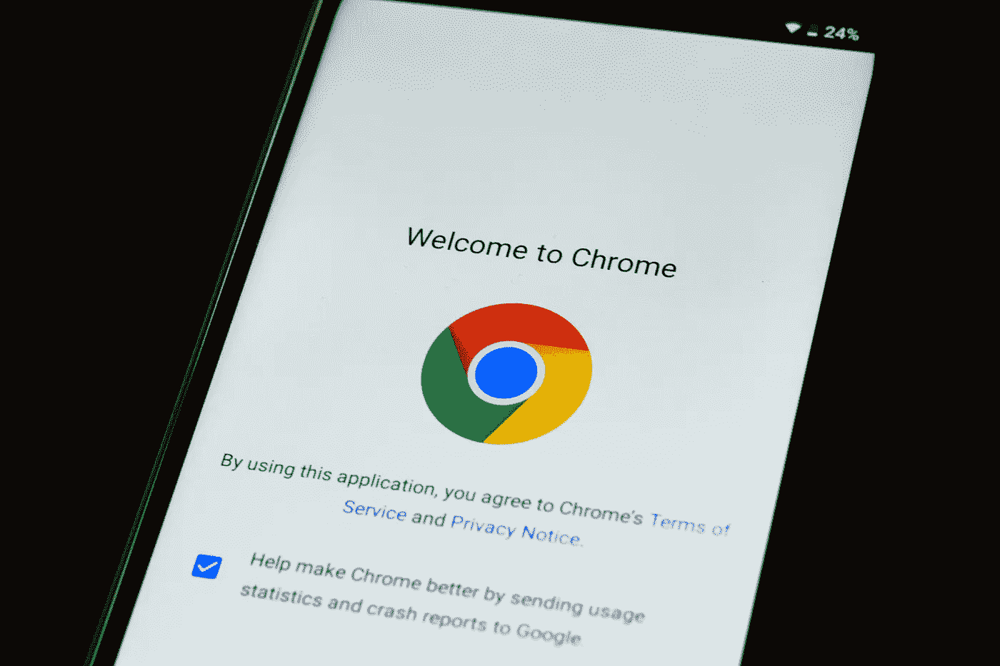
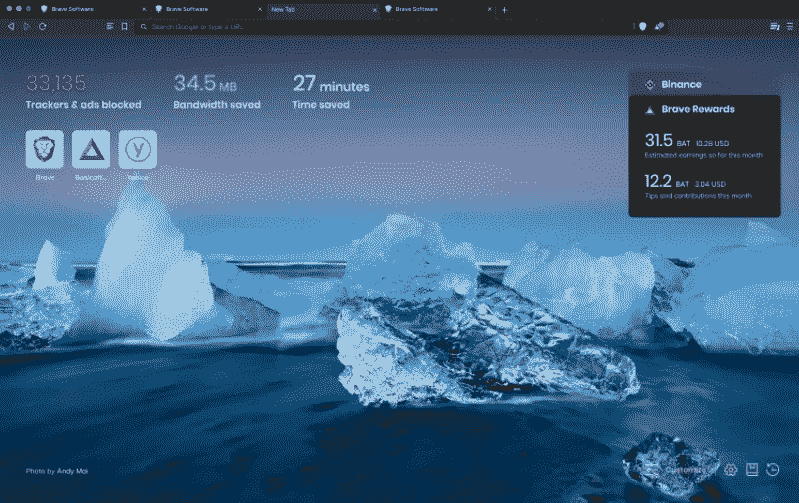
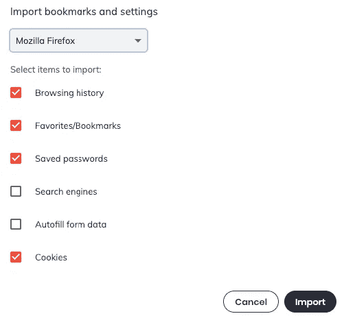
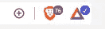

# 勇敢的浏览器，被动收入王？

> 原文：<https://medium.datadriveninvestor.com/brave-browser-the-passive-income-king-a5d78da848c3?source=collection_archive---------0----------------------->

## 保护我的隐私并从中赚钱。

Foto de [PhotoMIX Company](https://www.pexels.com/pt-br/@wdnet?utm_content=attributionCopyText&utm_medium=referral&utm_source=pexels) no [Pexels](https://www.pexels.com/pt-br/foto/browser-navegador-negocio-empresa-5494323/?utm_content=attributionCopyText&utm_medium=referral&utm_source=pexels)

*“欢迎使用 Chrome？”对我来说不再是了。是的，它发生了，在成为 Chrome 用户多年后，我改变了。新来的孩子打败了所有其他人。没有更多的广告，没有更多不必要的东西，更快更干净的用户友好的前端，最重要的是，我正在**通过使用它** *获得被动收入(但我不会一夜暴富)。**

遇见勇敢的浏览器，说实话，你不需要勇敢的去改变，我会让你很简单的决定相信我。

Screenshot by Author

我与 Brave 没有任何形式的联系。我只是一个高兴的用户，想与你分享这一伟大的经验

# 勇敢能拯救互联网吗？

众所周知，互联网中没有所谓的“隐私”。你可以观看许多纪录片，这些纪录片显示，我们的数据只是未经我们同意就出售给出价最高的投标人，因此我们的信息只是四处流动，被世界上最大的公司收集，然后向我们展示他们认为适合我们需求的广告，从而创造更高的转换*(购买)*他们的服务的机会。要深入了解我们数据的错误用法，你可以看看网飞的 *The Great Hack。*

总而言之，当你在谷歌上搜索东西、打开任何网站、玩浏览器游戏、购物或只是浏览社交媒体时，你的数据会被收集，你的偏好会被跟踪。从没想过为什么你看到一个关于狗的可爱帖子，然后很快就有了一个狗床广告？这是因为你的在线活动被跟踪，浏览器算法会根据你的偏好在那个时间给你提供一个广告。

现在，作为一个普通的网络用户，我看不到这些隐藏活动的影响，但我知道，如果有一种更好、更安全的方式来使用互联网，我会全力以赴，就在那时，我看到了一篇关于一款内置广告拦截器和跟踪拦截器的新浏览器 Brave 的文章。

# 为什么我不想用勇敢

我在 Chrome 上准备好了所有的密码、日历、待办事项、书签和自动填充，将所有这些信息迁移到新浏览器的想法看起来是一项令人疲惫的任务，但随着我继续搜索 Brave，我了解到它是建立在 Chrome 上的，Chrome 是一个开源浏览器项目，因为这个原因，我应该在用户角度上没有发现任何差异*(当然除了设计)。*

正是因为这个原因，所有 Chrome、Safari 和 Mozilla 用户只需点击一下，就可以将他们的书签、密码和偏好转移到 Brave。

Screenshot by Author

通过检查我的笔记本电脑运行 Chrome vs Brave 的性能，以及检查 Brave Shield 指示器，我很快意识到 Chrome 在内存使用和隐私保护方面不是最佳选择(因为它没有任何保护)，在 youtube 上连续半小时播放音乐视频后，阻止了超过 76 个跟踪器和其他入侵。

Screenshot by Author

你可能想知道那个蓝色的勾号是什么，它是一个经过验证的勇敢创造者徽章。由于 Brave 屏蔽了所有类型的广告，你将在看 YouTube 视频时看不到那些 5 秒钟的广告，因此开发者创建了一个小费罐，你可以用 BAT *给你最喜欢的创作者小费(在我看来这是非常酷的东西)。*如果你是内容创作者和勇敢的用户，在这里注册成为勇敢的创作者[。](https://creators.brave.com/sign-up)

# 使用 Brave 的日常结果

一旦我开始用这个浏览器作为我的日常驱动，我马上就开始注意到不同之处。用户体验要快得多，使用没有任何广告的 YouTube 很奇怪，打开一个新标签，看到我用它赚了 2 美分，这让我很开心*(“你很开心，因为你赚了 2 美分？”是的，我比使用 Chrome 多赚了 2 美分)*

怎么会？

那是抵抗的力量！这款浏览器有自己的加密货币，即基本注意力令牌(BAT)，你可以通过使用该浏览器并以推送通知的形式获得隐私友好型广告来获得它。您可以在设置中设置广告频率，并选择每小时 1 至 5 个广告。

但是如果你对加密不感兴趣，或者不想寻求小额被动收入，你可以随时关闭勇敢奖励，这样你就不会看到任何广告。

试一试，如果你不喜欢，你可以随时换到你以前的浏览器。

注意安全。